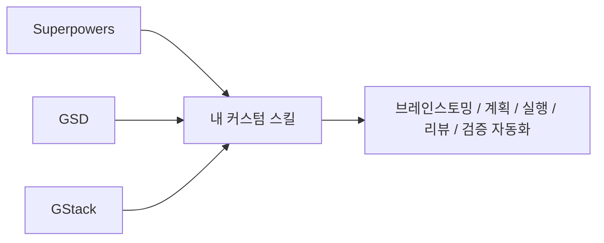
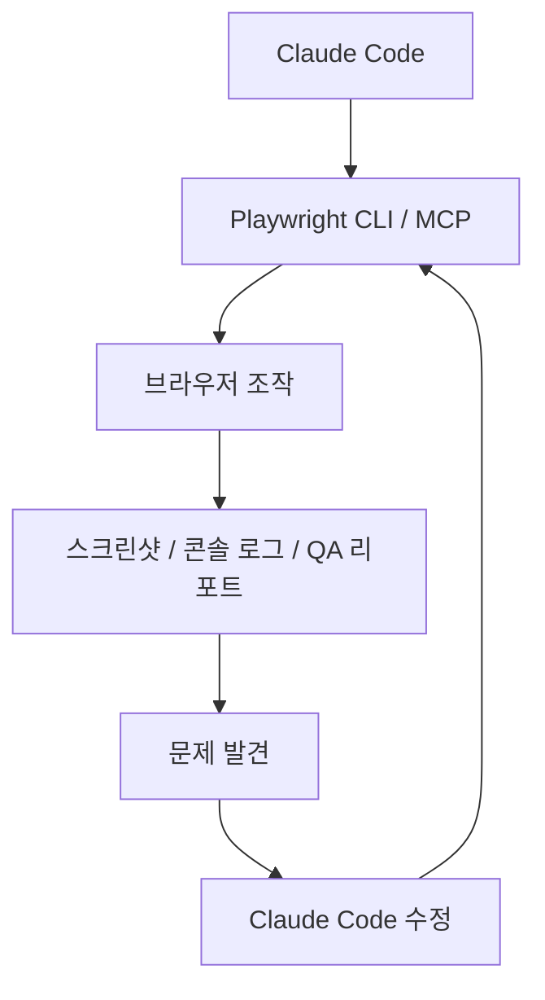

이 영상은 `Claude Code 스킬 추천 8선`처럼 보이지만, 실제로는 스킬 목록보다 더 큰 그림을 보여 줍니다. 좋은 Claude Code 사용법은 단순히 더 똑똑한 모델을 붙이는 것이 아니라, **계획하고, 실행하고, 검증하고, 기억하고, 성장시키는 흐름을 스킬로 외부화하는 것** 이라는 점입니다. 영상 속 8개 스킬도 각각 따로 노는 도구가 아니라, Claude Code의 빈칸을 하나씩 메우는 계층으로 등장합니다. [YouTube 영상](https://youtu.be/Va-U1dqhwzk)
<!--more-->

영상에서 다루는 핵심 스킬은 다음 흐름으로 읽는 것이 가장 자연스럽습니다.

- 정확도를 높이는 개발 방법론 스킬
- 내 팀과 내 취향에 맞는 커스텀 스킬 생성
- 디자인과 UI 개선
- 브라우저 자동 검증
- 세션이 끝나도 남는 기억 시스템
- 제품 성장과 마케팅 자동화
- 버그를 접수부터 QA 핸드오프까지 처리하는 운영 스킬

즉 이 영상의 진짜 메시지는 “좋은 스킬 8개가 있다”가 아니라, **Claude Code를 코더에서 운영체계로 확장하라** 는 쪽에 가깝습니다. [YouTube 영상](https://youtu.be/Va-U1dqhwzk)

## Sources

- https://youtu.be/Va-U1dqhwzk

## 1. Superpowers: Claude Code의 정확도를 올리는 기본 스킬

영상의 첫 번째 스킬은 `Superpowers` 입니다. 설명은 아주 직설적입니다. Claude Code는 기본 상태에서도 강력하지만, 그대로 쓰면 혼란스럽고 즉흥적이라는 것입니다. 계획도 없고, 테스트도 없고, 방법론도 없이 바로 코드를 쓰기 시작하니 돌아가긴 해도 취약하고 부서지기 쉬운 결과가 나올 수 있다는 것이죠. 영상은 이것을 전형적인 `vibe coding` 문제로 봅니다. [YouTube 영상](https://youtu.be/Va-U1dqhwzk)

Superpowers가 해결하려는 것은 바로 이 부분입니다.

- 먼저 브레인스토밍
- 요구사항을 문서화
- 실행 계획 작성
- 테스트 먼저 작성
- 구현
- 코드 리뷰와 검증

즉 단순히 더 똑똑한 프롬프트가 아니라, **Claude Code에게 시니어 엔지니어링 방법론을 강제하는 스킬** 입니다. 영상은 특히 TDD, 병렬 에이전트, 코드 리뷰, verification을 묶어 설명하는데, 핵심은 결과 품질을 우연에 맡기지 않는다는 점입니다.

## 2. Skill Creator: 남의 워크플로가 아니라 내 워크플로를 만든다

두 번째로 소개되는 것은 `Skill Creator` 입니다. 영상에서는 이것을 Anthropic이 만든 스킬이라고 설명하며, 새로운 스킬을 만들고 반복적으로 개선하며 평가까지 붙일 수 있다고 말합니다. [YouTube 영상](https://youtu.be/Va-U1dqhwzk)

이 스킬이 중요한 이유는 단순합니다. 아무리 좋은 Superpowers라도 결국은 남의 워크플로입니다. 어느 시점이 되면 팀마다:

- 자기만의 테스트 규칙
- 자기만의 배포 절차
- 자기만의 설계 선호
- 자기만의 리뷰 포인트

가 생깁니다. Skill Creator는 그 지점에서 Claude Code를 일반 도구가 아니라 **팀 전용 자동화 시스템** 으로 바꾸는 역할을 합니다.

영상에서는 Superpowers, GSD, GStack 같은 여러 프레임워크의 장점을 조합해 `build feature` 라는 자체 스킬을 만드는 예시를 보여 줍니다. 여기서 인상적인 포인트는 “하나의 프레임워크를 믿고 간다”가 아니라, **단계마다 가장 잘하는 도구를 섞어 나만의 파이프라인을 만든다** 는 발상입니다.

## 3. UIUX Pro Max: Claude Code가 디자인 시스템까지 고민하게 만든다

세 번째 스킬은 `UIUX Pro Max` 입니다. 영상은 이 스킬을 단순 프론트엔드 생성보다 더 높은 층위의 도구로 소개합니다. 수백 개의 산업별 디자인 데이터를 바탕으로, 니치와 업종에 맞는 UI 스타일을 제안하고, 여러 에이전트가 색상, 타이포그래피, 레이아웃, 랜딩 페이지 구조를 탐색한 뒤 최종 디자인 시스템을 만들어 준다는 설명입니다. [YouTube 영상](https://youtu.be/Va-U1dqhwzk)

중요한 포인트는 이것이 “예쁜 CSS 생성기”가 아니라는 점입니다. 영상에서 이 스킬은:

- 현재 페이지 구조 이해
- 업종과 맥락 파악
- 리디자인 계획 제시
- 제약 조건 반영
- 최종 디자인 시스템과 수정안 생성

의 흐름으로 동작합니다. 즉 Claude Code가 단순 구현자에서 **준디자이너 역할** 까지 맡게 만드는 스킬입니다.

특히 영상에서는 느린 이미지 로딩, SEO 메타 태그, 접근성, 다크모드, CTA 배치 같은 항목까지 함께 손보는 예를 보여 줍니다. 이 점이 중요합니다. 좋은 랜딩 페이지는 예쁜 색 조합보다도, **성능·전환·일관성·브랜드 맥락** 의 묶음이기 때문입니다.

## 4. Awesome Design MD: 특정 브랜드 스타일을 복제 가능한 규칙으로 바꾼다

UIUX Pro Max가 업계 데이터를 기반으로 새 디자인을 제안하는 쪽이라면, 영상이 이어서 소개하는 `Awesome Design MD`는 이미 존재하는 디자인 시스템을 복제 가능한 제약으로 가져오는 쪽에 가깝습니다. 영상에서는 Apple, Stripe, Claude, Cohere, ElevenLabs 같은 사이트 디자인을 참고하는 예를 보여 줍니다. [YouTube 영상](https://youtu.be/Va-U1dqhwzk)

핵심 아이디어는 `design.md` 파일입니다. 즉 색상, 타이포그래피, CTA, 간격, 금지 패턴 같은 디자인 규칙을 텍스트 문서로 만들어, LLM이 그 규칙을 읽고 페이지를 재설계하도록 하는 방식입니다.

이 접근이 흥미로운 이유는, “감으로 비슷하게 만들어 줘”가 아니라 **복제 가능한 디자인 제약을 파일로 제공한다** 는 점입니다. 그래서 디자이너 없이도:

- 특정 브랜드 감성의 차용
- 일관된 UI 규칙 유지
- 페이지 전반 리디자인

이 가능해집니다. 결국 Claude Code가 코드를 바꾸는 것에 그치지 않고, **스타일 시스템을 해석해 반영하는 도구** 로 확장되는 셈입니다.

## 5. Playwright CLI / MCP: Claude Code에 눈과 손을 붙인다

영상 중반 이후부터는 시각과 검증의 영역으로 넘어갑니다. 여기서 핵심 도구로 등장하는 것이 `Playwright CLI` 와 `Playwright MCP` 입니다. 설명도 명확합니다. 이제 Claude Code가 브라우저를 보고, 클릭하고, 사용자처럼 행동하고, 스크린샷과 콘솔 로그를 남기며 QA를 수행할 수 있어야 한다는 것입니다. [YouTube 영상](https://youtu.be/Va-U1dqhwzk)

영상에서 보여 주는 활용 방식은 꽤 실전적입니다.

- 앱의 여러 경로를 자동 탐색
- 단계별 스크린샷 캡처
- 콘솔 로그 수집
- QA 리포트 생성
- 발견한 이슈를 다시 Claude Code가 수정

이 흐름이 중요한 이유는, Claude Code가 더 이상 “코드만 쓰는 모델”이 아니라 **실제 동작을 검증하는 실행자** 가 되기 때문입니다. 특히 브라우저 테스트와 수정이 연결되면, 구현과 검증이 한 세션 안에서 닫힙니다.

## 6. Obsidian Skill: 복잡한 RAG 없이도 장기 기억을 만든다

영상이 후반부에서 짚는 가장 현실적인 문제는 기억입니다. 터미널 세션을 닫는 순간 결정, 조사, 프로젝트 히스토리가 다 사라진다는 것입니다. 영상은 벡터 데이터베이스, 임베딩, 검색 파이프라인 같은 본격적인 RAG 시스템 없이도, 더 가볍게 장기 기억을 만들 수 있는 방법으로 `Obsidian skill` 을 소개합니다. [YouTube 영상](https://youtu.be/Va-U1dqhwzk)

핵심은 단순합니다.

- Markdown 파일
- 링크
- 태그
- 폴더 구조
- graph view

이 다섯 개만으로도 Claude Code가 읽고, 쓰고, 조직하고, 다시 참조할 수 있는 지식 시스템이 된다는 것입니다. 영상에서는 프로젝트 개요, 대화 로그, 이메일 스레드, 회의 메모, 문서 파일을 Obsidian에 정리하고, 이후 Claude Code가 이를 다시 가져와 쓰는 흐름을 보여 줍니다.

즉 Obsidian skill은 “두 번째 뇌”라는 표현보다, **Claude Code용 저비용 장기 기억층** 으로 이해하는 것이 더 정확합니다.

## 7. Marketing Skills: 코드를 만든 뒤 성장까지 연결한다

영상은 여기서 멈추지 않습니다. 제품을 만들었다면 성장도 자동화해야 한다는 관점에서 `Marketing skills` 도 핵심 스킬로 넣습니다. 영상에서는 SEO, 카피라이팅, 이메일 시퀀스, 전환율 최적화, 분석, 콘텐츠 전략 등 43개 마케팅 스킬을 언급합니다. [YouTube 영상](https://youtu.be/Va-U1dqhwzk)

이 부분이 중요한 이유는 명확합니다. 대부분의 Claude Code 활용은 “무엇을 만들지”와 “어떻게 고칠지”에 머무르지만, 실제 제품은 그 뒤에:

- 유입을 만들고
- 가입 전환을 관리하고
- 이메일 nurture를 설계하고
- 분석 지표를 해석하고
- 콘텐츠를 반복 생산해야 합니다

즉 마케팅 스킬은 Claude Code를 개발 도구에서 **제품 운영 도구** 로 확장합니다. 영상에서는 실제로 SEO 점수, 분석 대시보드, 전환 퍼널, nurture sequence 설계까지 언급하며 이 레이어를 보여 줍니다.

## 8. Fixed Ticket Skill: 버그를 Jira 티켓에서 QA 핸드오프까지 밀어붙인다

마지막 스킬은 영상에서 가장 운영적인 도구입니다. 이름도 직설적인 `Fixed Ticket skill` 입니다. 역할은 “버그를 발견한 순간부터, 수정하고, 검증하고, 배포하고, QA 담당자에게 넘길 때까지”의 라이프사이클 전체를 자동화하는 것입니다. [YouTube 영상](https://youtu.be/Va-U1dqhwzk)

영상 속 흐름은 거의 작은 운영 플레이북에 가깝습니다.

- Jira 티켓 읽기
- 필요하면 Sentry 로그 등 외부 로그 수집
- Playwright로 재현 시도
- 원인 조사
- 수정 계획 제안
- 승인 후 구현
- 리뷰와 재검증
- 커밋/푸시/배포
- QA 핸드오프

이 스킬이 의미 있는 이유는, Claude Code가 단순히 코드를 조금 고치는 데서 그치지 않고 **실제 팀의 버그 수정 프로세스 자체를 실행하는 오퍼레이터** 가 되기 때문입니다.

## 9. 이 8개를 함께 보면 Claude Code 운영 지도가 보인다

영상의 8개 스킬은 개별 추천보다 전체 배치가 더 중요합니다.

- `Superpowers`: 정확도와 개발 방법론
- `Skill Creator`: 내 팀 기준의 커스텀 자동화
- `UIUX Pro Max`: 산업 맥락 기반 UI 개선
- `Awesome Design MD`: 특정 브랜드 스타일 규칙 이식
- `Playwright CLI / MCP`: 브라우저 QA와 검증
- `Obsidian skill`: 장기 기억
- `Marketing skills`: 성장과 운영
- `Fixed Ticket skill`: 버그 수정 운영 자동화

이 순서대로 보면 Claude Code는 점점:

1. 코드를 쓰는 도구에서
2. 계획하고 검증하는 도구가 되고
3. 기억하고 성장시키는 도구가 되며
4. 결국 제품 운영 전반을 보조하는 시스템으로 확장됩니다

즉 이 영상은 스킬 모음이 아니라, **Claude Code를 둘러싼 운영 지형도** 를 보여 주는 셈입니다.

## 실전 적용 포인트

모든 스킬을 한 번에 다 쓰기보다는, 현재 병목에 따라 레이어를 고르는 편이 좋습니다.

- 코드 품질이 들쑥날쑥하면 `Superpowers`
- 팀 방식에 맞춘 파이프라인이 필요하면 `Skill Creator`
- 랜딩 페이지와 UI가 약하면 `UIUX Pro Max` 또는 `Awesome Design MD`
- QA가 병목이면 `Playwright CLI / MCP`
- 세션이 끊길 때마다 맥락을 잃으면 `Obsidian skill`
- 제품은 있는데 성장 자동화가 약하면 `Marketing skills`
- 버그 수정 운영이 느리면 `Fixed Ticket skill`

특히 이 영상이 반복해서 보여 주는 메시지는, Claude Code를 잘 쓰는 핵심이 “한 번 더 좋은 프롬프트”가 아니라 **단계별 스킬을 적절히 붙여 워크플로를 구조화하는 것** 이라는 점입니다.

## 핵심 요약

- 이 영상은 Claude Code 스킬 8개를 소개하지만, 실제로는 Claude Code 운영체계의 8개 레이어를 설명한다.
- `Superpowers`는 정확도와 테스트 중심 개발 방법론을 강제한다.
- `Skill Creator`는 내 팀 기준의 커스텀 워크플로를 만든다.
- `UIUX Pro Max`와 `Awesome Design MD`는 디자인 시스템 레이어를 보강한다.
- `Playwright CLI / MCP`는 Claude Code에 브라우저 검증 능력을 부여한다.
- `Obsidian skill`은 무거운 RAG 없이 장기 기억을 만든다.
- `Marketing skills`는 개발 이후의 성장 운영을 자동화한다.
- `Fixed Ticket skill`은 버그 수정의 전체 라이프사이클을 자동화한다.

## 결론

이 영상이 던지는 가장 큰 통찰은 간단합니다. 이제 Claude Code를 잘 쓴다는 것은 단순히 코드를 잘 뽑아내는 것이 아닙니다. 계획, 테스트, 디자인, 브라우저 검증, 장기 기억, 성장, 버그 수정까지 이어지는 **운영 레이어를 스킬로 붙이는 것** 이 더 중요해지고 있습니다.

그래서 이 8개 스킬은 추천 목록인 동시에 로드맵입니다. 지금 내 병목이 어디에 있는지 파악하고, 그 구간을 Claude Code 스킬로 하나씩 외부화하는 것. 그게 2026년식 Claude Code 활용의 핵심이라는 점을 이 영상은 꽤 선명하게 보여 줍니다.
