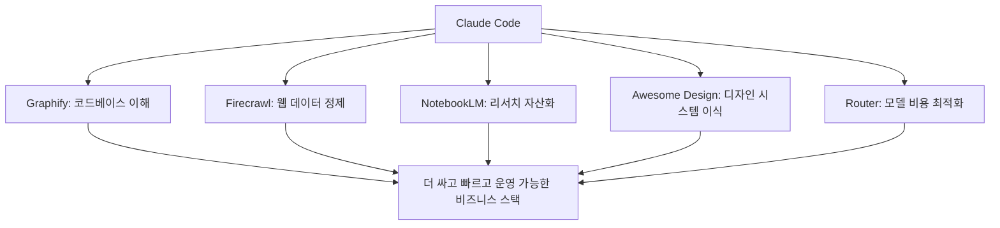

이 영상이 흥미로운 이유는 Claude Code 스킬을 더 잘 코딩하게 만드는 보조 도구로만 다루지 않는다는 점입니다. 오히려 “사업을 더 싸고, 더 빠르고, 더 잘 굴리게 만드는 도구”로 소개합니다. 그래서 등장하는 다섯 가지도 전형적인 코딩 스킬이 아닙니다. 코드베이스 이해를 빠르게 하는 `Graphify`, 웹을 AI 친화 데이터로 바꾸는 `Firecrawl`, 리서치 자동화에 가까운 `NotebookLM`, 디자인 시스템을 끌어오는 `Awesome Design`, 그리고 비용을 줄이는 `Claude Code Router` 까지, 전체적으로 보면 **Claude Code를 비즈니스 운영 스택으로 확장하는 다섯 개의 레버** 에 가깝습니다. [YouTube 영상](https://www.youtube.com/watch?v=WR-kVYU-lBU)
<!--more-->

즉 이 영상의 핵심은 “좋은 스킬 5선”이라기보다, Claude Code를 둘러싼 실제 병목 다섯 가지를 보여 주는 데 있습니다.

- 코드베이스를 매번 처음부터 읽는 문제
- 웹 데이터가 너무 더러운 문제
- 리서치를 수작업으로 하는 문제
- 디자인 감각을 처음부터 다시 잡아야 하는 문제
- 작은 작업에도 비싼 모델을 쓰는 문제

이 다섯 문제를 해결하는 레이어를 각각 하나씩 붙이는 방식이 바로 이번 영상의 구조입니다. [YouTube 영상](https://www.youtube.com/watch?v=WR-kVYU-lBU)

## Sources

- https://www.youtube.com/watch?v=WR-kVYU-lBU

## 1. Graphify: 코드베이스를 “읽는 대상”이 아니라 “질문 가능한 그래프”로 바꾼다

첫 번째 스킬은 `Graphify` 입니다. 영상은 이를 안드레이 카르파시의 지식 베이스 아이디어를 코드베이스에 적용한 것으로 설명합니다. 핵심은 어떤 프로젝트를 파일 묶음이 아니라 **질문 가능한 knowledge graph** 로 바꾸는 것입니다. [YouTube 영상](https://www.youtube.com/watch?v=WR-kVYU-lBU)

영상 속 비유가 꽤 좋습니다.

- 파일은 역
- import는 지하철 노선
- 커뮤니티는 동네
- 허브 노드는 Grand Central Station 같은 거점

이렇게 보면 Claude Code가 새로운 세션을 열 때마다 문서와 파일을 하나씩 더듬는 대신, 그래프를 타고 필요한 곳으로 곧장 이동할 수 있다는 설명이 됩니다.

영상은 특히 이 장점을 토큰 절감과 연결합니다. 새 세션마다 처음부터 다시 읽는 비용을 줄이고, 더 큰 저장소에서 질문-응답의 진입 비용을 낮춘다는 것이죠. 다만 작은 프로젝트에서는 오버헤드가 이득을 잡아먹을 수 있고, 500개 이상 파일이 있는 대형 저장소에서 특히 효과가 크다고 짚습니다.

즉 Graphify는 “검색 도구 하나 더”가 아니라, **코드베이스 탐색 방식을 구조화된 질의로 바꾸는 레이어** 입니다.

## 2. Firecrawl: 웹 스크래핑을 HTML 수프에서 AI-ready 데이터로 바꾼다

두 번째 도구는 `Firecrawl` 입니다. 영상은 웹을 `HTML soup`, Firecrawl을 `strainer` 로 비유합니다. 웹은 광고, 쿠키 배너, 무한 스크롤, 자바스크립트 렌더링으로 지저분하고, 그대로는 AI가 먹기 어렵다는 것이죠. Firecrawl은 이런 URL을 AI가 쓰기 좋은 구조화 데이터로 바꿔 준다고 설명합니다. [YouTube 영상](https://www.youtube.com/watch?v=WR-kVYU-lBU)

여기서 중요한 것은 스크래핑 자체보다 **스크래핑 후처리 비용** 입니다. HTML을 있는 그대로 모델에 던지면 토큰도 많이 들고, 잡음도 많고, 결과 품질도 흔들립니다. Firecrawl은 이 병목을 줄입니다.

영상의 사용 예시는 비즈니스 쪽입니다.

- 특정 지역 업종의 리드 수집
- 회사명, 이메일, 웹사이트 추출
- 사이트에서 흥미로운 사실 1~2개 요약
- HTML/CSV/JSON 형태로 정리

이 예시가 보여 주는 건 단순한 웹 스크랩이 아니라, **Claude Code를 리드 발굴 오퍼레이터로 바꾸는 흐름** 입니다. 즉 웹에서 정보를 긁어 오는 게 아니라, 실제 영업 가능한 데이터를 만들어 주는 것이죠.

## 3. NotebookLM 스킬: 검색이 아니라 개인화된 리서치 팀을 만든다

세 번째 도구는 `NotebookLM` 스킬입니다. 영상은 이를 “세계 최고의 리서치 인텔리전스 에이전트”와 Claude Code를 연결하는 식으로 설명합니다. [YouTube 영상](https://www.youtube.com/watch?v=WR-kVYU-lBU)

포인트는 단순합니다.

- 300개 이상의 소스
- PDF, YouTube 등 다양한 자료
- Claude Code가 내 사업과 관심사를 이미 알고 있음
- 그 정보를 바탕으로 특정 주제의 notebook을 자동 생성
- 이후 그 notebook에 질문만 던져서 답을 받음

즉 이 스킬은 Claude Code가 인터넷을 직접 다 훑는 대신, **잘 조직된 리서치 컨테이너를 미리 만들어 놓고 그 안을 질의하게 하는 방식** 입니다.

영상 예시도 흥미롭습니다. 인스타그램 성장 전략처럼 특정 주제에 대해 전문가 영상 20개를 모아 notebook을 만들고, 그 위에 “2026년에 AI 니치 인스타그램을 키우는 핵심 조언 3개만 말해 줘” 같은 질문을 던집니다. 이때 Claude Code는 새로 검색하는 대신 이미 큐레이션된 지식 베이스를 질의합니다.

따라서 NotebookLM 스킬의 진짜 가치는 검색 정확도 자체보다, **리서치를 한 번 구조화한 뒤 반복적으로 재활용할 수 있게 만드는 것** 입니다.

## 4. Awesome Design: 디자인 감각을 처음부터 만들지 않고 빌려온다

네 번째 도구는 `Awesome Design` 입니다. 영상은 이를 “지구상 최고의 웹사이트 디자인 시스템을 코드화한 라이브러리”에 가깝게 설명합니다. Claude, Apple, Lamborghini 같은 사이트의 디자인 시스템을 `design.md` 형태로 가져와 AI가 그 규칙을 읽고 자기 사이트를 재구성하게 만드는 방식입니다. [YouTube 영상](https://www.youtube.com/watch?v=WR-kVYU-lBU)

이 접근이 중요한 이유는 아주 단순합니다. AI는 코드를 잘 짜도, 무엇이 “좋은 디자인”인지 늘 잘 아는 것은 아니라는 점입니다. 그래서 처음부터 감으로 시키기보다:

- 좋은 레퍼런스의 타이포그래피
- 색상 체계
- 시각적 톤
- 레이아웃 규칙

을 문서화한 뒤 Claude Code에 읽히는 편이 더 안정적입니다.

영상은 이것을 옷장에 비유합니다. 맞춤 디자이너를 부르지 않고도, 이미 잘 만들어진 브랜드 아이덴티티 68종을 골라 입힐 수 있다는 뜻입니다. 이 도구의 핵심은 새로운 창작 그 자체보다, **고품질 취향을 텍스트 규칙으로 재사용하게 하는 것** 입니다.

## 5. Claude Code Router: 비싼 두뇌를 꼭 필요한 곳에만 쓴다

다섯 번째 도구는 `Claude Code Router` 입니다. 영상에서 가장 현실적인 포인트는 바로 이 부분입니다. 모든 작업에 가장 비싼 모델을 쓰는 것은 낭비라는 것이죠. [YouTube 영상](https://www.youtube.com/watch?v=WR-kVYU-lBU)

이 도구의 개념은 간단합니다.

- Claude Code의 UX는 그대로 둔다
- 하지만 뒤의 모델은 작업에 따라 바꾼다
- 큰 추론이 필요하면 큰 모델
- 단순 작업이면 더 싼 모델

영상은 이를 Ferrari와 엔진 비유로 설명합니다. 차체는 그대로 두되, 단순 주차 업무에 Formula 1 엔진을 쓸 필요는 없다는 것입니다.

이 스킬의 진짜 의미는 비용 절감 자체보다, **Claude Code를 인터페이스로 보고 모델은 백엔드에서 동적으로 바꾸는 사고방식** 에 있습니다. 즉 사용자는 같은 근육 기억을 유지하면서, 작업별로 다른 경제성을 얻습니다.

물론 영상도 주의점을 함께 말합니다.

- 일부 MCP/스킬은 Anthropic 특유의 툴 호출 형식에 기대기 때문에 오동작할 수 있음
- 레이턴시가 늘어날 수 있음
- 너무 싼 랜덤 모델로 돌리면 툴콜 품질이 급락할 수 있음

즉 무작정 “무료/저가 모델로 갈아타기”보다는, **툴 호출 품질과 비용의 균형을 라우팅 규칙으로 설계하는 일** 이 핵심입니다.

## 6. 다섯 도구를 함께 보면, Claude Code는 코더가 아니라 운영 허브가 된다

이 영상의 다섯 스킬은 각자 다른 병목을 해결하지만, 함께 보면 하나의 흐름이 됩니다.

- Graphify: 코드 이해 가속
- Firecrawl: 웹 데이터 정제
- NotebookLM: 리서치 자산화
- Awesome Design: 디자인 기준 외부화
- Claude Code Router: 비용 최적화

즉 Claude Code는 여기서 단순 코딩 도구가 아니라,

- 엔지니어링 이해
- 데이터 수집
- 리서치 자동화
- 디자인 적용
- 비용 관리

를 연결하는 운영 허브로 보이기 시작합니다.

## 실전 적용 포인트

이 다섯 개를 한 번에 다 넣는 것보다, 현재 비즈니스 병목에 따라 선택하는 편이 좋습니다.

- 리포지토리 이해가 느리면 `Graphify`
- 웹 데이터 추출과 리드 수집이 필요하면 `Firecrawl`
- 반복 리서치를 자산으로 만들고 싶으면 `NotebookLM`
- 랜딩 페이지와 제품 사이트 품질이 문제면 `Awesome Design`
- 모델 비용이 부담이면 `Claude Code Router`

특히 이 영상의 관점은 “Claude Code로 코딩한다”에서 멈추지 않습니다. **Claude Code로 사업 운영의 여러 마찰을 줄인다** 는 쪽에 더 가깝습니다.

## 핵심 요약

- 이 영상은 Claude Code 스킬 5개를 소개하지만, 실제로는 비즈니스 운영 병목 5개를 해결하는 레이어를 보여 준다.
- `Graphify` 는 코드베이스를 질문 가능한 그래프로 바꿔 대형 저장소 탐색 비용을 낮춘다.
- `Firecrawl` 은 지저분한 웹을 AI-ready 구조화 데이터로 바꾼다.
- `NotebookLM` 스킬은 리서치를 반복 가능한 자산으로 만든다.
- `Awesome Design` 은 좋은 사이트의 디자인 시스템을 재사용 가능하게 만든다.
- `Claude Code Router` 는 작업별로 다른 모델을 써서 비용을 최적화한다.

## 결론

이 영상이 던지는 가장 실용적인 메시지는 Claude Code를 더 똑똑하게 만드는 것보다, Claude Code 주변의 마찰을 줄이는 것이 더 큰 ROI를 만든다는 점입니다. 코드베이스를 읽는 비용, 웹을 정리하는 비용, 리서치하는 비용, 디자인 감각을 찾는 비용, 모델 사용 비용. 이 다섯 가지를 각각 줄이면 Claude Code는 단순한 개발 도구가 아니라 **사업 운영을 실제로 가속하는 인터페이스** 가 됩니다.

그래서 이 다섯 스킬은 “좋은 기능 모음”이 아니라, 비즈니스형 Claude Code 환경을 만들기 위한 설계도에 더 가깝습니다.
