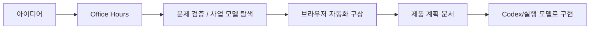

Garry Tan이 Claude Code를 쓰는 방식에서 흥미로운 점은, 단순히 코드를 빨리 뽑는 도구로 보지 않는다는 것입니다. 영상에서 그가 반복해서 강조하는 것은 역할, 프로세스, 리뷰입니다. 즉 에이전트 시대에도 인간 팀이 일하던 방식이 그대로 필요하다는 것이죠. 그래서 그가 만든 `GStack` 의 핵심도 거대한 자율 에이전트보다, **얇은 하네스 위에 역할과 리뷰를 얹는 구조** 에 가깝습니다. [YouTube 영상](https://www.youtube.com/watch?v=_m18_bgqfIw)
<!--more-->

특히 이번 영상은 단순한 기능 소개보다 `Office Hours` 스킬 하나로 GStack의 철학을 잘 보여 줍니다. 반쯤 익은 스타트업 아이디어를 가져가면, 그걸 바로 구현하지 않고 먼저 “누가 진짜 이걸 원하나”, “이게 진짜 큰 문제인가”, “더 큰 사업 모델로 확장 가능한가” 같은 질문으로 흔듭니다. 즉 GStack은 Claude Code를 더 똑똑한 코더로 만드는 게 아니라, **창업자와 PM, 리뷰어가 함께 붙은 팀처럼 생각하게 만드는 도구** 로 보입니다. [YouTube 영상](https://www.youtube.com/watch?v=_m18_bgqfIw)

## Sources

- https://www.youtube.com/watch?v=_m18_bgqfIw

## 1. Garry Tan이 보는 핵심 병목은 모델 지능이 아니라 “세워 주는 구조”다

영상에서 Garry Tan은 꽤 인상적인 말을 합니다. 기본 설정 그대로 두면 모델은 추측하기 시작하고, 그럴듯해 보이지만 조용히 망가지는 코드가 나온다는 것입니다. 그리고 그 병목은 모델의 지능이 아니라, 모델을 제대로 세워 주는 구조라고 말합니다. [YouTube 영상](https://www.youtube.com/watch?v=_m18_bgqfIw)

이 말은 중요합니다. 많은 사람은 Claude Code의 문제를 “모델이 아직 부족하다”로 해석하지만, Garry Tan은 반대로 봅니다.

- 모델은 이미 충분히 똑똑하다
- 문제는 무엇을 보게 하고 무엇을 먼저 시키느냐다
- 하지만 그 구조가 너무 두꺼워도 안 된다

즉 그는 거대한 자동화 프레임보다, **생각을 유도하는 얇은 하네스** 를 선호하는 것으로 보입니다. GStack은 바로 그 구조를 오픈소스로 풀어낸 셈입니다.

## 2. GStack의 출발점은 코딩이 아니라 팀 구조다

영상의 초반부에서 Garry Tan은 에이전트로 실제 일을 하게 만드는 방법은 예전부터 인간이 팀으로 일하던 방식과 같다고 말합니다.

- 역할이 있어야 하고
- 프로세스가 있어야 하고
- 리뷰가 있어야 한다

이 관점은 중요합니다. 왜냐하면 많은 코딩 프롬프트가 Claude를 “혼자 다 하는 천재”로 취급하는 반면, GStack은 처음부터 **혼자 다 하게 두지 않으려는 구조** 이기 때문입니다. [YouTube 영상](https://www.youtube.com/watch?v=_m18_bgqfIw)

즉 GStack은 Claude Code를 초강력 단일 에이전트로 키우는 것보다, 여러 역할을 교대로 수행하는 팀으로 보게 만듭니다. 이 점이 Garry Tan의 YC식 사고와도 맞닿아 있습니다.

## 3. Office Hours는 아이디어를 구현하기 전에 부숴 보는 스킬이다

이번 영상의 핵심 데모는 `Office Hours` 입니다. Garry Tan은 이 스킬을 YC 파트너들이 실제로 창업자와 오피스 아워스를 할 때 거치는 과정을 본뜬 것이라고 설명합니다. [YouTube 영상](https://www.youtube.com/watch?v=_m18_bgqfIw)

여기서 중요한 건 결과가 아니라 질문 방식입니다. 예시로 등장하는 아이디어는 세금 신고용 `1099 문서 수집 서비스` 입니다. 그런데 Office Hours는 곧바로 “좋아요, 브라우저 자동화를 만들죠”로 가지 않습니다. 먼저 이런 질문을 던집니다.

- 누가 이걸 정말 원하는가
- 이건 진짜 고통스러운 문제인가, 아니면 그냥 짜증나는 일인가
- 기존 대안은 왜 충분하지 않은가
- 문서 수집만으로 끝나는가, 아니면 더 큰 사업 모델로 이어지는가

이 질문들이 중요한 이유는, 코드 생성 전에 제품 정의가 먼저 이뤄지기 때문입니다. 즉 Office Hours는 아이디어를 실행으로 바꾸기 전에 **사업성과 고통 강도를 재검증하는 관문** 입니다.

## 4. 이 스킬의 진짜 장점은 “질문이 생각을 밀어 준다”는 점이다

영상에서 Garry Tan이 좋아하는 이유도 바로 이것입니다. 정해진 매뉴얼을 따라가는 느낌이 아니라, 실제로 사람과 대화하면서 사고가 밀려 나가는 느낌이라는 것이죠. [YouTube 영상](https://www.youtube.com/watch?v=_m18_bgqfIw)

예를 들어 처음에는 “1099를 모아 주는 도구” 정도로 시작한 아이디어가 오피스 아워스를 거치며 이렇게 확장됩니다.

- 단순 문서 수집 도구
- Gmail과 브라우저 자동화를 이용한 문서 탐색
- 사용자가 이미 가진 세무사와의 연결
- 세무사 매칭/리드 생성 비즈니스

즉 Office Hours는 정답을 바로 주지 않습니다. 대신 **반쯤 익은 아이디어가 더 큰 문제와 더 큰 사업 모델로 자라날 수 있게 생각의 경사를 만들어 줍니다.**

## 5. 브라우저 자동화가 중요한 이유: 생각이 바로 제품 형태로 이어진다

영상의 중간부에서 흥미로운 부분은 브라우저 자동화가 붙는 순간입니다. 사용자가 로그인하면 AI가 최근 문서 페이지를 찾아가 PDF를 내려받고, 사용자는 그 과정을 지켜보는 방식이 제안됩니다. [YouTube 영상](https://www.youtube.com/watch?v=_m18_bgqfIw)

이 접근이 중요한 이유는 두 가지입니다.

- Plaid 같은 계좌 연결을 반드시 쓰지 않아도 된다
- 사용자는 눈앞에서 브라우저가 움직이는 것을 보며 신뢰할 수 있다

즉 GStack은 “아이디어 검증”에 머무르지 않고, 그 아이디어가 **어떤 인터랙션으로 구현될지까지 바로 밀어붙인다** 는 점에서 강합니다. 단순히 백엔드 기능을 더하는 것이 아니라, 실제 사용자 흐름을 상상 가능한 수준으로 구체화합니다.

## 6. Garry Tan은 Opus를 CEO처럼, Codex를 CTO처럼 쓴다

영상 후반부에서 Garry Tan은 Claude Code를 이해하는 자신의 방식도 설명합니다. 기본적으로는 Claude, 특히 Opus를 쓰지만, 정말 어려운 구현이나 복잡한 정리는 `Codex` 같은 더 강한 실행 담당이 들어가는 구조로 말합니다. [YouTube 영상](https://www.youtube.com/watch?v=_m18_bgqfIw)

그의 표현을 빌리면 Opus는 “아이디어가 많은 CEO” 같은 존재입니다. 함께 맥주 마시기 좋고 큰 방향을 던져 주지만, 일이 진짜 어려워지면 좌뇌형 CTO가 필요하다는 식입니다.

이 비유는 꽤 유용합니다. 왜냐하면 GStack 전체 철학도 비슷하기 때문입니다.

- Claude/Opus: 큰 그림, 질문, 방향, 제품성
- Codex류: 복잡한 실행, 버그 정리, 세부 구현

즉 한 모델로 다 하려는 것이 아니라, **역할에 따라 다른 인지 스타일을 배치하는 사고** 입니다.

## 7. 적대적 리뷰는 아이디어를 공격하기 위한 것이 아니라, 망가질 곳을 먼저 드러내기 위한 것이다

영상에서 또 하나 중요한 축은 `적대적 리뷰` 입니다. Garry Tan은 모델이 여러 단계의 adversarial review를 하며 아이디어와 문서를 두들긴다고 설명합니다. [YouTube 영상](https://www.youtube.com/watch?v=_m18_bgqfIw)

이 과정에서 잡아내는 것들은 꽤 실무적입니다.

- 실패 처리 없음
- 개인정보 섹션 없음
- 예외를 넘기는 방식의 제한
- 사용 흐름상 빠진 요소

즉 적대적 리뷰는 “이 아이디어를 망하게 만들 허점”을 자동으로 표면 위로 끌어올립니다. 영상에서는 실제로 16개 이슈를 잡아내고 점수를 10점 만점 6점에서 8점 수준으로 끌어올리는 흐름이 나옵니다.

이게 중요한 이유는 제품이 망하는 이유가 대개 구현 난이도보다도:

- 예외 처리 누락
- 개인정보 고려 부족
- 사용 흐름의 미완성

같은 부분에 숨어 있기 때문입니다.

## 8. GStack의 강점은 “반쯤 덜 익은 아이디어”를 더 멀리 밀어 준다는 데 있다

영상에서 Garry Tan이 반복하는 인상적인 말이 하나 있습니다. 예전 같으면 진지하게 시도조차 하기 어려웠던 아이디어를 이제는 훨씬 더 멀리까지 밀어붙일 수 있다는 것입니다. [YouTube 영상](https://www.youtube.com/watch?v=_m18_bgqfIw)

여기서 핵심은 단순 속도가 아닙니다. 더 중요한 것은:

- 아이디어를 질문으로 두드리고
- 사업 모델을 넓히고
- 브라우저 자동화까지 구체화하고
- 적대적 리뷰로 허점을 보완하는

과정이 짧은 시간 안에 돌아간다는 점입니다.

즉 GStack의 진짜 강점은 코딩보다도, **아이디어를 제품 계획 수준까지 밀어 올리는 속도** 에 있는 것처럼 보입니다.

## 9. 기존 GStack 소개와 다른 이번 영상의 포인트

이전까지 GStack 관련 글들이 역할 분리나 planning workflow 자체를 많이 강조했다면, 이번 영상에서 특히 눈에 띄는 것은 세 가지입니다.

### 9-1. 오피스 아워스는 단순 Q&A가 아니라 PM + 파트너 리뷰다

질문 자체가 제품성과 사업성을 겨냥하고 있습니다.

### 9-2. 얇은 하네스가 중요하다

구조가 너무 두꺼우면 오히려 모델이 답답해진다는 시각이 분명히 드러납니다.

### 9-3. 적대적 리뷰가 실전 제품 문서를 만든다

좋은 기획은 칭찬이 아니라, 자동으로 공격받고 보강되어야 한다는 철학이 보입니다.

## 실전 적용 포인트

이 영상을 실무에 옮긴다면, GStack을 처음부터 전면 도입하기보다 `Office Hours` 만 먼저 붙여 보는 것이 가장 현실적입니다.

특히 아래 상황에서 효과가 큽니다.

- 만들 기능은 있는데 왜 이걸 만들어야 하는지 애매할 때
- 아이디어가 기능 수준에서 사업 모델 수준으로 안 올라갈 때
- 구현 전에 예외, 개인정보, 실패 처리 같은 허점 검토가 약할 때
- 제품 구상과 실제 사용자 흐름이 연결되지 않을 때

즉 GStack의 시작점은 코딩 자동화가 아니라 **질문 자동화와 리뷰 자동화** 에 가깝습니다.

## 핵심 요약

- Garry Tan은 Claude Code를 단일 코더가 아니라 역할과 리뷰가 있는 팀처럼 쓴다.
- GStack의 핵심은 두꺼운 자율 시스템보다 얇은 하네스와 역할 기반 사고다.
- `Office Hours` 스킬은 아이디어를 곧바로 구현하지 않고 문제 강도와 사업성을 먼저 검증한다.
- 브라우저 자동화는 생각을 실제 제품 흐름으로 빠르게 연결한다.
- 적대적 리뷰는 실패 처리, 개인정보, 예외 흐름 같은 현실적 허점을 먼저 드러낸다.
- GStack의 진짜 강점은 반쯤 익은 아이디어를 제품 계획 수준까지 밀어 올리는 데 있다.

## 결론

Garry Tan이 Claude Code를 쓰는 방식은 “코드를 더 빨리 쓰자”와는 조금 다릅니다. 오히려 그보다 앞단, 즉 아이디어를 검증하고, 관점을 나누고, 허점을 먼저 공격하고, 그 뒤에 구현으로 넘어가는 흐름을 더 중요하게 봅니다.

그래서 이번 영상에서 보이는 GStack은 코딩 프레임워크라기보다, **창업자용 Office Hours와 적대적 제품 리뷰를 Claude Code 위에 이식한 시스템** 에 더 가깝습니다. 제품을 만들기 전에 무엇을 다시 물어봐야 하는지 알려 주는 구조라는 점에서, 이 접근은 생각보다 훨씬 실무적입니다.
