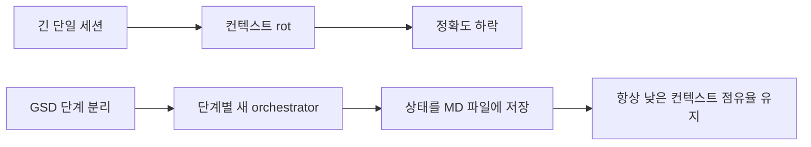
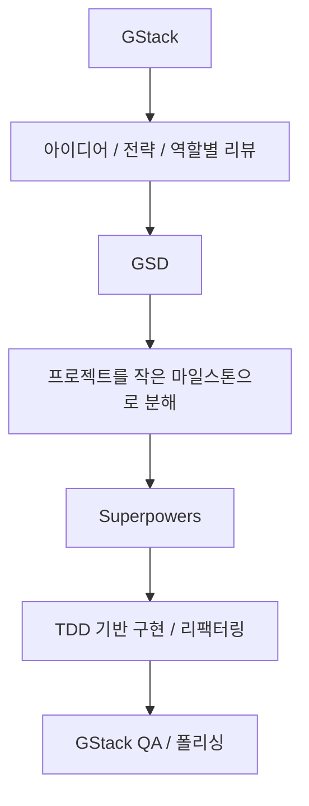

Claude Code로 무언가를 빠르게 만드는 것은 이제 그리 어렵지 않습니다. 더 어려운 것은 그 코드가 믿을 만한가, 같은 작업을 반복해도 품질이 일정한가, 테스트와 보안은 충분한가, 그리고 무엇보다 모델이 중간에 맥락을 잃지 않는가입니다. 이번 영상이 흥미로운 이유는 이 문제를 “최고의 단일 프레임워크”로 해결하려 하지 않기 때문입니다. 대신 커뮤니티에서 많이 쓰는 세 가지 축을 꺼냅니다. `Superpowers`, `GSD`, `GStack`. 그리고 이 셋이 서로 경쟁자가 아니라, 사실은 서로 다른 병목을 해결한다고 설명합니다. [YouTube 영상](https://www.youtube.com/watch?v=bzutStZJ1Ig)
<!--more-->

영상의 핵심 메시지는 아주 간단합니다. 세 프레임워크는 같은 문제를 풀지 않습니다.

- Superpowers는 **프로세스** 를 제어합니다.
- GSD는 **컨텍스트** 를 제어합니다.
- GStack은 **관점과 역할** 을 제어합니다.

이렇게 보면 왜 셋이 동시에 언급되는지가 분명해집니다. Claude Code의 실패는 한 가지 원인만으로 생기지 않기 때문입니다. 어떤 때는 계획 없이 코드를 써서 망가지고, 어떤 때는 컨텍스트가 썩어서 품질이 떨어지고, 어떤 때는 한 관점만으로 밀어붙여 제품적 판단이나 QA 시각이 빠집니다. 이 영상은 바로 그 세 종류의 실패를 구분해 줍니다. [YouTube 영상](https://www.youtube.com/watch?v=bzutStZJ1Ig)

## Sources

- https://www.youtube.com/watch?v=bzutStZJ1Ig

## 1. Superpowers는 Claude Code를 ‘즉흥 코더’에서 ‘절차를 따르는 엔지니어’로 바꾼다

영상에서 가장 먼저 설명하는 것은 `Superpowers` 입니다. 여기서 Superpowers의 역할은 명확합니다. Claude Code가 임의로 코드를 툭 던지는 대신, **정해진 소프트웨어 개발 방법론을 따르게 만드는 것** 입니다. [YouTube 영상](https://www.youtube.com/watch?v=bzutStZJ1Ig)

영상이 설명하는 흐름은 이렇습니다.

- 먼저 명확화 질문을 한다
- 무엇을 만들지 확인한다
- spec을 만든다
- 구현 계획을 만든다
- 테스트를 먼저 만든다
- 구현한다
- 리팩터링한다

즉 Superpowers의 핵심은 “잘 쓰는 프롬프트”가 아니라, **Claude에게 개발 절차를 강제하는 것** 입니다. 영상은 특히 TDD를 강조합니다. 먼저 소프트웨어가 어떻게 동작해야 하는지를 테스트로 고정하고, 그다음 구현하도록 만드는 방식입니다.

이 접근의 장점은 분명합니다. 출력 품질이 덜 흔들리고, 구현 전에 기대 행동이 먼저 정의되며, 이후 리팩터링까지 포함해 보다 안정적인 산출물을 얻기 쉽습니다. 결국 Superpowers는 Claude Code의 문제를 “모델이 덜 똑똑해서”가 아니라, **절차가 없어서** 생긴다고 보는 프레임워크입니다.

## 2. GSD는 ‘컨텍스트 rot’를 직접 겨냥한다

두 번째로 나오는 `GSD`는 방향이 다릅니다. 영상은 GSD가 해결하려는 문제를 `context rot` 라고 설명합니다. 세션 초반 20%쯤은 좋지만, 40%, 60%, 80%로 갈수록 출력 품질이 점점 떨어지는 현상입니다. [YouTube 영상](https://www.youtube.com/watch?v=bzutStZJ1Ig)

GSD의 믿음은 단순합니다. 컨텍스트 창을 항상 50% 이하로 유지하면 모델 정확도를 더 안정적으로 지킬 수 있다는 것입니다. 그래서 GSD는 작업을 여러 단계로 나누고, 각 단계를 별도의 orchestrator와 서브에이전트가 수행하도록 합니다. 그리고 각 단계의 상태는 markdown 파일로 디스크에 저장합니다.

즉 GSD의 핵심은:

- 한 번의 긴 대화로 끝까지 가지 않고
- 단계를 분리하고
- 각 단계마다 새 orchestrator를 쓰고
- 상태를 로컬 파일에 남기고
- 다음 단계는 그 상태를 다시 읽어 이어 가는 것

입니다.

이 접근은 Superpowers와 확실히 다릅니다. Superpowers도 여러 단계를 갖지만, 영상이 지적하듯 기본적으로는 하나의 큰 orchestrator 대화 안에서 흐름을 이어 갑니다. 반면 GSD는 단계가 바뀔 때마다 **오케스트레이터 자체를 교체** 하며, 그 사이 상태를 파일로 저장합니다. 결국 GSD는 Claude Code의 문제를 “절차 부재”보다 **긴 세션에서의 기억 오염과 품질 저하** 로 보는 셈입니다.

## 3. GStack은 ‘한 에이전트가 다 안다’는 가정을 버린다

세 번째 프레임워크인 `GStack`은 또 다른 문제를 겨냥합니다. 영상 표현을 빌리면, GStack의 사명은 하나의 범용 에이전트를 여러 전문 역할로 분해하는 것입니다. CEO, 엔지니어링 매니저, 디자이너, 릴리스 엔지니어, QA 등 서로 다른 렌즈를 프로젝트 각 단계에 도입하는 방식입니다. [YouTube 영상](https://www.youtube.com/watch?v=bzutStZJ1Ig)

여기서 중요한 차이는 단순 role prompt가 아니라는 점입니다. 영상은 GStack이 역할을 유지하기 위해 여러 레이어를 둔다고 설명합니다.

- 역할 집중
- 이전 단계의 데이터 흐름 위에서 작업
- 품질 체크리스트
- 자기 책임 범위만 처리
- 단순한 요약과 다음 액션 중심 출력

즉 “지금부터 CEO처럼 생각해” 수준이 아니라, **각 역할이 무엇을 보고 무엇은 보지 않을지까지 구조적으로 제한** 하는 접근입니다.

이 방식이 중요한 이유는 개발이 늘 하나의 관점만으로 풀리지 않기 때문입니다.

- 엔지니어는 구현 안정성을 본다
- CEO 관점은 가치와 우선순위를 본다
- QA는 사용자 흐름과 실패 시나리오를 본다
- 디자이너는 시각적 일관성과 사용성을 본다

GStack은 Claude Code의 실패를 “세션이 너무 길어서”도 아니고 “테스트가 없어서”도 아니라, **하나의 시각만으로 밀어붙이기 때문** 이라고 봅니다.

## 4. 세 프레임워크는 같은 층위에 있지 않다

이 영상이 좋은 이유는 바로 여기입니다. 많은 비교 영상이 “누가 더 좋냐”로 끝나는데, 이번 영상은 세 프레임워크를 같은 줄에 세우지 않습니다. 오히려 서로 다른 층위에 놓습니다.

- Superpowers는 작업 **절차** 를 설계한다
- GSD는 작업 **세션 구조** 를 설계한다
- GStack은 작업 **판단 렌즈** 를 설계한다

이 차이를 이해하면 왜 셋을 모두 쓰려는 시도가 나오는지도 이해됩니다. 예를 들어 TDD와 계획이 있어도 세션이 너무 길어져 정확도가 무너지면 결과가 흔들립니다. 반대로 세션을 잘게 쪼개도 제품 관점과 QA 관점이 빠지면 결과물은 일방적일 수 있습니다. 또 역할 분리가 잘 되어 있어도 구현 과정 자체가 즉흥적이면 안정성이 떨어집니다.

즉 세 프레임워크는 서로를 대체하기보다, **Claude Code 실패의 서로 다른 원인을 커버하는 조합** 에 가깝습니다.

## 5. 영상의 핵심 결론: 셋을 섞으면 ‘파워 스택’이 된다

영상 후반부는 아주 실용적입니다. 결국 셋을 합칠 수 있느냐는 질문으로 넘어가고, 답은 “그렇다”입니다. [YouTube 영상](https://www.youtube.com/watch?v=bzutStZJ1Ig)

영상이 제안하는 조합은 대략 이렇습니다.

- 전략적 기획과 상위 관점 리뷰는 `GStack`
- 프로젝트를 마일스톤으로 쪼개고, 각 단계의 컨텍스트를 보호하는 것은 `GSD`
- 실제 구현과 테스트 중심 실행은 `Superpowers`
- 마지막 QA나 polish 단계는 다시 `GStack`

이 배치는 꽤 설득력이 있습니다. GStack은 역할 기반 시각을 제공해 아이디어와 계획을 더 날카롭게 만들고, GSD는 그 계획을 지나치게 큰 작업 덩어리로 두지 않게 막고, Superpowers는 쪼개진 단위를 테스트 중심으로 구현하게 만듭니다.

즉 하나의 “최고 프레임워크”를 찾는 대신:

1. 먼저 관점을 나누고
2. 그다음 컨텍스트를 나누고
3. 마지막으로 구현 절차를 엄격히 적용하는

식의 스택이 되는 셈입니다.

## 6. 실전에서 어떻게 골라야 할까

이 영상을 실무에 그대로 옮기면 선택 기준은 생각보다 단순합니다.

만약 당신의 문제는:

- Claude가 너무 즉흥적으로 코드를 써서 품질이 들쑥날쑥하다  
  → `Superpowers`

- 작업이 길어질수록 세션 품질이 무너지고 반복 설명이 많아진다  
  → `GSD`

- 한 관점으로만 밀어붙여 제품 감각, QA, 디자인 판단이 자주 빠진다  
  → `GStack`

일 가능성이 큽니다.

즉 무엇이 최고냐보다, **내 병목이 프로세스인지, 컨텍스트인지, 관점인지** 먼저 진단하는 편이 훨씬 낫습니다.

## 7. 이 영상이 시사하는 더 큰 방향: Claude Code는 이제 ‘운영 설계’의 대상이다

예전에는 코딩 에이전트를 평가할 때 “코드를 얼마나 잘 쓰느냐”가 거의 전부였습니다. 하지만 이 영상은 그 시대가 지나가고 있음을 보여 줍니다. 이제 중요한 것은:

- 어떤 절차를 강제할 것인가
- 컨텍스트를 어떻게 보호할 것인가
- 어떤 역할과 관점을 언제 투입할 것인가

입니다.

즉 Claude Code의 성능은 이제 모델 단독 성능이 아니라, **어떤 운영 프레임 위에 올려 두느냐** 에 크게 좌우됩니다. 이 점에서 Superpowers, GSD, GStack은 단순한 취향 차이의 도구가 아니라, Claude Code를 실제 개발 조직처럼 굴리기 위한 세 가지 구조적 해답으로 볼 수 있습니다.

## 실전 적용 포인트

세 프레임워크를 한 번에 모두 도입할 필요는 없습니다. 오히려 다음처럼 단계적으로 붙이는 편이 현실적입니다.

- 먼저 `Superpowers` 로 테스트·계획 중심 습관을 만든다
- 큰 프로젝트나 긴 세션에서 문제가 생기면 `GSD` 를 붙인다
- 제품/디자인/QA 관점이 자주 빠지면 `GStack` 으로 역할 기반 리뷰를 추가한다

그리고 팀이 어느 정도 익숙해지면, 영상이 말한 것처럼:

- GStack으로 기획
- GSD로 마일스톤 분해
- Superpowers로 구현
- GStack으로 QA

같은 방식으로 파워 스택을 구성할 수 있습니다.

## 핵심 요약

- `Superpowers` 는 Claude Code의 개발 절차를 제어한다.
- `GSD` 는 긴 세션에서 생기는 context rot를 막기 위해 단계별 새 orchestrator와 디스크 상태 저장을 사용한다.
- `GStack` 은 하나의 범용 에이전트를 여러 전문 역할로 나누어 관점을 보강한다.
- 세 프레임워크는 경쟁자가 아니라 서로 다른 실패 원인을 다룬다.
- 따라서 무엇이 최고냐보다, 프로세스·컨텍스트·관점 중 어디가 병목인지 먼저 봐야 한다.
- 영상의 최종 제안은 셋을 조합한 파워 스택이다.

## 결론

이 영상이 보여 주는 가장 중요한 사실은, Claude Code를 잘 쓰는 방법이 더 이상 “프롬프트를 잘 쓰는 법”에만 머물지 않는다는 점입니다. 이제는 프로세스를 어떻게 제한할지, 세션을 어떻게 쪼갤지, 어떤 역할과 관점으로 리뷰할지를 설계해야 합니다.

그 의미에서 Superpowers, GSD, GStack은 세 개의 대체재가 아니라 세 개의 설계 축입니다. Claude Code를 더 강하게 만든다기보다, **Claude Code가 실패하는 서로 다른 이유를 줄이는 장치들** 이라고 보는 편이 훨씬 정확합니다.
