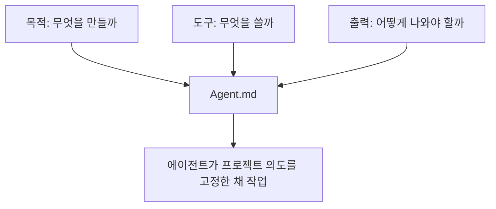

하네스 엔지니어링을 처음 접하면 보통 스킬, 에이전트, 프롬프트, 규칙 파일이 한꺼번에 쏟아져 들어와서 더 복잡하게 느껴집니다. 그런데 이 영상이 좋은 이유는, 그 복잡함을 “엄청난 자동화 체계”로 설명하지 않고 **프로젝트 시작 전에 에이전트가 기억해야 할 걸 먼저 기록해 두는 일** 로 풀어낸다는 점입니다. 영상의 핵심은 화려한 멀티 에이전트가 아니라 `Agent.md` 입니다. 무엇을 만들 프로젝트인지, 어떤 도구를 쓸 것인지, 결과물은 어떻게 나와야 하는지를 먼저 파일로 박아 두고 시작하는 것. 바로 그게 입문자용 하네스의 가장 작은 시작점이라는 설명입니다. [YouTube 영상](https://youtu.be/uB2m8MATXow)
<!--more-->

영상은 이를 슬라이드 메이커를 만드는 예시로 보여 줍니다. 그리고 이 예시가 좋은 이유는, 복잡한 코딩 프레임워크를 전면에 세우지 않고도 하네스가 왜 필요한지 보여 주기 때문입니다. 에이전트가 하이퍼프레임즈를 조사하고, 그 조사 결과를 바탕으로 `Agent.md` 를 만들고, 이후부터는 “이 프로젝트는 슬라이드도 보고 비디오도 렌더링해야 한다”는 목적을 매번 다시 설명하지 않아도 되게 만드는 것이죠. 결국 하네스 엔지니어링의 첫걸음은 복잡한 제어가 아니라 **반복 설명을 줄이는 구조화된 기억** 입니다. [YouTube 영상](https://youtu.be/uB2m8MATXow)

## Sources

- https://youtu.be/uB2m8MATXow

## 1. 하네스는 거창한 시스템이 아니라 “에이전트가 일하는 환경을 미리 세팅하는 것”이다

영상에서 가장 먼저 눈에 들어오는 것은 하네스를 대하는 태도입니다. 흔히 하네스 엔지니어링이라고 하면 거대한 자동화나 복잡한 스킬 체인을 떠올리기 쉬운데, 이 영상은 그보다 훨씬 현실적인 출발점을 보여 줍니다. [YouTube 영상](https://youtu.be/uB2m8MATXow)

핵심은 이겁니다.

- 프로젝트 폴더를 만든다
- 에이전트를 실행한다
- 어떤 도구를 왜 쓸지 조사시킨다
- 그 결과를 `Agent.md` 로 정리한다
- 이후 세션은 그 파일을 바탕으로 시작한다

즉 하네스는 “에이전트가 스스로 다 하게 만드는 마법”이 아니라, **에이전트가 같은 말을 다시 묻지 않도록 일하는 문맥을 먼저 깔아 두는 것** 에 가깝습니다.

## 2. 왜 `CLAUDE.md`보다 `Agent.md`를 권하나: 도구를 섞어 쓸 수 있어야 하기 때문이다

영상에서 반복해서 나오는 포인트 중 하나는 `CLAUDE.md` 대신 `Agent.md` 계열로 작업하라는 주장입니다. 이유도 명확합니다. 특정 도구 전용 파일은 그 도구 안에서는 잘 작동하지만, 도구를 두 개 이상 섞어 쓰거나 다른 에이전트로 옮길 때는 제약이 생긴다는 것입니다. [YouTube 영상](https://youtu.be/uB2m8MATXow)

즉:

- Claude Code만 쓸 거면 전용 규칙 파일도 괜찮을 수 있지만
- Codex, Claude Code, 다른 에이전트를 섞어 쓴다면
- 특정 제품 이름이 박힌 파일보다 더 일반적인 운영 문서가 낫다

는 논리입니다.

이 주장은 꽤 실용적입니다. 하네스를 만든다는 것은 결국 특정 세션에 종속되지 않는 작업 환경을 만든다는 뜻이기 때문에, **도구 독립적인 메모리 층** 을 갖는 편이 유리합니다.

## 3. 입문자에게 중요한 건 모델보다 프로젝트 목적을 먼저 고정하는 일이다

영상 초반에는 Codex 설정 이야기도 나옵니다. GPT 5.5 모델 사용, fast 모드, 프로젝트별 설정 파일 등 여러 실무 팁이 등장하지만, 글의 본질은 여기에 있지 않습니다. 더 중요한 것은 “무슨 모델을 쓰느냐”보다 **이 프로젝트가 무엇을 하려는지 먼저 고정하는 것** 입니다. [YouTube 영상](https://youtu.be/uB2m8MATXow)

영상의 슬라이드 메이커 예시를 보면, 에이전트에게 먼저 하이퍼프레임즈가 무엇인지 조사시키고, 그다음 이렇게 말합니다.

- 이 프로젝트에서는 하이퍼프레임즈를 쓸 것이다
- 정적 슬라이드도 봐야 한다
- 동영상 렌더링도 해야 한다
- 이 계획을 Agent.md에 기록해라

이 과정이 중요한 이유는, 그 순간부터 프로젝트가 “그냥 새 폴더”가 아니라 **목적이 명시된 작업 공간** 으로 바뀌기 때문입니다.

## 4. Agent.md는 단순 메모가 아니라 세션 시작 프롬프트 역할을 한다

영상이 설명하는 Agent.md의 핵심은 이 파일이 이후 세션마다 자동으로 다시 읽히며 작업의 출발점을 고정한다는 점입니다. [YouTube 영상](https://youtu.be/uB2m8MATXow)

즉 Agent.md에 다음이 적혀 있으면:

- 프로젝트 목적
- 핵심 도구
- 어떤 출력이 필요한지
- 어떤 구조로 폴더를 쓸지
- 어떤 선행 조건이 필요한지

이후 새 세션을 열 때마다 에이전트가 그걸 올려놓고 시작하게 됩니다. 그래서 매번:

- “이 프로젝트는 슬라이드 만드는 거야”
- “하이퍼프레임즈 쓸 거야”
- “정적 뷰와 비디오 렌더 둘 다 필요해”

라고 다시 설명하지 않아도 됩니다.

이게 바로 하네스의 본질입니다. 더 많은 명령을 시키는 게 아니라, **세션을 열 때마다 같은 배경 설명을 되풀이하지 않게 만드는 것** 입니다.

## 5. 좋은 하네스는 도구를 먼저 이해한 뒤 규칙을 적는다

영상에서 또 눈에 띄는 부분은, 규칙 파일부터 억지로 쓰지 않는다는 점입니다. 먼저 하이퍼프레임즈라는 도구를 검색시켜 “이게 어떤 도구인지 알아봐”라고 시킵니다. 그리고 나서 그 조사 결과를 바탕으로 Agent.md를 쓰게 합니다. [YouTube 영상](https://youtu.be/uB2m8MATXow)

이 순서가 중요한 이유는 명확합니다.

- 도구도 잘 모르는데 규칙부터 쓰면 빈 문서가 된다
- 먼저 도구의 선행 조건과 사용법을 이해해야
- 프로젝트에서 어떤 방식으로 운용할지가 구체화된다

즉 좋은 하네스는 추상 규칙이 아니라, **실제 도구 조사 결과를 기반으로 한 작업 지침** 에서 시작합니다.

## 6. Agent.md가 있으면 설치와 선행 조건도 에이전트가 먼저 챙긴다

영상 후반부의 아주 실용적인 포인트는 이것입니다. Agent.md에 하이퍼프레임즈와 그 선행 조건이 적혀 있으니, 이후 슬라이드를 만들어 달라고 했을 때 에이전트가 먼저 필요한 설치를 확인하고 챙기기 시작합니다. 예를 들어 Node.js나 FFmpeg 같은 요구 사항을 찾아보고, 없으면 설치하려고 나서는 식입니다. [YouTube 영상](https://youtu.be/uB2m8MATXow)

이게 의미하는 바는 크죠. 우리가 원하는 건 매번 “이거 먼저 깔아”, “저거 필요해”라고 사람이 일일이 지시하는 게 아닙니다. 하네스가 잘 잡혀 있으면, 에이전트는 **목적을 달성하기 위해 필요한 준비 작업까지 스스로 추론** 합니다.

즉 Agent.md는 단순한 기억 장치가 아니라, 준비 단계까지 자동화하는 출발 문서입니다.

## 7. 입문자에게 하네스가 특히 필요한 이유: 반복 설명이 가장 큰 낭비이기 때문이다

경험이 적을수록 사람은 에이전트에게 같은 설명을 계속 반복하게 됩니다.

- 이 프로젝트는 뭐 하는 건지
- 왜 이 도구를 쓰는지
- 출력이 어떻게 나와야 하는지
- 정적 결과와 동적 결과가 모두 필요한지

이런 걸 매 세션마다 새로 설명하면, 토큰도 아깝고 판단도 흔들립니다. 영상은 바로 이 낭비를 없애는 가장 쉬운 방법으로 Agent.md를 제시합니다. [YouTube 영상](https://youtu.be/uB2m8MATXow)

결국 초보자용 하네스는 대단한 자율 시스템보다도, **프로젝트 목적을 잘 적어 놓은 한 장의 운영 문서** 에서 시작합니다.

## 8. 하네스의 최소 단위는 “목적 + 도구 + 출력 형식”이다

영상의 예시를 정리하면, 최소한 다음 세 가지는 Agent.md에 들어가야 합니다.

### 8-1. 목적

이 프로젝트는 무엇을 만드는가. 예: 슬라이드 메이커.

### 8-2. 도구

무엇을 핵심 도구로 쓸 것인가. 예: 하이퍼프레임즈.

### 8-3. 출력 형식

정적 슬라이드도 보여야 하고, 비디오 렌더링도 가능해야 한다.

이 세 가지가 들어가면 에이전트는 이후부터 “무엇을 위해, 어떤 도구를 써서, 어떤 결과물을 내야 하는가”를 알고 움직입니다. 즉 하네스의 최소 단위는 복잡한 자동화 규칙이 아니라, **작업의 좌표계를 먼저 적는 것** 입니다.

## 9. 이 영상이 말하는 하네스는 ‘통제’보다 ‘정렬’에 가깝다

하네스라는 말을 들으면 보통 에이전트를 세게 통제하는 느낌이 먼저 듭니다. 그런데 이 영상에서의 하네스는 그보다는 정렬에 가깝습니다.

- 프로젝트가 뭘 하려는지 정렬하고
- 도구 사용법을 정렬하고
- 결과물 기대치를 정렬하고
- 세션이 바뀌어도 같은 방향으로 시작하게 정렬합니다

즉 하네스는 에이전트를 족쇄 채우는 장치가 아니라, **처음부터 같은 방향을 보게 만드는 정렬 도구** 라고 이해하는 편이 맞습니다.

## 실전 적용 포인트

처음 하네스를 만들 때는 거창한 스킬 체인보다 아래 순서로만 해도 충분합니다.

1. 프로젝트 폴더를 만든다
2. 사용할 핵심 도구를 하나 정한다
3. 그 도구를 에이전트에게 먼저 조사시킨다
4. 조사 결과를 바탕으로 Agent.md를 작성시킨다
5. 목적, 도구, 출력 형식을 먼저 고정한다
6. 그다음부터 실제 구현을 시작한다

이 순서만 지켜도 이후 세션의 흔들림이 크게 줄어듭니다.

## 핵심 요약

- 입문자용 하네스 엔지니어링의 출발점은 Agent.md다.
- Agent.md는 단순 메모가 아니라 세션마다 다시 읽히는 작업 기준 문서다.
- 좋은 하네스는 도구를 먼저 조사한 뒤 그 결과를 바탕으로 작성된다.
- 최소한 목적, 도구, 출력 형식을 먼저 고정해야 한다.
- 이렇게 하면 에이전트는 반복 설명 없이 같은 방향으로 작업을 시작할 수 있다.
- 하네스의 핵심은 복잡한 통제보다 작업 환경의 정렬에 있다.

## 결론

하네스 엔지니어링을 처음 시작할 때 가장 흔한 오해는, 거대한 스킬 시스템부터 만들어야 한다는 생각입니다. 하지만 이 영상이 보여 주는 실제 출발점은 훨씬 작고 실용적입니다. 프로젝트 목적을 쓰고, 도구를 조사시키고, Agent.md에 남기고, 그 문서를 매 세션의 기준점으로 삼는 것.

결국 초보자에게 필요한 하네스는 복잡한 자율 시스템이 아니라, **에이전트가 매번 같은 프로젝트를 같은 의도로 이해하게 만드는 문서 한 장** 입니다. 그 한 장이 쌓이기 시작하면, 그다음부터 진짜 하네스가 자라납니다.
