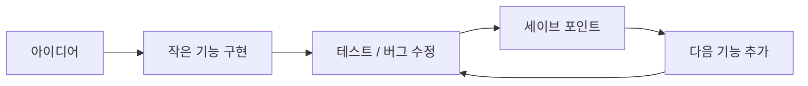
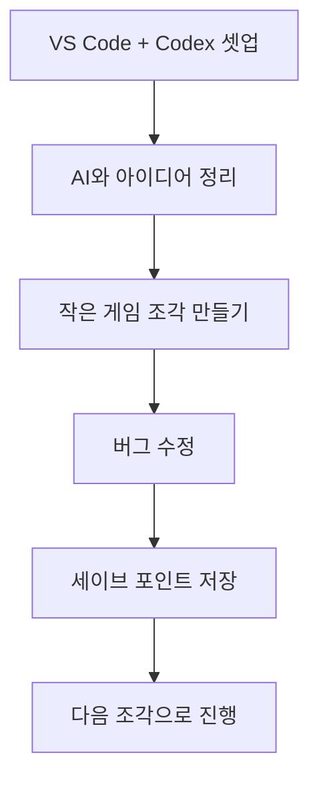

이 라이브 영상이 흥미로운 이유는 “게임을 만들었다”는 결과보다, 비전공자가 바이브 코딩으로 게임을 만들 때 어디서 제일 많이 막히는지를 아주 현실적으로 보여 준다는 점입니다. 영상은 처음부터 거창한 기술론으로 가지 않습니다. 대신 셋업이 왜 중요한지, 아이디어를 AI와 함께 어떻게 구체화하는지, 그리고 왜 게임은 한 번에 만들어지지 않고 계속 잘라서 저장해야 하는지를 반복해서 강조합니다. 즉 이번 영상의 핵심은 멋진 게임 데모보다, **왕초보가 좌절하지 않기 위한 작업 방식** 에 더 가깝습니다. [YouTube 영상](https://www.youtube.com/watch?v=awt1i7vq-5w)
<!--more-->

특히 인상적인 부분은 발표자가 자신을 전공자도 아니고 일반 직장인이라고 소개하면서도, 실제로는 두 개의 게임을 몇백 시간씩 쪼개서 만들었다는 점입니다. 이 말은 중요합니다. 바이브 코딩으로 게임을 만든다는 것은 “한 번의 프롬프트로 게임 완성”이 아니라, **셋업 → 아이디어 협업 → 조금 만들고 저장 → 다시 다듬기** 의 긴 반복이라는 뜻이기 때문입니다. [YouTube 영상](https://www.youtube.com/watch?v=awt1i7vq-5w)

## Sources

- https://www.youtube.com/watch?v=awt1i7vq-5w

## 1. 초보자에게 가장 중요한 것은 모델보다 셋업이다

영상에서 발표자는 시작부터 셋업의 중요성을 크게 잡습니다. 루피가 예전에 말했던 것처럼, 처음 환경을 잘 잡는 것이 제일 중요하다는 식으로 이야기하죠. 그리고 실제로 강의에서도 상당한 시간을 여기에 씁니다. [YouTube 영상](https://www.youtube.com/watch?v=awt1i7vq-5w)

그 이유는 명확합니다. 바이브 코딩은 모델이 똑똑하다고 바로 굴러가는 게 아니라:

- 어디서 코딩할지
- 어떤 확장을 쓸지
- 어떤 모델로 돌릴지
- 파일 구조를 어떻게 볼지

같은 기본 환경이 흔들리면, 이후 단계가 전부 불안정해집니다.

영상은 그래서 초보자용 최소 셋업을 아주 단순하게 제안합니다.

- VS Code 설치
- Codex 확장 설치
- VS Code 안에서 Codex 사용

즉 처음부터 여러 도구를 섞지 않고, **가장 단순한 편집기 + 에이전트 조합으로 시작하라** 는 메시지입니다.

## 2. 왜 VS Code를 쓰나: 코딩 도구라서가 아니라 폴더와 파일 흐름을 보기 쉬워서다

영상에서 VS Code를 쓰는 이유는 IDE 찬양이 아닙니다. 발표자는 오히려 왼쪽 파일 트리와 현재 폴더 구조를 보기 편해서 쓴다고 말합니다. [YouTube 영상](https://www.youtube.com/watch?v=awt1i7vq-5w)

이건 입문자에게 특히 중요한 포인트입니다. 초보자는 에이전트가 무슨 파일을 만들었는지, 어떤 폴더에 저장했는지, 지금 프로젝트가 어떤 구조인지 감을 잃기 쉽습니다. 그래서:

- 폴더 구조를 눈으로 보고
- 파일이 생기는 흐름을 추적하고
- 가운데 에디터로 결과를 확인하고
- 옆에서 터미널을 돌릴 수 있는 환경

이 필요합니다.

즉 VS Code는 여기서 고급 코딩 환경이라기보다, **에이전트가 한 일을 사람이 따라갈 수 있게 해 주는 관찰 창** 역할을 합니다.

## 3. 게임 아이디어도 혼자 짜내는 게 아니라 AI와 함께 구체화한다

영상의 목차에서 흥미로운 부분은, 발표자가 처음엔 게임 아이디어를 미리 준비해 두고 만들기만 보여 줄까 고민했지만, 결국 아이디어를 AI와 같이 이야기하는 단계부터 보여 주는 쪽을 택했다는 점입니다. [YouTube 영상](https://www.youtube.com/watch?v=awt1i7vq-5w)

이 선택은 중요합니다. 왜냐하면 초보자에게 가장 막막한 순간은 “무슨 게임을 만들지”이지, 코드 한 줄 한 줄이 아니기 때문입니다.

즉 바이브 코딩에서 AI는 단순 구현 도구가 아니라:

- 아이디어를 좁히고
- 게임 장르를 구체화하고
- 초반 구현 범위를 작게 잡고
- 무엇부터 만들지 정리하게 해 주는

기획 파트너 역할도 합니다.

이 점에서 게임 제작은 앱 제작과 비슷합니다. 코드보다 먼저, **어떤 경험을 만들지 AI와 대화로 압축하는 단계** 가 필요합니다.

## 4. 이번 영상의 중요한 현실 인식: 게임은 절대 한 번에 안 만들어진다

영상에서 발표자가 가장 강하게 말하는 부분 중 하나는, 게임이 한 번에 만들어지지 않는다는 점입니다. 각 게임마다 400시간 정도가 들어갔고, 조금 만들고 저장하고, 또 조금 만들고 저장하는 식으로 쌓였다고 설명합니다. [YouTube 영상](https://www.youtube.com/watch?v=awt1i7vq-5w)

이 말은 바이브 코딩에 대한 가장 흔한 오해를 깨 줍니다. 많은 사람은 AI가 있으니:

- 프롬프트 한 번
- 코드 생성 한 번
- 곧바로 플레이 가능한 게임

같은 흐름을 기대합니다. 하지만 현실은 정반대입니다.

- 버그가 생기고
- 고치고
- 다시 돌려 보고
- 저장 포인트를 만들고
- 기능을 조금씩 늘립니다

즉 AI 게임 개발의 진짜 생산성은 마법 같은 완성도가 아니라, **작은 단위를 계속 쌓을 수 있게 해 주는 반복 속도** 에 있습니다.

## 5. 세이브 포인트 감각이 왜 중요할까

영상 중간에 발표자는 실제 프로젝트 화면을 보여 주며, 한 줄 한 줄이 전부 살짝 만들고 세이브한 포인트라고 설명합니다. [YouTube 영상](https://www.youtube.com/watch?v=awt1i7vq-5w)

이 관점은 매우 중요합니다. 게임 개발은 상태가 많고 서로 얽혀 있기 때문에, 한 번에 큰 덩어리로 밀면 망가졌을 때 되돌리기 어렵습니다. 특히 바이브 코딩에서는 AI가 좋은 수정과 나쁜 수정을 섞어 내놓는 경우가 많으므로:

- 어디까지가 괜찮은 상태였는지
- 어디서부터 이상해졌는지
- 어떤 기능이 새로 들어온 것인지

를 추적할 수 있어야 합니다.

그래서 세이브 포인트는 단순 저장이 아니라, **에이전트와 함께 일할 때 망가짐을 견디는 복구 지점** 입니다.

## 6. “버그 수정이 70%”라는 말이 보여 주는 것

영상에서 발표자는 앱이든 게임이든 전체 노력의 70% 정도는 버그 고치기에 들어간다는 식으로 이야기합니다. [YouTube 영상](https://www.youtube.com/watch?v=awt1i7vq-5w)

이 말은 초보자에게 특히 중요합니다. 왜냐하면 바이브 코딩을 시작하면 대부분 “왜 이렇게 자꾸 고쳐야 하지?”라는 좌절을 빨리 겪기 때문입니다. 하지만 영상은 오히려 그것이 정상이라고 말합니다.

즉:

- 버그가 많다고 실패한 게 아니고
- 버그를 고치는 과정 자체가 제작의 대부분이며
- 추리력과 원인 파악 능력이 점점 더 중요해진다

는 것입니다.

이 관점으로 보면 바이브 코딩은 멋진 생성보다도, **오작동을 빠르게 읽고 복구하는 반복 훈련** 에 더 가깝습니다.

## 7. 비전공자에게 중요한 메시지: 코드를 몰라도 시작할 수는 있지만, 반복은 피할 수 없다

발표자는 스스로를 전공자가 아니고 코딩을 전혀 몰랐던 사람이라고 소개합니다. 그러면서도 두 개의 게임을 몇백 시간씩 만들었다고 말합니다. [YouTube 영상](https://www.youtube.com/watch?v=awt1i7vq-5w)

이 말이 주는 희망은 분명합니다. 시작 장벽은 낮아졌습니다. 하지만 동시에 영상은 냉정한 사실도 보여 줍니다.

- 비전공자도 시작할 수 있다
- 하지만 시간을 거의 안 들이고 끝내는 것은 아니다
- 오히려 더 잘게 쪼개고 더 자주 저장하고 더 많이 수정해야 한다

즉 AI는 입구를 넓혀 줬지만, **완성도 있는 게임을 만드는 반복 노동 자체를 없애 주지는 않습니다.**

## 8. 이번 영상이 말하는 ‘초보자용’의 진짜 의미

이 영상은 분명 초보자용이라고 말하지만, 그 의미는 “금방 끝난다”가 아닙니다. 오히려:

- 최소 셋업으로 시작한다
- 아이디어를 AI와 같이 정리한다
- 조금씩 만든다
- 자주 저장한다
- 버그 수정이 대부분이라는 걸 받아들인다

는 현실적인 태도를 배우는 것이 초보자용이라는 뜻에 더 가깝습니다.

즉 초보자용 입문은 마법 같은 쉬움이 아니라, **망가지지 않게 오래 버티는 기본기** 를 알려 주는 것입니다.

## 실전 적용 포인트

이 영상을 바로 따라 한다면 가장 중요한 원칙은 다섯 가지입니다.

1. 도구를 많이 깔지 말고 VS Code + Codex부터 시작한다  
2. 게임 아이디어를 혼자 정리하지 말고 AI와 먼저 대화한다  
3. 한 번에 큰 걸 만들지 말고 작은 조각부터 만든다  
4. 자주 세이브 포인트를 남긴다  
5. 버그 수정이 대부분의 시간을 차지해도 정상이라고 받아들인다

즉 입문자의 목표는 멋진 완성작보다, **망가지지 않는 제작 루프를 먼저 배우는 것** 입니다.

## 핵심 요약

- 이 영상은 초보자용 게임 제작 튜토리얼이지만, 실제 핵심은 셋업과 작업 방식이다.
- VS Code + Codex 조합은 파일 구조를 눈으로 추적하기 쉬운 최소 셋업이다.
- 게임 아이디어도 AI와 함께 정리하는 과정이 중요하다.
- 게임은 한 번에 완성되지 않고, 작은 조각과 세이브 포인트의 반복으로 만들어진다.
- 바이브 코딩에서 많은 시간은 버그 수정에 쓰이며, 그건 정상이다.
- 비전공자도 시작할 수 있지만 반복과 복구의 감각은 반드시 필요하다.

## 결론

왕초보가 Codex로 게임을 만들 때 가장 먼저 배워야 하는 것은 화려한 프롬프트가 아닙니다. 좋은 셋업, 작은 단위로 나누는 습관, 자주 저장하는 감각, 그리고 버그 수정이 제작의 일부라는 현실 인식입니다.

그래서 이 영상의 진짜 가치는 “게임을 만들 수 있다”는 희망보다, **어떻게 망가지지 않고 계속 만들 수 있는가** 를 보여 주는 데 있습니다. 시작은 쉬워졌지만, 완성은 여전히 반복의 기술이라는 점을 아주 솔직하게 보여 주는 입문 영상입니다.
