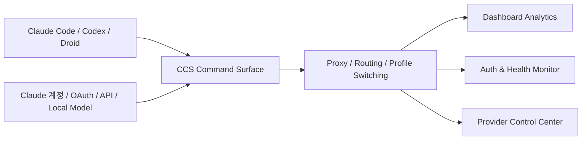

처음 보면 `CCS` 는 단순히 Claude 계정을 바꿔 쓰는 도구처럼 보입니다. 하지만 README를 조금만 읽어 보면 그보다 범위가 훨씬 넓습니다. 저장소가 스스로를 설명하는 문구부터 `The multi-provider profile and runtime manager for Claude Code and compatible CLIs` 입니다. 즉 CCS는 계정 전환 도구가 아니라, **Claude Code와 호환 CLI들을 위한 멀티 프로바이더 운영 레이어** 를 만들려는 프로젝트입니다. [GitHub 저장소](https://github.com/kaitranntt/ccs)
<!--more-->

이 프로젝트의 핵심은 “하나의 안정된 명령 표면”을 만들겠다는 데 있습니다. Claude Code, Codex CLI, Factory Droid 같은 런타임을 오가고, 여러 Claude 구독 계정과 OAuth 제공자, 그리고 OpenRouter·Ollama·GLM 같은 API/로컬 모델 프로필을 섞어 써도, 사용자는 계속 `ccs` 라는 같은 명령 표면 위에서 움직입니다. 즉 CCS가 해결하려는 것은 단순 로그인 전환이 아니라 **구성 파일 갈아엎기와 세션 파손 없이 AI 런타임을 오가는 문제** 입니다. [GitHub 저장소](https://github.com/kaitranntt/ccs)

## Sources

- https://github.com/kaitranntt/ccs

## 1. CCS는 ‘계정 전환기’보다 ‘운영면 통합기’에 가깝다

README의 `Why CCS` 섹션이 보여 주는 가장 큰 포인트는 범위입니다. CCS는 다음을 하나의 표면에서 다루겠다고 말합니다.

- Claude Code, Factory Droid, Codex CLI 같은 여러 런타임
- 여러 Claude 구독과 분리된 계정 문맥
- Codex, Copilot, Kiro, Claude, Qwen, Kimi 같은 OAuth 제공자
- GLM, Kimi, OpenRouter, Ollama, llama.cpp, Novita 등 API/로컬 모델 프로필

이 구성은 중요합니다. 왜냐하면 실제 AI 코딩 환경에서 귀찮은 부분은 모델 자체보다도:

- 지금 어떤 런타임을 쓰는지
- 어떤 계정 컨텍스트를 타는지
- 어떤 API 프로필을 물고 있는지
- local/model/provider를 바꿀 때 세션이 얼마나 흔들리는지

같은 운영면이기 때문입니다. CCS는 이 문제를 `하나의 command surface` 로 정리하려 합니다. [GitHub 저장소](https://github.com/kaitranntt/ccs)

## 2. 이 프로젝트의 목표는 설정 파일 갈아엎기를 끝내는 것이다

README는 목표를 아주 직설적으로 설명합니다. `stop rewriting config files, stop breaking active sessions, and move between providers in seconds.` [GitHub 저장소](https://github.com/kaitranntt/ccs)

이 문장이 CCS의 핵심을 가장 잘 보여 줍니다. AI 도구를 여러 개 섞어 쓰다 보면 보통 이런 일이 생깁니다.

- 특정 CLI는 Anthropic 계정 기준으로 맞춰 둠
- 다른 CLI는 OpenRouter 쪽으로 따로 맞춰 둠
- 또 다른 실험은 로컬 Ollama로 돌림
- 그때마다 환경 변수, 설정 파일, 세션 상태가 뒤섞임

즉 실제 병목은 모델 선택이 아니라 **운영 전환 비용** 입니다. CCS는 이를 명령 수준에서 평탄화합니다.

예를 들어 README의 Quick Start만 봐도:

- `ccs`
- `ccs codex`
- `ccs --target droid glm`
- `ccs ollama`

처럼 거의 같은 감각으로 서로 다른 런타임/프로필을 부를 수 있습니다. 사용자의 근육 기억을 바꾸지 않고 백엔드만 바꾸려는 설계입니다.

## 3. Anthropic-compatible proxy가 붙으면서 범위가 더 커졌다

README에서 특히 눈에 띄는 부분은 `OpenAI-Compatible Routing` 입니다. CCS는 이제 로컬 Anthropic-compatible proxy를 통해 Claude Code를 OpenAI-compatible provider에 브리지할 수 있다고 설명합니다. [GitHub 저장소](https://github.com/kaitranntt/ccs)

이 말이 의미하는 것은 꽤 큽니다.

- 어떤 툴은 Anthropic 형식으로만 말할 수 있고
- 어떤 공급자는 OpenAI 호환 형식만 내놓고
- 사용자는 둘 사이의 프로토콜 차이를 매번 신경 써야 했는데

CCS는 그 사이에 프록시를 놓아 이를 흡수합니다.

즉 CCS는 단순 스위처에서 한 단계 더 나아가, **프로토콜 번역까지 포함한 런타임 브리지** 가 되기 시작한 셈입니다.

README가 `claude-code-router` 와의 관계를 따로 설명하는 것도 이 때문입니다. CCR이 독립 라우터라면, CCS는 그 라우팅 흐름을 프로필 관리와 런타임 브리지까지 통합한 방향으로 가져가고 있습니다.

## 4. CCS의 강점은 “하나의 CLI + 하나의 대시보드”로 운영을 보이게 만든다는 점이다

저장소 화면과 README를 보면 CCS는 CLI만 있는 도구가 아닙니다. Usage Analytics, Live Auth Monitor, OAuth Provider Control Center, WebSearch fallback 같은 대시보드 표면을 함께 강조합니다. [GitHub 저장소](https://github.com/kaitranntt/ccs)

이게 중요한 이유는 운영 복잡도가 커질수록 사람이 알고 싶은 것이 늘어나기 때문입니다.

- 어떤 프로필이 지금 켜져 있나
- 어느 계정의 인증 상태가 괜찮나
- 이번 세션 비용이 얼마나 나가나
- 어떤 라우팅 정책이 걸려 있나
- fallback 도구는 준비돼 있나

CLI만 있으면 이걸 다 config와 로그로 추적해야 합니다. CCS는 그걸 “운영면”으로 올려줍니다. 그래서 이 도구의 진짜 가치는 명령 몇 개가 아니라, **멀티 프로바이더 상태를 사람 눈에 보이게 만든다** 는 데 있습니다.

## 5. 실제 사용 흐름은 ‘작업별 런타임 분리’에 가깝다

README의 Example Workflow도 꽤 인상적입니다.

- 설계는 기본 Claude로
- 구현은 Codex로
- 정리 작업은 더 싼 GLM 프로필로
- 프라이버시/오프라인 필요 시 Ollama로

이 예시는 CCS를 왜 운영 레이어라고 봐야 하는지 잘 보여 줍니다. [GitHub 저장소](https://github.com/kaitranntt/ccs)

즉 CCS는 “어떤 모델이 최고냐”를 묻지 않습니다. 오히려:

- 지금 이 작업은 누구에게 맡길까
- 이 단계에서 어떤 비용/속도/프라이버시 균형을 쓸까
- 이 런타임을 지금 계정과 붙일까, 다른 프로필과 붙일까

를 결정하는 표면입니다.

그래서 이 프로젝트는 모델 라우터이기도 하지만, 더 정확히는 **작업 단위별 런타임 배치 도구** 에 가깝습니다.

## 6. WebSearch와 Browser Automation 경로를 함께 제공하는 이유

README 후반부에서 CCS는 WebSearch fallback과 Browser Automation도 first-class setup path로 제공한다고 말합니다. [GitHub 저장소](https://github.com/kaitranntt/ccs)

이건 단순 부가기능이 아닙니다. 멀티 프로바이더 체계에서 진짜 번거로운 건 모델 자체보다도 주변 툴링을 다시 연결하는 일입니다.

- 어떤 프로필은 기본 검색이 약하고
- 어떤 런타임은 브라우저 도구가 따로 필요하고
- 어떤 공급자는 이미지 분석/검색을 수동 배선해야 합니다

CCS가 이걸 “운영면에 포함된 준비된 기능”으로 가져오면, 사용자는 새 프로바이더를 붙일 때마다 툴체인을 처음부터 다시 묶을 필요가 줄어듭니다.

즉 이 프로젝트는 모델만 바꾸는 게 아니라, **모델 전환 때 따라오는 주변 인프라 재배선을 줄이려는 프로젝트** 로 읽는 편이 맞습니다.

## 7. CCS가 특히 잘 맞는 사람은 누구인가

이 저장소는 단일 Claude 계정만 안정적으로 쓰는 사람보다, 아래 같은 사용자에게 더 잘 맞습니다.

- Claude Code와 Codex를 둘 다 쓰는 사람
- 여러 OAuth 제공자와 API 프로필을 오가는 사람
- OpenRouter와 로컬 모델을 같이 쓰는 사람
- 계정/프로필/비용 상태를 눈으로 관리하고 싶은 사람
- 팀이나 개인 실험 환경에서 “지금 무엇으로 돌고 있는지”를 자주 바꾸는 사람

반대로 단일 공급자, 단일 계정, 단일 CLI만 오래 쓰는 경우라면 CCS의 가치가 상대적으로 덜 느껴질 수 있습니다. 이 도구는 애초에 **복잡성이 있는 환경의 복잡성을 평탄화** 하기 위해 만들어졌기 때문입니다.

## 8. 최신 저장소 상태가 보여 주는 것

2026년 4월 27일 기준 저장소 화면 기준으로 CCS는 다음 상태를 보입니다.

- stars 2.2k
- forks 186
- 기본 브랜치 `main`
- 최신 릴리스 `v7.74.0` (2026-04-24)
- MIT 라이선스
- TypeScript 중심 프로젝트

릴리스 수가 707개라는 점도 눈에 띕니다. 이건 이 프로젝트가 정적인 유틸리티라기보다, **프로바이더와 런타임 변화 속도에 맞춰 매우 자주 손보이는 운영 제품** 이라는 인상을 줍니다. [GitHub 저장소](https://github.com/kaitranntt/ccs)

## 실전 적용 포인트

CCS를 바라볼 때는 “Claude 계정 바꾸는 툴” 정도로만 보면 아쉽습니다. 더 현실적인 사용 관점은 이렇습니다.

- 디자인/기획은 Claude 프로필
- 구현은 Codex
- 로그/테스트 정리는 더 싼 모델
- 민감한 데이터는 로컬 Ollama

이렇게 작업 단위에 따라 런타임을 바꾸되, 사용자는 계속 `ccs` 라는 같은 표면에서 움직이는 것입니다.

즉 핵심은 더 많은 모델을 쓰는 게 아니라, **모델과 런타임의 복잡성을 사용 경험 바깥으로 밀어내는 것** 입니다.

## 핵심 요약

- CCS는 단순 계정 전환기가 아니라 Claude Code와 호환 CLI를 위한 멀티 프로바이더 런타임 매니저다.
- 여러 계정, OAuth 제공자, API 프로필, 로컬 모델을 하나의 명령 표면에서 다룬다.
- 로컬 Anthropic-compatible proxy를 통해 OpenAI-compatible provider 브리지까지 지원한다.
- 대시보드, 인증 상태, 분석, fallback 도구를 함께 제공해 운영면을 눈에 보이게 만든다.
- 이 도구의 진짜 가치는 모델 선택보다 운영 전환 비용을 줄이는 데 있다.

## 결론

CCS가 흥미로운 이유는 “Claude 계정을 쉽게 바꾸게 해 준다”에서 끝나지 않기 때문입니다. 이 프로젝트는 점점 더 AI 코딩 환경의 운영 레이어, 즉 런타임·계정·프로토콜·도구 연결을 한 겹 감싸는 관리면으로 가고 있습니다.

그래서 CCS는 스위처라기보다 **AI CLI들을 위한 소형 control plane** 에 가깝습니다. 여러 런타임과 프로바이더를 오갈수록, 모델 자체보다 이 운영면이 더 중요해진다는 점을 잘 보여 주는 프로젝트입니다.
