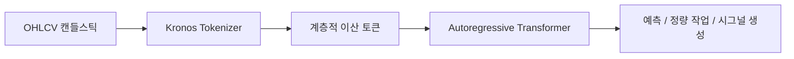

대부분의 시계열 모델은 가격 데이터를 숫자 벡터로 보고, 더 잘 맞는 예측기 구조를 고민합니다. 그런데 `Kronos`는 출발점이 다릅니다. 이 프로젝트는 금융 시장의 K-line, 즉 OHLCV 캔들스틱 시퀀스를 하나의 `language` 로 보고, 먼저 그 언어를 토큰화한 뒤 오토리그레시브 Transformer로 학습합니다. 저장소가 스스로를 `A Foundation Model for the Language of Financial Markets` 라고 부르는 이유가 바로 여기에 있습니다. [GitHub 저장소](https://github.com/shiyu-coder/Kronos)
<!--more-->

이 관점은 꽤 중요합니다. 일반 시계열 파운데이션 모델이 넓은 범용성을 목표로 한다면, Kronos는 금융 데이터의 높은 잡음과 특수한 구조를 전제로 삼습니다. 즉 “시계열 일반론”보다 **금융 캔들스틱이라는 특수 언어를 먼저 잘 읽자** 는 접근입니다. 그래서 이 프로젝트는 단순 예측 모델이라기보다, 금융 시계열을 위한 토크나이저 + 생성형 모델 스택으로 보는 편이 더 정확합니다. [GitHub 저장소](https://github.com/shiyu-coder/Kronos)

## Sources

- https://github.com/shiyu-coder/Kronos

## 1. Kronos의 핵심은 가격을 숫자열이 아니라 토큰 시퀀스로 본다는 점이다

README는 Kronos를 `decoder-only foundation models` 라고 설명하면서, 금융 시장의 “언어”인 K-line 시퀀스에 특화돼 있다고 말합니다. [GitHub 저장소](https://github.com/shiyu-coder/Kronos)

여기서 중요한 차이는 입력 해석 방식입니다.

- 일반적 접근: OHLCV를 연속값 시계열로 처리
- Kronos 접근: OHLCV를 먼저 계층적 이산 토큰으로 양자화

즉 Kronos는 먼저 시장 데이터를 말뭉치처럼 바꿉니다. 그다음 Transformer가 이 토큰들의 순서를 읽고 다음 상태를 예측하도록 합니다. 이 발상이 중요한 이유는, 금융 데이터가 워낙 노이즈가 많고 패턴이 불안정해서 **숫자의 연속성만으로 다루기보다 구조화된 토큰 언어로 재표현하는 편이 더 유리할 수 있다** 는 점입니다.

## 2. 2단계 구조가 이 프로젝트의 정체성이다

README는 Kronos의 프레임워크를 아주 분명하게 두 단계로 설명합니다.

1. specialized tokenizer  
   - 연속적인 다차원 K-line 데이터(OHLCV)를 계층적 이산 토큰으로 양자화

2. autoregressive Transformer  
   - 그 토큰을 바탕으로 다양한 정량 작업을 수행하는 통합 모델

즉 토크나이저가 보조 부품이 아니라 모델의 정체성 일부입니다. [GitHub 저장소](https://github.com/shiyu-coder/Kronos)

이건 꽤 큰 차이입니다. 보통 시계열 모델은 인코더/예측기 자체에 초점을 맞추는데, Kronos는 “무엇을 입력으로 볼 것인가”를 먼저 해결합니다. 다시 말해 Kronos의 핵심은 Transformer보다도, **금융 시계열을 어떤 토큰 언어로 재표현할 것인가** 에 있습니다.

## 3. 왜 금융 전용 모델이 필요한가

README는 Kronos가 일반 목적 TSFM들과 달리 금융 데이터의 독특한 특성을 다루도록 설계되었다고 설명합니다. 특히 `high-noise characteristics of financial data` 를 직접 언급합니다. [GitHub 저장소](https://github.com/shiyu-coder/Kronos)

이 점은 중요합니다. 금융 시계열은:

- 노이즈가 많고
- 정권이 자주 바뀌고
- 같은 패턴도 시장/자산/시간축에 따라 의미가 달라지고
- 단순한 계절성/추세 모델로 풀기 어려운 경우가 많습니다

그래서 Kronos는 범용 시계열 모델의 “넓은 적용성”보다, **시장 데이터라는 특수 환경에 맞는 표현 학습** 을 우선한 것으로 보입니다.

즉 이 프로젝트의 진짜 질문은 “더 일반적인 모델을 만들 수 있는가”가 아니라, “금융 캔들스틱만의 문법을 따로 배워야 하지 않는가”에 가깝습니다.

## 4. 모델 패밀리 구조가 분명하다: mini에서 base까지 공개, large는 비공개

README의 Model Zoo를 보면 Kronos는 여러 크기의 모델 패밀리로 제공됩니다.

- Kronos-mini: context length 2048, 4.1M params
- Kronos-small: context length 512, 24.7M params
- Kronos-base: context length 512, 102.3M params
- Kronos-large: 499.2M params, 비공개

모델과 토크나이저는 Hugging Face Hub에서 불러오도록 안내됩니다. [GitHub 저장소](https://github.com/shiyu-coder/Kronos)

이 구성이 의미하는 것은 두 가지입니다.

- 작은 실험부터 실제 연구까지 단계적으로 접근 가능
- 토크나이저와 모델이 명시적으로 짝을 이룸

특히 mini 모델이 2048 컨텍스트를 갖는 점은 흥미롭습니다. 더 긴 금융 구간을 가볍게 실험하고 싶은 경우에 유리할 수 있기 때문입니다.

## 5. 사용법은 surprisingly 단순하다: KronosPredictor가 전처리와 역정규화를 감춘다

README의 Getting Started는 꽤 실용적입니다. 사용자는 `KronosTokenizer`, `Kronos`, `KronosPredictor` 를 불러오고, pandas DataFrame으로 OHLCV 데이터를 넘긴 뒤 `predict` 를 호출하면 됩니다. [GitHub 저장소](https://github.com/shiyu-coder/Kronos)

입력 조건도 명확합니다.

- 필수 컬럼: `open`, `high`, `low`, `close`
- 선택 컬럼: `volume`, `amount`
- 과거 구간용 `x_timestamp`
- 예측 구간용 `y_timestamp`

그리고 `KronosPredictor` 가 전처리, 정규화, 예측, 역정규화를 감싸 준다고 설명합니다. 즉 모델 개념은 꽤 연구지향적이지만, 사용자 경험은 비교적 단순하게 만들었습니다.

이 점이 중요합니다. 파운데이션 모델이라고 해도 실제 사용이 너무 까다로우면 채택이 어렵습니다. Kronos는 적어도 README 수준에서는 **연구 아이디어와 실무 진입성을 함께 가져가려는 설계** 를 보입니다.

## 6. 배치 예측과 파인튜닝 파이프라인까지 공개한 점이 크다

이 저장소가 흥미로운 또 다른 이유는 단순 추론 예제에서 끝나지 않는다는 점입니다.

- `predict_batch` 를 통한 여러 시계열 병렬 예측
- Qlib 기반 데이터 준비
- 토크나이저 파인튜닝
- 예측기 파인튜닝
- 간단한 백테스트 파이프라인

이 전부가 README에 연결돼 있습니다. [GitHub 저장소](https://github.com/shiyu-coder/Kronos)

즉 Kronos는 “모델 체크포인트 하나 공개”가 아니라, **금융 연구 워크플로 전체를 재현 가능한 형태로 제공하려는 프로젝트** 에 가깝습니다.

특히 백테스트 설명에서 raw signal과 pure alpha를 구분하고, 포트폴리오 최적화나 리스크 중립화가 추가로 필요하다고 명시한 부분은 좋습니다. 모델 예측이 곧바로 실전 전략이 아니라는 점을 분명히 선 긋고 있기 때문입니다.

## 7. 이 프로젝트가 조심스러운 이유도 분명하다

README는 파인튜닝/백테스트 파이프라인을 제공하면서도, 이것이 production-ready quant system은 아니라고 분명히 말합니다. [GitHub 저장소](https://github.com/shiyu-coder/Kronos)

이 경고는 중요합니다. 금융 모델 프로젝트는 종종 다음 오해를 부릅니다.

- 예측이 되면 바로 수익 전략이 된다
- 백테스트가 좋으면 실전에서도 통한다
- foundation model이면 범용적으로 알파를 뽑을 수 있다

하지만 실제로는:

- 거래 비용
- 슬리피지
- 시장 충격
- 포지션 사이징
- 리스크 팩터 노출

등이 훨씬 더 큰 문제를 만듭니다.

즉 Kronos는 매우 흥미로운 표현 학습 실험이지만, 그 자체로 자동 수익 기계가 아니라 **금융 연구의 상위 레이어를 구성하는 모델 블록** 으로 이해하는 편이 맞습니다.

## 8. 저장소 상태가 보여 주는 현재 위상

2026년 4월 27일 기준 GitHub 저장소 화면 기준으로 Kronos는:

- stars 21.7k
- forks 3.8k
- 기본 브랜치 `master`
- MIT 라이선스

상태를 보입니다. README의 뉴스 섹션에는 2025년 11월 AAAI 2026 채택, 2025년 8월 파인튜닝 스크립트 공개, 2025년 8월 arXiv 논문 공개가 적혀 있습니다. [GitHub 저장소](https://github.com/shiyu-coder/Kronos)

즉 이 프로젝트는 단순 GitHub 바이럴이 아니라, **논문·코드·모델 허브·데모를 함께 갖춘 연구형 오픈소스** 로 자리 잡으려는 흐름으로 읽힙니다.

## 실전 적용 포인트

Kronos를 바라볼 때는 “가격 예측 모델 하나 더”로 보기보다, 아래처럼 보는 편이 더 유용합니다.

- 금융 데이터 전용 tokenizer 실험
- OHLCV를 언어처럼 다루는 foundation model
- 멀티 자산 배치 예측 연구용 기반
- Qlib와 연결되는 금융 연구 파이프라인

즉 실전에서 바로 쓰는 매매 봇보다, **금융 시계열 표현 학습을 연구하거나 도메인 특화 모델을 파인튜닝하려는 사람** 에게 훨씬 더 매력적인 프로젝트입니다.

## 핵심 요약

- Kronos는 금융 K-line 시퀀스를 “언어”로 보고 토큰화하는 금융 전용 foundation model이다.
- 핵심은 토크나이저와 autoregressive Transformer의 2단계 구조다.
- 일반 시계열 모델보다 금융 데이터의 높은 노이즈와 특수성을 더 직접 겨냥한다.
- mini/small/base 모델과 Hugging Face 기반 사용 경로가 공개돼 있다.
- 배치 예측, 파인튜닝, 백테스트까지 포함한 연구 워크플로를 제공한다.
- 다만 production-ready trading system이 아니라 연구용 블록으로 이해하는 편이 맞다.

## 결론

Kronos가 흥미로운 이유는 금융 시계열에 Transformer를 얹었다는 데만 있지 않습니다. 더 본질적인 차별점은 OHLCV 캔들스틱을 먼저 `읽을 수 있는 언어` 로 재구성한 뒤, 그 위에서 예측과 정량 작업을 통합하려 한다는 데 있습니다.

그래서 이 프로젝트는 가격 예측기 하나가 아니라, **금융 시장 데이터를 위한 표현 학습 체계** 로 보는 편이 맞습니다. 금융 시계열을 단순 숫자열이 아니라 문법을 가진 시퀀스로 바라보는 순간, Kronos의 방향성이 왜 많은 관심을 받는지 이해가 됩니다.
