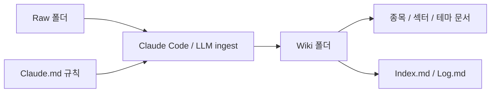
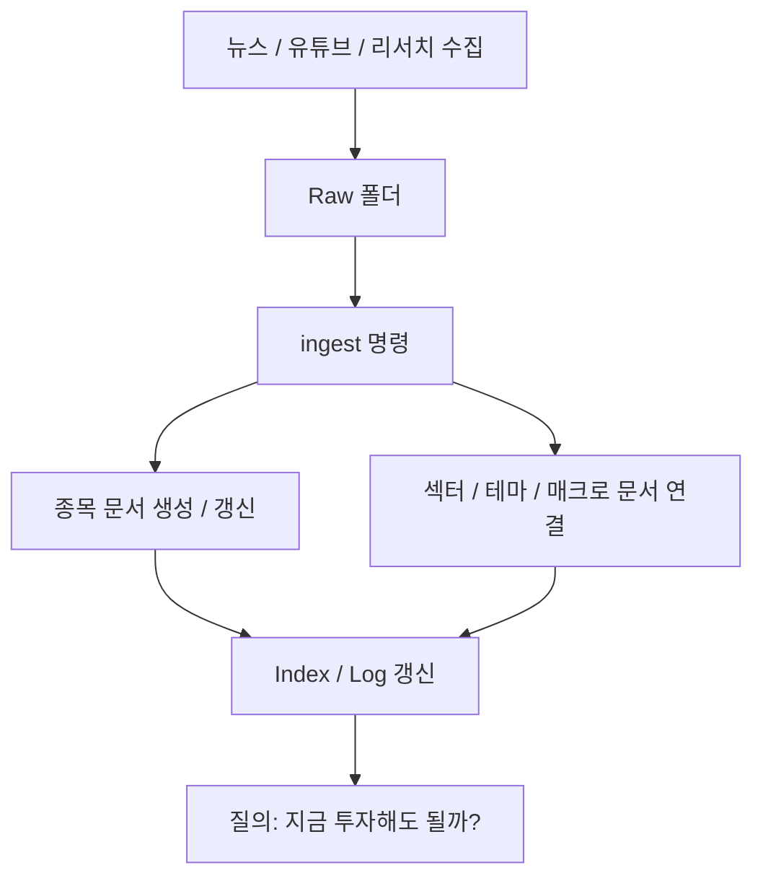

옵시디언을 쓰는 사람이라면 누구나 한 번쯤 비슷한 갈증을 느낍니다. 자료는 계속 쌓이는데, 결국 정리와 연결은 내가 직접 해야 하고, 조금만 손을 놓으면 과거 정보는 다시 흩어집니다. 이번 영상이 흥미로운 이유는 바로 이 지점을 `LLM Wiki` 로 뒤집기 때문입니다. 기존 PKM이 사람이 수동으로 지식을 관리하는 구조라면, 여기서는 사람이 구조만 잡아 두고 **실제 문서 생성과 갱신은 LLM이 맡습니다.** [YouTube 영상](https://www.youtube.com/watch?v=4JaN0NNvY_o)
<!--more-->

특히 이 영상은 카파시의 LLM Wiki 철학을 단순 소개에서 끝내지 않고, 옵시디언 안에서 국내 주식 분석용 위키로 실제 구현합니다. Raw 폴더에 뉴스와 유튜브를 쌓고, Wiki 폴더에 종목·섹터·테마 문서를 자동 생성하고, `Claude.md` 에 규칙을 적어 둔 뒤 `ingest` 명령으로 새 자료를 흡수하게 만드는 구조입니다. 즉 이건 “지식 저장소”가 아니라, **수집된 정보를 계속 살아 있는 위키로 갱신하는 루프** 입니다. [YouTube 영상](https://www.youtube.com/watch?v=4JaN0NNvY_o)

## Sources

- https://www.youtube.com/watch?v=4JaN0NNvY_o

## 1. LLM Wiki가 기존 PKM과 다른 점: 사람이 관리자가 아니라 설계자가 된다

영상은 기존 개인 지식 관리 시스템과 LLM Wiki의 차이를 아주 선명하게 설명합니다. 기존 PKM에서는 사람이 직접:

- 자료를 정리하고
- 어디에 넣을지 판단하고
- 링크를 만들고
- 관련 문서를 연결해야 합니다

반면 LLM Wiki에서는 사람이 하는 일은:

- 구조를 세팅하고
- 규칙을 적어 두고
- 원본 자료를 넣는 것

에 더 가깝습니다. 그리고 실제 문서 생성과 관리, 연결은 LLM이 맡습니다. [YouTube 영상](https://www.youtube.com/watch?v=4JaN0NNvY_o)

즉 핵심 차이는 생산성보다 역할입니다. 사람은 더 이상 모든 노트를 손으로 정리하는 사람이 아니라, **위키가 어떻게 굴러갈지를 설계하는 사람** 이 됩니다.

## 2. 가장 중요한 구조는 Raw → Wiki → Claude.md의 3계층이다

영상은 카파시식 LLM Wiki의 핵심 구조를 세 계층으로 설명합니다.

- `raw` 폴더: 원본 소스 저장
- `wiki` 폴더: LLM이 생성·갱신한 위키 문서
- `Claude.md`: 작동 규칙과 워크플로우

이 구조는 매우 중요합니다. [YouTube 영상](https://www.youtube.com/watch?v=4JaN0NNvY_o)

왜냐하면 많은 사람이 AI 지식 관리 도구를 만들 때, 원본과 정리본과 규칙을 한데 섞어 둡니다. 그러면 결국:

- 무엇이 원자료인지
- 무엇이 LLM이 요약한 것인지
- 어떤 규칙으로 정리된 것인지

가 흐려집니다.

하지만 이 구조에서는 역할이 분명합니다.

- Raw는 절대 원본
- Wiki는 가공된 위키
- Claude.md는 운영 규칙

즉 이 3계층은 단순 폴더 분리가 아니라, **정보의 상태를 분리하는 구조** 입니다.

## 3. Raw 폴더는 그냥 스크랩 창고가 아니라 위키의 유일한 원천이다

영상에서는 경제 뉴스와 유튜브 뉴스를 옵시디언 웹 클리퍼로 `raw` 폴더에 계속 쌓는 모습을 보여 줍니다. [YouTube 영상](https://www.youtube.com/watch?v=4JaN0NNvY_o)

이 점이 핵심입니다. LLM Wiki는 자체적으로 지식을 창작하는 게 아니라, **사람이 모은 원천 데이터에서만 위키를 자라게 하는 구조** 입니다.

주식 분석 예시에서는:

- 뉴스 기사
- 유튜브 스크립트
- 관심 있는 리서치 자료

등이 raw 폴더로 들어갑니다.

즉 raw 폴더는 “자료 보관소”가 아니라, 위키가 성장하는 유일한 공급망입니다. 이 구조를 가져가면 나중에 잘못된 정보가 들어왔을 때도, 어디서부터 들어왔는지 추적하기 쉬워집니다.

## 4. Wiki 폴더는 사람이 쓰는 메모장이 아니라 LLM이 생성하는 지식 지도다

영상에서 가장 인상적인 부분은 `wiki` 폴더를 열어 보는 장면입니다. 발표자는 자신이 손댄 적이 거의 없고, 종목/섹터/테마 문서들이 LLM의 판단으로 생성되었다고 설명합니다. [YouTube 영상](https://www.youtube.com/watch?v=4JaN0NNvY_o)

예를 들어 특정 종목 페이지에는:

- 요약 정보
- 사업 개요
- 재무 정보
- 밸류에이션
- 강세 이유 / 약세 이유
- 관련 섹터와 테마

같은 구조가 자동으로 들어갑니다.

이게 중요한 이유는 단순 요약 때문이 아닙니다. 진짜 가치는 **개별 문서가 서로 링크되며 위키처럼 자라난다** 는 데 있습니다. 종목에서 섹터로, 섹터에서 테마로, 테마에서 매크로 이슈로 이어지는 흐름이 생기기 때문입니다.

즉 Wiki 폴더는 노트 모음이 아니라, 사람이 직접 만들기엔 너무 번거로운 **관계형 투자 지식 지도** 에 가깝습니다.

## 5. `ingest` 명령이 하는 일: 새 자료를 읽고, 기존 위키를 판단해 갱신한다

영상의 실전 루프는 굉장히 단순합니다.

1. Raw 폴더에 새 소스를 넣는다
2. Claude Code에서 `ingest` 를 실행한다
3. LLM이 새 종목이 필요한지, 기존 섹터/테마를 업데이트할지 판단한다
4. 사용자 승인 후 문서를 생성/갱신한다

이 구조가 핵심입니다. [YouTube 영상](https://www.youtube.com/watch?v=4JaN0NNvY_o)

즉 LLM은 단순 요약기가 아니라:

- 새 종목 문서를 만들어야 하는지
- 기존 섹터 문서를 갱신해야 하는지
- 새로운 테마가 필요한지
- 기존 구조 안에 어디를 업데이트해야 하는지

를 결정합니다.

이게 바로 “위키”다운 점입니다. 단순한 메모 자동화가 아니라, **기존 지식 구조를 기준으로 새 정보를 어디에 흡수할지 판단하는 시스템** 이기 때문입니다.

## 6. `Claude.md` 는 규칙 파일이자 위키 헌법이다

영상에서 `Claude.md` 는 단순한 프롬프트 저장소가 아닙니다. 발표자는 이것을 LLM Wiki의 기본 규칙과 워크플로우를 적어 둔 문서라고 설명합니다. 그리고 이 파일을 계속 업데이트하면 위키가 점점 더 자신이 원하는 포맷으로 작동한다고 말합니다. [YouTube 영상](https://www.youtube.com/watch?v=4JaN0NNvY_o)

즉 `Claude.md` 의 역할은:

- Raw를 어떻게 읽을지
- Wiki 문서를 어떤 형태로 만들지
- 어떤 메타데이터를 포함할지
- 어떤 링크를 생성할지
- 어떤 작업은 금지할지

를 정하는 것입니다.

이 말은 곧 LLM Wiki의 품질이 결국 모델 자체보다도, **Claude.md에 어떤 운영 원칙을 심어 두느냐** 에 달려 있다는 뜻이기도 합니다.

## 7. Index와 Log가 중요한 이유: 검색 비용과 변화 추적 비용을 줄여 준다

영상은 3계층 외에도 `index.md` 와 `log.md` 를 추가로 설명합니다. [YouTube 영상](https://www.youtube.com/watch?v=4JaN0NNvY_o)

### 7-1. `index.md`

전체 문서의 인덱스 역할을 합니다. 나중에 질문할 때 LLM이 모든 페이지를 무작정 뒤지는 대신, 먼저 인덱스에서 어떤 문서가 있는지 보고 찾아가게 만듭니다.

즉 이 파일은:

- 토큰 절감
- 탐색 속도 개선
- 위키의 전체 지도 제공

효과를 가집니다.

### 7-2. `log.md`

LLM이 그동안 어떤 작업을 했는지 기록합니다.

- 어떤 문서가 생성됐는지
- 어떤 문서가 업데이트됐는지
- 어떤 정보가 새로 들어왔는지

를 남깁니다.

이건 단순 이력 관리가 아닙니다. 사람이 나중에 “이 위키가 왜 이렇게 바뀌었지?”를 추적할 수 있게 해 주는 **감사 로그** 역할을 합니다.

## 8. 질의는 수정 요청보다 더 중요하다

영상 후반에서 발표자는 사람의 역할을 다시 한 번 강조합니다. 사람이 해야 할 일은 문서를 직접 관리하는 것이 아니라:

- 자료를 수집하고
- ingest를 돌리고
- 위키에 질문하는 것

이라고 설명합니다. [YouTube 영상](https://www.youtube.com/watch?v=4JaN0NNvY_o)

예를 들어:

- “삼성전자 지금 투자해도 될까?”
- “효성중공업 경쟁사를 같이 참고해서 업데이트해 줄래?”

같은 질의를 던집니다.

여기서 중요한 점은, 두 번째 질문은 raw 데이터 없이 임의로 지식 추가를 허용하지 않도록 제한해 두었다는 것입니다. 즉 이 위키는 인터넷처럼 무한 생성되는 게 아니라, **raw 폴더에 들어온 자료를 기반으로만 성장하는 폐쇄형 지식 시스템** 에 가깝습니다.

## 9. 이 구조가 왜 주식 분석에 특히 잘 맞는가

주식 분석은 본질적으로:

- 종목
- 섹터
- 테마
- 매크로
- 뉴스 이벤트

가 계속 얽히며 변하는 문제입니다. 사람이 이걸 일일이 손으로 연결하려면 시간이 너무 많이 듭니다.

LLM Wiki 방식은 여기서 강점이 있습니다.

- 새 뉴스가 들어오면
- 어느 종목과 섹터에 연결되는지 판단하고
- 새로운 테마가 필요하면 만들고
- 기존 문서를 갱신하고
- 다시 질의 가능한 구조로 유지합니다

즉 이 구조는 금융 RAG라기보다, **금융 위키를 계속 자가 성장시키는 방식** 에 더 가깝습니다.

## 실전 적용 포인트

이 구조를 그대로 따라 하지 않더라도, LLM Wiki를 만들 때는 아래 원칙만 가져가도 효과가 큽니다.

1. 원본과 요약본을 같은 폴더에 섞지 않는다  
2. 규칙 파일(`Claude.md`)을 먼저 만든다  
3. 새 자료는 raw에만 쌓는다  
4. ingest 단계에서만 wiki를 갱신한다  
5. index와 log를 두어 토큰 비용과 변경 추적 비용을 줄인다  

즉 핵심은 더 많은 정보를 넣는 것이 아니라, **정보가 위키로 자라는 경로를 고정하는 것** 입니다.

## 핵심 요약

- LLM Wiki는 사람이 직접 노트를 관리하는 PKM과 달리, 구조만 사람이 정하고 실제 문서 관리는 LLM이 맡는 방식이다.
- 핵심 구조는 `raw / wiki / Claude.md` 의 3계층이다.
- `raw` 는 원본 소스, `wiki` 는 LLM이 생성한 문서, `Claude.md` 는 운영 규칙이다.
- `ingest` 명령이 새 자료를 읽고 기존 위키 구조를 판단해 생성/갱신을 수행한다.
- `index.md` 와 `log.md` 는 탐색 비용과 추적 비용을 낮춘다.
- 주식 분석처럼 종목·섹터·테마·매크로가 얽힌 분야에서 특히 강력하다.

## 결론

옵시디언으로 만드는 LLM Wiki의 진짜 강점은 “질문에 대답해 주는 AI”가 아니라, **내가 수집한 자료를 계속 연결된 위키로 성장시키는 AI** 라는 점입니다. 사람이 하는 일은 점점 줄어듭니다. 자료를 모으고, 규칙을 적고, ingest를 돌리고, 그 위키에 질문하면 됩니다.

그래서 이 방식은 단순한 RAG 세팅보다 더 매력적입니다. 지식을 가져오는 데서 끝나는 것이 아니라, 지식 자체가 계속 구조화되고 연결되고 업데이트되기 때문입니다. 특히 주식 분석처럼 변화가 빠르고 연결이 중요한 영역에서는, 이 방식이 생각보다 강력한 개인 분석 환경이 될 수 있습니다.
