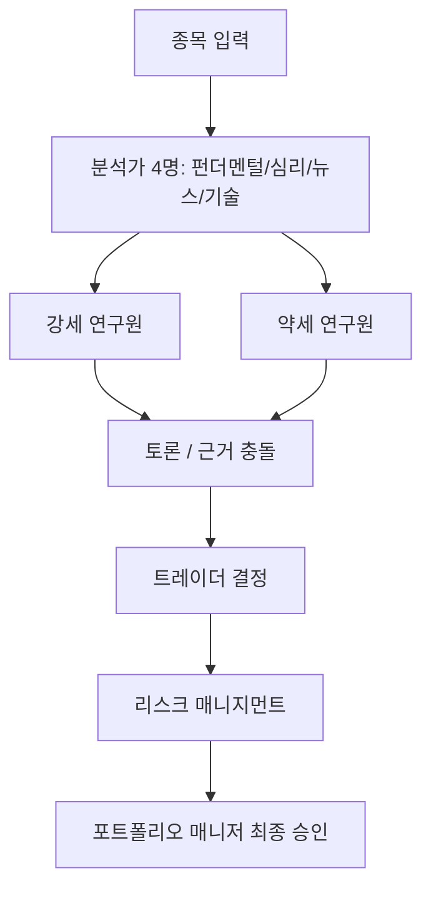
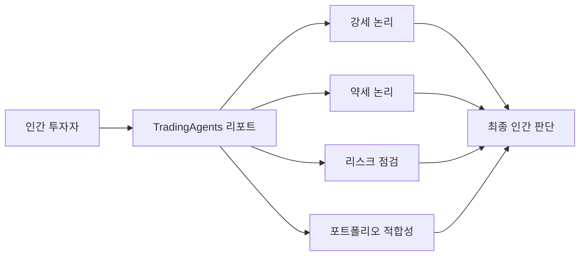

`TradingAgents` 를 처음 보면 가장 먼저 눈에 띄는 건 숫자와 역할 분담입니다. 원본 저장소 `TauricResearch/TradingAgents` 를 보면, 분석가 4명, 연구원 2명, 트레이더, 리스크 매니지먼트, 포트폴리오 매니저까지 총 9개 역할이 등장합니다. Threads에서 표현한 것처럼, 단순히 LLM 하나가 종목을 찍는 게 아니라 펀더멘털·뉴스·심리·기술 분석이 각각 따로 들어오고, 강세/약세 토론까지 거쳐서 최종 결론이 나옵니다. [GitHub 저장소](https://github.com/TauricResearch/TradingAgents) [Threads 원문](https://www.threads.com/@conanssam/post/DXo8AVZmN12)
<!--more-->

그런데 이 프로젝트를 “자동 매매봇”으로만 보면 핵심을 놓치기 쉽습니다. 오히려 더 흥미로운 점은, 한 종목을 볼 때 사람이 자주 빠뜨리는 반대 시나리오를 강제로 끌어온다는 데 있습니다. Threads 작성자도 40대 재테크 관점에서는 매매봇보다 `여러 시각의 분석 리포트 자동 생성기` 로 보는 게 맞다고 말합니다. 저는 이 해석이 꽤 정확하다고 봅니다. 원본 저장소 구조를 봐도 TradingAgents의 진짜 가치는 주문 실행보다, **한 방향으로만 기울어진 인간의 해석을 다중 에이전트 토론으로 흔드는 것** 에 있습니다. [GitHub 저장소](https://github.com/TauricResearch/TradingAgents) [Threads 원문](https://www.threads.com/@conanssam/post/DXo8AVZmN12)

## Sources

- https://github.com/TauricResearch/TradingAgents
- https://www.threads.com/@conanssam/post/DXo8AVZmN12

## 1. 구조가 곧 메시지다: 한 명의 천재가 아니라 역할 분업된 투자 회의

원본 저장소와 Threads에서 함께 확인되는 역할 구조는 이렇습니다.

- 분석가 4명: 펀더멘털 / 심리 / 뉴스 / 기술
- 연구원 2명: 강세 / 약세
- 트레이더
- 리스크 매니지먼트
- 포트폴리오 매니저

이 구조는 단순히 “에이전트가 많다”는 자랑이 아닙니다. [GitHub 저장소](https://github.com/TauricResearch/TradingAgents) [Threads 원문](https://www.threads.com/@conanssam/post/DXo8AVZmN12)

핵심은, 주식 판단을 한 개의 지능에 맡기지 않는다는 점입니다. 보통 개인 투자자는:

- 차트만 보거나
- 뉴스만 보거나
- 확신이 서는 방향으로만 자료를 모읍니다

그런데 TradingAgents는 처음부터 시야를 분할합니다. 펀더멘털과 기술적 분석이 다르고, 뉴스와 시장 심리는 또 다르며, 강세와 약세는 아예 서로 반대로 싸우게 만듭니다. 즉 이 프로젝트는 “누가 제일 똑똑하냐”보다, **의사결정 전에 어떤 충돌을 의도적으로 만들어 넣을 것이냐** 를 더 중요하게 보는 구조입니다.

## 2. 강세/약세 토론이 중요한 이유: 혼자 볼 때 놓치는 반대 논리를 강제로 듣게 한다

TradingAgents의 가장 흥미로운 지점은 연구원 두 명이 강세와 약세 관점으로 나뉘어 토론하는 구조입니다. 이건 단순한 역할놀이가 아닙니다. [Threads 원문](https://www.threads.com/@conanssam/post/DXo8AVZmN12)

실제 투자 판단이 자주 망가지는 이유는 정보 부족보다도:

- 확증편향
- 이미 마음속으로 결론을 정해 둔 상태
- 반대 근거를 읽어도 무시하는 습관

때문인 경우가 많습니다.

강세/약세 토론은 바로 이걸 겨냥합니다. 내가 특정 종목에 끌리더라도, 시스템은 약세 논리를 자동으로 끌어와 반대편 증거를 들이밉니다. 이 점 때문에 TradingAgents는 “정답을 주는 시스템”보다, **성급한 확신을 늦추는 시스템** 으로 보는 편이 더 맞습니다.

## 3. LangGraph 기반이라는 점이 의미하는 것

Threads에서 이 프로젝트가 LangGraph 기반이고 `ta.propagate("NVDA", "2026-01-15")` 같은 형태로 한 줄 실행된다고 설명하는 부분도 중요합니다. 저장소 README도 이 워크플로 중심 사용법을 전면에 두고 있습니다. [GitHub 저장소](https://github.com/TauricResearch/TradingAgents) [Threads 원문](https://www.threads.com/@conanssam/post/DXo8AVZmN12)

이 말은 결국 각 역할이 그냥 병렬로 흩어지는 것이 아니라:

- 어떤 입력을 받고
- 어떤 증거를 모으고
- 누가 누구에게 넘기고
- 마지막에 누가 승인하는지

가 그래프 형태로 설계되어 있다는 뜻입니다.

즉 TradingAgents의 진짜 강점은 분석가 숫자보다도, **그 역할들의 상호작용이 정해진 워크플로로 구조화되어 있다** 는 데 있습니다. 이 점에서 이 프로젝트는 채팅 여러 개 띄운 것보다 훨씬 “프로세스”에 가깝습니다.

## 4. 모델을 가리지 않는다는 점보다 더 중요한 것: 깊은 사고용과 빠른 작업용을 나눌 수 있다

Threads는 GPT, Gemini, Claude, Grok, DeepSeek, Qwen, GLM, Ollama 등 여러 모델을 지원하고, 깊은 사고용 모델과 빠른 작업용 모델을 따로 지정할 수 있다고 설명합니다. 이 부분도 저장소 문서와 맞물리는 핵심 포인트입니다. [GitHub 저장소](https://github.com/TauricResearch/TradingAgents) [Threads 원문](https://www.threads.com/@conanssam/post/DXo8AVZmN12)

이 부분이 중요한 이유는, 투자 리서치도 사실 한 종류의 추론만 필요한 게 아니기 때문입니다.

- 데이터 수집과 정리는 빠른 모델
- 논리 충돌과 토론은 더 강한 모델
- 요약과 형식화는 다시 저렴한 모델

로 나눌 수 있습니다.

즉 TradingAgents는 단순 다중 에이전트가 아니라, **역할별 인지 비용을 다르게 배치할 수 있는 시스템** 이기도 합니다. 이것이 실제 운영비를 생각하면 꽤 현실적인 장점입니다.

## 5. 메모리 구조가 진짜 흥미롭다: 한 번 본 종목의 과거 판단과 알파를 다시 학습 자산으로 쌓는다

Threads에서 또 하나 중요하게 짚는 부분은 메모리입니다. 한 번 분석한 종목은 과거 결정과 SPY 대비 알파를 메모리에 쌓아, 다음 분석 때 다시 참고 자료로 들어간다고 합니다. [GitHub 저장소](https://github.com/TauricResearch/TradingAgents) [Threads 원문](https://www.threads.com/@conanssam/post/DXo8AVZmN12)

이건 단순 대화 이력 저장보다 훨씬 의미가 큽니다.

- 과거에 왜 샀는지
- 왜 틀렸는지
- 당시 어떤 근거가 먹혔는지
- 시장 벤치마크 대비 어떤 성과였는지

를 다시 시스템이 끌어올 수 있기 때문입니다.

즉 TradingAgents는 정적인 분석기가 아니라, **반복 분석을 통해 자기 판단의 흔적을 축적하는 리서치 메모리 시스템** 에 가까워집니다.

## 6. 이 프로젝트를 매매봇보다 리포트 엔진으로 봐야 하는 이유

Threads 작성자가 가장 실용적으로 짚은 부분이 바로 이것입니다. 40대 재테크 관점에서는 매매봇보다 `여러 시각의 분석 리포트 자동 생성기` 로 보는 게 맞다는 해석입니다. 저는 이 해석이 원본 저장소의 구조와도 가장 잘 맞는다고 봅니다. [GitHub 저장소](https://github.com/TauricResearch/TradingAgents) [Threads 원문](https://www.threads.com/@conanssam/post/DXo8AVZmN12)

이 관점이 좋은 이유는 현실적이기 때문입니다.

실제 개인 투자자는 보통:

- 자동 주문 체계보다
- 종목을 보기 전 체크리스트
- 반대 논리 검토
- 강세/약세 근거 비교

가 더 필요합니다.

TradingAgents는 이 부분에 딱 맞습니다. 펀더멘털, 심리, 뉴스, 기술, 토론, 리스크, 포트폴리오 관점을 한 번에 강제로 통과시키면, 적어도 **한쪽 논리만 보고 서두르는 실수** 는 줄어듭니다.

## 7. 저장소 규모와 현재 상태도 연구용 오픈소스치고 꽤 크다

2026년 4월 28일 기준 `TauricResearch/TradingAgents` 저장소는:

- stars 54,208
- forks 9,817
- 기본 브랜치 `main`
- Apache-2.0 라이선스
- Python 프로젝트
- 최신 릴리스 `v0.2.4` (2026-04-25)

상태입니다. Threads에서 언급한 것처럼 관련 arXiv 논문(2412.20138)도 붙어 있어, 단순 데모라기보다 **연구 기반 오픈소스 프로젝트** 라는 성격이 분명합니다. [GitHub 저장소](https://github.com/TauricResearch/TradingAgents)

## 8. 실전에서 더 유용한 활용법: 주문 자동화보다 의사결정 보조

TradingAgents를 실제로 쓴다면 저는 다음 순서가 더 맞다고 봅니다.

1. 관심 종목 후보를 넣는다
2. 강세/약세 양쪽 논리를 읽는다
3. 리스크 항목을 본다
4. 포트폴리오 관점에서 그 종목의 위치를 생각한다
5. 마지막 의사결정은 사람이 한다

즉 이 프로젝트를 자동 매매 시스템으로 바로 연결하기보다, **투자 전 회의실을 자동으로 열어 주는 도구** 로 보는 게 낫습니다.

이 해석은 Threads의 “매매 자문 아님, 의사결정과 투자 책임은 본인”이라는 선 긋기와도 잘 맞습니다.

## 실전 적용 포인트

이 프로젝트를 바로 실무에 적용한다면 다음처럼 쓰는 것이 가장 안전하고 유용합니다.

- 자동 주문 엔진보다 분석 리포트 보조 도구로 쓴다
- 강세/약세 논리를 일부러 둘 다 읽는다
- 과거 메모리와 SPY 대비 성과 기록을 판단 보조로 쓴다
- 한 모델만 고집하지 말고 역할에 따라 다른 모델을 쓴다
- 최종 의사결정과 책임은 반드시 사람이 진다

즉 핵심은 수익 자동화보다 **판단 편향 완화** 입니다.

## 핵심 요약

- TradingAgents는 단일 LLM 트레이더가 아니라 역할 분업된 투자 회의 구조를 가진다.
- 핵심은 펀더멘털/심리/뉴스/기술 분석과 강세/약세 토론을 강제로 거치게 한다는 점이다.
- LangGraph 기반 구조 덕분에 분석 흐름이 워크플로로 고정된다.
- 여러 모델을 역할별로 나눠 배치할 수 있고, 과거 판단과 알파를 메모리로 축적한다.
- 실제 개인 투자자 관점에서는 자동 매매봇보다 다중 시각 분석 리포트 엔진으로 보는 편이 더 유용하다.

## 결론

TradingAgents가 흥미로운 이유는 “LLM 9명이 종목을 사고판다”는 자극적인 문장 때문만은 아닙니다. 더 본질적인 포인트는, 한 종목을 볼 때 인간이 빠지기 쉬운 편향을 여러 역할과 반대 논리 토론으로 깨려고 한다는 데 있습니다.

그래서 이 프로젝트는 자동 매매 시스템이라기보다, **혼자 투자할 때 열기 어려운 내부 투자 회의를 매번 자동으로 열어 주는 도구** 로 보는 편이 더 정확합니다. 실제 돈을 거는 순간 더 필요한 건 빠른 확신보다, 반대 시나리오를 강제로 듣는 구조일 수 있기 때문입니다.
