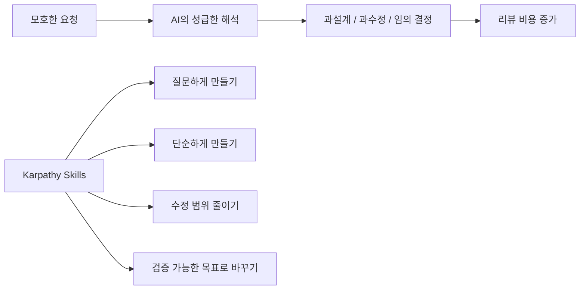
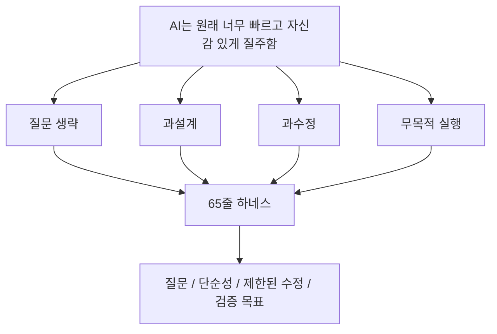

최근 `andrej-karpathy-skills` 가 유독 크게 회자되는 이유는, 새로운 모델이나 거대한 프레임워크가 아니라 고작 65줄 안팎의 마크다운 문서 하나 때문이라는 점입니다. 저장소 `forrestchang/andrej-karpathy-skills` 는 이 문서를 `A single CLAUDE.md file to improve Claude Code behavior` 라고 설명합니다. 즉 이것은 기능 번들이 아니라, Claude Code의 행동 방식을 교정하는 최소 지침 파일입니다. 영상이 잘 짚듯, 이 문서는 AI에게 없던 능력을 주입하는 비밀 주문이 아니라, **이미 너무 빠르고 너무 자신 있게 일하는 AI에게 곱비를 채우는 하네스** 로 작동합니다. [YouTube 영상](https://www.youtube.com/watch?v=4cyQUo2ZIAQ) [GitHub 저장소](https://github.com/forrestchang/andrej-karpathy-skills)
<!--more-->

즉 이 프로젝트가 바이럴을 탄 이유는 “AI를 천재로 만든 문서”여서가 아닙니다. 오히려 반대입니다. 저장소 README가 직접 말하듯, 이 문서는 Andrej Karpathy가 지적한 LLM 코딩 함정, 즉 잘못된 가정, 과설계, 불필요한 수정, 검증 없는 실행을 네 가지 원칙으로 직접 겨냥합니다. 이번 글은 그 네 가지 원칙이 왜 하네스로 작동하는지, 그리고 왜 이 저장소가 Claude Code 플러그인·CLAUDE.md·Cursor rule 형태로까지 빠르게 퍼졌는지 중심으로 정리해 보겠습니다. [YouTube 영상](https://www.youtube.com/watch?v=4cyQUo2ZIAQ) [GitHub 저장소](https://github.com/forrestchang/andrej-karpathy-skills)

## Sources

- https://www.youtube.com/watch?v=4cyQUo2ZIAQ
- https://github.com/forrestchang/andrej-karpathy-skills

## 1. 이 저장소가 특별한 이유: 문서 한 장을 여러 실행 표면으로 배포한다

`forrestchang/andrej-karpathy-skills` 저장소를 보면 단순히 `CLAUDE.md` 하나만 있는 것이 아닙니다. README 기준으로 이 프로젝트는:

- Claude Code plugin 설치 경로
- 프로젝트별 `CLAUDE.md` 사용 경로
- Cursor용 rule 파일
- 예시 문서

를 함께 제공합니다. [GitHub 저장소](https://github.com/forrestchang/andrej-karpathy-skills)

즉 핵심 아이디어는 짧은 문서 하나지만, 배포 방식은 꽤 실용적입니다. 사람마다 쓰는 도구가 다르기 때문에, 같은 원칙을:

- Claude Code에서는 플러그인으로
- 일반 프로젝트에서는 `CLAUDE.md` 로
- Cursor에서는 rule 파일로

심을 수 있게 해 둔 것입니다. 이 점 때문에 이 프로젝트는 단순 텍스트 팁보다 **바로 가져다 붙일 수 있는 운영 부품** 으로 퍼졌습니다.

## 2. 이 문서가 특별한 이유는 “더 많은 자유”가 아니라 “더 좋은 습관”을 강제하기 때문이다

영상은 안드레 카파시 스킬스가 폭발적으로 주목받는 이유를 아주 명확하게 설명합니다. 이 문서는 AI에게 더 많은 자유를 주는 대신, 더 좋은 작업 습관을 강제합니다. [YouTube 영상](https://www.youtube.com/watch?v=4cyQUo2ZIAQ)

이 관점이 중요합니다. 많은 사람이 AI 코딩 성능을 올리려면:

- 더 강한 모델
- 더 긴 컨텍스트
- 더 긴 프롬프트

가 필요하다고 생각합니다. 하지만 카파시 스킬스가 보여 주는 건 전혀 다른 방향입니다. 성능 좋은 AI는 이미 충분히 많이 알고 있고, 오히려 문제는 **너무 잘, 너무 빨리, 너무 자신 있게** 움직인다는 것입니다.

그래서 필요한 것은 지식 추가가 아니라 행동 교정입니다. 이 문서는 바로 그 행동 교정을 네 가지 원칙으로 수행합니다.

## 3. 원칙 1: Think Before Coding — 먼저 생각하고, 애매하면 물어보게 만든다

첫 번째 원칙은 `think before coding` 입니다. 영상은 이것을 “성급하게 코딩하지 말고 먼저 생각하라, 그리고 혼자 가정하지 말고 불확실하면 질문하라”는 지침으로 설명합니다. [YouTube 영상](https://www.youtube.com/watch?v=4cyQUo2ZIAQ)

이 원칙이 필요한 이유는 AI가 애매한 요구를 만나면 보통 이렇게 행동하기 때문입니다.

- 여러 구현 옵션이 있는데도
- 사용자에게 묻지 않고
- 자기 나름대로 하나를 골라
- 그대로 진행해 버립니다

예를 들어 로그인 기능만 해도 JWT, OAuth, 세션 기반 인증 등 여러 선택지가 있는데, AI는 종종 그중 하나를 독단적으로 택합니다.

이 원칙은 그 문제를 막습니다. 즉 AI가 “물어봐야 할 순간”을 놓치지 않게 만들고, 사용자가 선택해야 할 지점을 AI가 대신 결정하지 못하게 만듭니다.

즉 첫 번째 원칙은 AI에게 더 많은 답을 주는 게 아니라, **질문해야 할 타이밍을 되돌려 주는 것** 입니다.

## 4. 원칙 2: Simplicity First — 똑똑해 보이려 하지 말고 필요한 만큼만 하게 만든다

두 번째 원칙은 `simplicity first` 입니다. 영상은 AI 코딩 에이전트가 간단한 함수 하나로 끝날 일을 추상 클래스, 확장 구조, 미래 기능까지 얹어 과설계하는 경향이 있다고 설명합니다. [YouTube 영상](https://www.youtube.com/watch?v=4cyQUo2ZIAQ)

이 문제는 실전에서 정말 자주 나타납니다.

- 지금 필요 없는 추상화
- 미래를 가정한 확장성
- 요청받지 않은 기능
- 괜히 복잡해진 구조

AI는 종종 이런 걸 “좋은 설계”라고 착각합니다. 하지만 실제 프로젝트에서는 유지보수 비용만 늘고, 사람이 이해하기 어려워집니다.

그래서 `simplicity first` 는 AI에게 똑똑해 보이는 코드를 만들지 말고, **필요한 만큼의 코드만 쓰라** 고 강제합니다. 즉 두 번째 원칙은 창의성을 억누르는 게 아니라, 과잉 생산을 막는 브레이크입니다.

## 5. 원칙 3: Surgical Changes — 수술하듯 필요한 부분만 바꾸게 만든다

세 번째 원칙은 `surgical changes` 입니다. 영상은 AI가 버그 하나 고치라고 하면 옆 코드까지 리팩토링하고, 주석도 바꾸고, 포맷도 바꾸고, 스타일도 자기 마음대로 손대는 경향을 지적합니다. [YouTube 영상](https://www.youtube.com/watch?v=4cyQUo2ZIAQ)

이 문제는 단순 취향 문제가 아닙니다. 진짜 큰 문제는 리뷰 비용입니다.

- 어떤 변경이 버그 수정 때문인지
- 어떤 변경이 AI의 자의적 손질인지
- 실제로 무엇을 봐야 하는지

가 점점 더 흐려집니다.

그래서 이 원칙은 AI에게 “수술하듯 필요한 부분만 수정하라”고 요구합니다. 즉 성능 좋은 모델이더라도, 수정 범위를 인간이 따라갈 수 있을 정도로 제한하는 것입니다.

이것이 중요합니다. AI가 내뱉는 코드 양이 많아질수록, 개발자의 역할은 직접 쓰는 사람보다 **변경 범위를 이해하고 승인하는 사람** 에 가까워집니다. 그러려면 AI의 손질 범위가 좁아야 합니다.

## 6. 원칙 4: Goal Directedness — 모호한 요청을 검증 가능한 목표로 바꾸게 만든다

네 번째 원칙은 `goal directedness` 입니다. 영상은 이것을 “개발해 줘, 고쳐 줘, 개선해 줘” 같은 모호한 요청을 곧바로 실행하지 말고, 스스로 검증 가능한 목표 형태로 바꿔서 일하라는 뜻으로 설명합니다. [YouTube 영상](https://www.youtube.com/watch?v=4cyQUo2ZIAQ)

버그 수정 예시가 특히 좋습니다.

기존의 AI는:

- 버그를 대충 추정하고
- 그럴듯한 부분을 수정하고
- “완료했습니다”라고 말할 수 있습니다

하지만 목표 중심으로 바꾸면:

- 먼저 버그를 재현하는 테스트를 쓴다
- 테스트가 실패함을 확인한다
- 그다음 수정을 한다
- 다시 테스트를 돌려 해결 여부를 검증한다

이렇게 됩니다.

이 원칙은 AI에게 단순히 “열심히 해”라고 하는 것이 아니라, **어떤 상태가 성공인지 먼저 정의한 뒤 그 성공을 향해 움직이게 만드는 장치** 입니다.

## 7. 네 가지 원칙을 묶으면 결국 하나의 하네스가 된다

영상이 말하는 핵심은 이 네 가지가 따로 노는 팁이 아니라, 하나의 하네스를 이룬다는 점입니다. [YouTube 영상](https://www.youtube.com/watch?v=4cyQUo2ZIAQ)

- Think Before Coding: 독단을 줄인다
- Simplicity First: 과설계를 줄인다
- Surgical Changes: 과수정을 줄인다
- Goal Directedness: 무목적 질주를 줄인다

즉 이 네 가지는 AI의 성능을 올리는 명령이 아니라, AI가 자주 망가지는 네 가지 방식에 각각 브레이크를 거는 구조입니다.

그래서 65줄 문서가 강력하게 느껴지는 이유는 분량이 짧아서가 아니라, **AI가 실패하는 지점을 매우 압축적으로 통제하기 때문** 입니다.

## 8. 이 문서가 바이럴을 탄 진짜 이유: 모두가 이미 겪고 있는 고통을 정확히 때렸기 때문이다

영상 후반의 정리가 좋습니다. 카파시 스킬스가 주목받은 이유는 없던 능력을 주입했기 때문이 아니라, 개발자들이 AI와 코딩할 때 매번 겪는 고통을 너무 정확하게 짚어 해결했기 때문이라는 점입니다. [YouTube 영상](https://www.youtube.com/watch?v=4cyQUo2ZIAQ)

그 고통은 낯설지 않습니다.

- 물어보지 않고 결정함
- 필요 이상으로 복잡하게 만듦
- 관련 없는 부분까지 함께 수정함
- 성공 기준 없이 막 달림

즉 이 문서는 모델의 머리를 바꾸지 않고도, **개발자가 체감하는 실무 고통을 크게 줄여 준다** 는 데서 힘을 얻습니다.

## 9. 저장소 README가 말하는 진짜 인사이트: imperative가 아니라 verifiable goals

README에서 특히 중요한 문장은 Karpathy의 통찰을 인용하는 부분입니다. `Don't tell it what to do, give it success criteria and watch it go.` 저장소는 이를 `Goal-Driven Execution` 의 핵심 통찰로 정리합니다. [GitHub 저장소](https://github.com/forrestchang/andrej-karpathy-skills)

이 말은 왜 중요할까요? 보통 우리는 AI에게 “뭘 해라”라고 명령합니다. 하지만 이 저장소는 한 걸음 더 나아가, “성공이 어떤 상태인지”를 먼저 주라고 말합니다.

- “버그 고쳐”가 아니라 실패 테스트를 먼저 쓰고 통과하게 만들기
- “validation 추가해”가 아니라 invalid input 테스트를 만들고 통과시키기
- “리팩터링해”가 아니라 리팩터링 전후 테스트 통과를 보장하기

즉 이 저장소가 하네스로 작동하는 핵심은 행동 명령보다 **검증 가능한 성공 조건** 을 우선시하는 습관을 넣는 데 있습니다.

## 10. 하네스 엔지니어링의 핵심은 프롬프트 기술이 아니라 운영 환경 설계다

영상은 마지막에 더 큰 그림으로 넘어갑니다. 앞으로 개발자의 역할은 한 줄 한 줄 코드를 치는 시간이 줄고, 대신 AI가 일할 수 있는 환경을 설계하는 쪽으로 옮겨갈 것이라고 말합니다. [YouTube 영상](https://www.youtube.com/watch?v=4cyQUo2ZIAQ)

즉 중요한 일은:

- 명확한 성공 기준 만들기
- 검증 루프 붙이기
- 중간 체크포인트 만들기
- 불필요한 질주를 막기

입니다.

이건 곧 하네스 엔지니어링의 정의이기도 합니다. AI에게 더 많은 자유를 주는 대신, **운영 가능한 개발 환경 안에서 제대로 일하도록 묶는 것** 입니다.

## 실전 적용 포인트

카파시 스킬스를 그대로 쓰지 않더라도, 지금 프로젝트에 바로 적용할 수 있는 원칙은 분명합니다.

1. 애매하면 먼저 질문하게 만들기  
2. 필요한 만큼만 만들기  
3. 수정 범위를 가능한 좁게 유지하기  
4. 모든 작업을 검증 가능한 목표로 바꾸기  

즉 중요한 건 문서의 길이가 아니라, **AI가 실패하는 패턴을 얼마나 정확히 제약했는가** 입니다.

## 핵심 요약

- `forrestchang/andrej-karpathy-skills` 는 65줄 안팎의 원칙을 Claude plugin, CLAUDE.md, Cursor rule 형태로 배포한다.
- 카파시 스킬스가 주목받는 이유는 AI에게 새 능력을 주입해서가 아니다.
- 핵심은 너무 빠르고 자신 있게 움직이는 AI에게 곱비를 채우는 하네스 역할이다.
- 네 가지 원칙은 질문, 단순성, 제한된 수정, 목표 중심 실행이다.
- 이 원칙들은 각각 독단, 과설계, 과수정, 무목적 질주를 막는다.
- 하네스 엔지니어링의 핵심은 프롬프트 미화가 아니라 운영 가능한 개발 환경 설계다.

## 결론

왜 65줄짜리 문서가 최고의 스킬처럼 보일까요? 아마도 우리가 필요한 것은 더 똑똑한 AI보다, 이미 충분히 똑똑한 AI를 함부로 날뛰지 못하게 만드는 장치이기 때문일 겁니다.

그래서 카파시 스킬스의 진짜 가치는 짧은 문서라는 데 있지 않습니다. 그 짧은 문서가 AI 코딩의 가장 흔한 실패를 정면으로 겨냥하고, 개발자가 다시 주도권을 잡을 수 있는 최소한의 하네스를 제공한다는 데 있습니다.
