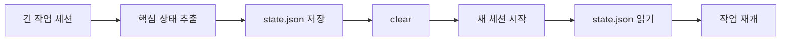

`Claude Code` 의 컨텍스트 창이 커졌다고 해서, 작업이 자동으로 더 좋아지는 것은 아닙니다. 오히려 영상의 핵심 메시지는 그 반대에 가깝습니다. **컨텍스트 창이 커질수록, 무엇을 남기고 무엇을 버릴지 관리하는 능력이 더 중요해진다** 는 것. 영상은 이 문제를 “모델이 멍청해진 것”이 아니라, 사용자가 책상을 너무 지저분하게 쓰고 있기 때문이라고 설명합니다. [YouTube](https://www.youtube.com/watch?v=NpfBwijf0-Y)
<!--more-->

이 비유가 꽤 정확합니다. Claude가 한 번에 볼 수 있는 책상은 커졌지만, 그 위에 올려진 파일, 메모, 대화, `CLAUDE.md`, 도구 호출 결과가 뒤섞이면 결국 중요한 것과 잡음이 같이 섞입니다. 그러면 100만 토큰이 있다는 사실보다, **어떤 정보가 지금 작업의 중심이어야 하는가** 가 훨씬 더 중요해집니다. [YouTube](https://www.youtube.com/watch?v=NpfBwijf0-Y)

## Sources

- https://www.youtube.com/watch?v=NpfBwijf0-Y

## 1. 100만 토큰은 “더 많이 넣어도 된다”가 아니라 “더 관리해야 한다”는 뜻이다

영상은 컨텍스트 창을 책상 크기에 비유합니다. 책상이 넓어졌다고 해서, 아무 서류나 다 쌓아 두면 일이 잘 되는 것은 아닙니다. 오히려 정말 중요한 세 장의 문서를 천 장 사이에서 못 찾게 될 수 있습니다.

즉 100만 토큰 시대의 진짜 변화는:

- 더 긴 세션이 가능해졌다
- 더 많은 파일을 한 번에 참조할 수 있다
- 하지만 그만큼 중요도 관리 실패 비용도 커졌다

는 데 있습니다.

영상은 이 상태를 `context rot` 혹은 `context corruption` 에 가깝게 설명합니다. 정보가 너무 많아지면 모델이:

- 무엇이 현재 목표인지
- 어떤 제약이 우선인지
- 어떤 파일 상태가 최신인지

를 점점 헷갈리게 된다는 것입니다. [YouTube](https://www.youtube.com/watch?v=NpfBwijf0-Y)

## 2. 긴 세션에서 망가질 때 나타나는 4가지 증상

영상은 Claude가 맛이 갈 때 보이는 증상을 네 가지로 정리합니다.

1. 컨텍스트 오염  
2. 목표 이탈(goal drift)  
3. 기억 오염(memory confusion)  
4. 판단 불일치(decision inconsistency)  

이 네 가지는 사실 따로 노는 문제가 아닙니다. 전부 같은 뿌리에서 나옵니다. **책상 위 정보가 너무 많고, 정리가 안 되어 있어서** 입니다.

예를 들어:

- 파란색 UI를 원했는데 어느새 빨간색 제안을 들고 온다
- 파일은 이미 수정됐는데 에이전트는 옛 버전을 기준으로 행동한다
- 조금 전엔 `try/catch` 였다가 다음 순간 `if` 로 처리한다

이런 현상은 모델이 갑자기 논리를 잃어서라기보다, **세션 안에서 기준점이 흐려졌기 때문** 이라고 보는 쪽이 더 정확합니다.

## 3. `compact` 는 만능이 아니라 “다음 창으로 넘기는 도구”다

많은 사용자가 긴 세션에서 `compact` 를 구세주처럼 생각합니다. 영상은 여기서 중요한 함정을 짚습니다. `compact` 는 결국 요약입니다. 즉 많은 정보를 더 작은 형태로 압축해 다음 창으로 넘기는 방식입니다. [YouTube](https://www.youtube.com/watch?v=NpfBwijf0-Y)

문제는 요약에는 반드시 손실이 생긴다는 점입니다.

- 무엇을 남길지
- 무엇을 뺄지
- 어떤 디테일을 중요하다고 볼지

를 결국 모델이 결정합니다.

그래서 `compact` 를 자동으로만 믿으면 위험해집니다. 특히 영상은 자동 compact가 최악일 수 있다고 지적합니다. 이유는 간단합니다. **이미 컨텍스트가 흐려진 상태의 모델이 무엇이 중요한지 다시 추측해서 요약하기 때문** 입니다.

즉 compact는:

- 새로 시작하는 도구가 아니라
- 현재 작업의 맥락을 다음 창으로 옮기는 도구

로 봐야 합니다.

## 4. 그래서 중요한 것은 “언제 compact할지”와 “무엇을 남기라고 말할지”다

영상에서 가장 실용적인 조언 중 하나는, 자동 compact를 기다리지 말고 **사람이 먼저 시점을 잡으라** 는 것입니다. 특히 긴 세션이 쌓일수록, 모델이 무너지기 전에 요약을 주도해야 한다는 메시지입니다.

그리고 더 중요한 것은 compact 명령 자체보다, **요약의 보존 규칙을 직접 지정하는 것** 입니다. 예를 들면:

- 이번 작업에서 내린 결정
- 제약 조건
- 발견한 버그
- 다음 세션에서 반드시 이어야 할 TODO

를 남기라고 지시하는 식입니다.

이렇게 하면 compact는 단순 축약이 아니라, **세션 인수인계 문서 생성** 에 가까워집니다.

## 5. `clear` 는 compact와 반대다: 이어가기보다 끊어내기

영상은 `clear` 와 `compact` 를 명확히 다르게 봅니다.

- `compact`: 지금 작업을 다음 창으로 넘긴다
- `clear`: 책상을 완전히 비운다

즉 `clear` 는 요약도 남기지 않고, 아예 이전 문맥을 버리고 새 작업으로 넘어갈 때 유용합니다. [YouTube](https://www.youtube.com/watch?v=NpfBwijf0-Y)

이 구분이 중요한 이유는, 많은 사람이 모든 전환을 “이어가기”로만 처리하기 때문입니다. 하지만 실제 작업에서는:

- 테스트 작성이 끝나고 디버깅으로 넘어갈 때
- 프론트 작업이 끝나고 백엔드 작업으로 넘어갈 때
- A 기능을 끝내고 B 기능으로 넘어갈 때

이전 문맥이 남아 있는 것이 오히려 방해가 될 수 있습니다.

즉 좋은 세션 운영은 길게 붙드는 능력만이 아니라, **필요할 때 과감하게 비우는 능력** 도 포함합니다.

## 6. 영상의 하이라이트: 중요한 상태만 `JSON` 으로 남기고 `clear` 하라

영상에서 가장 인상적인 팁은 `state.json` 패턴입니다. 핵심은 이렇습니다.

1. 중요한 상태만 구조화해서 JSON 파일로 저장한다  
2. 세션을 `clear` 한다  
3. 다음 세션에서 그 JSON 파일을 읽고 이어서 작업한다  

이 패턴이 좋은 이유는 compact의 장점과 clear의 장점을 동시에 가져오기 때문입니다.

- compact의 연속성
- clear의 깔끔함

을 동시에 잡는 방식이라는 것이죠. [YouTube](https://www.youtube.com/watch?v=NpfBwijf0-Y)

또 JSON은 Markdown 몇 줄 요약보다 구조가 분명합니다. 예를 들면 다음 같은 필드를 둘 수 있습니다.

- current_goal
- decisions
- constraints
- known_bugs
- touched_files
- next_steps

그러면 다음 세션의 모델은 긴 대화 로그 전체를 다시 훑지 않고도, **사람이 남긴 구조화된 현재 상태** 에서 바로 출발할 수 있습니다.

## 7. “지금 뭐 하고 있지?”를 주기적으로 물어보는 습관도 강력하다

영상의 두 번째 실전 팁은 아주 단순합니다. 중간중간 멈춰서 Claude에게 묻는 것입니다.

- 지금까지 뭐 했지?
- 원래 목표가 뭐였지?
- 지금 제약 조건이 뭐지?

이 질문이 효과적인 이유는, 중요한 정보가 대화가 길어질수록 스크롤 위쪽, 즉 컨텍스트의 깊은 곳으로 밀려나기 때문입니다. 최근에 다시 언급하면 그 정보가 다시 세션의 전면으로 올라옵니다.

즉 이 질문은 단순 확인이 아니라, **중요 정보를 현재성(recency) 위로 다시 끌어올리는 리프레시 동작** 입니다.

goal drift나 판단 오락가락 현상이 줄어드는 이유도 여기에 있습니다.

## 8. 결국 컨텍스트 관리는 메모리 문제가 아니라 작업 설계 문제다

이 영상이 좋은 이유는 “더 큰 모델이면 해결된다”는 식으로 말하지 않기 때문입니다. 오히려 반대입니다. 컨텍스트 창이 커질수록 사용자는 더 의식적으로:

- 무엇을 유지할지
- 무엇을 버릴지
- 무엇을 구조화할지
- 언제 세션을 끊을지

를 설계해야 합니다.

즉 컨텍스트 관리는 메모리 최적화 팁이 아니라, **에이전트와 함께 일하는 작업 운영 방식** 에 더 가깝습니다.

## 실전 적용 포인트

오늘 바로 적용할 수 있는 패턴만 뽑으면 이렇습니다.

1. 긴 세션을 무작정 이어 가지 않는다  
2. 자동 compact를 기다리지 않고 사람이 시점을 잡는다  
3. compact 시에는 반드시 남길 항목을 직접 지정한다  
4. 작업 종류가 바뀌면 `clear` 를 쓴다  
5. 중요한 상태는 `state.json` 또는 구조화된 메모 파일로 남긴다  
6. 20분 단위로 “지금 뭐 하고 있지?”를 다시 물어본다  

이 여섯 가지만 해도, 같은 모델로도 체감 품질이 꽤 달라질 가능성이 큽니다.

## 핵심 요약

- 100만 토큰은 무작정 더 많이 넣어도 된다는 뜻이 아니다.
- 컨텍스트가 길어질수록 오염, 목표 이탈, 기억 혼선, 판단 불일치가 생긴다.
- `compact` 는 새로 시작하는 도구가 아니라 현재 작업을 다음 창으로 넘기는 도구다.
- `clear` 는 문맥을 끊고 새 작업으로 넘어갈 때 유용하다.
- 가장 실전적인 패턴은 핵심 상태를 `state.json` 으로 저장하고 새 세션에서 읽게 하는 방식이다.
- 결국 Claude Code의 성능은 모델 크기보다 컨텍스트 운영 방식에 크게 좌우된다.

## 결론

100만 토큰 시대의 Claude Code는 “이제 아무거나 다 넣어도 되는 도구”가 아닙니다. 오히려 더 큰 책상을 받았기 때문에, **정리 실력이 더 중요해진 도구** 에 가깝습니다.

그래서 진짜 실력은 프롬프트 한 줄에만 있지 않습니다. 언제 compact할지, 언제 clear할지, 무엇을 state file로 남길지, 어떤 정보를 다시 전면으로 끌어올릴지를 설계하는 능력에 있습니다. 결국 큰 컨텍스트를 잘 쓰는 사람은, 긴 대화를 버티는 사람이 아니라 **중요한 맥락만 살아남게 만드는 사람** 입니다.
