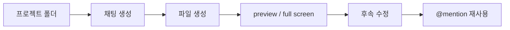
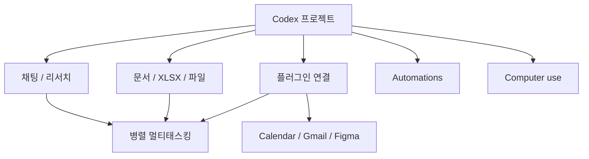

이 영상의 핵심은 `Codex가 최고인가`를 논쟁하는 데 있지 않습니다. 오히려 더 흥미로운 포인트는, Codex를 **코딩만 하는 도구가 아니라 하나의 통합 AI 작업대(unified workbench)** 로 설명한다는 점입니다. 영상은 Codex 안에서 디자인, 리서치, 문서, 스프레드시트, 웹앱, 투자자 덱, 런치 영상, iOS 앱, 자동화, 심지어 컴퓨터 사용까지 한 흐름으로 다룹니다. [YouTube](https://www.youtube.com/watch?v=KXIdYEdOPys)
<!--more-->

즉 이 영상이 보여 주는 Codex의 진짜 변화는 모델 자체보다, **프로젝트 단위로 파일을 만들고, 여러 채팅을 병렬로 돌리고, 플러그인과 스킬을 붙이고, 결과물을 다시 문서나 자동화로 연결하는 운영 방식** 에 있습니다. Codex가 단순 프롬프트 박스가 아니라 “에이전트 운영 콘솔”처럼 보이기 시작하는 지점이 바로 여기입니다. [YouTube](https://www.youtube.com/watch?v=KXIdYEdOPys)

## Sources

- https://www.youtube.com/watch?v=KXIdYEdOPys

## 1. 이 영상이 보는 Codex의 본질은 “올인원 에이전트 앱”이다

영상 초반은 Codex를 굉장히 공격적으로 소개합니다. 코딩, 코워크, 브라우저, 컴퓨터 사용을 모두 한 인터페이스로 묶은 `unified all-purpose AI agent tool` 이라고 규정하죠. 이 표현은 과장처럼 들릴 수 있지만, 설명 구조를 보면 단순 찬양은 아닙니다. 실제로 보여 주는 기능이:

- 프로젝트별 작업 폴더
- 문서와 스프레드시트 생성
- 미리보기(preview)
- 플러그인과 스킬
- 자동화
- 컴퓨터 사용
- 병렬 멀티태스킹

으로 이어지기 때문입니다. [YouTube](https://www.youtube.com/watch?v=KXIdYEdOPys)

즉 Codex를 “코드 생성기”보다 **파일과 에이전트를 함께 관리하는 데스크톱 작업 환경** 으로 재해석하는 영상이라고 보는 편이 맞습니다.

## 2. 프로젝트 기반 구조가 생각보다 중요하다

영상에서 가장 먼저 강조되는 것은 모델이나 프롬프트가 아니라 `project location` 입니다. 사용자는 특정 폴더를 하나의 프로젝트로 잡고, 그 아래에서 채팅과 파일 생성이 이뤄지게 합니다. [YouTube](https://www.youtube.com/watch?v=KXIdYEdOPys)

이 구조의 의미는 단순 저장 위치 지정이 아닙니다.

- 에이전트가 어디에서 시작하는지 정해진다
- 생성한 파일이 한 폴더에 모인다
- 같은 프로젝트 안에서 여러 채팅이 같은 자산을 공유한다
- 나중에 Finder에서 열어 직접 확인할 수 있다

즉 Codex의 대화는 휘발성 채팅이 아니라, **실제 폴더를 중심으로 조직되는 작업 세션** 에 가깝습니다.

이건 에이전트 툴에서 매우 중요합니다. 많은 도구가 대화는 강하지만, 생성한 결과물이 어디에 있고 다음 작업과 어떻게 이어지는지는 약합니다. 영상은 Codex가 이 부분을 프로젝트 구조로 메운다고 설명합니다.

## 3. Preview와 side-by-side 편집이 “문서 작업대”로 보이게 만든다

영상 중반에는 Codex가 만든 XLSX 파일을 바로 열고, 전체 화면으로 보고, 다시 채팅으로 수정 지시하는 장면이 나옵니다. 여기서 중요한 것은 단지 “스프레드시트를 만든다”가 아닙니다.

- 파일을 생성하고
- 결과를 preview로 열고
- 다시 follow-up edit를 하고
- 그 파일을 다른 채팅에서 `@mention` 해 재사용한다

는 루프가 한 화면 안에서 이어진다는 점입니다. [YouTube](https://www.youtube.com/watch?v=KXIdYEdOPys)

이 흐름 덕분에 Codex는 코딩 앱이라기보다:

- 문서 편집기
- 리서치 워크스페이스
- 파일 브라우저
- 에이전트 콘솔

이 겹쳐진 형태처럼 보입니다.

## 4. 진짜 핵심은 한 채팅보다 “여러 채팅을 같은 프로젝트 안에서 병렬로 돌리는 방식”이다

영상 초반부터 후반까지 반복되는 메시지는 하나입니다. 앞으로 AI 에이전트는 한 작업에 1~2시간씩 걸릴 수 있기 때문에, 잘 쓰려면 **멀티태스킹을 배워야 한다** 는 것입니다. [YouTube](https://www.youtube.com/watch?v=KXIdYEdOPys)

그래서 이 영상이 보여 주는 Codex의 핵심 사용법은:

- 하나의 프로젝트 폴더를 잡고
- 그 안에서 여러 채팅을 만들고
- 각각 다른 조사나 산출물을 병렬로 돌리고
- unread dot, side panel, search로 다시 회수하는 것

입니다.

이건 중요한 변화입니다. 예전 AI 사용법이 “한 대화창에 오래 붙어 있는 법”이었다면, 이 영상이 보여 주는 사용법은 **여러 에이전트 작업을 탭과 프로젝트 단위로 분산 운영하는 법** 에 가깝습니다.

## 5. Search 기능은 사실상 “채팅 히스토리 인덱스” 역할을 한다

영상에서 재미있는 부분 하나는, side panel에서 제거한 프로젝트도 search로 다시 찾아 열 수 있다는 점입니다. 이건 사소해 보이지만 장기적으로 매우 중요합니다. [YouTube](https://www.youtube.com/watch?v=KXIdYEdOPys)

왜냐하면 프로젝트 수가 늘어나면 문제는 생성 능력보다도 **찾아오는 능력** 이 되기 때문입니다. 검색을 통해:

- 예전에 했던 Karpathy 분석
- 삭제하지 않고 숨겨 둔 프로젝트
- 특정 주제의 과거 채팅

을 다시 불러오는 흐름은, Codex가 단발성 챗봇이 아니라 **검색 가능한 에이전트 작업 기록 시스템** 으로 간다는 신호로 읽힙니다.

## 6. Plugins와 Skills를 같이 보는 관점이 흥미롭다

영상은 plugins와 skills를 엄밀히 구분하면서도, 사용자 입장에서는 둘 다 결국 **모델 능력을 확장하는 레이어** 로 이해하면 된다고 설명합니다. [YouTube](https://www.youtube.com/watch?v=KXIdYEdOPys)

이때 skill은 재사용 가능한 workflow package, plugin은 능력을 실제로 연결하는 installable unit처럼 설명됩니다.

예를 들면:

- Google Calendar plugin
- Gmail integration
- Figma plugin

을 붙여서:

- 캘린더 이벤트를 읽고
- 요약을 이메일로 보내고
- Figma 보드를 수정하는

식으로 사용합니다.

즉 Codex의 힘은 기본 모델 성능 자체보다, **어떤 외부 도구와 어떤 작업 프로토콜을 묶어 두느냐** 에서 커집니다.

## 7. 자동화는 “명령 하나를 저장하는 기능”이 아니라, 작업을 스케줄로 승격하는 기능이다

영상에서는 캘린더 요약을 이메일로 보내는 흐름을 만든 뒤, 그 작업을 `매주 금요일 4시` 자동화로 바꿉니다. 이게 의미하는 것은 단순 예약 기능이 아닙니다. [YouTube](https://www.youtube.com/watch?v=KXIdYEdOPys)

채팅에서 했던 작업이:

- 일회성 요청
- 재사용 가능한 작업
- 반복 실행되는 자동화

로 승격되는 흐름을 보여 주기 때문입니다.

즉 Codex는 단순 응답 엔진이 아니라, **대화를 실행 가능한 워크플로와 스케줄로 굳히는 도구** 로도 읽을 수 있습니다.

## 8. Figma와 computer use 데모는 “코드 밖 작업”까지 한 콘솔에서 다루려는 방향을 보여 준다

영상 후반부에서 Figma 연동을 테스트하는 장면은 꽤 상징적입니다. Codex가 로컬에서 Figma를 보고, 텍스트를 배치하고, 이미지 생성 결과를 다시 디자인 워크플로에 연결하려고 시도합니다. [YouTube](https://www.youtube.com/watch?v=KXIdYEdOPys)

물론 영상에서도 Figma integration이 완벽한 디자인 생성기라기보다, 기존 보드를 inspect하거나 코드와 연결하는 데 더 맞는다는 뉘앙스가 나옵니다. 하지만 중요한 건 완성도보다 방향입니다.

이 방향은 분명합니다.

- 코드 생성
- 파일 생성
- 문서 편집
- 외부 도구 제어
- 컴퓨터 사용

을 하나의 에이전트 콘솔 안에서 이어 붙이려는 것입니다.

즉 Codex는 IDE라기보다, 점점 **디지털 업무 전체를 다루는 범용 에이전트 셸** 에 가까워집니다.

## 9. 이 영상의 진짜 메시지는 도구 사용법보다 “에이전트 운영법”에 있다

표면적으로는 데스크톱 앱 튜토리얼처럼 보이지만, 실제로 더 중요한 메시지는 따로 있습니다.

- 긴 일을 시키려면 병렬로 돌려야 한다
- 프로젝트 단위로 정리해야 한다
- 파일을 자산처럼 다뤄야 한다
- 플러그인과 스킬을 붙여 능력을 넓혀야 한다
- 한 번 만든 흐름은 자동화로 승격해야 한다

즉 이 영상은 `Codex 사용법` 강의이기도 하지만, 동시에 **에이전트를 개인 비서가 아니라 운영 대상 워커(worker)로 다루는 법** 에 대한 강의이기도 합니다.

## 실전 적용 포인트

이 영상에서 바로 가져올 수 있는 패턴은 다음과 같습니다.

1. 채팅을 시작하기 전에 프로젝트 폴더부터 만든다  
2. 한 프로젝트 안에서 조사/문서/산출물을 여러 채팅으로 병렬 운영한다  
3. 생성된 파일은 preview로 보고, 다음 채팅에서 `@mention` 해 재사용한다  
4. 자주 하는 작업은 플러그인 + 자동화로 승격한다  
5. Codex를 “코딩 봇”이 아니라 `작업 운영 콘솔` 로 본다  

특히 2번과 4번은 앞으로 에이전트 활용의 생산성을 크게 가를 가능성이 큽니다.

## 핵심 요약

- 이 영상은 Codex를 단순 코딩 툴보다 `통합형 AI 작업대`로 설명한다.
- 핵심은 모델 성능보다 프로젝트 폴더, 파일 출력, preview, 병렬 채팅 같은 운영 구조에 있다.
- 여러 채팅을 같은 프로젝트 안에서 병렬로 돌리는 멀티태스킹 사용법이 중요하게 다뤄진다.
- plugins와 skills는 결국 모델 능력을 확장하는 작업 레이어로 이해할 수 있다.
- 자동화는 대화 내용을 반복 가능한 워크플로로 굳히는 기능으로 소개된다.
- Codex는 점점 IDE보다 `범용 에이전트 콘솔` 처럼 보이기 시작한다.

## 결론

이 영상이 흥미로운 이유는 `Codex가 최고냐`를 말해서가 아닙니다. 더 중요한 것은 Codex를 바라보는 프레임을 바꿔 놓기 때문입니다. 즉 “코드를 잘 짜 주는 AI”가 아니라, **파일·문서·도구·자동화·외부 앱을 묶어 여러 작업을 동시에 굴리는 운영 콘솔** 로 보게 만든다는 점입니다.

그래서 이 영상의 진짜 교훈은 기능 목록이 아닙니다. 앞으로 에이전트를 잘 쓰는 사람은 좋은 프롬프트만 쓰는 사람이 아니라, **프로젝트를 만들고, 작업을 병렬화하고, 산출물을 파일과 자동화로 축적하는 사람** 이 될 가능성이 크다는 것입니다.
