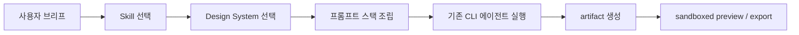
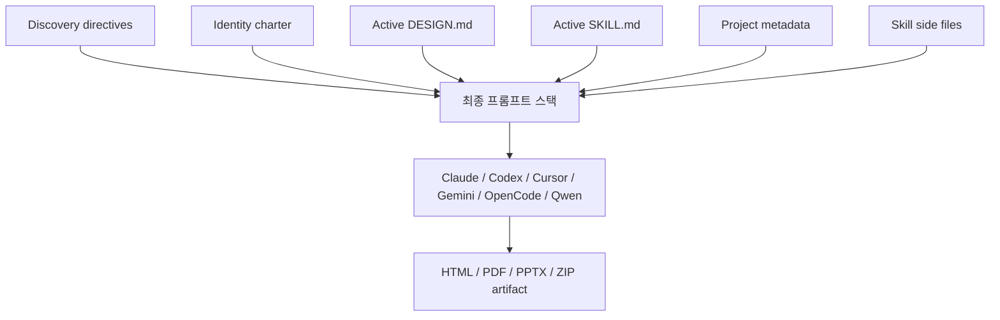

`nexu-io/open-design` 은 자기 소개가 아주 분명한 저장소입니다. `Claude Design의 오픈소스 대안`, `local-first`, `BYOK`, 그리고 `기존 코딩 에이전트를 디자인 엔진으로 바꾼다`. 즉 이 프로젝트는 새로운 독자 모델을 내놓는 것이 아니라, **이미 로컬에 있는 Claude Code·Codex·Cursor·Gemini CLI·OpenCode·Qwen을 디자인 생산 파이프라인에 묶는 런타임** 을 만들려는 시도입니다. [GitHub 저장소](https://github.com/nexu-io/open-design)
<!--more-->

이 저장소가 흥미로운 이유는 “AI가 예쁜 시안을 뽑는다” 수준이 아니라, **닫힌 Claude Design 경험을 오픈소스·로컬·배포 가능한 형태로 재구성한다** 는 데 있습니다. README는 Anthropic의 Claude Design이 보여 준 artifact-first 루프를 인정하면서도, cloud-only / paid-only / Anthropic lock-in 구조를 그대로 받아들이지 않습니다. 대신:

- 웹 앱 + 로컬 daemon
- 19개 composable skill
- 71개 brand-grade design system
- sandboxed preview
- HTML / PDF / PPTX / ZIP export

라는 식으로, **디자인 작업을 하나의 오픈 워크벤치** 로 만들려 합니다. [GitHub 저장소](https://github.com/nexu-io/open-design)

## Sources

- https://github.com/nexu-io/open-design

## 1. 이 프로젝트의 본질은 “디자인 모델”이 아니라 “디자인 하네스”다

가장 먼저 눈에 띄는 점은, Open Design이 “우리가 만든 에이전트를 쓰라”고 하지 않는다는 것입니다. 오히려 정반대입니다. 강한 코딩 에이전트는 이미 사용자의 노트북에 있으니, 이 저장소는 그 위에:

- skill-driven workflow
- design-system injection
- preview / export / file workspace
- project folder / local DB / daemon

을 얹습니다. 즉 핵심 자산은 모델이 아니라 **설계된 프롬프트 스택과 파일 기반 워크플로** 입니다.

이 점에서 Open Design은 단순 생성 앱보다 `하네스 엔지니어링` 쪽에 더 가깝습니다. 모델을 바꾸는 것이 아니라, **모델이 어떻게 질문하고 어떤 파일을 읽고 어떤 기준으로 자기 결과를 비평할지** 를 구조화합니다.

## 2. 왜 Claude Design의 대안이라는 말이 중요한가

README는 이 프로젝트가 왜 존재하는지 아주 직설적으로 설명합니다. Claude Design은 강력했지만:

- closed-source
- paid-only
- cloud-only
- Anthropic model / skill lock-in

이 있었습니다. Open Design은 이 경험을 부정하지 않습니다. 오히려 그 정신은 그대로 가져오되, **잠금장치만 제거하겠다** 는 방향입니다. [GitHub 저장소](https://github.com/nexu-io/open-design)

즉 이 저장소의 경쟁축은 “Figma보다 낫다”가 아니라:

- Claude Design처럼 artifact-first로 움직이되
- 로컬에서도 돌고
- Vercel에도 배포되고
- 원하는 CLI 에이전트로 바꿔 끼울 수 있는가

에 더 가깝습니다.

## 3. 19개 Skills와 71개 Design Systems가 핵심 레이어다

README 기준 Open Design의 가장 큰 자산은 두 가지입니다.

- 19개 skills
- 71개 design systems

여기서 skills는 단순 프롬프트가 아니라 surface를 정의합니다. 예를 들어:

- `web-prototype`
- `saas-landing`
- `dashboard`
- `pricing-page`
- `docs-page`
- `blog-post`
- `mobile-app`
- `simple-deck`
- `guizang-ppt`

같은 식으로 결과물 종류를 정합니다. [GitHub 저장소](https://github.com/nexu-io/open-design)

그리고 design system은 `DESIGN.md` 스키마를 따르는 portable Markdown 자산입니다. 즉 theme JSON이 아니라:

- color
- typography
- spacing
- layout
- components
- motion
- voice
- brand
- anti-patterns

를 담은 파일 단위 지식입니다. 이 점이 중요합니다. 왜냐하면 Open Design은 예쁜 결과물을 랜덤 샘플링하는 대신, **어떤 브랜드 문법을 읽고 생성할지** 를 먼저 고정하기 때문입니다.

## 4. 질문 폼을 먼저 띄우는 구조가 의외로 가장 중요하다

README에서 개인적으로 가장 중요한 부분은 fancy한 preview가 아니라 `interactive question form` 입니다. Open Design은 fresh brief가 들어오면 바로 시안을 그리기보다 먼저:

- surface
- audience
- tone
- brand context
- scale
- constraints

를 묻는 discovery form을 띄운다고 설명합니다. [GitHub 저장소](https://github.com/nexu-io/open-design)

이게 중요한 이유는 디자인 작업의 실패가 대체로 “생성 품질”보다 **방향을 늦게 바로잡는 비용** 에서 오기 때문입니다. README 표현을 빌리면, 긴 브리프도 시각 톤과 범위를 충분히 고정해 주지 못합니다. 그래서 30초짜리 라디오 버튼 폼이 30분짜리 재작업보다 싸다는 논리가 나옵니다.

즉 Open Design은 AI가 더 창의적으로 improvisation 하도록 두기보다, **아예 즉흥 연주를 덜 하게 만드는 쪽** 에 가깝습니다.

## 5. 웹 앱 + 로컬 daemon 구조라는 점이 다른 대안들과 다르다

README는 자신들을 `desktop Electron app` 과도 구분합니다. 구조를 보면:

- 브라우저의 Vite + React SPA
- Express + SQLite 기반 local daemon
- `.od/projects/<id>/` 실제 작업 폴더
- CLI spawn 기반 agent runtime

으로 이뤄집니다. [GitHub 저장소](https://github.com/nexu-io/open-design)

이 구조의 의미는 꽤 큽니다.

1. UI는 웹처럼 열려 있다  
2. 하지만 권한 있는 프로세스는 daemon 하나로 좁혀진다  
3. 에이전트는 가짜 샌드박스가 아니라 실제 파일 시스템 위에서 일한다  
4. 결과물은 화면 속 ephemeral state가 아니라 디스크 위 산출물이 된다  

즉 Open Design은 “디자인 챗봇”보다 **디자인용 로컬 작업대** 에 가깝습니다.

## 6. Preview와 Export를 제품의 핵심으로 본다

README는 preview와 export를 꽤 전면에 둡니다.

- sandboxed iframe preview
- HTML
- PDF
- PPTX
- ZIP
- Markdown

이 조합이 중요한 이유는, 많은 AI 디자인 데모가 “예쁜 화면을 잠깐 보여 주는 것”에서 끝나기 때문입니다. 반면 Open Design은 아예 출력물 중심으로 사고합니다. artifact가 `<artifact>` 로 렌더되고, 파일 workspace에서 내려받을 수 있어야 하며, 다음 작업이 이어질 수 있어야 한다는 것이죠.

즉 이 프로젝트는 생성 순간보다 **산출물의 전달성과 재사용성** 을 더 중요하게 봅니다.

## 7. `prompt stack is the product`라는 말이 이 저장소를 가장 잘 설명한다

README에는 아주 인상적인 문장이 있습니다. `The prompt stack is the product.` 이 프로젝트를 이해하는 가장 좋은 요약입니다. Open Design이 조립하는 레이어는 대략 이렇습니다.

- discovery directives
- identity charter
- active `DESIGN.md`
- active `SKILL.md`
- project metadata
- skill side files
- deck framework directive

즉 system prompt 하나로 끝나는 게 아니라, **역할 / 디자인 문법 / 작업면 / 프로젝트 상태 / 참조 자산** 을 레이어로 쌓습니다. [GitHub 저장소](https://github.com/nexu-io/open-design)

이 관점은 요즘 agent tooling의 흐름과도 맞닿아 있습니다. 좋은 결과는 더 똑똑한 단일 모델에서만 나오지 않고, **더 잘 구조화된 입력 계층** 에서 나온다는 것입니다.

## 8. 오픈소스 네 군데의 장점을 조립해 놓았다는 점도 흥미롭다

README는 이 프로젝트가 네 가지 오픈소스의 어깨 위에 서 있다고 밝힙니다.

- `huashu-design`
- `guizang-ppt-skill`
- `OpenCoworkAI/open-codesign`
- `multica`

이게 의미하는 것은 Open Design이 “완전히 새로운 발명”을 주장하기보다, 이미 검증된 조각들을:

- 디자인 철학
- 덱 생성
- streaming artifact UX
- daemon/runtime 구조

로 다시 조립했다는 점입니다. 이런 태도는 오히려 제품화 관점에서 더 현실적입니다.

## 9. 2026년 4월 29일 기준 저장소 상태도 꽤 강하다

GitHub API 기준 `nexu-io/open-design` 은 현재:

- stars 1,055
- forks 119
- 기본 브랜치 `main`
- Apache-2.0 라이선스
- TypeScript 중심

상태입니다. 저장소 설명에도:

- local-first open replica of Claude Design
- 19 skills
- 71 brand-grade design systems
- sandboxed preview
- HTML / PDF / PPTX export

가 전면에 배치돼 있습니다. [GitHub 저장소](https://github.com/nexu-io/open-design)

## 실전 적용 포인트

이 저장소를 그대로 도입하지 않더라도, 다음 아이디어는 바로 가져올 수 있습니다.

1. 디자인 작업도 첫 턴 질문 폼으로 방향을 잠근다  
2. style guide를 JSON이 아니라 `DESIGN.md` 같은 문서 자산으로 관리한다  
3. skill 단위로 산출물 surface를 나눈다  
4. preview보다 export 가능한 artifact를 우선한다  
5. 모델보다 prompt stack과 working filesystem을 제품으로 본다  

특히 1번과 2번만 가져와도, 디자인용 AI 워크플로의 품질은 꽤 크게 달라질 가능성이 있습니다.

## 핵심 요약

- Open Design은 새로운 모델이 아니라 기존 코딩 에이전트를 디자인 엔진으로 바꾸는 하네스에 가깝다.
- `Claude Design의 오픈소스 대안` 이라는 포지션이 이 저장소의 핵심이다.
- 19개 skill과 71개 design system이 결과물 품질을 좌우하는 핵심 레이어다.
- discovery form으로 방향을 먼저 잠그는 구조가 재작업 비용을 줄인다.
- 웹 앱 + 로컬 daemon + 실제 프로젝트 폴더 구조 덕분에 artifact 중심 작업대처럼 동작한다.
- 본질적으로 이 프로젝트의 제품은 모델이 아니라 `prompt stack + file workflow` 다.

## 결론

`nexu-io/open-design` 이 흥미로운 이유는 AI가 디자인을 “해 준다”는 환상을 파는 대신, **디자인 산출물이 나오도록 에이전트를 구조화하는 시스템** 을 내놓기 때문입니다. 모델 하나가 마법처럼 해결하는 것이 아니라, 질문 폼, 스킬, 디자인 시스템, 파일 워크스페이스, 프리뷰, 익스포트까지 이어지는 작업대가 결과를 만든다는 관점입니다.

그래서 이 저장소는 단순 디자인 생성기보다, **오픈소스版 Claude Design이자 멀티-에이전트 디자인 런타임** 으로 보는 편이 더 정확합니다.
