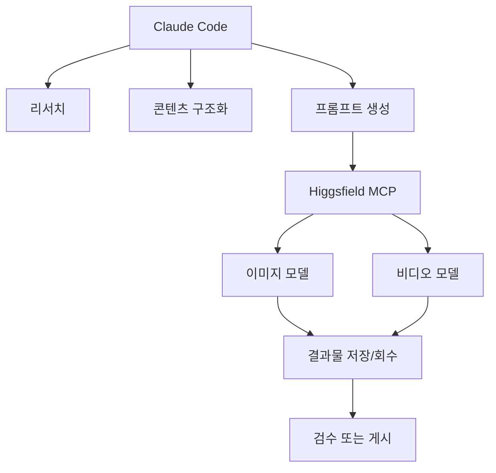

이 영상의 핵심은 `Claude Code가 이미지도 만든다` 같은 데모 자랑이 아닙니다. 더 중요한 포인트는, **흩어져 있던 AI 콘텐츠 툴들을 Higgsfield MCP라는 단일 진입점으로 묶고, 그 위에 Claude Code 자동화를 얹는다** 는 점입니다. 즉 개별 이미지 모델이나 비디오 모델을 하나씩 직접 연결하는 방식이 아니라, 콘텐츠 생성 계층 자체를 한 번에 붙여 버리는 접근입니다. [YouTube](https://www.youtube.com/watch?v=20BDYk-CU_o)
<!--more-->

영상은 이를 두 가지 관점에서 설명합니다. 첫째, 이제는 “이번 주 최고 툴”이 자주 바뀌기 때문에 하나의 모델에만 고정되면 계속 뒤처진다는 것. 둘째, MCP로 연결되면 Claude Code가 외부 정보를 가져오고, 분석하고, 프롬프트를 만들고, 이미지/영상을 생성하고, 다시 결과물을 회수하는 자동화 루프를 안정적으로 만들 수 있다는 것입니다. [YouTube](https://www.youtube.com/watch?v=20BDYk-CU_o)

## Sources

- https://www.youtube.com/watch?v=20BDYk-CU_o

## 1. 왜 Higgsfield MCP가 중요한가: 모델 하나가 아니라 “콘텐츠 툴 모음”을 연결한다

영상은 Claude Code의 콘텐츠 제작 문제를 아주 현실적으로 짚습니다. 좋은 이미지 모델, 좋은 비디오 모델, 좋은 음성/편집 도구가 계속 바뀌는데, 그때마다 각각을 Claude에 따로 연결하는 것은:

- 번거롭고
- API 체계가 제각각이며
- 결제와 인증도 따로 필요하고
- 어떤 도구는 아예 공개 API가 제한적일 수 있습니다

그래서 대부분은 결국 한두 개 툴만 쓰게 됩니다. 문제는 이렇게 하면 `그 시점의 최선 도구` 를 계속 갈아끼우기 어렵다는 점입니다. [YouTube](https://www.youtube.com/watch?v=20BDYk-CU_o)

Higgsfield MCP가 의미 있는 이유는 바로 여기 있습니다. Claude Code 입장에서는 개별 툴 여러 개를 따로 아는 대신, **Higgsfield라는 단일 MCP를 통해 콘텐츠 생성 레이어 전체에 접근** 하게 되는 것입니다.

## 2. 진짜 핵심은 편의성보다 자동화다

영상은 “툴을 한 군데로 모았다”는 편의성보다, 그게 MCP라는 점 때문에 **자동화가 가능해진다** 는 것을 더 강조합니다. [YouTube](https://www.youtube.com/watch?v=20BDYk-CU_o)

예시로 드는 흐름은 이렇습니다.

1. Claude Code가 GitHub에서 트렌딩 AI 저장소를 가져온다  
2. 그 정보를 분석해 소셜용 캐러셀 구조로 정리한다  
3. 각 장면에 필요한 이미지 프롬프트를 만든다  
4. 그 프롬프트를 Higgsfield MCP로 보낸다  
5. MCP가 적절한 생성 모델을 호출한다  
6. 결과 이미지를 다시 Claude Code로 가져온다  

즉 MCP는 단순 호출기가 아니라, **외부 정보 수집 → 분석 → 생성 → 회수** 의 자동화 루프 안에 들어가는 실행 레이어가 됩니다.

## 3. 이 조합이 ‘마케팅 머신’처럼 보이는 이유

영상은 이 흐름을 아주 직설적으로 `turning Claude Code into a marketing machine` 이라고 표현합니다. 이 말이 과장처럼 들릴 수 있지만, 구조를 보면 이해가 됩니다. [YouTube](https://www.youtube.com/watch?v=20BDYk-CU_o)

마케팅 콘텐츠 자동화에서 필요한 것은 보통:

- 소재 탐색
- 정보 수집
- 요약/구조화
- 이미지/영상 생성
- 검수
- 게시 또는 예약

입니다. 기존에는 이 단계가 각각 다른 툴에 흩어져 있었는데, Higgsfield MCP를 붙이면 적어도 생성 계층이 하나로 모입니다. 여기에 Claude Code의:

- 자동화
- 자연어 지시
- 파일 처리
- 외부 도구 호출

이 붙으면서, 마케팅용 반복 작업이 꽤 긴 파이프라인 단위로 묶이기 시작합니다.

## 4. 설치 자체는 어렵지 않다. 중요한 건 연결 위치다

영상 기준으로 Higgsfield MCP를 붙이는 경로는 두 가지입니다.

- Claude 웹/데스크톱 앱에서 connector로 연결
- Claude Code 터미널 안에서 MCP 서버로 연결

웹 앱 쪽은 `settings → connector → add custom connector` 흐름을 통해 붙이고, Claude Code 쪽은 자연어로 “이 MCP 서버를 설정해 줘” 식으로 요청한 뒤 `/mcp` 로 연결 여부를 확인하는 흐름을 보여 줍니다. [YouTube](https://www.youtube.com/watch?v=20BDYk-CU_o)

여기서 중요한 것은 설치 그 자체보다 **같은 연결이 웹 앱과 코드 에이전트 양쪽에서 재사용될 수 있다는 점** 입니다. 즉:

- 웹/데스크톱에서는 in-line 시각 결과 확인
- Claude Code에서는 자동화와 스크립팅

이라는 식으로 역할이 갈립니다.

## 5. 웹 앱과 Claude Code의 차이: 하나는 확인용, 하나는 운영용

영상은 이 둘의 차이도 잘 보여 줍니다.

- 웹/데스크톱 Claude에서는 이미지가 대화 안에 바로 보인다
- Claude Code 터미널에서는 이미지를 직접 보진 못하지만 대량 생성과 자동화에 더 적합하다

즉 웹 앱 쪽은 시각적 피드백이 중요할 때 좋고, Claude Code 쪽은 **대량 실행, 파일 저장, 후속 흐름 연결** 에 강합니다. [YouTube](https://www.youtube.com/watch?v=20BDYk-CU_o)

이 구분은 생각보다 중요합니다. 많은 사람이 “터미널에서 이미지를 못 보니 별로다”라고 느낄 수 있지만, 영상의 논리는 다릅니다. 진짜 목적은 미리보기보다 **자동화 가능한 콘텐츠 파이프라인** 을 만드는 데 있다는 것이죠.

## 6. 이 접근이 강한 이유는 “최적 모델 갈아끼우기”를 쉽게 만든다는 데 있다

영상 초반에서 반복되는 메시지 중 하나는, 콘텐츠 생성 모델의 우열이 너무 자주 바뀐다는 점입니다. 지난주 최고가 이번 주에도 최고라는 보장이 없고, 이미지/영상 분야는 특히 교체 속도가 빠르다는 것이죠. [YouTube](https://www.youtube.com/watch?v=20BDYk-CU_o)

그래서 개별 모델에 깊게 종속되는 구조보다, **MCP를 통해 생성 계층을 추상화** 하는 구조가 더 유리합니다.

즉 Claude Code는:

- 정보를 해석하고
- 콘텐츠 구조를 설계하고
- 어떤 도구를 쓸지 선택하고
- 결과를 다시 묶는 역할

을 맡고, 실제 생성은 Higgsfield가 뒤에서 최적 도구를 호출하는 식으로 분리됩니다.

이 구조는 AI 에이전트 시대의 전형적인 패턴과 닮아 있습니다. 상위 레이어는 orchestration, 하위 레이어는 specialized tool execution입니다.

## 7. 영상의 실전 예시는 “GitHub trending → carousel” 자동화다

영상의 대표 예시는 꽤 구체적입니다. 매일 아침 Claude Code가:

- 최근 7일 생성된 GitHub 저장소 중
- 주간/월간 기준으로 트렌딩하는 AI repo를 찾고
- 별 수와 설명을 정리하고
- 그걸 소셜 캐러셀용 정보 구조로 바꾸고
- 필요한 이미지를 생성하는 흐름

입니다. [YouTube](https://www.youtube.com/watch?v=20BDYk-CU_o)

이 예시가 좋은 이유는, 단순 “이미지 하나 뽑기”보다:

- 정보 수집
- 요약
- 포맷 변환
- 생성

이 한 묶음으로 돌아가야 진짜 자동화라는 것을 보여 주기 때문입니다.

즉 이 조합의 강점은 창작보다도, **반복 가능한 정보형 콘텐츠 제작** 에 더 잘 드러납니다.

## 8. 이 영상은 Claude Code를 ‘콘텐츠 IDE’처럼 보게 만든다

보통 Claude Code는 개발자용 코딩 툴로 인식됩니다. 그런데 이 영상은 시선을 바꿉니다. Claude Code를:

- 리서치 도구
- 자동화 도구
- 프롬프트 생성기
- 외부 생성 엔진 오케스트레이터
- 결과물 회수기

로 쓰기 시작하면, 그것은 더 이상 단순 코딩 도구가 아니라 **콘텐츠 제작용 운영 환경** 처럼 보입니다. [YouTube](https://www.youtube.com/watch?v=20BDYk-CU_o)

즉 Higgsfield MCP의 진짜 가치는 모델 수보다, Claude Code의 역할을 `개발 보조` 에서 `콘텐츠 파이프라인 관리자` 로 넓힌다는 데 있습니다.

## 실전 적용 포인트

이 영상을 그대로 따라 하지 않더라도, 바로 가져갈 수 있는 아이디어는 분명합니다.

1. 콘텐츠 생성 모델을 하나씩 직접 연결하지 말고, 가능하면 단일 진입점으로 묶는다  
2. Claude Code는 생성기가 아니라 오케스트레이터로 쓴다  
3. 자동화는 “이미지 만들기”가 아니라 “정보 수집부터 결과물 회수까지” 한 묶음으로 설계한다  
4. 웹 앱은 시각 확인용, Claude Code는 운영/자동화용으로 역할을 나눈다  
5. 특히 GitHub/뉴스/리포트 기반 정보형 콘텐츠 자동화에 잘 맞는다  

## 핵심 요약

- Higgsfield MCP의 가치는 개별 생성 모델 접근보다 `콘텐츠 생성 레이어 통합` 에 있다.
- 진짜 핵심은 편의성이 아니라 Claude Code 기반 자동화 파이프라인을 만들 수 있다는 점이다.
- 웹/데스크톱 Claude는 in-line 확인에, Claude Code는 대량 실행과 자동화에 더 잘 맞는다.
- 이 구조는 최적 모델이 자주 바뀌는 콘텐츠 생성 시장에 특히 유리하다.
- 대표 활용 패턴은 외부 정보 수집 → 분석 → 생성 프롬프트 작성 → 이미지/영상 생성 → 결과물 회수다.
- 결과적으로 Claude Code는 코딩 툴을 넘어 `콘텐츠 IDE` 혹은 `마케팅 머신`처럼 동작하기 시작한다.

## 결론

이 영상이 흥미로운 이유는 `새 MCP가 나왔다`는 소식을 넘어서기 때문입니다. 더 중요한 것은, 이제 Claude Code 위에 이미지·영상 생성 계층을 얹어 **반복 가능한 콘텐츠 자동화 파이프라인** 을 만들 수 있다는 점을 구체적으로 보여 준다는 것입니다.

결국 Higgsfield MCP의 의미는 툴 하나를 더 붙이는 데 있지 않습니다. Claude Code를 단순 코딩 도구가 아니라, **리서치하고, 구조화하고, 생성시키고, 회수하는 콘텐츠 오케스트레이터** 로 확장하는 데 있습니다.
