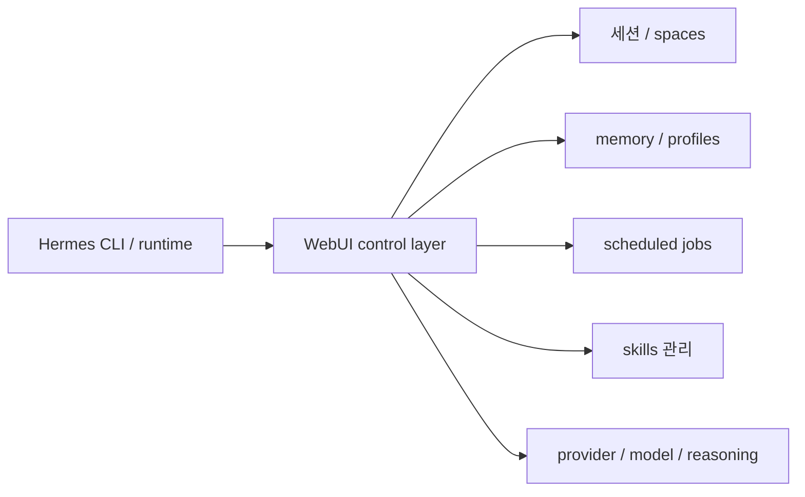
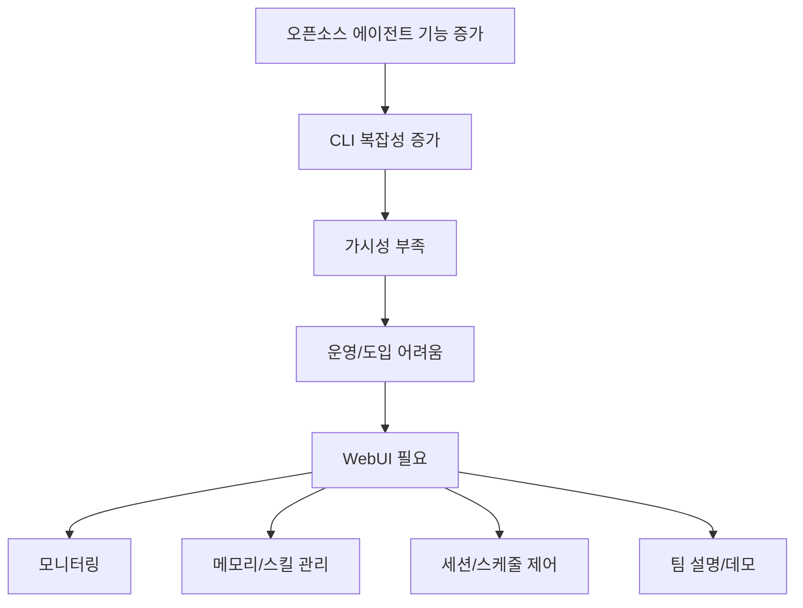

이 영상의 핵심은 `Hermes WebUI가 예쁘다`는 데 있지 않습니다. 더 중요한 포인트는, Hermes 같은 오픈소스 에이전트가 강력해질수록 오히려 **터미널만으로는 관리가 어려워지고, 그 위에 시각적 운영 레이어가 필요해진다** 는 점을 잘 보여 준다는 것입니다. 영상은 바로 그 간극을 WebUI가 메운다고 설명합니다. [YouTube](https://www.youtube.com/watch?v=RxbkSe4Et4k)
<!--more-->

Hermes 자체는 이미 강력한 오픈소스 에이전트입니다. 공식 GitHub README는 이를 `the self-improving AI agent` 라고 설명하고, 내장 학습 루프, 지속 메모리, 스케줄링, 병렬 서브에이전트, 다중 플랫폼 게이트웨이를 강점으로 내세웁니다. 그런데 이런 능력이 많아질수록 사용자에게 필요한 것은 또 하나 생깁니다. 바로 **현재 무슨 일이 벌어지고 있는지 보고, 스킬과 세션과 메모리를 정리하고, 작업을 시각적으로 통제하는 인터페이스** 입니다. [Hermes Agent GitHub](https://github.com/NousResearch/hermes-agent), [Hermes Web UI](https://hermes-agent.ai/tools/hermes-web-ui)

## Sources

- https://www.youtube.com/watch?v=RxbkSe4Et4k
- https://github.com/NousResearch/hermes-agent
- https://hermes-agent.ai/tools/hermes-web-ui

## 1. Hermes가 강한 이유와 WebUI가 필요한 이유는 같은 곳에서 나온다

Hermes Agent 공식 README를 보면 이 프로젝트는 꽤 야심찹니다.

- built-in learning loop
- persistent memory
- skills self-improvement
- FTS5 기반 세션 검색
- scheduled automations
- subagent parallelization
- Telegram/Discord/Slack/WhatsApp/Signal/CLI 게이트웨이

즉 Hermes는 단순 채팅형 에이전트가 아니라, **시간을 두고 학습하고, 여러 채널에 걸쳐 일하고, 스케줄과 메모리를 끌고 가는 시스템** 입니다. [Hermes Agent GitHub](https://github.com/NousResearch/hermes-agent)

문제는 바로 여기서 생깁니다. 기능이 많아질수록 CLI만으로는:

- 현재 어떤 세션이 살아 있는지
- 어떤 스케줄 잡이 도는지
- 어떤 스킬이 활성화돼 있는지
- 어떤 메모리와 프로필이 붙어 있는지

를 한눈에 보기 어렵습니다.

그래서 WebUI는 부가 기능이 아니라, **복잡해진 에이전트 런타임을 사람이 운영 가능한 형태로 바꾸는 인터페이스** 로 등장합니다.

## 2. 공식 설명도 WebUI를 “CLI 대체”가 아니라 “시각적 제어 레이어”로 본다

Hermes Web UI 공식 페이지는 이 도구를 browser-based dashboard 라고 설명합니다. 주요 목적도 분명합니다.

- active agents 모니터링
- conversation history inspection
- skill management
- browser-based control panel

그리고 가장 중요한 문장은 이것입니다. WebUI는 CLI를 대체한다기보다, **모니터링과 관리가 쉬워지는 visual control layer** 로 이해해야 한다는 점입니다. [Hermes Web UI](https://hermes-agent.ai/tools/hermes-web-ui)

이 정의는 영상의 흐름과 정확히 맞습니다. 영상도 반복해서 “터미널보다 훨씬 관리하기 쉽다”, “에이전트와 직접 대화하기 편하다”, “여러 에이전트와 프로필을 정리하기 좋다”고 설명합니다. [YouTube](https://www.youtube.com/watch?v=RxbkSe4Et4k)

## 3. 이 영상이 보여 주는 가장 큰 변화는 ‘예쁜 UI’가 아니라 ‘운영 가시성’이다

영상 초반은 Hermes의 기존 터미널 UI와 WebUI를 직접 비교합니다. 메시지는 분명합니다. 터미널 UI도 괜찮지만:

- 세션이 많아지면 지저분해지고
- 상태를 한눈에 보기 어렵고
- 비기술 사용자에게는 진입 장벽이 높아집니다

반면 WebUI는:

- 현재 에이전트가 online인지
- 어떤 provider/model이 연결돼 있는지
- reasoning mode가 무엇인지
- 어떤 task list가 살아 있는지

를 더 쉽게 드러냅니다. [YouTube](https://www.youtube.com/watch?v=RxbkSe4Et4k)

이 차이는 꽤 큽니다. 에이전트가 실험 단계에서는 CLI로 충분할 수 있지만, 실제로 일상 업무에 붙기 시작하면 중요한 것은 추론 품질만이 아니라 **상태 가시성(state visibility)** 입니다.

## 4. Hermes WebUI는 “에이전트 운영 대시보드”처럼 작동한다

영상 중반 이후를 보면 WebUI가 단순 채팅창이 아니라 운영 대시보드처럼 보입니다.

- provider 전환
- reasoning mode 변경
- spaces 전환
- personal memory 확인
- scheduled jobs 확인/삭제
- active tasks 관리
- prompt 수정
- output 위치 변경
- 스케줄 수정
- skills 관리

이런 것들이 한 화면 안에서 이뤄집니다. [YouTube](https://www.youtube.com/watch?v=RxbkSe4Et4k)

즉 이 도구는 “에이전트와 대화하는 화면”이 아니라, **에이전트 런타임의 설정·기억·스케줄·세션을 직접 다루는 관리 콘솔** 에 가깝습니다.

## 5. Claude Code와의 비교가 꽤 정확하다: 즉시성 vs 통제력

영상에서 가장 인상적인 비유 중 하나는 Claude Code와 Hermes의 차이를 `바로 탈 수 있는 차` 와 `직접 조립하는 차` 로 비교한 부분입니다. [YouTube](https://www.youtube.com/watch?v=RxbkSe4Et4k)

이 비유는 단순 취향 문제가 아닙니다.

- Claude Code는 덜 기술적이고 바로 쓸 수 있다
- Hermes는 더 많은 설정과 관리가 필요하다
- 대신 모델 선택, 성격, 스킬, 런타임 전반에 대한 통제력이 훨씬 크다

즉 Hermes + WebUI 조합은 “누구나 바로 쓰는 도구”보다는, **오픈소스 에이전트를 자기 방식대로 운용하고 싶은 사용자** 에게 더 잘 맞습니다.

이 관점은 중요합니다. 많은 오픈소스 에이전트 프로젝트가 기능은 많은데 실제 운영 감각이 떨어지는 이유는, 사용자가 그 복잡성을 다 받아내야 하기 때문입니다. WebUI는 바로 그 복잡성의 일부를 흡수합니다.

## 6. 특히 여러 모델과 provider를 오가는 사람에게 의미가 크다

영상은 provider 전환 장면도 꽤 강조합니다. OpenRouter, Ollama, Mistral, DeepSeek 같은 다양한 경로를 바꿔 가며 연결하는 데모를 보여 줍니다. [YouTube](https://www.youtube.com/watch?v=RxbkSe4Et4k)

공식 README도 Hermes가 OpenRouter 200+ models, OpenAI, Anthropic, Hugging Face, 자체 endpoint 등 다양한 모델 공급자를 바꿔 쓸 수 있다고 밝힙니다. [Hermes Agent GitHub](https://github.com/NousResearch/hermes-agent)

이 말은 곧:

- 모델 실험을 많이 하는 사람
- 비용/성능 조합을 자주 바꾸는 사람
- 로컬 모델과 원격 모델을 섞어 쓰는 사람

에게는 WebUI가 꽤 큰 가치가 있다는 뜻입니다. CLI에서도 할 수는 있지만, **시각적으로 현재 연결 상태를 확인하고 프로필 단위로 정리하는 것** 이 운영 부담을 크게 줄입니다.

## 7. Memory, spaces, scheduled jobs가 한 화면에 보인다는 점이 진짜 중요하다

영상에서 후반부에 가장 눈에 띄는 것은 채팅 자체보다:

- personal memory
- spaces
- scheduled jobs
- active tasks

같은 운영성 요소입니다. [YouTube](https://www.youtube.com/watch?v=RxbkSe4Et4k)

이게 왜 중요하냐면, 현대 에이전트 시스템은 점점:

- 단일 대화
- 단일 작업
- 단일 세션

에서 벗어나고 있기 때문입니다.

에이전트가 실제로 유용해지려면:

- 작업별 공간이 분리되고
- 기억을 선택적으로 관리하고
- 자동 스케줄 작업이 돌고
- 실패한 잡과 활성 잡을 구분해 정리해야 합니다

즉 WebUI가 필요한 이유는 결국 **에이전트가 장기 실행 시스템이 되기 시작했기 때문** 입니다.

## 8. 팀 도입 관점에서도 WebUI는 ‘데모용’ 이상이다

공식 Hermes Web UI 설명은 이 도구가 founders, operators, small teams 에게 특히 유용하다고 말합니다. 이유는 명확합니다.

- learning curve를 낮추고
- demos를 더 깔끔하게 만들고
- 터미널에 익숙하지 않은 동료도 이해하기 쉽게 해 주기 때문입니다 [Hermes Web UI](https://hermes-agent.ai/tools/hermes-web-ui)

이건 단순 “보기 좋다” 수준이 아닙니다. 에이전트 시스템은 혼자 실험할 때보다 **팀 안에서 설명하고 넘겨주고 같이 관리할 수 있을 때** 훨씬 가치가 커집니다. WebUI는 바로 그 지점을 돕습니다.

즉 Hermes WebUI는 개인의 편의성 도구를 넘어서, **에이전트의 조직 내 채택 가능성** 을 높이는 요소로도 볼 수 있습니다.

## 실전 적용 포인트

이 영상에서 바로 가져갈 수 있는 포인트는 꽤 실용적입니다.

1. Hermes를 serious하게 쓸 거라면 CLI만이 아니라 WebUI도 같이 본다  
2. WebUI는 채팅창이 아니라 운영 콘솔로 이해한다  
3. 여러 provider/model을 자주 바꾸는 경우 특히 가치가 크다  
4. scheduled jobs, memory, spaces, skills가 늘어나면 시각 관리 레이어가 사실상 필수에 가까워진다  
5. 팀 공유나 데모, 운영 인수인계가 필요한 경우 WebUI가 도입 장벽을 크게 낮춘다  

## 핵심 요약

- Hermes Agent는 이미 학습 루프, 메모리, 스케줄링, 병렬화가 있는 강한 오픈소스 에이전트다.
- 기능이 많아질수록 CLI만으로는 운영 가시성이 부족해진다.
- Hermes WebUI는 CLI 대체가 아니라 메모리·세션·스킬·스케줄을 관리하는 visual control layer다.
- 이 조합은 Claude Code보다 더 많은 설정을 요구하지만, 대신 통제력과 커스터마이징이 크다.
- 여러 모델과 provider를 실험하거나 팀 단위로 운영할수록 WebUI의 가치가 커진다.
- 결국 WebUI의 진짜 의미는 ‘예쁜 화면’이 아니라 에이전트를 운영 가능한 시스템으로 바꾸는 데 있다.

## 결론

`Hermes + WebUI` 가 흥미로운 이유는 또 하나의 채팅 UI가 생겼기 때문이 아닙니다. 더 중요한 것은, 오픈소스 에이전트가 강해질수록 필요한 것이 단순 추론 능력이 아니라 **가시성과 통제력** 이라는 사실을 잘 보여 주기 때문입니다.

Hermes가 엔진이라면 WebUI는 계기판이자 관제탑에 가깝습니다. 그리고 에이전트가 점점 장기 기억, 스케줄 잡, 여러 세션과 스킬을 끌고 가는 방향으로 진화할수록, 이런 시각적 운영 레이어는 선택이 아니라 사실상 기본 요소가 될 가능성이 큽니다.
