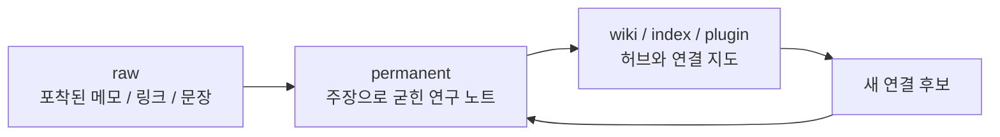
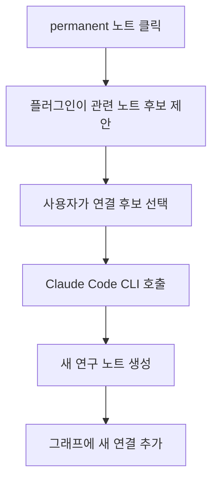

이 영상의 핵심은 `옵시디언 플러그인 사용법` 자체가 아닙니다. 더 중요한 포인트는, 메모를 많이 모으는 습관과 실제 글쓰기·사고 생산성 사이의 간극을 **제텔카스텐 구조 + Claude Code 자동화** 로 메우려 한다는 점입니다. 즉 메모를 쌓는 시스템이 아니라, 메모들이 서로 연결되고 새 연구 노트로 승격되며 다시 연결 후보를 제안하는 시스템을 만드는 것이 목표입니다. [YouTube](https://www.youtube.com/watch?v=Fo7uIEklY_I)
<!--more-->

영상은 이를 “메모를 모으는 사람이 아니라 메모들이 서로 말을 걸게 하는 사람”이 되는 과정이라고 설명합니다. 핵심 도구는 옵시디언 하나, Claude Code 스킬 몇 개, 그리고 직접 만든 플러그인 하나입니다. 이 조합이 흥미로운 이유는, 단순 PKM 도구 사용법을 넘어서 **AI가 로컬 마크다운 볼트를 직접 읽고 쓰며 제텔카스텐의 일부 노동을 대신하게 만든다** 는 데 있습니다. [YouTube](https://www.youtube.com/watch?v=Fo7uIEklY_I)

## Sources

- https://www.youtube.com/watch?v=Fo7uIEklY_I

## 1. 문제 정의가 정확하다: 메모는 많은데 글은 맨땅에서 시작된다

영상 초반은 많은 지식 관리 시스템이 실패하는 이유를 아주 일상적으로 짚습니다.

- 노션에 메모하고
- 옵시디언에 메모하고
- 휴대폰 메모장에도 적지만

정작 글을 쓰려고 앉으면 늘 처음부터 다시 생각하는 느낌이 든다는 것입니다. [YouTube](https://www.youtube.com/watch?v=Fo7uIEklY_I)

이 문제는 메모의 양이 부족해서가 아니라, 메모가 **서로 말을 걸지 못하기 때문** 입니다. 즉 저장은 했지만, 다음 사고를 촉발하는 구조가 없다는 것이죠.

그래서 이 영상의 목표는 “더 잘 저장하는 법”이 아니라, **메모를 연구 노트와 연결 구조로 바꿔 사고의 재료로 재조직하는 법** 에 더 가깝습니다.

## 2. 철학의 중심은 제텔카스텐의 ‘폴더’가 아니라 ‘연결’이다

영상은 니클라스 루만의 제텔카스텐을 소개하면서, 중요한 것은 카드 수가 아니라 카드끼리 말을 걸게 만든 시스템이었다고 설명합니다. [YouTube](https://www.youtube.com/watch?v=Fo7uIEklY_I)

여기서 특히 강조되는 것은:

- 폴더식 분류는 아이디어를 가두기 쉽고
- 루만은 카드마다 주소를 부여하고
- 서로를 가리키게 만들었으며
- 진짜 심장은 임시노트가 아니라 permanent note라는 점

입니다.

즉 이 영상이 만드는 시스템은 “주제별 폴더 정리”보다도, **각 메모를 하나의 주장으로 결정시키고 그 주장들을 주소 기반으로 연결하는 시스템** 에 가깝습니다.

## 3. 구조는 `raw → permanent → wiki` 의 3계층이다

영상에서 제안하는 구조는 세 층으로 나뉩니다.

1. `raw`  
2. `permanent`  
3. `wiki / index / plugin`

`raw` 는 카파시가 말한 raw folder와 비슷한 개념으로, 떠오른 생각이나 기사, 책 문장을 가공 없이 던져 두는 층입니다. 여기서는:

- 편집하지 않고
- 삭제하지 않고
- 원문을 그대로 둡니다

영상은 옵시디언 웹 클리퍼를 이용해 유튜브 링크나 아티클을 한 번에 넣는 흐름도 보여 줍니다. [YouTube](https://www.youtube.com/watch?v=Fo7uIEklY_I)

`permanent` 는 그 raw 조각을 자신의 언어로 굳혀 하나의 주장으로 만든 연구 노트 층입니다.

`wiki` 또는 index 층은, 쌓인 노트를 검색하고 허브를 만들고 연결 후보를 제안하는 **지도 계층** 입니다.

## 4. 왜 옵시디언인가: 로컬 파일, 양방향 링크, AI 친화성

영상은 노션 대신 옵시디언을 택한 이유도 분명히 말합니다.

첫째, 파일이 로컬 마크다운으로 남습니다. 서비스가 망해도, 구독이 끊겨도, 10년 뒤에도 열 수 있다는 안심이 있습니다. [YouTube](https://www.youtube.com/watch?v=Fo7uIEklY_I)

둘째, 양방향 링크와 그래프 뷰가 기본 철학과 맞습니다. 노션이 데이터베이스, 에버노트가 노트북을 강요한다면, 옵시디언은 “카드끼리 연결하라”는 철학에 더 가깝다는 것이죠.

셋째, 가장 중요한 이유로 **Claude Code 같은 터미널형 AI가 로컬 마크다운 볼트를 직접 읽고 쓸 수 있다** 는 점을 듭니다. 즉 이 시스템의 자동화는 클라우드 DB가 아니라, 로컬 파일이기 때문에 가능해집니다.

## 5. 스킬 다섯 개가 사실상 이 시스템의 작업 프로토콜이다

영상 후반부에서 소개되는 다섯 개 스킬은 이 구조의 핵심 프로토콜입니다.

- `fleeting`
- `permanent`
- `query`
- `wiki`
- `lint`

각 역할은 꽤 선명합니다. [YouTube](https://www.youtube.com/watch?v=Fo7uIEklY_I)

`fleeting` 은 순간적으로 포착한 생각, 문장, 링크를 raw 폴더에 던져 넣는 역할입니다.

`permanent` 는 raw 메모를 연구 노트로 승격시키며, 제텔카스텐 번호 체계에 따라 고유한 아이디를 자동 부여합니다.

`query` 는 키워드, 링크, 유사도, 관계 같은 관점으로 메모를 검색합니다.

`wiki` 는 노트가 많이 쌓였을 때 허브 페이지를 만들고 개념 지도로 압축해 줍니다.

`lint` 는 연결이 약하거나 고립된 노트를 찾아 보강을 제안하는 건강검진 역할을 합니다.

즉 이 시스템은 단순 “노트 앱 + AI”가 아니라, **포착 → 승격 → 검색 → 허브화 → 건강 점검** 이라는 작업 루프를 스킬 단위로 캡슐화한 것입니다.

## 6. 가장 인상적인 부분: raw 메모를 permanent note로 자동 승격한다

영상에서 실제로 보여 주는 흐름 중 가장 인상적인 장면은 `fleeting` 으로 넣은 임시 메모를 `permanent` 로 승격시키는 과정입니다. Claude Code는:

- raw 폴더에서 처리되지 않은 메모를 찾고
- 그 메모를 연구 노트로 재구성하고
- 기존 노트와의 연관성을 분석하고
- 고유한 제텔카스텐 ID를 부여하고
- 어디에 배치할지 결정합니다

여기서 중요한 것은 단순 요약이 아니라, **새 메모를 기존 지식 그래프 안의 적절한 위치에 심는다는 점** 입니다. [YouTube](https://www.youtube.com/watch?v=Fo7uIEklY_I)

영상은 이때 Claude Code가 기존 노트를 참조해:

- 왜 특정 노트와 연결되는지
- 어떤 새로운 메타 원칙을 만들 수 있는지
- 어떤 후속 노트를 생각해 볼 수 있는지

까지 제안하는 모습을 보여 줍니다.

## 7. 제텔카스텐 번호 체계를 AI가 다룬다는 점이 중요하다

이 시스템이 흥미로운 또 하나의 이유는, AI가 단순 파일 생성기가 아니라 **제텔카스텐의 주소 체계** 를 이해하고 쓰도록 만든다는 데 있습니다. [YouTube](https://www.youtube.com/watch?v=Fo7uIEklY_I)

영상은 0030A, 0030B 같은 식의 고유한 번호를 붙여 연관성 있는 노트가 근처에 배치되게 만듭니다. 이건 단순 파일명 규칙이 아니라, 나중에 permanent 폴더를 정렬했을 때:

- 이웃한 노트가 사고의 맥락을 이루고
- 가까운 아이디가 가까운 개념 군집을 만들며
- 그래프와 폴더 정렬이 동시에 의미를 갖게 하는

방식입니다.

즉 AI가 노트를 써 준다는 것보다 더 중요한 것은, **노트가 위치할 좌표계까지 함께 만들어 준다는 점** 입니다.

## 8. 커스텀 플러그인이 하는 일: 연결 후보를 보여 주고 새 연구 노트를 생성한다

영상 후반의 커스텀 플러그인은 꽤 중요한 역할을 합니다. permanent 폴더의 노트를 클릭하면 오른쪽 패널에 관련성이 높은 노트 후보가 뜨고, 사용자는 그중 몇 개를 골라 `연구 노트 생성` 버튼을 누를 수 있습니다. 그러면 Claude Code CLI를 호출해 새로운 연구 노트를 생성합니다. [YouTube](https://www.youtube.com/watch?v=Fo7uIEklY_I)

이 흐름의 의미는 큽니다. 보통 링크 추천 시스템은 “관련 노트입니다” 정도에서 멈춥니다. 그런데 여기서는 추천이 끝이 아니라:

- 후보 제안
- 사용자의 선택
- 새로운 연구 노트 생성

으로 이어집니다.

즉 플러그인은 단순 뷰어가 아니라, **연결을 실제 창조 행위로 이어 주는 인터페이스** 역할을 합니다.

## 9. 이 시스템이 좋은 이유: 저장 자동화가 아니라 ‘사고 촉진 자동화’이기 때문이다

많은 노트 자동화는 결국 캡처 자동화에 머뭅니다.

- 링크 저장
- 요약 저장
- 태그 분류

까지는 해 주지만, 정작 중요한 “이 메모로 무엇을 생각할 것인가”는 남겨 둡니다.

반면 이 영상의 시스템은 그 다음 단계에 집중합니다.

- 원문을 캡처하고
- 자기 언어의 주장으로 승격시키고
- 기존 주장과 연결하고
- 연결 자체에서 새 아이디어를 뽑아냅니다

즉 단순 정리가 아니라 **사고를 유도하는 자동화** 라는 점이 이 구조의 가장 큰 차별점입니다.

## 실전 적용 포인트

이 영상을 그대로 따라 하지 않더라도, 바로 가져갈 수 있는 패턴은 꽤 분명합니다.

1. 메모 보관소와 연구 노트를 분리한다  
2. raw 메모는 편집하지 말고 permanent note에서 자기 언어로 다시 쓴다  
3. permanent note에는 주소 체계를 부여해 연관 노트가 근처에 오게 한다  
4. Claude Code는 요약기가 아니라 승격·연결·재배치 엔진으로 쓴다  
5. 플러그인은 보기 좋은 UI가 아니라 연결 결정을 돕는 인터페이스로 설계한다  

특히 1번과 2번만 지켜도, 메모 저장 습관이 글쓰기와 연구로 이어질 가능성이 훨씬 높아집니다.

## 핵심 요약

- 이 영상은 옵시디언에서 제텔카스텐을 Claude Code로 자동화하는 구조를 보여 준다.
- 핵심 구조는 `raw → permanent → wiki` 의 3계층이다.
- 다섯 개 스킬이 포착, 승격, 검색, 허브화, 건강 점검의 작업 루프를 맡는다.
- Claude Code는 임시 메모를 연구 노트로 승격하고 제텔카스텐 ID를 부여하며 기존 노트와 연결한다.
- 커스텀 플러그인은 연결 후보를 제안하고 새 연구 노트를 생성하는 인터페이스로 작동한다.
- 이 시스템의 진짜 목적은 저장 자동화가 아니라 사고 촉진 자동화다.

## 결론

이 영상이 흥미로운 이유는 옵시디언 팁 몇 가지를 알려 주기 때문이 아닙니다. 더 중요한 것은, 메모를 많이 쌓는 습관을 **연구 노트와 연결 구조를 낳는 시스템** 으로 바꾸려 한다는 점입니다.

결국 제텔카스텐의 본질은 많이 적는 데 있지 않습니다. 하나의 메모가 다른 메모를 부르고, 그 연결이 새 주장을 낳고, 그 주장이 다시 글이 되는 흐름에 있습니다. 이 영상은 Claude Code를 그 흐름의 자동화 파트너로 붙였다는 점에서 꽤 인상적입니다.
