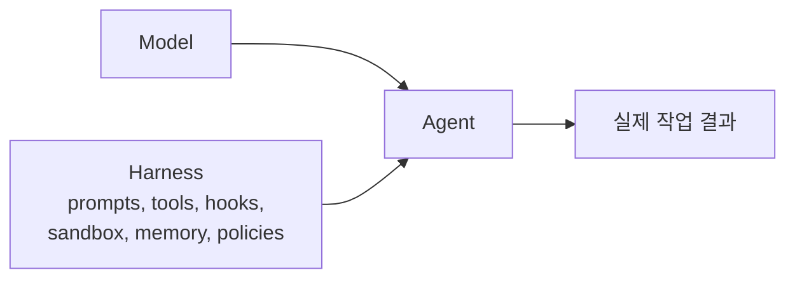
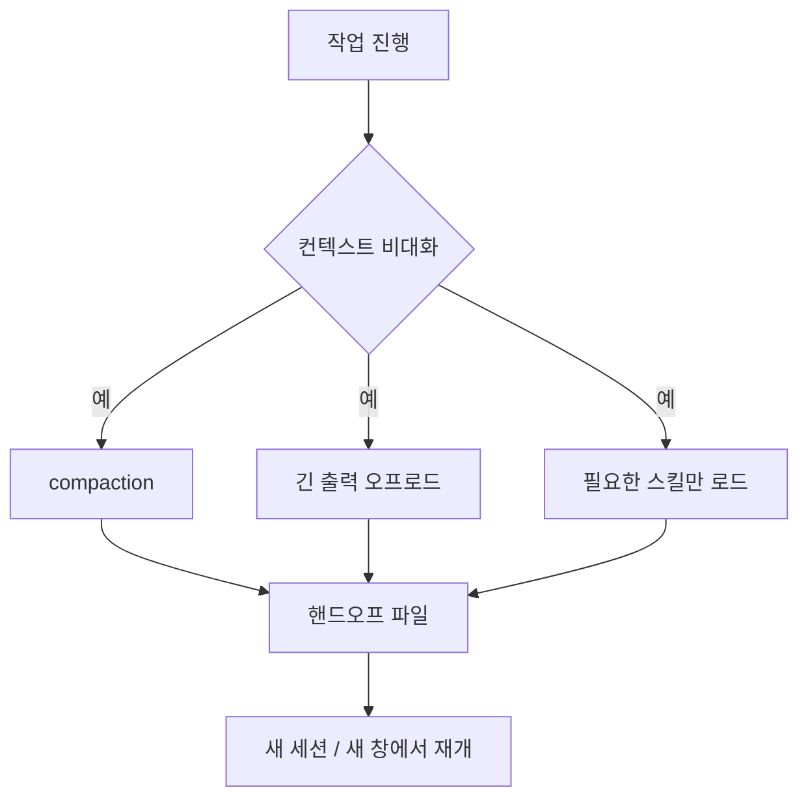

Addy Osmani의 글 「Agent Harness Engineering」은 요즘 코딩 에이전트를 볼 때 시선을 어디에 둬야 하는지를 아주 선명하게 정리한다. 핵심은 간단하다. **에이전트의 성능은 모델만으로 설명되지 않는다. 모델 주위에 어떤 하네스를 설계했는지가 실제 결과를 더 크게 바꾼다.**

즉, “어떤 모델이 더 똑똑한가?”라는 질문만으로는 부족하다.  
실전에서는 프롬프트, 파일 구조, 도구 설명, 훅, 샌드박스, 메모리, 검증 루프, 서브에이전트 분리 같은 **주변 설계물 전체**가 에이전트의 품질을 결정한다.

<!--more-->

## Sources

- Addy Osmani, `Agent Harness Engineering`: <https://addyosmani.com/blog/agent-harness-engineering/>

## 1. Agent = Model + Harness

원문에서 가장 중요한 문장은 이것이다.

> Agent = Model + Harness

여기서 하네스는 모델 자체를 제외한 거의 모든 것을 뜻한다.

- system prompt
- `CLAUDE.md`, `AGENTS.md`, skill 파일
- 도구와 MCP 서버 설명
- 파일시스템과 샌드박스
- 서브에이전트 분기와 모델 라우팅
- compaction, continuation, lint/typecheck 훅
- 로그, 트레이스, 비용/지연 관측

즉, 모델은 두뇌에 가깝고, 하네스는 **일하는 방식 전체**에 가깝다.

그래서 같은 모델을 써도 결과가 크게 다른 이유는 자주 모델 자체보다 하네스에 있다.

## 2. “모델이 멍청하다”보다 “구성이 약하다”가 더 정확한 경우가 많다

Addy의 글은 에이전트 실패를 바라보는 태도를 바꾼다.  
에이전트가 이상한 결정을 하면, 우리는 보통 이렇게 반응한다.

- 모델이 아직 부족하다
- 다음 버전을 기다려야 한다
- 이번 런이 운이 없었다

하지만 하네스 엔지니어링 관점은 다르다.

- 규칙을 몰랐다면 `AGENTS.md`에 추가한다
- 위험한 명령을 쳤다면 훅으로 막는다
- 긴 작업에서 길을 잃는다면 planner / executor로 쪼갠다
- 깨진 코드를 완료 처리한다면 typecheck/test를 강제한다

즉 실패를 “성능 한계”보다 **구성 문제**로 읽는 것이다.

이 관점이 중요한 이유는, 그래야 개선이 누적되기 때문이다.

## 3. 좋은 하네스는 실수를 규칙으로 바꾸는 래칫이다

원문에서 특히 강한 개념은 `ratchet` 이다.  
에이전트의 실수를 한 번 웃고 넘어가는 대신, 다음부터는 구조적으로 반복되지 않게 만드는 것이다.

예를 들어,

- 테스트를 주석 처리한 채 PR을 올렸다
- 위험한 bash 명령을 실행했다
- 40단계 작업에서 중간에 목표를 잃었다
- 포맷은 맞지만 타입 오류가 남은 코드를 완료 처리했다

이런 일이 한 번 생기면 다음엔:

- `AGENTS.md`에 규칙을 적고
- pre-commit / post-edit 훅을 추가하고
- reviewer subagent를 넣고
- 테스트와 타입체크 결과를 다시 루프에 주입한다

이렇게 되면 좋은 하네스는 결국 **실패 이력으로 다듬어진 운영체계**가 된다.

## 4. 하네스의 핵심 부품은 결국 파일시스템, 실행, 검증이다

Addy는 하네스를 추상론으로만 말하지 않는다. 아주 구체적으로 부품을 나눈다.

### 4-1. 파일시스템과 Git

파일시스템은 컨텍스트 창 밖에 상태를 저장하는 가장 기본적인 장치다.

- 계획 파일을 남길 수 있고
- 중간 산출물을 디스크로 오프로드할 수 있고
- 사람과 에이전트가 같은 파일을 공유할 수 있고
- Git으로 롤백과 비교가 가능하다

그래서 장기 작업에서 파일시스템은 단순 저장소가 아니라 **외부 작업 기억장치**처럼 작동한다.

### 4-2. Bash와 코드 실행

하네스가 모든 액션을 전용 도구로 미리 만들어 둘 수는 없다.  
그래서 오늘날 많은 에이전트는 bash를 범용 도구로 사용한다.

이건 중요하다.  
에이전트는 이미 준비된 버튼만 누르는 존재가 아니라, 필요하면 **그 자리에서 필요한 도구를 조합하는 존재**가 되기 때문이다.

### 4-3. 샌드박스

bash가 강력할수록 안전한 실행 공간이 필요하다.

- 로컬 환경 오염 방지
- 병렬 에이전트 분리
- allow-list / network policy 적용
- 테스트, 브라우저, 로그, 스크린샷 기반 자기 검증

결국 “어디서 실행하는가”도 모델이 아니라 하네스가 결정한다.

## 5. 메모리와 검색도 하네스 문제다

모델은 자기 가중치를 세션 중에 바꾸지 못한다.  
그러니 새 지식이나 팀 규칙을 반영하는 가장 현실적인 방식은 **컨텍스트 주입**이다.

여기서 `AGENTS.md` 같은 파일이 중요해진다.

- 세션마다 자동 주입되고
- 에이전트가 수정 가능하며
- 다음 세션으로 이어지고
- 팀의 규칙과 실패 이력을 보존한다

또한 최신 문서, 오늘의 데이터, 새 라이브러리 버전처럼 학습 이후에 생긴 정보는 웹 검색과 MCP가 메워 준다.

즉 메모리도, 최신성도, 규칙 주입도 전부 하네스 레벨 설계다.

## 6. 긴 컨텍스트보다 더 중요한 건 context rot 대응이다

Addy가 정리한 부분 중 특히 실전적인 지점은 `context rot` 다.  
컨텍스트 창이 커질수록 무조건 좋아지는 게 아니라, 오히려 작업이 늘어질수록 추론 품질과 목표 일관성이 깨진다는 것이다.

하네스는 이 문제를 여러 방식으로 다룬다.

- `compaction`: 오래된 맥락을 요약해 축약
- `tool-call offloading`: 긴 로그는 파일로 빼고 앞/뒤만 컨텍스트에 남김
- `skills with progressive disclosure`: 필요한 스킬만 늦게 로드
- `full context reset`: 아예 새 세션을 열고 hand-off 파일로 재시작

이건 사람이 긴 프로젝트에서 새 팀원에게 브리프를 넘기는 방식과 비슷하다.

즉, 메모리를 많이 쌓는 것보다 **다음 창에 무엇을 넘길지 설계하는 능력**이 더 중요하다.

## 7. 장기 작업은 planner / generator / evaluator 분리가 핵심이다

원문은 긴 작업에서 모델이 자주 보이는 세 가지 약점을 지적한다.

- 너무 일찍 끝내려 든다
- 복잡한 문제를 잘게 나누지 못한다
- 컨텍스트가 길어지면 일관성이 무너진다

이때 하네스는 구조를 더한다.

- `planning`: 먼저 plan file로 단계 분해
- `verification`: 각 단계 뒤 테스트와 기준 검증
- `planner / generator / evaluator split`: 생성과 평가를 분리

특히 생성한 에이전트가 자기 결과를 직접 평가하면 대체로 후하게 점수를 준다.  
그래서 작성자와 검토자를 분리하는 편이 더 낫다.

이건 우리가 최근 자주 보는 `PO + coder + reviewer`, `CEO + eng-review`, `planner + executor` 같은 구조와도 정확히 연결된다.

## 8. 훅은 “지시”를 “강제”로 바꾸는 층이다

하네스의 진짜 힘은 훅에서 드러난다.  
프롬프트에 “테스트를 꼭 돌려라”라고 적는 것과, 파일 수정 뒤 자동으로 테스트를 실행하고 실패 로그를 다시 모델에 주입하는 것은 전혀 다르다.

훅이 하는 일은 보통 이렇다.

- edit 후 typecheck / lint / test 실행
- `rm -rf`, `git push --force`, `DROP TABLE` 차단
- PR 생성이나 main push 전 승인 요구
- 저장 시 자동 포맷

원문의 표현을 빌리면, **성공은 조용하고 실패는 시끄러워야 한다.**  
성공했을 때는 아무 말 없이 넘어가고, 실패했을 때만 구체적 오류를 루프에 되돌려 주는 방식이 가장 효율적이다.

## 9. AGENTS.md는 짧을수록 강하다

Addy는 `AGENTS.md` 같은 루트 규칙 파일을 아주 높게 평가하면서도, 동시에 짧아야 한다고 말한다.

이유는 간단하다.

- 매 턴 시스템 프롬프트에 가까운 위치로 들어가고
- 줄 수가 많아질수록 각 규칙의 가중치가 떨어지며
- 실제 실패와 연결되지 않은 규칙은 소음이 되기 때문이다

그래서 좋은 `AGENTS.md`는 스타일 가이드가 아니라 **조종사 체크리스트**에 가깝다.

- package manager
- formatter
- test runner
- 건드리면 안 되는 경로
- 반드시 써야 하는 로거

처럼 정말 중요한 것만 짧게 남기는 편이 낫다.

## 10. 결론

이 글의 핵심은 결국 하나다.

**좋은 에이전트는 좋은 모델에서만 나오지 않는다. 좋은 하네스에서 나온다.**

그래서 앞으로 에이전트를 더 잘 쓰고 싶다면 질문도 바뀌어야 한다.

- 어떤 모델이 제일 똑똑한가?

보다,

- 어떤 실패를 규칙으로 바꿨는가?
- 어떤 훅이 자동 검증을 강제하는가?
- 어떤 파일이 장기 기억을 유지하는가?
- 어떤 방식으로 context rot를 줄이는가?
- 생성자와 평가자를 어떻게 분리했는가?

를 먼저 물어야 한다.

모델 경쟁이 왼쪽 항에 있다면, 실제 레버리지는 점점 더 오른쪽 항, 즉 **하네스 엔지니어링** 쪽으로 이동하고 있다.
