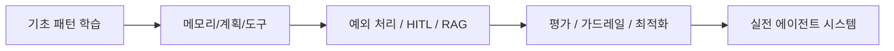

`evoiz/Agentic-Design-Patterns`는 또 하나의 에이전트 프레임워크가 아니다. 오히려 그 반대에 가깝다. 이 저장소의 가치는 특정 프레임워크를 밀기보다, **에이전트 시스템을 이루는 반복 가능한 설계 패턴을 카탈로그처럼 정리하고 실습까지 붙여 놓았다는 점**에 있다.

그래서 이 저장소는 “무엇을 설치할까?”보다 “**어떤 문제를 어떤 패턴으로 풀까?**”를 먼저 생각하게 만든다.

<!--more-->

## Sources

- GitHub: <https://github.com/evoiz/Agentic-Design-Patterns>
- README: <https://raw.githubusercontent.com/evoiz/Agentic-Design-Patterns/main/README.md>

## 1. 이 저장소는 프레임워크 소개가 아니라 패턴 지도다

README를 보면 구조가 명확하다.

- 전체 책 PDF
- 21개 장
- 7개 appendix
- 각 장에 대응하는 Jupyter notebook

즉 이 저장소는 도구 사용법을 빠르게 알려 주는 튜토리얼보다, **에이전트 시스템을 구성하는 패턴을 체계적으로 나누어 보여 주는 교재형 저장소**다.

핵심 주제도 패턴 중심이다.

- Prompt chaining
- Routing
- Parallelization
- Reflection
- Tool use
- Planning
- Multi-agent
- Memory
- Learning and adaptation
- MCP
- Goal setting
- Exception handling
- Human-in-the-loop
- RAG
- A2A
- Resource-aware optimization
- Reasoning
- Guardrails
- Evaluation
- Prioritization
- Exploration

이렇게 보면 이 저장소는 “에이전트”를 기능 하나가 아니라 **설계 조각들의 조합**으로 보게 만든다.

```mermaid
flowchart TD
    A[Agentic Design Patterns] --> B[Core Patterns]
    A --> C[Advanced Patterns]
    A --> D[Production Patterns]
    A --> E[Enterprise Patterns]

    B --> B1[Prompt Chaining]
    B --> B2[Routing]
    B --> B3[Parallelization]
    B --> B4[Reflection]
    B --> B5[Tool Use]
    B --> B6[Planning]
    B --> B7[Multi-Agent]

    C --> C1[Memory]
    C --> C2[Adaptation]
    C --> C3[MCP]
    C --> C4[Goal Monitoring]

    D --> D1[Exception Handling]
    D --> D2[Human-in-the-Loop]
    D --> D3[RAG]

    E --> E1[A2A]
    E --> E2[Resource Optimization]
    E --> E3[Reasoning]
    E --> E4[Guardrails]
    E --> E5[Evaluation]
    E --> E6[Prioritization]
    E --> E7[Exploration]
```

## 2. 좋은 점은 “패턴의 난이도 계단”이 보인다는 것이다

많은 에이전트 자료는 처음부터 멀티 에이전트, 자율 루프, 장기 메모리 같은 복잡한 주제로 뛰어든다.  
반면 이 저장소는 비교적 자연스러운 난이도 계단을 만든다.

### 2-1. Core Patterns

처음에는 가장 기본적인 조합들부터 시작한다.

- 순차 분해
- 분기 선택
- 병렬 실행
- 자기 반성
- 외부 도구 사용
- 계획 수립
- 다중 에이전트 협업

이건 사실 오늘날 거의 모든 agent framework의 공통 문법이다.

### 2-2. Advanced / Production

그다음에는 기억, 적응, MCP, 목표 추적, 예외 처리, human-in-the-loop, RAG 같은 주제로 올라간다.

즉 “데모가 된다”에서 끝나지 않고, **실제 환경에서 계속 돌릴 수 있나**라는 질문으로 넘어간다.

### 2-3. Enterprise

마지막엔 A2A, 자원 최적화, guardrails, 평가, 우선순위화, 탐색 같은 운영과 확장 주제가 나온다.

이 구간에 오면 에이전트는 더 이상 장난감이 아니라 **조직 시스템**에 가까워진다.

## 3. 노트북 기반이라는 점이 의외로 중요하다

이 저장소는 Jupyter notebook 중심이다.  
이건 단순한 학습 편의성 이상을 뜻한다.

- 챕터별 실험이 분리되어 있고
- 패턴별 최소 예제가 있으며
- 코드를 바로 변형해 볼 수 있고
- 결과를 단계적으로 관찰할 수 있다

즉 “읽고 끝나는 책”이 아니라, **패턴을 실행해 보면서 몸에 익히는 워크북**에 가깝다.

프레임워크 README는 종종 사용법만 알려 주지만, 노트북은 “이 패턴이 왜 이렇게 동작하는가”를 더 잘 드러낸다.

## 4. 요즘 흐름과 특히 잘 맞는 챕터들

이 저장소 전체가 유용하지만, 지금 시점에서 특히 눈에 띄는 챕터들이 있다.

### 4-1. MCP

Model Context Protocol 챕터가 독립적으로 들어가 있다는 점이 중요하다.  
이제 에이전트 설계에서 MCP는 부록이 아니라 **표준 연결 계층**에 가깝기 때문이다.

### 4-2. Guardrails / Evaluation / Monitoring

요즘 실전 에이전트 작업에서 가장 부족한 부분은 종종 “더 똑똑한 모델”보다 **어떻게 통제하고 평가할 것인가**다.  
이 저장소가 그 부분을 별도 패턴으로 다루는 건 장점이다.

### 4-3. Resource-aware optimization

토큰, 지연, 호출 비용, 컨텍스트 낭비가 커지는 시점에는 알고리즘보다 운영 설계가 중요해진다.  
이 챕터는 그 현실을 잘 반영한다.

### 4-4. Appendix G: Coding agents

코딩 에이전트가 appendix에 따로 정리된 점도 흥미롭다.  
이건 코딩 에이전트를 모든 에이전트의 중심으로 보지 않고, **여러 패턴이 응용되는 하나의 분야**로 본다는 뜻이기도 하다.

## 5. 이 저장소를 어떻게 읽으면 좋은가

이 프로젝트를 처음부터 끝까지 정독하는 것도 가능하지만, 실전에서는 병목 중심으로 보는 편이 더 효율적이다.

### 5-1. 에이전트가 중간에 자주 길을 잃는다면

- Planning
- Goal setting and monitoring
- Prioritization

### 5-2. 에이전트가 비용을 너무 많이 쓴다면

- Parallelization
- Resource-aware optimization
- Evaluation and monitoring

### 5-3. 에이전트가 위험하거나 불안정하다면

- Exception handling
- Human-in-the-loop
- Guardrails

### 5-4. 에이전트가 외부 세계와 잘 연결되지 않는다면

- Tool use
- MCP
- RAG
- A2A

즉 이 저장소는 통독형 교재이면서 동시에 **문제별 패턴 사전**으로도 쓸 수 있다.

## 6. 라이선스와 성격은 조금 조심해서 봐야 한다

README 기준 이 저장소는 교육 목적 성격이 강하다.

- 책 내용: 저작권 보호
- 코드 예제: MIT
- 저장소 배지: Educational

즉 완전한 자유 재배포 문서 모음처럼 보기보다, **책 + 실습 노트북을 위한 학습용 저장소**로 이해하는 편이 정확하다.

## 7. 결론

`Agentic-Design-Patterns`가 흥미로운 이유는 새로운 프레임워크를 제안해서가 아니다.  
오히려 에이전트 시스템을 지나치게 도구 이름 중심으로 보지 말고, **패턴과 설계 문제의 조합**으로 보게 만든다는 데 있다.

그래서 이 저장소는 다음 질문에 더 가깝다.

- 우리는 순차 분해를 잘하고 있는가?
- 언제 분기하고 언제 병렬화해야 하는가?
- 메모리와 목표 추적은 어떻게 설계하는가?
- 예외 처리와 인간 개입은 어디에 넣는가?
- 평가와 가드레일은 어떻게 운영하는가?

이 질문들이 중요해질수록, 좋은 에이전트 빌드는 프레임워크 선택보다 **패턴 선택과 조합**의 문제가 된다.  
그 점에서 이 저장소는 도구 모음보다 **에이전트 설계의 교과서형 지도**에 더 가깝다.
