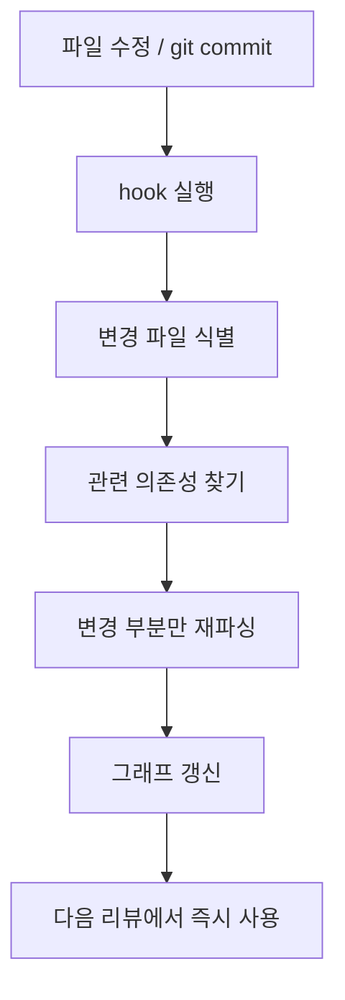

`tirth8205/code-review-graph`는 이름 그대로 코드 리뷰용 그래프이지만, 실제로는 더 큰 문제를 겨냥한다. **AI 코딩 도구가 매번 저장소 전체를 다시 읽으며 토큰을 태우는 구조**를, 변경 반경 중심의 로컬 지식 그래프로 바꾸려는 프로젝트다.

그래서 이 저장소는 단순 시각화 툴보다, **리뷰 시점의 컨텍스트 압축기**로 보는 편이 더 정확하다.

<!--more-->

## Sources

- GitHub: <https://github.com/tirth8205/code-review-graph>
- README: <https://raw.githubusercontent.com/tirth8205/code-review-graph/main/README.md>

## 1. 이 프로젝트가 푸는 문제는 “AI가 너무 많이 읽는다”는 것이다

README의 문제 정의는 명확하다.  
AI 코딩 도구는 작업할 때마다 전체 코드베이스를 다시 읽는 경향이 있고, 이건 토큰과 시간 낭비를 만든다.

`code-review-graph`는 이 흐름을 이렇게 바꾼다.

1. Tree-sitter로 저장소를 파싱한다
2. 함수, 클래스, import, call 관계를 그래프로 저장한다
3. 변경이 생기면 blast radius를 계산한다
4. 리뷰 시점에 **정말 관련 있는 파일만** 읽게 한다

즉 “더 좋은 리뷰 프롬프트”보다 먼저, **리뷰 입력을 줄이는 구조**를 만든다.

## 2. Graphify류와 닮았지만, 초점은 훨씬 더 “리뷰”에 가깝다

이 저장소는 우리가 이미 여러 번 다뤘던 그래프 기반 컨텍스트 도구들과 닮아 있다.  
하지만 차이도 뚜렷하다.

- Graphify 계열은 `코드베이스를 먼저 이해시키는 always-on knowledge layer`에 가깝고
- `code-review-graph`는 `변경점 리뷰와 영향 범위 계산`에 더 직접적으로 맞춰져 있다

특히 README가 강조하는 포인트는:

- blast-radius analysis
- risk-scored reviews
- detect_changes
- test coverage gaps
- review workflows

같은 **리뷰 전용 시그널**이다.

즉 이 프로젝트는 “AI에게 구조를 알려 준다”를 넘어, **리뷰어가 지금 무엇을 읽어야 하는지까지 좁혀 주는 하네스**다.

## 3. 핵심 설계는 blast radius다

이 저장소의 중심 개념은 blast radius다.  
파일 하나가 바뀌면, 단순히 그 파일만 보면 되는 경우는 드물다.

- 누가 그 함수를 호출하는가
- 어떤 클래스가 상속에 묶여 있는가
- 어떤 테스트가 영향을 받는가
- 어떤 흐름(entry point → call chain)이 흔들리는가

를 함께 봐야 한다.

`code-review-graph`는 바로 이 영향을 그래프로 추적해서, **리뷰 범위를 ‘변경 파일’에서 ‘변경 영향 반경’으로 확장**한다.

이게 중요한 이유는, 리뷰 품질을 올리려면 전체 저장소를 읽는 것보다 **관련된 곳을 빠짐없이 읽는 것**이 더 중요하기 때문이다.

## 4. 증분 업데이트가 있어야 그래프가 실전 도구가 된다

그래프 기반 툴이 자주 실패하는 이유는 첫 인덱싱이 아니라 **업데이트 비용** 때문이다.  
한 번 만들고 나서 금방 낡아 버리면, 결국 다시 전체 스캔으로 돌아간다.

이 저장소는 그 점을 꽤 강하게 의식한다.

- 파일 저장
- git commit
- hook
- SHA-256 기반 변경 판별
- changed files only 재파싱

구조로, 변경된 부분만 빠르게 다시 인덱싱하는 방식을 택한다.

README 기준으로는 2,900 파일 프로젝트도 증분 업데이트가 2초 이내라고 설명한다.

즉 이 프로젝트의 경쟁력은 “그래프를 만든다”보다 **그래프를 계속 신선하게 유지한다**는 쪽에 있다.

## 5. 벤치마크 숫자는 “언제 유리한가”를 같이 읽어야 한다

README에는 몇 가지 흥미로운 수치가 나온다.

- 자동 평가 기준 평균 `8.2x` 토큰 감소
- monorepo 사례에선 `49x` 수준의 축소
- 설명 문구에는 리뷰 기준 `6.8x fewer tokens` 라는 표현도 있음
- impact recall `1.0`
- 평균 F1 `0.54`

여기서 중요한 건 숫자 하나를 외우는 게 아니다.

### 5-1. 큰 프로젝트일수록 유리하다

Next.js monorepo 예시처럼 파일 수가 많을수록, 그래프가 관련 없는 파일을 쳐내는 효과가 커진다.

### 5-2. 작은 단일 파일 수정엔 손해일 수도 있다

README도 인정하듯, 작은 패키지의 단순 수정에서는 그래프 메타데이터가 오히려 원문 파일보다 클 수 있다.

### 5-3. recall 우선 전략이다

영향 파일을 놓치지 않는 대신, 다소 넓게 잡는 보수적 전략을 택한다.  
리뷰에서는 이 편이 낫다. 중요한 의존성을 놓치는 것보다 약간 더 많이 읽는 편이 안전하기 때문이다.

즉 이 저장소는 “항상 가장 적은 토큰”보다 **안전하게 덜 읽는 방식**을 선택한다.

## 6. MCP와 다중 도구 지원이 실전성을 높인다

Quick Start를 보면 `install` 명령 하나가 여러 플랫폼을 자동 감지하고 MCP 구성을 써 준다.

- Codex
- Claude Code
- Cursor
- Windsurf
- Zed
- Continue
- OpenCode
- Qwen
- Kiro

등을 폭넓게 다루는 구조다.

이건 중요하다.  
좋은 코드 그래프도 특정 에디터 전용이면 adoption이 어렵다.  
반면 이 프로젝트는 그래프 자체를 로컬에 두고, **MCP를 통해 여러 에이전트 프런트엔드에 공급하는 공용 백엔드**처럼 동작한다.

## 7. 단순 그래프 뷰어를 넘어 분석 기능이 많다

README의 기능표를 보면 이 프로젝트는 생각보다 훨씬 넓다.

- semantic search
- hub / bridge detection
- surprise scoring
- knowledge gap analysis
- graph traversal
- graph diff
- wiki generation
- multi-repo registry
- daemon
- Obsidian / GraphML / Cypher export

이걸 보면 `code-review-graph`는 사실 코드 리뷰 도구에서 출발했지만, 점점 **로컬 코드 지식 인프라**로 확장되는 느낌이 강하다.

다만 글의 중심은 여전히 리뷰에 두는 편이 맞다.  
기능이 많아질수록 오히려 핵심 가치가 흐려질 수 있는데, 이 저장소의 핵심은 아직도 **무엇을 읽지 않을지 결정해 주는 것**에 있다.

## 8. 실전 적용 포인트

이 프로젝트는 특히 이런 환경에서 잘 맞는다.

### 8-1. PR 리뷰가 자주 비싸지는 팀

변경 하나 볼 때마다 관련 파일을 수동으로 추적하는 비용이 큰 팀에 적합하다.

### 8-2. 모노레포

저장소가 큰데 실제 영향 범위는 좁은 경우, 효과가 가장 크다.

### 8-3. 여러 에이전트 툴을 병행하는 환경

MCP 기반이라 Claude Code, Codex, Cursor 등을 섞어 쓰는 팀에도 어울린다.

### 8-4. 구조 이해와 리뷰를 같이 하고 싶은 경우

리뷰뿐 아니라 아키텍처 맵, wiki, diff, export도 활용할 수 있다.

## 9. 결론

`code-review-graph`가 흥미로운 이유는 “코드베이스 그래프를 만든다”는 데 있지 않다.  
진짜 의미는 **리뷰 시점에 AI가 전체 코드를 다시 읽지 않게 만들고, 대신 변경의 영향 반경만 읽게 만든다**는 데 있다.

그래서 이 저장소는 단순한 최적화 툴이 아니라, 리뷰 워크플로를 바꾸는 하네스에 가깝다.

- 전체 읽기 → 영향 반경 읽기
- 매번 재스캔 → 증분 갱신
- 막연한 리뷰 → risk-scored review

이 세 가지 전환이 필요한 팀이라면, 이 프로젝트는 꽤 실용적인 레이어가 될 수 있다.
