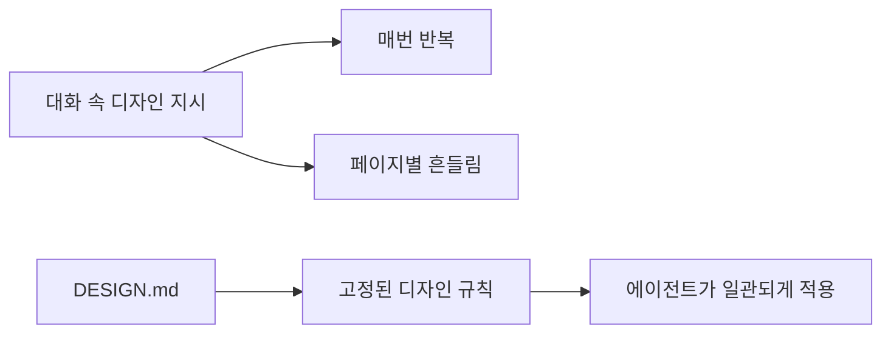
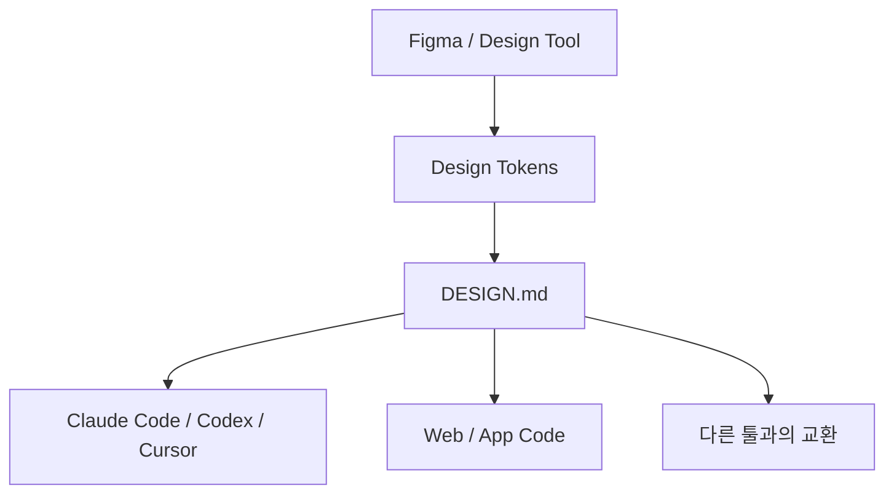

이 영상이 말하는 `design.md`의 핵심은 단순하다.  
**AI에게 같은 디자인 지시를 매번 다시 말하지 말고, 파일 하나로 고정하자**는 것이다.

색상, 폰트, 간격, 둥글기 같은 규칙을 프롬프트에 계속 적는 대신 `DESIGN.md`라는 파일에 넣어 두면, 코딩 에이전트는 그 파일을 읽고 일관된 UI를 만들어 낸다.  
그래서 이 포맷의 진짜 가치는 “프롬프트를 줄인다”보다 **디자인 시스템을 대화 밖으로 꺼내는 것**에 있다.

<!--more-->

## Sources

- YouTube: <https://www.youtube.com/watch?v=w33YxZ7auZs>
- Google Labs DESIGN.md GitHub: <https://github.com/google-labs-code/design.md>
- DTCG: <https://www.designtokens.org/>

## 1. 문제는 AI가 디자인을 못하는 게 아니라, 규칙이 대화 속에만 있다는 것이다

영상이 짚는 문제는 아주 현실적이다.

- 같은 프로젝트인데 페이지마다 색이 조금씩 다르고
- 폰트 크기와 간격이 흔들리고
- 버튼 둥글기나 그림자 규칙이 일관되지 않는다

이건 AI가 무능해서라기보다, 우리가 매번

- “좀 모던하게”
- “깔끔하게”
- “예쁘게”

같은 애매한 표현으로 지시하기 때문이다.

사람끼리는 이런 표현이 대충 통하지만, 에이전트에게는

- 정확한 색상 코드
- 정확한 spacing scale
- 정확한 typography 규칙

이 필요하다.

즉 문제는 모델보다 **디자인 의사결정이 파일로 고정되어 있지 않다**는 데 있다.

## 2. DESIGN.md는 AI에게 주는 디자인 시방서다

영상의 비유를 빌리면 `DESIGN.md`는 인테리어 시방서에 가깝다.

- 어떤 색을 쓰는지
- 어떤 폰트를 기본으로 하는지
- 간격 시스템은 어떤지
- 어떤 컴포넌트가 어떤 성격인지

를 한 파일에 넣어 두면, 에이전트는 더 이상 매번 묻지 않고 그 규칙대로 작업한다.

Google Labs의 공식 README도 같은 설명을 한다.  
`DESIGN.md`는 coding agents에게 visual identity를 설명하는 포맷이며, **machine-readable tokens + human-readable rationale**을 같이 담는다.

즉 이 파일은 단순 메모가 아니라:

- 기계가 읽을 값
- 사람이 읽을 의도

를 한 문서에 동시에 담는 구조다.

## 3. 포맷의 핵심은 “YAML 토큰 + Markdown 설명” 이중 구조다

공식 README 기준 `DESIGN.md`는 두 층으로 이루어진다.

### 3-1. YAML front matter

여기에는 기계가 읽을 수 있는 토큰이 들어간다.

- colors
- typography
- rounded
- spacing
- components

등이 구조화된 값으로 기록된다.

### 3-2. Markdown body

그 아래에는 사람이 읽는 설명이 들어간다.

- 이 색은 왜 primary인지
- 어떤 톤을 의도하는지
- 어떤 컴포넌트에 어떤 감정을 주고 싶은지
- 무엇을 해야 하고 무엇을 피해야 하는지

이 구조가 중요한 이유는, 디자인 시스템이 숫자만으로는 부족하기 때문이다.  
토큰은 값을 주고, prose는 **적용 맥락**을 준다.

## 4. 왜 게임 체인저처럼 느껴지나: 규칙이 자동으로 읽히기 때문이다

영상이 강조하는 실전 포인트는 이것이다.

예를 들어 `CLAUDE.md`나 다른 agent rules 파일에 `@DESIGN.md` 같은 참조를 한 줄 넣어 두면, 이후부터는 UI 작업마다 디자인 규칙이 자동으로 따라온다.

그러면 프롬프트가

- “회원가입 페이지 만들어 줘”

한 줄이어도,

- 어떤 색을 써야 하는지
- 어떤 heading scale을 써야 하는지
- 버튼과 카드가 어떤 모양이어야 하는지

를 파일에서 끌어올 수 있다.

이건 토큰 절약도 되지만, 더 중요한 건 **어제 만든 화면과 오늘 만든 화면이 같은 언어를 쓰게 된다**는 점이다.

## 5. 이 포맷의 진짜 힘은 표준화에 있다

영상에서 가장 중요한 지점은 오히려 여기다.  
`DESIGN.md`가 단지 구글 내부 포맷이면 반짝 유행으로 끝날 수 있다. 하지만 공식 자료를 보면 이 포맷은 **DTCG(Design Tokens Community Group)** 흐름과 맞닿아 있다.

DTCG는 W3C 커뮤니티 그룹으로, design tokens를 어떻게 정의하고 교환할지 표준화하는 작업을 해 왔다.  
즉 색상, 타이포그래피, spacing 같은 디자인 결정이 특정 툴 전용 포맷이 아니라 **상호 운용 가능한 형식**으로 옮겨 가고 있다는 뜻이다.

이게 중요한 이유는:

- Figma
- 코드베이스
- AI 에이전트
- 토큰 변환 도구

가 결국 같은 설계 언어를 공유할 수 있기 때문이다.

## 6. 공식 spec도 생각보다 실용적이다

Google Labs README를 보면 `DESIGN.md`는 단순한 아이디어 문서가 아니라 꽤 운영 가능한 포맷이다.

- `lint`: 구조 검증, broken token reference, WCAG contrast 점검
- `diff`: 두 버전 비교
- section order 정의
- component token 구조 정의
- unknown content 처리 방식 정의

즉 그냥 “적당히 쓰는 마크다운”이 아니라, **검증 가능한 디자인 규칙 파일**로 가려는 방향이 보인다.

이 지점이 중요하다.  
표준이 되려면 읽기 쉬운 것만으로는 부족하고, 비교/검증/버전 관리가 가능해야 한다.

## 7. 비개발자에게도 중요한 이유

영상이 좋은 점은 `DESIGN.md`를 개발자만의 도구로 보지 않는다는 것이다.

비개발자 입장에서도 의미가 크다.

- 디자이너는 규칙을 한 번 정의하면 되고
- 기획자는 “이 화면 하나만 고쳐 주세요” 식의 반복 설명이 줄고
- 개발자는 디자인 토큰을 다시 캐묻는 시간이 줄고
- AI는 프로젝트 전반에서 같은 UI 언어를 유지한다

즉 이 파일은 단순 기술 스펙보다, **디자이너-개발자-AI가 공통 언어를 갖게 하는 문서**에 가깝다.

## 8. 물론 단점도 있다

영상도 좋은 점만 말하지 않는다. 실제로 몇 가지 한계는 분명하다.

### 8-1. 파일을 잘 써야 한다

애매하게 적으면, 결국 애매한 결과가 나온다.  
프롬프트의 모호함이 파일로 옮겨가는 것뿐일 수 있다.

### 8-2. 중간에 수정해도 세션이 바로 반영하지 않을 수 있다

에이전트는 보통 세션 시작 시 rules file을 읽는 경우가 많아서, 파일을 바꾼 뒤 새 대화를 여는 편이 안전하다.

### 8-3. 이것만으로 디자인 감각이 생기진 않는다

일관성은 높여 주지만, 좋은 디자인을 자동으로 보장해 주는 마법 문서는 아니다.

## 9. 실전 적용 포인트

이 영상과 공식 자료를 합쳐 보면, 적용 순서는 단순하다.

### 9-1. 프로젝트 루트에 `DESIGN.md`를 둔다

README 옆, 즉 프로젝트 루트에서 rules file이 쉽게 참조할 수 있게 둔다.

### 9-2. 최소한의 토큰부터 적는다

처음부터 거대한 시스템을 만들기보다:

- primary / secondary colors
- 기본 typography scale
- spacing scale
- rounded scale

정도만 먼저 적는 편이 현실적이다.

### 9-3. agent rules 파일에서 읽게 만든다

- `CLAUDE.md`
- `AGENTS.md`
- Cursor rules
- Copilot instructions

등에서 DESIGN.md를 참조하게 해야 효과가 난다.

## 10. 결론

`DESIGN.md`의 본질은 AI 디자인 도구 하나가 아니다.  
본질은 **디자인 시스템을 프롬프트에서 꺼내 파일로 고정하고, 그 파일을 사람과 에이전트가 함께 읽게 만드는 것**이다.

그래서 이 포맷이 중요한 이유도 명확하다.

- 반복 설명이 줄어들고
- 결과 일관성이 올라가고
- 토큰 낭비가 줄고
- Figma, 코드, AI가 같은 언어를 공유할 가능성이 생긴다

즉 `DESIGN.md`는 “예쁜 UI를 만드는 팁”이 아니라, **AI 시대의 디자인 시스템 전달 방식**을 바꾸는 시도에 더 가깝다.
