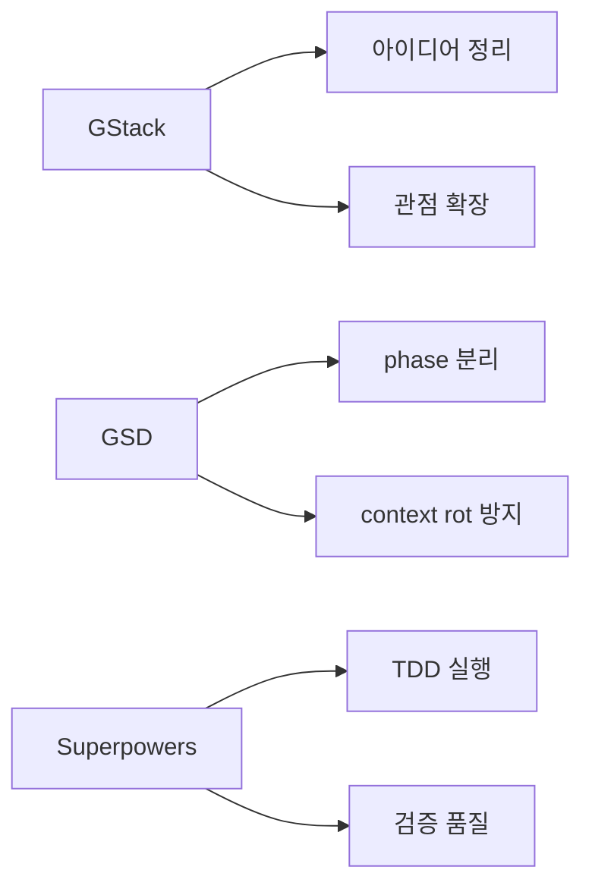
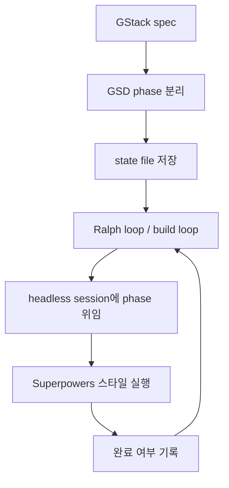

이번 영상의 핵심은 `GStack vs GSD vs Superpowers` 비교가 아니다.  
핵심은 **세 프레임워크를 각각 잘하는 위치에 배치한 뒤, 마지막엔 Ralph loop로 자동화까지 연결하는 것**이다.

즉 이 영상은 “무엇이 최고인가?”보다 **기획은 GStack, 컨텍스트 관리는 GSD, 실행 품질은 Superpowers**라는 식의 역할 분리를 제안한다.

<!--more-->

## Sources

- YouTube: <https://www.youtube.com/watch?v=BlTpG51x94w>

## 1. 영상의 전제: 대부분의 spec workflow는 결국 같은 큰 흐름을 따른다

영상은 먼저 대부분의 spec framework가 크게 같은 흐름을 따른다고 본다.

1. brainstorming
2. planning
3. execution
4. review / verification

즉 이름이 다르고 스킬 이름이 달라도, 본질은 **생각을 정리하고, 계획으로 쪼개고, 구현하고, 검증하는 루프**다.

중요한 차이는 이 큰 틀보다, 각 프레임워크가 어디에서 가장 강한가에 있다.

## 2. 세 프레임워크의 역할을 이렇게 나눈다

영상은 세 프레임워크를 같은 레벨의 경쟁자로 두지 않는다.  
오히려 서로 다른 문제를 푸는 도구로 나눈다.

### 2-1. GStack = 기획과 관점 확장

GStack의 장점은 role-based 사고다.

- CEO
- designer
- engineer manager
- security manager

같은 역할을 통해 아이디어를 다양한 시각에서 검토하고, 제품 의도를 더 선명하게 만드는 데 강하다.

즉 GStack은 코드 생성기보다 **spec clarification 엔진**에 가깝다.

### 2-2. GSD = context rot 방지

GSD는 긴 세션에서 정확도가 무너지는 `context rot` 문제를 다룬다.  
영상은 대략 컨텍스트 창의 절반을 넘기기 시작하면 정확도가 떨어진다고 보고, GSD를 통해 spec을 여러 phase로 나눠 각 세션이 짧게 유지되도록 한다.

즉 GSD는 아이디어 생성보다 **세션 분할과 작업 단위 설계**에 초점이 있다.

### 2-3. Superpowers = TDD 중심 실행 품질

Superpowers의 강점은 test-driven development다.  
영상은 다른 프레임워크에 비해 Superpowers가 `tests first` 관점을 강하게 밀어 준다고 본다.

즉 Superpowers는 기획용보다 **phase별 execution quality control**에 적합하다는 해석이다.

## 3. 영상이 제안하는 실제 조합 순서

영상의 워크플로는 비교적 명확하다.

1. `GStack`으로 intent를 명확히 하고 spec을 만든다
2. `GSD`로 그 spec을 여러 phase로 쪼갠다
3. 각 phase를 `Superpowers` 스타일의 TDD 실행으로 구현한다

이 순서의 핵심은 “좋은 spec을 한 번에 전부 실행하지 않는다”는 점이다.  
오히려

- 기획은 넓게
- 실행은 좁게
- 세션은 짧게
- 검증은 촘촘하게

가 기본 철학이다.

## 4. 왜 굳이 쪼개야 하나: context rot 때문이다

영상이 가장 강하게 밀어 주는 논리는 이것이다.  
spec이 좋아도, 그걸 한 세션에서 통째로 실행시키면 정확도가 떨어진다.

그래서 GSD가 중요한 이유는 단순 task breakdown이 아니라, **에이전트가 매 phase마다 짧고 깨끗한 문맥 안에서 일하게 만드는 것**이다.

이건 우리가 최근 여러 번 다뤘던

- compact
- clear
- handoff file
- context reset

논리와 완전히 맞닿아 있다.

즉 GSD의 가치는 “계획표를 예쁘게 만든다”가 아니라, **정확도 하락을 구조적으로 막는다**는 데 있다.

## 5. greenfield에서는 강력하지만, brownfield에서는 과할 수 있다

영상은 이 조합이 모든 상황에 맞는다고 말하지 않는다.  
오히려 꽤 실용적으로 선을 긋는다.

### 5-1. greenfield

처음부터 만드는 프로젝트, 특히 비교적 큰 프로젝트라면 이 풀 스택 조합이 잘 맞는다.

- GStack으로 넓게 기획
- GSD로 phase 분할
- Superpowers로 TDD 실행

이런 구조가 오히려 안정적이다.

### 5-2. brownfield

기존 코드베이스에 기능을 추가하는 정도라면, 이 전체 조합은 너무 무거울 수 있다.  
영상도 이런 경우엔

- Superpowers만 쓰거나
- GStack + Superpowers 정도만 쓰는 식

으로 더 가볍게 가는 걸 권한다.

이 지점이 중요하다.  
좋은 워크플로는 무조건 많은 단계가 아니라, **상황에 맞는 최소 조합**이어야 한다.

## 6. 이번 영상의 새 포인트는 Ralph loop 기반 자동화다

이 영상이 기존 `GStack/GSD/Superpowers` 비교 영상과 다른 핵심은 여기다.  
사람이 phase를 하나씩 열고 새 세션을 계속 띄우는 건 정확하지만 오래 걸린다. 그래서 발표자는 이를 `Ralph loop` 스타일의 build loop로 자동화하자고 제안한다.

구조는 대략 이렇다.

1. spec을 phase별 prompt로 쪼갠다
2. 그 상태를 하나의 state file에 저장한다
3. build loop가 완료 여부를 읽는다
4. 아직 끝나지 않은 phase를 headless session에 위임한다
5. 끝나면 다음 phase로 넘어간다

즉 사람 손으로 하던

- 새 세션 시작
- 다음 phase 전달
- 상태 기록
- 반복

을 루프 엔진이 대신 수행하는 것이다.

## 7. 이 조합을 어떻게 읽어야 하나

이 영상의 좋은 점은 세 프레임워크를 “stacking”이 아니라 **pipeline specialization**으로 본다는 데 있다.

- GStack은 넓게 생각하게 한다
- GSD는 문맥을 작게 유지한다
- Superpowers는 구현 품질을 강제한다
- Ralph loop는 그 반복을 자동화한다

즉 각각의 강점을 한 파이프라인의 다른 위치에 배치하는 방식이다.

이 관점은 중요하다.  
많은 사람이 프레임워크를 설치형 상품처럼 보지만, 실제로는 이런 것들이 **작업 공정의 부품**에 가깝기 때문이다.

## 8. 결론

이 영상은 “최고의 프레임워크 1개”를 찾는 방향이 아니다.  
오히려 에이전트 개발 워크플로를 이렇게 분해한다.

- 의도를 명확히 하는 엔진
- 세션을 잘게 쪼개는 엔진
- 구현 품질을 높이는 엔진
- 반복을 자동화하는 루프

그리고 그 자리에 각각

- GStack
- GSD
- Superpowers
- Ralph loop

를 배치한다.

그래서 이 영상의 핵심 메시지는 단순하다.

**정확도를 높이려면 한 프레임워크를 맹신하기보다, 기획·문맥·실행·반복을 서로 다른 레이어로 나눠 설계해야 한다.**
