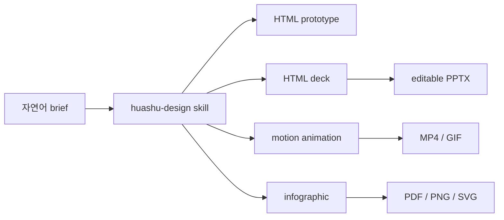
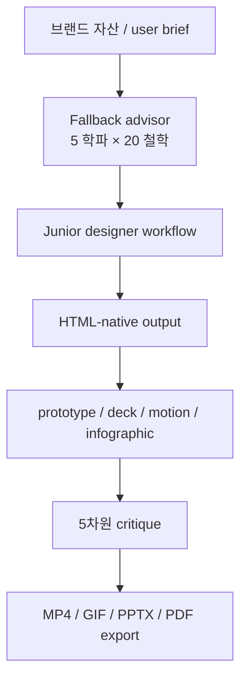

`alchaincyf/huashu-design` 은 처음부터 포지션이 분명합니다. `Claude Code 안에서 돌아가는 HTML-native design skill`, 그리고 한 문장 프롬프트로 **고충실도 프로토타입, 슬라이드, 애니메이션, 인포그래픽까지 납품 가능한 결과물** 을 뽑는다는 주장입니다. 이 저장소가 흥미로운 이유는 “AI도 디자인 좀 한다” 수준이 아니라, **디자인 도구 레이어를 없애고 agent 안에 디자인 워크플로 자체를 집어넣으려 한다** 는 데 있습니다. [GitHub 저장소](https://github.com/alchaincyf/huashu-design)
<!--more-->

README는 이를 거의 선언처럼 말합니다. 버튼도 없고 패널도 없고 Figma 플러그인도 없이, agent에게 한 줄을 말하면 설계된 디자인 자산이 나온다는 것입니다. 물론 현실은 그렇게 단순하지 않지만, 이 프로젝트가 던지는 중요한 질문은 분명합니다. “왜 디자인 작업은 여전히 GUI 안에서만 이뤄져야 하는가? HTML과 skill만으로 충분히 높은 퀄리티에 도달할 수는 없는가?” [README](https://raw.githubusercontent.com/alchaincyf/huashu-design/master/README.md)

## Sources

- https://github.com/alchaincyf/huashu-design
- https://raw.githubusercontent.com/alchaincyf/huashu-design/master/README.md

## 1. 이 프로젝트의 본질은 ‘디자인 툴’보다 ‘디자인 스킬 운영체계’에 가깝다

Huashu Design은 독립 실행 앱이 아닙니다. README도 끝까지 이걸 `skill` 로 정의합니다. 즉 핵심은 새 모델이나 새 GUI가 아니라:

- `SKILL.md`
- `assets/`
- `references/`
- `scripts/`

를 중심으로 구성된 **에이전트용 디자인 운영체계** 입니다. [README](https://raw.githubusercontent.com/alchaincyf/huashu-design/master/README.md)

이 말이 중요한 이유는, 결과물을 만드는 능력이 단순히 모델 IQ에서 나오지 않고:

- 어떤 starter components를 읽는지
- 어떤 디자인 철학 라이브러리를 참조하는지
- 어떤 export 스크립트를 쓰는지
- 어떤 anti-slop 규칙을 따르는지

에서 결정된다는 뜻이기 때문입니다.

즉 Huashu Design은 “더 좋은 프롬프트”보다 **더 좋은 디자인 작업 프로토콜** 에 가깝습니다.

## 2. 왜 HTML-native가 핵심인가

이 저장소는 HTML을 단순 출력 형식이 아니라 중심 매체로 삼습니다. README가 내세우는 거의 모든 산출물도 결국 HTML이 중심입니다.

- 클릭 가능한 앱 프로토타입
- 브라우저 발표용 HTML deck
- HTML 기반 슬라이드에서 editable PPTX 변환
- HTML 애니메이션에서 MP4/GIF 내보내기
- 인포그래픽의 PDF/PNG/SVG 출력

즉 디자인 결과물을 Figma 내부 object로 두기보다, **브라우저가 바로 렌더할 수 있는 구조물** 로 두는 것이 핵심입니다. [README](https://raw.githubusercontent.com/alchaincyf/huashu-design/master/README.md)

이 접근은 에이전트에게 특히 유리합니다. 에이전트는:

- HTML
- CSS Grid
- typography
- DOM 구조

를 이미 잘 다룹니다. 반면 Figma나 After Effects 같은 GUI 기반 도구는 대개 별도 추상화와 연결 레이어가 필요합니다.

그래서 Huashu Design은 “AI에게 그래픽 툴을 가르친다”보다, **AI가 원래 잘하는 웹 표현을 디자인 저작 언어로 승격** 하려는 시도라고 보는 편이 더 정확합니다.

## 3. 기능 목록보다 더 중요한 것은 ‘산출물 범위’가 넓다는 점이다

README 기준 Huashu Design이 다루는 산출물은 꽤 넓습니다.

- App / Web 인터랙티브 프로토타입
- 발표용 슬라이드
- MP4/GIF 애니메이션
- 디자인 변형안
- 인포그래픽 / 데이터 시각화
- 디자인 방향 컨설팅
- 5차원 전문가 리뷰

여기서 중요한 것은 각각이 따로 떨어져 있지 않다는 점입니다. 예를 들어 슬라이드는 HTML deck으로 만들고, 다시 editable PPTX로 바꾸고, 애니메이션은 Stage + Sprite 시간축 모델로 MP4/GIF까지 내보냅니다. [README](https://raw.githubusercontent.com/alchaincyf/huashu-design/master/README.md)

즉 이 저장소는 단일 포맷 생성기가 아니라, **디자인 산출물 패밀리 전체를 agent workflow 안에 묶으려는 프로젝트** 입니다.

## 4. 20가지 디자인 철학과 5차원 리뷰가 이 프로젝트의 차별점이다

많은 디자인용 AI 도구는 “예쁜 결과물”을 강조하지만, Huashu Design은 중간 계층으로:

- 5개 스타일 학파
- 20가지 디자인 철학
- 5차원 전문가 평가

를 전면에 둡니다. [README](https://raw.githubusercontent.com/alchaincyf/huashu-design/master/README.md)

예를 들어 사용자의 요구가 모호하면 그냥 바로 만들지 않고 `fallback advisor` 로 들어가:

- 서로 다른 학파에서 3개 방향을 추천하고
- 각 방향의 대표작, 분위기 키워드, 대표 디자이너를 붙이며
- 병렬로 3개의 visual demo를 생성하게 합니다

이건 디자인에서 매우 중요합니다. 실패 비용의 상당수는 “못 만들었다”가 아니라 **방향을 잘못 잡고 한참 뒤에 되돌아오는 것** 에서 생기기 때문입니다.

또 5차원 리뷰는 결과물을:

- 철학 일관성
- 시각 위계
- 디테일 실행
- 기능성
- 혁신성

같은 축으로 점검하게 합니다. 즉 Huashu Design은 생성기이면서 동시에 **자체 비평 레이어** 도 갖고 있습니다.

## 5. Junior Designer 워크플로가 사실상 핵심 운영 원칙이다

README에서 눈에 띄는 또 하나의 포인트는 `Junior Designer workflow` 입니다. 요약하면:

- 처음부터 큰 결과물을 만들지 않고
- assumptions와 placeholders를 먼저 드러내며
- 가능한 빨리 보여 주고
- 여러 단계에서 다시 확인받는다

는 흐름입니다. [README](https://raw.githubusercontent.com/alchaincyf/huashu-design/master/README.md)

이건 디자인 자동화에서 매우 중요한 철학입니다. 많은 AI 시스템이 초반부터 완성형에 가까운 이미지를 뽑으려 하지만, 실제 작업에서는 **일찍 잘못 이해한 방향을 잡는 것** 이 더 비쌉니다.

그래서 Huashu Design은 일종의 junior designer처럼:

- 먼저 질문하고
- placeholder로 reasoning을 드러내고
- 일찍 show하고
- 변형안과 tweaks를 거쳐 최종화합니다

즉 디자인을 즉흥 생성이 아니라 **단계별 상호작용 프로세스** 로 다룹니다.

## 6. 브랜드 자산 프로토콜은 ‘추측 금지’를 강하게 밀어붙인다

README에서 가장 인상적인 부분 중 하나는 `brand asset protocol` 입니다. 특정 브랜드를 다룰 때는 무조건:

1. 사용자에게 brand guideline 존재 여부를 묻고  
2. 공식 브랜드 페이지를 찾고  
3. SVG, HTML, 제품 스크린샷 등 자산을 확보하고  
4. 실제 색상을 grep으로 추출하고  
5. `brand-spec.md` 와 CSS 변수로 고정한다  

는 5단계를 거칩니다. [README](https://raw.githubusercontent.com/alchaincyf/huashu-design/master/README.md)

핵심은 아주 분명합니다. **브랜드 색을 기억으로 추측하지 않는다** 는 것입니다.

이건 소소한 규칙처럼 보여도, AI 디자인 품질에서 엄청 큰 차이를 만듭니다. 많은 생성 결과가 “그럴듯하지만 뭔가 가짜 같아 보이는” 이유는 바로 브랜드 맥락을 실제 자산에서 읽지 않고, 모델 기억에 의존하기 때문입니다.

## 7. Motion Design 엔진과 HTML→PPTX 변환이 이 저장소를 더 독특하게 만든다

이 저장소가 다른 design skill과 확실히 다른 부분은 산출물이 static mockup에서 끝나지 않는다는 점입니다.

README가 강조하는 두 축은:

- `Stage + Sprite` 기반 motion design
- `html2pptx.js` 기반 editable PPTX export

입니다. [README](https://raw.githubusercontent.com/alchaincyf/huashu-design/master/README.md)

즉 HTML deck은 그냥 발표 미리보기가 아니라, 브라우저 발표 + PowerPoint 편집이라는 두 세계를 연결합니다. 애니메이션도 단순 CSS 데모가 아니라, MP4/GIF/60fps 보간/BGM 삽입까지 포함합니다.

이건 매우 실용적입니다. 실제 업무에서는 “예쁜 화면”보다도:

- 발표 자료로 넘길 수 있는가
- 영상으로 export 가능한가
- 고객이 다시 편집할 수 있는가

가 더 중요하기 때문입니다.

## 8. Claude Design과의 관계를 숨기지 않는 점도 흥미롭다

README는 Claude Design에서 영감을 받았다는 점을 숨기지 않습니다. 특히 브랜드 자산 프로토콜의 철학은 Claude Design prompt에서 많이 배웠다고 공개적으로 말합니다. [README](https://raw.githubusercontent.com/alchaincyf/huashu-design/master/README.md)

하지만 포지션은 분명히 다릅니다.

- Claude Design: 브라우저 제품, GUI 중심
- Huashu Design: skill, 대화 중심, agent 안에 내장

그리고 Huashu Design은:

- HTML
- MP4 / GIF
- editable PPTX
- PDF

같이 훨씬 다양한 출력 계층을 강조합니다.

즉 이 프로젝트는 Claude Design을 복제한다기보다, **그 철학을 에이전트용 스킬 패키지로 재조립** 한 것으로 보는 편이 맞습니다.

## 9. 라이선스는 오픈소스라기보다 ‘개인 무료 / 기업 상용 금지’에 가깝다

GitHub API 상으로는 SPDX 라이선스가 명확히 잡히지 않고 `NOASSERTION` 으로 보입니다. README 안에서는 훨씬 명확하게, 개인 사용은 자유롭지만 기업 상용 사용은 별도 허가가 필요하다고 적고 있습니다. [GitHub API](https://api.github.com/repos/alchaincyf/huashu-design), [README](https://raw.githubusercontent.com/alchaincyf/huashu-design/master/README.md)

즉 이 저장소는 엄밀한 의미의 완전 자유 오픈소스라고 보기보다:

- 개인 학습/연구/창작은 자유
- 기업 내부 도구화, 대외 납품, 상용 제품 통합은 제한

이라는 사용 정책을 가진 프로젝트로 이해하는 게 맞습니다.

## 10. 2026년 5월 1일 기준 저장소 상태도 꽤 강하다

GitHub API 기준 `alchaincyf/huashu-design` 은 현재:

- stars 10,701
- forks 1,536
- 기본 브랜치 `master`
- 주 언어 `HTML`
- 라이선스 표시는 `NOASSERTION`

상태입니다. 저장소 설명도 곧 프로젝트 요약입니다.

- Claude Code 안의 HTML-native design skill
- 고충실도 프로토타입 / 슬라이드 / 애니메이션
- 20 디자인 철학
- 5차원 리뷰
- MP4 export
- agent-agnostic

즉 이미 “디자인 스킬”이라는 별도 카테고리에서 꽤 강한 존재감을 확보한 상태라고 볼 수 있습니다. [GitHub API](https://api.github.com/repos/alchaincyf/huashu-design)

## 실전 적용 포인트

이 저장소를 그대로 도입하지 않더라도, 가져갈 만한 아이디어는 아주 많습니다.

1. 디자인 작업도 skill 패키지로 구조화할 수 있다  
2. 애매한 요구일수록 먼저 방향 후보를 3개 내고 선택받는다  
3. 브랜드 작업은 모델 기억이 아니라 실제 자산 추출에서 시작한다  
4. HTML을 디자인 산출물의 중간 표현이 아니라 중심 표현으로 삼는다  
5. 결과물 생성과 평가를 분리하지 않고, 5차원 critique를 기본 루프에 넣는다  

특히 2번과 3번만 적용해도, AI 디자인 결과의 체감 품질은 꽤 크게 달라질 가능성이 높습니다.

## 핵심 요약

- Huashu Design은 단순 프롬프트 모음이 아니라 HTML 네이티브 디자인 스킬 운영체계에 가깝다.
- 핵심은 모델보다 `SKILL.md + assets + references + scripts` 로 구성된 작업 프로토콜이다.
- 고충실도 프로토타입, 슬라이드, 애니메이션, 인포그래픽, editable PPTX/MP4 export까지 범위가 넓다.
- 20가지 디자인 철학과 5차원 리뷰가 품질 제어 레이어로 작동한다.
- Junior Designer workflow와 브랜드 자산 프로토콜이 anti-slop 핵심 원칙이다.
- Claude Design의 철학을 agent용 skill 패키지로 재조립한 프로젝트라고 볼 수 있다.

## 결론

`huashu-design` 이 흥미로운 이유는 “AI가 예쁜 디자인을 만든다”는 흔한 약속을 넘어서기 때문입니다. 더 중요한 것은, 디자인 작업을 에이전트가 실행 가능한 **구조화된 skill 시스템** 으로 바꾸고, 결과물을 HTML 중심으로 통일하며, 그 위에 브랜드 자산 수집·방향 추천·비평·export까지 한 루프로 묶어 놨다는 점입니다.

그래서 이 저장소는 단순 디자인 템플릿보다, **에이전트 시대의 디자인 운영체계** 에 더 가깝습니다. GUI를 여는 대신 agent에게 말해서 프로토타입, 슬라이드, 애니메이션까지 받아 보고 싶다면, 이 프로젝트는 꽤 중요한 신호로 읽힙니다.
