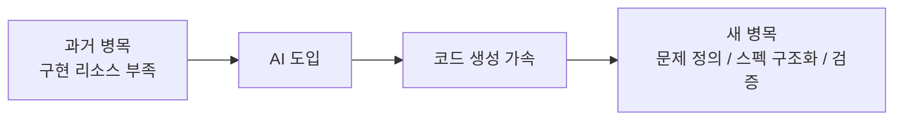
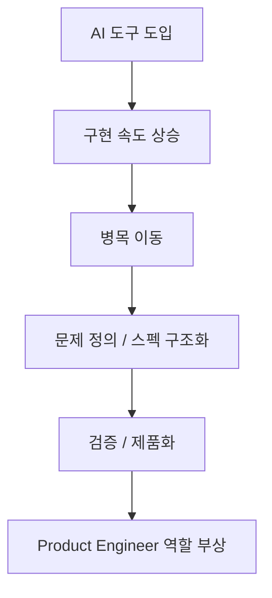

이 Threads의 핵심은 `무신사가 Codex를 쓴다`는 사실 자체가 아닙니다. 더 중요한 포인트는, **Codex 같은 에이전트 도구를 도입한 뒤 개발 조직의 병목과 역할 정의가 어디로 이동했는가** 를 꽤 구체적으로 보여 준다는 점입니다. 정리된 내용에 따르면 무신사 CTO는 이제 코드 작성 그 자체보다 설계, 검토, 문제 정의, 검증, 제품화가 훨씬 더 중요한 단계로 부상하고 있다고 설명합니다. [Threads 원문](https://www.threads.com/@choi.openai/post/DXweMpKj90U?xmt=AQF07GNi9a8RI91otmDevbbn90ehDIxnAd5zxvBjuRXi8IKFAQSxhhiSyDXUZOpoiMXydvd4&slof=1)
<!--more-->

물론 이 글은 공식 발표문이 아니라 행사 참석자가 정리한 Threads 요약입니다. 그래서 여기서는 “무신사가 실제로 이렇게 말했다고 정리된 바에 따르면”이라는 전제를 깔고 읽는 것이 맞습니다. 그 전제를 두고 보면, 이 Threads는 단순 툴 추천보다 **AI-native workflow가 조직 구조와 채용 기준, 제품 개발 흐름을 어떻게 재편하는가** 를 보여 주는 흥미로운 사례로 읽힙니다. [Threads 원문](https://www.threads.com/@choi.openai/post/DXweMpKj90U?xmt=AQF07GNi9a8RI91otmDevbbn90ehDIxnAd5zxvBjuRXi8IKFAQSxhhiSyDXUZOpoiMXydvd4&slof=1)

## Sources

- https://www.threads.com/@choi.openai/post/DXweMpKj90U?xmt=AQF07GNi9a8RI91otmDevbbn90ehDIxnAd5zxvBjuRXi8IKFAQSxhhiSyDXUZOpoiMXydvd4&slof=1

## 1. 패션 커머스 기업이 왜 AI에 진심이어야 하는가

Threads에 따르면 무신사 CTO는 이 질문을 `IT 패러다임의 전환` 으로 설명합니다. 과거 닷컴 시대에서 스마트폰 앱 시대로 넘어갔듯, 다음 운영체제는 LLM OS가 될 수 있다는 관점입니다. [Threads 원문](https://www.threads.com/@choi.openai/post/DXweMpKj90U?xmt=AQF07GNi9a8RI91otmDevbbn90ehDIxnAd5zxvBjuRXi8IKFAQSxhhiSyDXUZOpoiMXydvd4&slof=1)

이 관점에서 보면 커머스의 인터페이스는:

- 앱을 열고
- 필터를 누르고
- 스크롤하고
- 결제하는 흐름

에서 점점:

- “주말에 입을 트렌디한 자켓 찾아줘”
- “생수 3박스 주문해 줘”

처럼 AI 에이전트에게 의도를 말하는 흐름으로 이동합니다.

즉 유통사는 더 이상 “앱을 잘 만든 회사”만으로는 방어가 어렵고, **AI 에이전트 생태계 안에서 살아남을 수 있는 기술 회사** 로 바뀌어야 한다는 문제의식이 나옵니다.

## 2. 하지만 패션은 일반 커머스보다 더 어려운 도메인이다

Threads가 흥미로운 이유는 “AI가 다 바꾼다” 같은 추상론에서 끝나지 않고, 왜 패션 기업이 특히 이 문제에 예민한지도 설명하기 때문입니다. [Threads 원문](https://www.threads.com/@choi.openai/post/DXweMpKj90U?xmt=AQF07GNi9a8RI91otmDevbbn90ehDIxnAd5zxvBjuRXi8IKFAQSxhhiSyDXUZOpoiMXydvd4&slof=1)

패션은:

- 실루엣
- 재질
- 장식
- 스타일 뉘앙스

같은 비정형 시각 정보를 많이 다룹니다. 생수나 생필품처럼 규격화된 탐색과 추천만으로 해결되지 않는 부분이 많죠.

그래서 범용 에이전트가 유통을 장악하는 상황에서, 패션 기업은 오히려 **패션에 특화된 내비게이션과 시각적 탐색 능력을 가진 vertical AI agent** 를 스스로 가져야 경쟁력을 지킬 수 있다는 논리가 나옵니다.

## 3. Codex 도입이 의미 있는 이유: 빠르게 코드를 쓰는 도구라서가 아니라, ‘실수를 줄이는 흐름’을 강하게 만들기 때문이다

Threads가 정리한 무신사 CTO의 Codex 평가는 꽤 인상적입니다. 핵심은 Codex가 바로 코드를 찍어내기보다:

- 먼저 계획을 세우고
- 수정 범위를 확인하고
- 테스트 케이스를 만들고
- 그 다음 구현하는 흐름

이 강하다는 점입니다. [Threads 원문](https://www.threads.com/@choi.openai/post/DXweMpKj90U?xmt=AQF07GNi9a8RI91otmDevbbn90ehDIxnAd5zxvBjuRXi8IKFAQSxhhiSyDXUZOpoiMXydvd4&slof=1)

이건 표면적으로는 느리고 답답해 보일 수 있습니다. 하지만 실제론:

- 실수를 줄이고
- 컨텍스트가 길어져도
- 테스트가 기준선 역할을 하며
- 회귀를 잡아내는 구조

를 만든다는 점에서 운영상 이득이 큽니다.

즉 이 평가에서 중요한 것은 “Codex가 더 똑똑하다”가 아니라, **Codex의 작업 흐름이 더 검증 친화적** 이라는 점입니다.

## 4. 병목은 구현에서 ‘무엇을 만들지 정의하는 단계’로 이동한다

Threads에서 가장 중요한 문장은 아마 이 부분일 겁니다. 과거에는 아이디어가 있어도 개발 리소스가 부족해서 실행하지 못하는 경우가 많았지만, AI가 코드 생성을 빠르게 처리하기 시작하면서 병목이 구현이 아니라 **문제 정의와 요구사항 구조화 단계** 로 이동하고 있다는 설명입니다. [Threads 원문](https://www.threads.com/@choi.openai/post/DXweMpKj90U?xmt=AQF07GNi9a8RI91otmDevbbn90ehDIxnAd5zxvBjuRXi8IKFAQSxhhiSyDXUZOpoiMXydvd4&slof=1)

이 변화는 엄청 큽니다. 예전에는 “누가 더 빨리 구현하느냐”가 경쟁력이었다면, 이제는:

- 무엇을 만들지
- 어떤 제약이 있는지
- 어떤 예외 케이스가 있는지
- 어떤 결과가 성공인지

를 기계가 이해 가능한 수준으로 정의하는 능력이 훨씬 더 중요해집니다.

즉 AI 시대의 생산성은 구현 속도보다 **요구사항 해상도** 에 더 크게 좌우될 수 있다는 뜻입니다.

## 5. 과거 AI 경험이 오히려 현재 생산성을 막을 수도 있다

Threads에서 꽤 흥미로운 포인트 중 하나는 `기술 격차` 를 단순 실력 차이가 아니라 **과거 경험이 만든 편견의 차이** 로 본다는 점입니다. [Threads 원문](https://www.threads.com/@choi.openai/post/DXweMpKj90U?xmt=AQF07GNi9a8RI91otmDevbbn90ehDIxnAd5zxvBjuRXi8IKFAQSxhhiSyDXUZOpoiMXydvd4&slof=1)

작년에 AI 코딩을 먼저 접한 사람들은:

- 초창기 모델 한계를 직접 겪고
- 마지막 완성도를 끌어올리기 위해 프롬프트를 수십 번 반복하고
- 결국 “AI는 믿기 어렵다”는 습관을 가지게 되었다는 것입니다

반면 최근에 AI 코딩을 시작한 사람들은 처음부터:

- 테스트 기반
- harness 기반
- 결과를 어느 정도 신뢰하며 맡기는 방식

으로 들어온다고 정리합니다.

이 해석이 중요한 이유는, 도구가 좋아졌는데도 조직 생산성이 그대로인 이유가 **모델이 부족해서가 아니라, 사용자의 사고방식이 예전 버전에 머물러 있기 때문일 수 있음** 을 보여 주기 때문입니다.

## 6. 채용 기준도 바뀐다: 정답 맞히기보다 비정형 문제를 구조화하는 능력

Threads에 따르면 무신사는 신입 개발자 채용에서도 AI 활용 능력을 직접 평가하기 시작했다고 합니다. [Threads 원문](https://www.threads.com/@choi.openai/post/DXweMpKj90U?xmt=AQF07GNi9a8RI91otmDevbbn90ehDIxnAd5zxvBjuRXi8IKFAQSxhhiSyDXUZOpoiMXydvd4&slof=1)

여기서 중요한 것은 단순 “AI 써도 된다”가 아니라, 알고리즘 정답 문제보다:

- 비정형 문제를 주고
- Codex를 활용해
- 요구사항을 스스로 찾아내고
- 앱을 설계하고
- 동작하는 결과물을 만드는 과정

을 본다는 점입니다.

즉 평가 기준이:

- 문제 풀이 능력

에서

- 불완전한 상황에서 문제를 정의하고 구조화하고 결과물을 완성하는 능력

쪽으로 이동하고 있는 셈입니다.

## 7. 그래서 Product Engineer라는 역할이 부상한다

Threads의 후반부는 이 변화를 직무 정의 문제까지 연결합니다. 기존의:

- 프론트엔드 개발자
- 백엔드 개발자

같은 스택 중심 구분만으로는 설명이 어려워지고, 무신사는 `Product Engineer` 라는 역할을 새롭게 정리하고 있다고 합니다. [Threads 원문](https://www.threads.com/@choi.openai/post/DXweMpKj90U?xmt=AQF07GNi9a8RI91otmDevbbn90ehDIxnAd5zxvBjuRXi8IKFAQSxhhiSyDXUZOpoiMXydvd4&slof=1)

이 역할은 단순히 코드를 많이 쓰는 사람이 아니라:

- 제품 맥락을 이해하고
- 요구사항을 구조화하고
- AI가 만든 결과물을 검증하며
- 실제 사용자 가치로 연결하는 사람

으로 설명됩니다.

즉 핵심 역량이 구현 자체에서:

- 문제 정의
- 판단
- 검증
- 제품화

쪽으로 이동하고 있다는 뜻입니다.

## 8. 조직 도입 방식도 “전사 일괄”보다 “소수 선도자 + 사례 확산”이 더 현실적이다

Threads는 도구 도입 방식에 대해서도 꽤 현실적인 조언을 정리합니다. 전사 일괄 도입보다:

- 먼저 적극 수용층을 중심으로 시작하고
- 충분한 권한을 주고
- 실제 업무에 써 보게 하고
- 활용 사례를 사내 채널에 축적하고
- 그 패턴을 조직 전체로 확산시키는 방식

이 더 효과적이라는 것입니다. [Threads 원문](https://www.threads.com/@choi.openai/post/DXweMpKj90U?xmt=AQF07GNi9a8RI91otmDevbbn90ehDIxnAd5zxvBjuRXi8IKFAQSxhhiSyDXUZOpoiMXydvd4&slof=1)

이건 AI 도구 도입에서 자주 간과되는 부분입니다. 성과는 도구 그 자체보다, **현업 맥락에 맞는 활용 패턴이 발견되고 공유되느냐** 에서 갈리기 때문입니다.

## 9. 결국 차이를 만드는 것은 ‘도구 접근권’이 아니라 ‘결과를 끝까지 밀어붙이는 집요함’이다

Threads 후반의 정리 중 가장 날카로운 부분은, AI 시대의 격차는 단순한 도구 접근 여부보다 **결과의 완성도를 끝까지 끌어올리는 집요함** 에서 갈린다는 설명입니다. [Threads 원문](https://www.threads.com/@choi.openai/post/DXweMpKj90U?xmt=AQF07GNi9a8RI91otmDevbbn90ehDIxnAd5zxvBjuRXi8IKFAQSxhhiSyDXUZOpoiMXydvd4&slof=1)

이건 정말 중요한 포인트입니다.

- 한 번 결과를 보고 “대충 됐다”고 멈추는 사람
- 원하는 결과가 나올 때까지 계속 수정하고 엣지 케이스를 파고드는 사람

사이에는 이미 큰 차이가 생기고 있다는 것입니다.

즉 AI 활용 능력은 단순히 “툴을 쓸 줄 안다”가 아니라, **그 툴을 가지고 끝까지 제품 품질을 밀어붙일 줄 안다** 는 뜻에 더 가까워지고 있습니다.

## 실전 적용 포인트

이 Threads에서 바로 가져갈 수 있는 포인트는 꽤 명확합니다.

1. AI 도구의 생산성은 구현보다 문제 정의 품질에서 갈린다  
2. 테스트와 하니스가 있는 흐름이 긴 컨텍스트에서도 더 안정적이다  
3. 채용에서도 정답 문제보다 비정형 문제를 구조화하는 능력이 중요해질 수 있다  
4. Product Engineer 역량은 점점 스택보다 제품 판단과 검증으로 옮겨간다  
5. 조직 도입은 선도자 그룹의 사례 축적과 공유가 더 효과적이다  

## 핵심 요약

- 무신사 사례는 Codex 도입 이후 병목이 구현에서 설계·검토·스펙 구조화로 이동했음을 보여 준다.
- Codex의 강점은 단순 생성 속도보다 계획·범위 확인·테스트를 포함한 검증 친화적 흐름에 있다.
- 과거 AI 경험이 현재 도구 활용 방식에 편견을 남겨 생산성을 제한할 수 있다.
- 채용 기준도 정답 맞히기보다 비정형 문제를 구조화하고 결과물을 완성하는 능력으로 이동하고 있다.
- Product Engineer라는 역할은 AI 시대 개발자의 핵심 변화 방향을 잘 보여 준다.

## 결론

이 Threads가 흥미로운 이유는 “무신사가 Codex를 쓴다”는 뉴스성 정보 때문이 아닙니다. 더 중요한 것은, AI-native workflow가 실제 조직 안에서 **무엇이 병목이 되고, 어떤 사람이 더 강해지고, 어떤 역할이 새롭게 중요해지는지** 를 꽤 구체적으로 보여 준다는 점입니다.

결국 AI 시대에 개발자의 가치가 사라지는 것이 아니라, 가치의 위치가 이동하는 것에 가깝습니다. 구현 속도만으로 차이가 나던 시대에서, 이제는 **문제 정의, 구조화, 검증, 제품화까지 끝까지 밀어붙이는 능력** 이 더 중요해지는 방향으로 바뀌고 있다는 뜻입니다.
