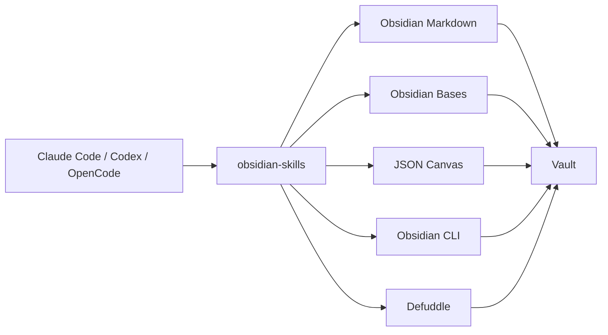
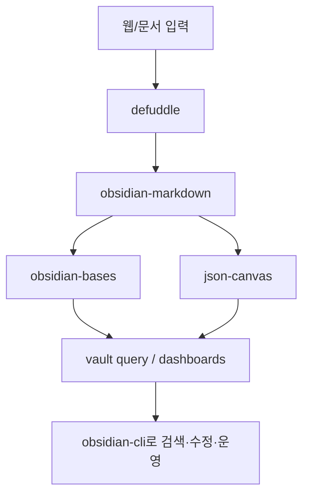

`kepano/obsidian-skills`는 단순한 “옵시디언용 프롬프트 모음”이 아니다. 이 저장소의 진짜 의미는 **에이전트가 옵시디언 볼트를 사람처럼이 아니라, 옵시디언 문법과 파일 형식을 이해하는 도구처럼 다루게 만든다**는 데 있다.

즉, 일반 마크다운 편집 수준을 넘어서

- Obsidian Flavored Markdown
- Bases
- JSON Canvas
- Obsidian CLI
- 웹 문서 정제 ingest

까지 한꺼번에 스킬로 묶는다.

<!--more-->

## Sources

- GitHub: <https://github.com/kepano/obsidian-skills>
- README: <https://raw.githubusercontent.com/kepano/obsidian-skills/main/README.md>

## 1. 이 저장소는 “옵시디언 자동화”보다 “볼트 운영 레이어”에 가깝다

README 첫 문장부터 방향이 분명하다.  
이 스킬들은 Agent Skills specification을 따르기 때문에 Claude Code, Codex CLI, OpenCode 같은 **skills-compatible agent**에서 공통으로 쓸 수 있다.

이 말은 중요하다.

옵시디언을 다루는 방법이 이제 특정 앱 플러그인에 묶이지 않고,

- 스킬 표준
- 파일 포맷
- CLI

조합으로 추상화된다는 뜻이기 때문이다.

즉 `obsidian-skills`는 “에이전트가 옵시디언을 이해하게 만드는 번역기”가 아니라, **볼트를 조작하는 공용 작업 프로토콜**에 가깝다.

## 2. 핵심은 5개 스킬이 서로 다른 파일 형식과 작업층을 담당한다는 점이다

이 저장소의 장점은 “옵시디언 지원”을 한 덩어리로 다루지 않는다는 데 있다.

### 2-1. obsidian-markdown

이 스킬은 일반 Markdown이 아니라 **Obsidian Flavored Markdown**을 다룬다.

- wikilinks
- embeds
- callouts
- properties
- block references

같은 문법을 정확히 이해하게 만든다.

이 차이는 크다.  
에이전트가 평범한 Markdown 편집기처럼 행동하면 옵시디언 볼트의 연결 구조를 잘 못 쓴다.  
반대로 이 스킬이 있으면 노트 하나를 쓰는 게 아니라 **볼트의 링크 그래프를 갱신**하는 쪽으로 움직인다.

### 2-2. obsidian-bases

`.base` 파일을 다루는 스킬은 특히 중요하다.  
옵시디언을 메모 앱으로만 보지 않고, 데이터베이스적 뷰를 가진 작업 공간으로 보게 만들기 때문이다.

- filters
- formulas
- summaries
- table/cards/list/map views

를 YAML로 다루는 방식은, 에이전트가 노트를 단순 문서가 아니라 **조회 가능한 구조화 데이터**로 취급하게 만든다.

### 2-3. json-canvas

`.canvas` 파일은 시각적 구조를 담당한다.

- nodes
- edges
- groups
- layout

를 JSON Canvas spec에 맞춰 만들 수 있기 때문에, 에이전트가 마인드맵, 플로우, 조사 보드, 설계도 같은 시각 결과물을 파일로 직접 생성할 수 있다.

이건 단순 시각화가 아니라, 텍스트 중심 PKM을 **공간적 사고 도구**로 확장하는 역할이다.

### 2-4. obsidian-cli

이 스킬은 이미 열려 있는 Obsidian 인스턴스와 CLI로 상호작용한다.

- 읽기
- 생성
- append
- search
- property set
- daily note 작업
- task 관리
- plugin/theme 개발

까지 포함한다.

즉 파일을 수정하는 것에 그치지 않고, **실행 중인 옵시디언 환경을 조작**하는 층까지 올라간다.

### 2-5. defuddle

`defuddle`은 웹 페이지를 깨끗한 Markdown으로 정리해 주는 ingest 도구다.

이 스킬이 중요한 이유는, 많은 볼트 작업이 사실

- 읽기
- 정리
- 요약
- 링크화

이기 때문이다.

즉 외부 웹을 볼트 안으로 들여올 때, 광고/네비게이션/잡음을 제거한 **토큰 효율적인 입력 파이프라인**을 제공한다.

## 3. 이 저장소는 “노트 작성”보다 “지식 운영”에 더 가깝다

겉으로 보면 5개 스킬이 따로 노는 것 같지만, 실제로는 하나의 흐름으로 읽는 편이 맞다.

1. `defuddle`로 웹 자료를 Markdown으로 정리한다
2. `obsidian-markdown`으로 영구 노트나 정리 문서를 만든다
3. `obsidian-bases`로 구조화된 뷰를 만든다
4. `json-canvas`로 시각 맵을 만든다
5. `obsidian-cli`로 실제 볼트 운영과 검색, 갱신을 수행한다

즉 이 저장소는 “예쁘게 메모 쓰기”보다 **수집 → 구조화 → 시각화 → 운영** 루프를 제공한다.

## 4. 기존 옵시디언 + AI 글들과 다른 점

우리가 최근 다뤘던 옵시디언 관련 흐름은 주로

- raw / permanent / wiki 구조
- Claude Code 기반 ingest
- 제텔카스텐 자동화

같은 지식 관리 파이프라인에 가까웠다.

반면 `obsidian-skills`는 그 위에 한 층 더 올라간다.  
이 저장소는 “무엇을 정리할까”보다 **에이전트가 옵시디언의 파일 형식과 인터페이스를 얼마나 정확히 다루는가**에 초점이 있다.

즉 이전 글들이 워크플로 설계였다면, 이 저장소는 그 워크플로를 받쳐 주는 **파일 포맷/도구 하네스**에 가깝다.

## 5. 설치 방식도 중요한 메시지를 준다

README는 세 가지 설치 방식을 보여 준다.

- marketplace
- `npx skills`
- 수동 설치

그리고 Claude Code, Codex CLI, OpenCode 각각에 맞는 배치 방식을 설명한다.

이건 단순 설치 안내가 아니다.  
옵시디언 작업이 이제 한 제품 내부 기능이 아니라, **에이전트 생태계 전반에서 재사용 가능한 skill pack**이 되고 있다는 신호다.

즉 이 저장소의 진짜 가치는 옵시디언만이 아니라, **skills ecosystem**에 있다.

## 6. 실전 적용 포인트

이 저장소는 특히 이런 경우에 강하다.

### 6-1. 볼트를 지식 DB처럼 운영할 때

- `.base` 파일
- properties
- structured note conventions

이 중요할수록 효과가 크다.

### 6-2. 조사/리서치 볼트를 운영할 때

- `defuddle`로 웹 수집
- `obsidian-markdown`으로 정리
- `json-canvas`로 관계 시각화

루프가 잘 맞는다.

### 6-3. 에이전트가 실제 볼트를 수정해야 할 때

그냥 마크다운 파일만 쓰게 하는 것보다, 옵시디언 CLI와 형식별 스킬을 주는 편이 훨씬 안전하다.

## 7. 결론

`kepano/obsidian-skills`가 흥미로운 이유는 옵시디언에 AI를 “붙였다”는 데 있지 않다.  
진짜 의미는 **옵시디언 볼트를 에이전트가 오해 없이 다룰 수 있는 네이티브 작업 공간으로 만든다**는 데 있다.

그래서 이 저장소는 단순 생산성 팁보다 더 큰 흐름을 보여 준다.

- 메모 앱이 파일 기반 지식 시스템으로 바뀌고
- 그 파일 시스템이 에이전트 친화적 스킬 표준으로 포장되며
- 결국 볼트 전체가 하나의 작업 가능한 지식 환경이 된다

옵시디언을 AI와 함께 오래 쓸 생각이라면, 이 저장소는 “노트 잘 쓰는 법”보다 **에이전트가 볼트를 제대로 다루게 만드는 기본기**에 더 가깝다.
