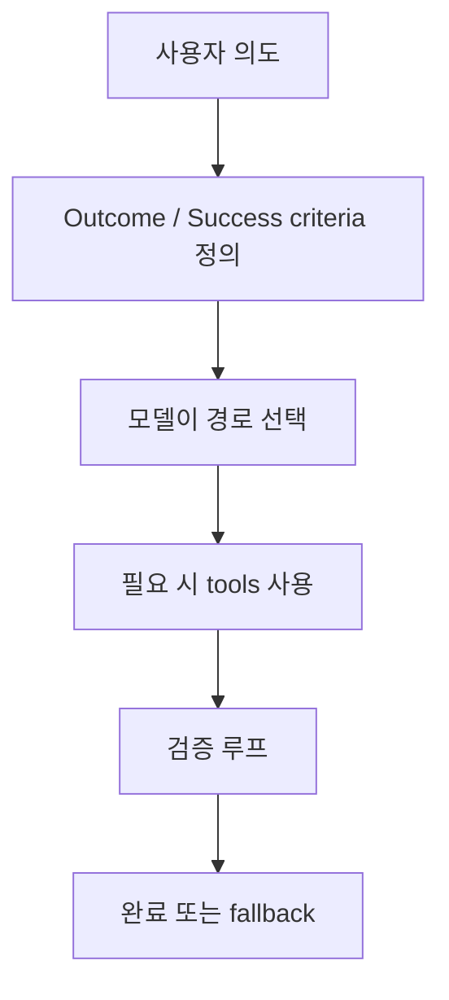
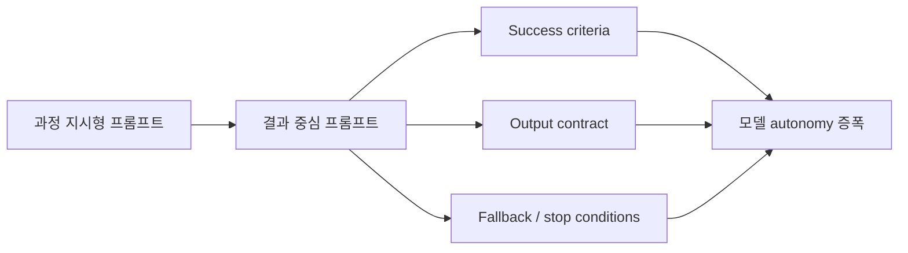

이 글의 핵심은 단순한 프롬프트 팁이 아닙니다. 더 중요한 것은 **OpenAI가 GPT-5.5 시대에 프롬프트 철학 자체를 바꾸고 있다는 점** 입니다. 예전에는 모델에게 “먼저 이걸 하고, 다음에 저걸 하고, 마지막으로 이렇게 해”처럼 과정을 세세히 지시하는 방식이 강했습니다. 하지만 번역문이 잘 요약하듯, 이제 공식 가이드는 오히려 그 방식이 모델의 더 좋은 경로 탐색을 막을 수 있다고 봅니다. [번역 원문](https://jkf87.github.io/openai-prompt-guidance-2026-04-30), [OpenAI Prompting Guide](https://developers.openai.com/api/docs/guides/prompting)
<!--more-->

즉 새로운 기본 원칙은 이것입니다. **과정을 처방하지 말고, 성공 기준과 출력 형태와 멈춰야 할 조건을 명확히 정의하라.** 모델이 강해질수록 “어떻게”를 너무 많이 고정하는 것은 족쇄가 되고, 대신 “무엇이 좋은 결과인가”를 분명히 적는 것이 더 중요해진다는 것입니다. [번역 원문](https://jkf87.github.io/openai-prompt-guidance-2026-04-30), [OpenAI Models](https://developers.openai.com/api/docs/models)

## Sources

- https://jkf87.github.io/openai-prompt-guidance-2026-04-30
- https://developers.openai.com/api/docs/guides/prompting
- https://developers.openai.com/api/docs/models
- https://developers.openai.com/api/docs/models/gpt-5.4

## 1. 왜 프롬프트 방식이 바뀌었나: 모델이 경로를 찾게 해야 하기 때문이다

번역문은 OpenAI 공식 가이드를 바탕으로 “단계 지시형 프롬프트”가 점점 덜 유리해졌다고 정리합니다. 핵심 논리는 단순합니다.

- 예전 모델은 중간 단계를 명확히 적어 주는 편이 안전했다
- 지금 모델은 스스로 더 효율적인 경로를 찾을 수 있다
- 그런데 프롬프트가 경로를 고정하면 그 능력을 죽일 수 있다

즉 모델이 강해질수록 프롬프트의 역할은 “상세 작업 지시서”에서 **성과 계약서(outcome contract)** 쪽으로 이동합니다. [번역 원문](https://jkf87.github.io/openai-prompt-guidance-2026-04-30)

이 변화는 모델의 성격과도 맞물립니다. OpenAI 공식 모델 문서는 2026년 현재 시작점으로 `gpt-5.5` 를 복잡한 reasoning과 coding의 flagship 모델로 권장합니다. 즉 기본적으로 훨씬 많은 판단을 모델이 맡을 수 있는 상황이 된 것이죠. [OpenAI Models](https://developers.openai.com/api/docs/models)

## 2. Outcome-first 구조는 ‘짧게 쓰라’가 아니라 ‘성공 기준을 명확히 쓰라’는 뜻이다

많은 사람이 “짧은 프롬프트가 좋다”만 가져가는데, 더 중요한 것은 길이보다 구조입니다. 번역문이 잘 짚은 핵심은 outcome-first prompt의 구성 요소입니다.

- success criteria
- output fields
- fallback
- stopping conditions

즉 모델에게:

- 무엇이 성공인지
- 출력은 어떤 모양이어야 하는지
- 근거가 부족하면 어떻게 처리할지
- 언제 멈춰야 하는지

를 명시하는 것이 핵심입니다. [번역 원문](https://jkf87.github.io/openai-prompt-guidance-2026-04-30)

이건 “짧게 써라”보다 훨씬 실용적인 조언입니다. 짧더라도 기준이 없으면 결과가 흔들리고, 길더라도 성공 조건이 명확하면 오히려 더 안정적일 수 있기 때문입니다.

## 3. Personality보다 Collaboration Style이 더 중요해졌다

번역문은 프롬프트의 성격 설정을 두 축으로 나눕니다.

- Personality
- Collaboration Style

Personality는 톤과 분위기입니다. 따뜻함, 차가움, 공식적, 비공식적 같은 것이죠.

반면 Collaboration Style은:

- 언제 질문할지
- 언제 가정할지
- 언제 바로 진행할지
- 언제 중간 확인을 할지

를 정하는 규칙입니다. [번역 원문](https://jkf87.github.io/openai-prompt-guidance-2026-04-30)

이 구분이 중요한 이유는, 오늘날의 모델은 단순 텍스트 생성기가 아니라 **협업자처럼 행동하는 도구** 이기 때문입니다. 즉 말투보다도 “언제 멈추고, 언제 묻고, 언제 계속 달릴 것인가”를 정해 두는 것이 훨씬 큰 차이를 만듭니다.

## 4. 검색과 인용도 이제는 ‘예산 개념’으로 봐야 한다

번역문에서 특히 좋은 부분 중 하나는 citations와 retrieval budget에 대한 정리입니다. 핵심은 검색을 무조건 많이 하는 것이 아니라:

- 첫 검색은 넓게
- 추가 검색은 정말 빠진 사실이 있을 때만
- 표현만 더 좋게 하려고 반복 검색하지 말 것

이라는 원칙입니다. [번역 원문](https://jkf87.github.io/openai-prompt-guidance-2026-04-30)

이건 실전에서 매우 중요합니다. 많은 에이전트 워크플로가 검색을 과용하면서:

- 비용을 늘리고
- 답변 시간을 늦추고
- 같은 내용만 재확인하는 루프

에 빠집니다.

즉 검색은 “많이 하면 좋은 것”이 아니라, **정확도 향상에 실질적으로 도움이 될 때만 써야 하는 리소스** 로 보는 편이 맞습니다.

## 5. 창의적 작업에서도 ‘지어내지 말라’는 원칙은 더 강해졌다

슬라이드, 카피라이팅, 내러티브 같은 창의 작업은 자칫하면 환각을 아름답게 포장해 버리기 쉽습니다. 번역문은 OpenAI 가이드가 이런 경우에도:

- 제품명
- 고객명
- 수치
- 로드맵
- 날짜
- 기능
- 경쟁 비교

같은 구체적 사실은 반드시 검색되거나 제공된 사실에 기반해야 한다고 강조한다고 정리합니다. [번역 원문](https://jkf87.github.io/openai-prompt-guidance-2026-04-30)

그리고 근거가 없으면 지어내지 말고 placeholder로 남기라고 합니다.

이건 매우 중요한 변화입니다. 창의 작업은 허구를 허용하는 영역처럼 보일 수 있지만, 실제 업무용 문서와 마케팅 자료에서는 **근거 없는 구체성** 이 가장 위험한 환각 형태이기 때문입니다.

## 6. 프론트엔드 가이드는 기술보다도 ‘AI slop 방지’에 가깝다

번역문에 따르면 OpenAI 공식 가이드는 프론트엔드 작업에서 해야 할 것과 하지 말아야 할 것을 꽤 구체적으로 제시합니다.

해야 할 것:

- 디자인 시스템 정렬
- 첫 화면 사용성
- 친숙한 컨트롤
- 예상 상태 고려
- 반응형 동작

피해야 할 것:

- 제네릭 히어로 이미지
- 중첩 카드 레이아웃
- 장식용 그래디언트
- 노골적인 지시 텍스트
- 깨진 레이아웃

이건 사실상 “AI가 흔히 만드는 조잡한 기본값”을 피하라는 이야기입니다. 즉 프론트엔드 가이드는 코드 스타일 이전에, **결과물의 식상함과 slop을 막는 규칙** 으로 읽는 것이 맞습니다. [번역 원문](https://jkf87.github.io/openai-prompt-guidance-2026-04-30)

## 7. GPT-5.4 계열은 ‘진행 정책’과 ‘검증 루프’가 중요하다

공식 모델 문서 기준으로 `GPT-5.4` 는 복잡한 professional work용 frontier 모델이며, reasoning effort는 `none, low, medium, high, xhigh` 를 지원합니다. 1.05M context window와 다양한 tool 지원도 갖고 있습니다. [GPT-5.4 Model](https://developers.openai.com/api/docs/models/gpt-5.4)

번역문은 여기에 맞는 실전 패턴으로:

- Output Contract
- Default Follow-Through Policy
- Tool Persistence Rules
- Completeness Contract
- Empty Result Recovery
- Verification Loop

를 정리합니다. [번역 원문](https://jkf87.github.io/openai-prompt-guidance-2026-04-30)

핵심은 “명확한 의도와 되돌릴 수 있는 작업은 묻지 말고 진행하라”는 정책입니다. 즉 협업 스타일을 명시적으로 정의해야 모델이:

- 과하게 멈추지 않고
- 불필요하게 묻지 않고
- 그렇다고 위험한 irreversible action을 독단적으로 하지 않도록

균형을 잡을 수 있습니다.

## 8. Reasoning effort는 구조를 대신하지 못한다

번역문이 특히 잘 짚는 실수 하나는, 프롬프트 구조가 엉성한데 reasoning effort부터 높이는 것입니다. [번역 원문](https://jkf87.github.io/openai-prompt-guidance-2026-04-30)

OpenAI 공식 모델 문서도 reasoning effort를 제공하지만, 그 자체가 문제를 해결해 주는 것은 아닙니다. 오히려:

1. 프롬프트 구조를 먼저 정리하고  
2. success criteria를 명확히 하고  
3. 그 다음에 reasoning effort를 올릴지 판단하는 순서가 더 합리적입니다

즉 높은 추론 자원은 “좋은 구조의 증폭기”일 수는 있어도, **나쁜 프롬프트 구조의 대체재는 아닙니다**.

## 9. Codex 가이드는 ‘autonomy’와 ‘병렬화’가 핵심이다

번역문에서 가장 흥미로운 부분 중 하나는 `GPT-5.3 Codex` 섹션입니다. 여기서 핵심 원칙은 autonomy입니다.

> 사용자가 방향을 주면, 추가 프롬프트를 기다리지 말고 맥락 수집, 계획, 구현, 테스트, 수정까지 proactive하게 진행하라

라는 식으로 요약됩니다. [번역 원문](https://jkf87.github.io/openai-prompt-guidance-2026-04-30)

또한:

- `apply_patch` 선호
- 파일 읽기 병렬화
- 단순 작업은 upfront plan 생략
- 각 sub-task 후 plan 업데이트

같은 규칙도 강조됩니다.

이건 단순 코딩 스타일 팁이 아닙니다. Codex 계열 모델은 “잘 쓰는 법”이 곧 **에이전트 운영법** 과 직결된다는 의미입니다.

## 10. 모델별 차이를 요약하면 결국 ‘얼마나 맡길 수 있는가’의 문제다

번역문이 정리한 모델별 차이는 결국 하나의 질문으로 수렴합니다.

**이 모델에게 얼마나 많은 경로 결정권을 맡길 수 있는가?**

대략적으로 보면:

- GPT-5.5: 더 짧고 결과 중심인 프롬프트가 잘 맞는다
- GPT-5.4: 출력 계약, 진행 정책, 검증 루프가 중요하다
- GPT-5.4-mini: 더 literal하므로 구조와 규칙을 더 명시해야 한다
- GPT-5.3 Codex: autonomy, 병렬화, proactive execution이 핵심이다
- nano: 좁고 단순한 작업에만 써야 한다

즉 “어떤 프롬프트가 좋은가”는 절대 문장이 아니라, **모델이 스스로 처리할 수 있는 판단량이 어디까지인가** 와 함께 봐야 합니다. [번역 원문](https://jkf87.github.io/openai-prompt-guidance-2026-04-30), [OpenAI Models](https://developers.openai.com/api/docs/models)

## 실전 적용 포인트

오늘 바로 가져갈 수 있는 패턴만 정리하면 이렇습니다.

1. 단계별 절차를 길게 쓰기 전에 success criteria부터 쓴다  
2. output 형식과 멈춤 조건을 명시한다  
3. collaboration style을 분명히 써서 언제 묻고 언제 진행할지 정한다  
4. 검색은 예산 개념으로 다룬다  
5. creative drafting에서도 구체 사실은 반드시 근거 기반으로 제한한다  
6. reasoning effort는 구조를 다듬은 뒤 마지막에 올린다  

이 여섯 가지만 적용해도 프롬프트 품질이 꽤 달라질 가능성이 큽니다.

## 핵심 요약

- OpenAI의 최신 프롬프트 철학은 과정 지시보다 결과 정의를 중시한다.
- 핵심은 success criteria, output fields, fallback, stopping conditions를 명확히 쓰는 것이다.
- personality보다 collaboration style이 실전에서 더 큰 차이를 만든다.
- 검색과 tool 사용은 무조건 많이가 아니라 정확도 향상에 필요한 만큼만 써야 한다.
- GPT-5.4 계열은 진행 정책과 검증 루프가 중요하고, Codex 계열은 autonomy와 병렬화가 핵심이다.
- reasoning effort는 좋은 구조를 증폭할 뿐, 나쁜 프롬프트를 구해 주지 않는다.

## 결론

이 번역문이 중요한 이유는 단순히 OpenAI 문서를 한국어로 옮겼기 때문이 아닙니다. 더 중요한 것은, GPT-5.5 시대의 프롬프트 설계가 더 이상 “모델을 조종하는 절차서”가 아니라, **좋은 결과의 조건을 정의하고 그 안에서 모델이 스스로 경로를 찾게 하는 계약서** 로 바뀌고 있다는 점을 잘 드러내기 때문입니다.

즉 앞으로 좋은 프롬프트는 더 길고 더 세세한 프롬프트가 아닐 가능성이 큽니다. 오히려 **무엇이 성공인지 더 또렷하게 정의한 프롬프트** 가 좋은 프롬프트가 될 가능성이 큽니다.
