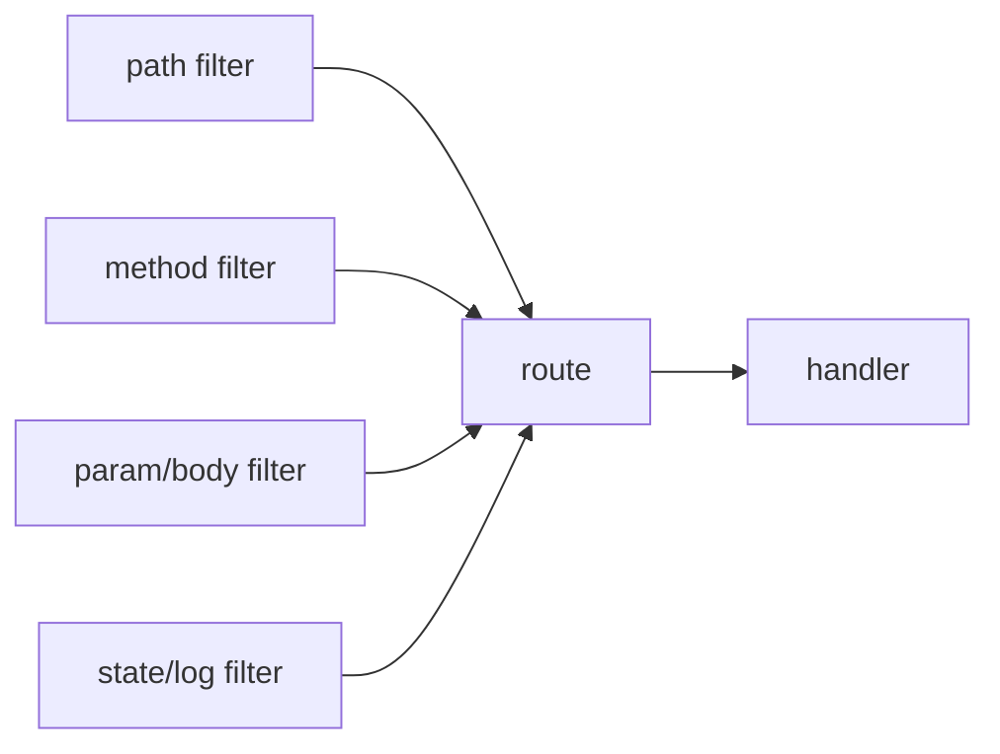
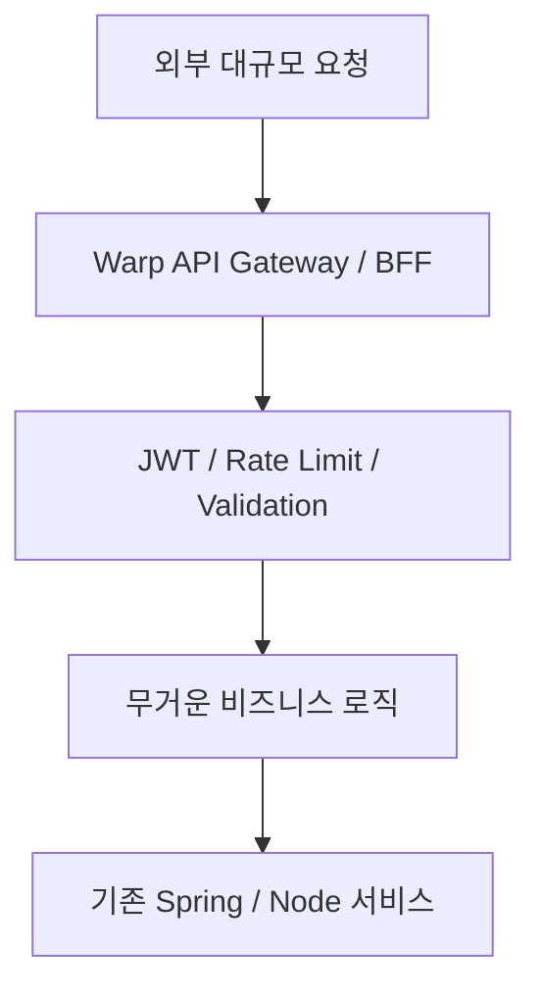

OpsOAI의 글은 Rust 웹 프레임워크 `Warp`를 단순히 “빠른 백엔드 프레임워크”로 소개하지 않는다. 오히려 훨씬 더 정확한 표현을 쓴다. **Warp는 라우팅, 미들웨어, 상태 주입, 검증을 모두 `Filter`라는 하나의 조합 가능한 추상화로 통합한 프레임워크**이며, 그 극단적인 설계 덕분에 성능을 얻는 대신 개발자의 사고방식까지 바꾸라고 요구한다.

이 글의 핵심은 “Warp가 Spring이나 Node.js의 구원자인가?”라는 질문에 대한 단순 찬양이 아니다.  
핵심은 **왜 Warp가 빠른지, 그리고 왜 그 속도를 공짜로 얻을 수 없는지**를 냉정하게 보여 준다는 데 있다.

<!--more-->

## Sources

- 원문: <https://www.opsoai.com/posts/Is-Rusts-Warp-Framework-the-Salvation-from-Spring-and-Nodejs-A-10-Year-Backend-Engineers-Deep-Dive-into-the-Filter-Architecture/>
- Warp GitHub: <https://github.com/seanmonstar/warp>

## 1. Warp의 본질은 라우터가 아니라 Filter 조합기다

Spring Boot나 Express에 익숙하면 보통 이렇게 생각한다.

- 컨트롤러를 만든다
- 라우트를 붙인다
- 미들웨어를 통과시킨다
- 비즈니스 로직을 실행한다

Warp는 이 흐름을 좀 다르게 본다.  
요청 경로, HTTP 메서드, path 파라미터, body 파싱, DB pool 주입, 로그 처리까지 모두 **Filter**로 표현하고, 이 필터들을 `.and()`, `.or()`로 조합한다.

즉 Warp는 “라우팅 프레임워크”라기보다 **함수형 조합으로 웹 서버를 조립하는 시스템**에 가깝다.

## 2. 왜 빠른가: 런타임이 아니라 컴파일 타임에 많이 결정하기 때문이다

원문이 강조하는 핵심은 `Zero-cost Abstraction` 이다.

Express처럼 런타임에 라우팅 트리를 순회하는 방식과 달리, Warp는 수많은 `.and()` 조합을 **컴파일 타임에 거대한 타입 조합**으로 굳혀 버린다.  
그 결과 실행 시점에는 라우팅 오버헤드가 아주 작아진다.

이 차이를 대략적으로 보면:

- Spring Boot: 런타임 디스패치 + JVM 메모리/GC 비용
- Express: 런타임 동적 체이닝
- Warp: 컴파일 타임 조합 + Tokio/Hyper 기반 async

즉 Warp의 속도는 “Rust라서 무조건 빠르다”가 아니라, **런타임에서 할 일을 최대한 컴파일 타임으로 밀어 넣는 설계**에서 나온다.

## 3. 그래서 Warp는 ‘더 빠른 Express’가 아니라 패러다임 전환에 가깝다

이 지점이 중요하다.  
Warp를 단순히 Express나 Spring의 대체재로 보면 자주 오해한다.

Warp는 API 핸들러를 익숙한 어노테이션/데코레이터 스타일로 붙여 가는 프레임워크가 아니다.  
오히려

- 함수형 조합
- 강한 타입 시스템
- 비동기 런타임
- 컴파일 시점 최적화

를 전제로 사고하도록 요구한다.

그래서 원문에서 “도구를 바꾸는 게 아니라 뇌 구조를 뜯어고쳐야 한다”는 표현이 나오는 것이다.

## 4. 실무에서 특히 맞는 곳은 ‘전면 교체’보다 병목 구간이다

원문이 실용적으로 좋은 이유는, Warp를 전면 도입하자고 부추기지 않는다는 점이다.  
대신 어디에 맞는지 아주 구체적으로 짚는다.

### 4-1. 앞단 API Gateway / BFF

대규모 트래픽 스파이크가 오는 시스템에서는, JWT 검증이나 rate limiting, 단순한 입력 검증 같은 앞단 처리를 Warp로 얇게 빼는 전략이 맞을 수 있다.

이 경우 무거운 트랜잭션은 뒤쪽 Spring/Node.js 서비스로 넘기고, Warp는 **연결 수와 요청 급증을 버텨 주는 가벼운 방파제** 역할을 한다.

### 4-2. SSE / WebSocket / 장기 연결

실시간 연결을 아주 많이 유지해야 하는 경우도 Warp의 장점이 살아난다.

- 낮은 메모리 오버헤드
- Rust의 소유권 모델이 주는 안정성
- Tokio 기반의 async 동시성

덕분에 장기 연결이 많은 워크로드에서 강점이 뚜렷할 수 있다.

즉 Warp는 “모든 백엔드를 바꾸는 프레임워크”보다, **병목을 긁어내는 정밀한 마이크로서비스용 칼**에 가깝다.

## 5. 하지만 대가는 분명하다: 타입 지옥과 컴파일 시간

원문이 정직한 이유는, 장점만 말하지 않는다는 데 있다.

### 5-1. 에러 메시지가 무섭다

Warp의 필터 조합은 강한 타입 시스템 위에 서 있기 때문에, 중간 타입이 하나만 어긋나도 컴파일러가 엄청나게 긴 타입 에러를 뱉는다.

이건 단순한 불편함이 아니다.  
Rust 자체의 학습 곡선 위에, Warp 특유의 조합 타입 복잡도가 한 층 더 얹힌다.

### 5-2. 컴파일 시간이 길어진다

라우터가 커질수록 타입 크기가 불어나고, 컴파일 타임도 늘어난다.  
`.boxed()` 로 타입을 지워서 완화할 수 있지만, 그러면 Warp가 자랑하는 zero-cost 추상화를 일부 포기하게 된다.

즉 여기에는 아주 분명한 교환이 있다.

- 런타임 속도
- 타입 안정성

를 얻는 대신,

- 컴파일 시간
- 디버깅 난이도
- 팀 학습 비용

을 치러야 한다.

## 6. Axum이 커지는 지금, Warp의 위치도 다시 생각해야 한다

원문이 짚는 또 하나의 현실은 `Axum`의 부상이다.  
Tokio 진영이 밀고 있는 Axum은 더 익숙한 핸들러 스타일을 제공하면서도 성능이 비슷하게 나온다는 평가를 자주 받는다.

이 말은 Warp가 나쁘다는 뜻은 아니다.  
오히려 Warp의 필터 아키텍처가 아주 독특한 미덕을 갖지만, 동시에 **실용성 면에서는 더 익숙한 대안과 경쟁해야 한다**는 뜻이다.

그래서 지금 Warp를 선택한다는 건 단순히 Rust를 선택하는 것이 아니라,

- 함수형 조합 중심 사고
- 강한 타입 지향
- 컴파일 타임 최적화 우선

이라는 철학까지 받아들이는 선택에 가깝다.

## 7. 실전 적용 포인트

Warp를 고려할 만한 상황은 대체로 이런 경우다.

### 7-1. 연결 수와 메모리 효율이 특히 중요할 때

실시간 연결, 고트래픽 게이트웨이, 앞단 필터링 레이어에 어울린다.

### 7-2. 팀이 Rust와 타입 시스템에 익숙할 때

성능 이득보다 학습 비용이 더 크면 오히려 역효과가 난다.

### 7-3. 기존 시스템 전체 교체가 아니라 일부 병목을 떼어낼 때

Spring 모놀리스를 전면 교체하는 식보다, 앞단 서비스나 특정 고성능 경로에 적용하는 편이 현실적이다.

## 8. 결론

OpsOAI 글의 가장 좋은 점은 Warp를 “구원자”로 포장하지 않는다는 것이다.  
Warp는 대중적인 만능 프레임워크라기보다, **극단적인 성능과 낮은 오버헤드를 위해 개발자의 복잡도 감내 능력을 요구하는 도구**에 가깝다.

그래서 결론은 단순하다.

- Spring/Node.js가 무겁다고 해서 무조건 Warp로 도망칠 일은 아니다
- 하지만 특정 병목 구간에서는 Warp가 정말 다른 체급의 결과를 줄 수 있다
- 그 대가로 팀은 필터 조합, 타입 에러, 긴 컴파일 시간과 친해져야 한다

즉 Warp는 모두의 구원이 아니라, **정말 성능이 필요하고 그 대가를 감당할 준비가 된 팀에게만 맞는 정밀한 선택지**다.
