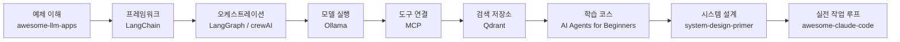
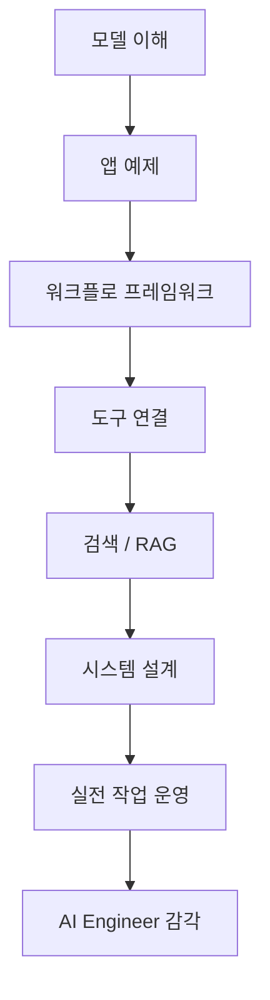

X에서 “90일 안에 연봉 20만 달러 AI 엔지니어 역할에 가까워지고 싶다면 학위보다 이 10개 GitHub 저장소를 익히라”는 식의 글이 화제가 됐다. 과장은 섞여 있지만, 목록 자체는 꽤 흥미롭다.  

핵심은 저장소 10개를 외우라는 게 아니다. **앱 예제, 에이전트 프레임워크, 로컬 모델 실행, MCP, 벡터 검색, 시스템 설계, Claude Code 생태계**까지 한 번에 훑는 로드맵으로 읽으면 의미가 있다.

<!--more-->

## Sources

- X post: <https://x.com/i/status/2049295115441905775>
- awesome-llm-apps: <https://github.com/Shubhamsaboo/awesome-llm-apps>
- LangChain: <https://github.com/langchain-ai/langchain>
- LangGraph: <https://github.com/langchain-ai/langgraph>
- crewAI: <https://github.com/crewAIInc/crewAI>
- Ollama: <https://github.com/ollama/ollama>
- awesome-mcp-servers: <https://github.com/punkpeye/awesome-mcp-servers>
- Qdrant: <https://github.com/qdrant/qdrant>
- AI Agents for Beginners: <https://github.com/microsoft/ai-agents-for-beginners>
- system-design-primer: <https://github.com/donnemartin/system-design-primer>
- awesome-claude-code: <https://github.com/hesreallyhim/awesome-claude-code>

## 1. 이 목록을 그대로 믿기보다 “10개 레이어”로 읽는 편이 낫다

X 원문은 강한 문장으로 시작한다. 하지만 실제로 더 유용한 해석은 이것이다.

1. `awesome-llm-apps`로 **완성형 예제**를 본다.
2. `LangChain`, `LangGraph`, `crewAI`로 **에이전트 구조**를 익힌다.
3. `Ollama`로 **모델 실행 환경**을 손에 익힌다.
4. `awesome-mcp-servers`로 **도구 연결 표준**을 본다.
5. `Qdrant`로 **RAG의 저장·검색 레이어**를 이해한다.
6. `AI-Agents-for-Beginners`로 **학습용 커리큘럼**을 돈다.
7. `system-design-primer`로 **프로덕션 사고방식**을 보강한다.
8. `awesome-claude-code`로 **실전 워크플로와 스킬 생태계**를 붙인다.

즉, 이건 “최고의 저장소 10개”라기보다 **AI 엔지니어링을 구성하는 10개 시야**에 가깝다.

## 2. 예제 저장소는 “무엇을 만들 수 있는가”를 보여 준다

`Shubhamsaboo/awesome-llm-apps`는 생산형 AI 앱을 예제로 훑는 데 강하다. RAG, 멀티모달, 음성, 에이전트, 워크플로 자동화처럼 요즘 AI 앱에서 자주 나오는 조합을 실제 코드로 본다는 점이 크다.

처음부터 프레임워크 내부 구조를 파고들면 금방 추상화에 질린다. 반대로 예제를 먼저 보면 “왜 이런 도구가 필요한가”가 보인다.  

이 저장소는 **앱 관점의 출발점**이다.

## 3. LangChain, LangGraph, crewAI는 같은 듯하지만 보는 층이 다르다

이 세 개는 한 덩어리처럼 보이지만, 실제로는 레이어가 다르다.

- `LangChain`: LLM 앱 조립용 기본 프레임워크
- `LangGraph`: 상태, 분기, 루프, 메모리를 포함한 에이전트 오케스트레이션
- `crewAI`: 역할 기반 멀티 에이전트 협업 패턴

중요한 건 “무슨 프레임워크가 최고인가”가 아니다.  
중요한 건 **단일 호출 → 상태 있는 워크플로 → 다중 역할 협업**으로 시야를 넓히는 것이다.

그래서 이 세 저장소를 한 번에 익히려 하기보다,

1. LangChain으로 기본 체인을 보고,
2. LangGraph로 상태 흐름을 이해하고,
3. crewAI로 역할 분리를 비교해 보는 순서가 더 자연스럽다.

## 4. Ollama와 MCP는 2026년 AI 툴링 감각의 기본값에 가깝다

`Ollama`는 로컬에서 모델을 돌려 보는 가장 손쉬운 관문 중 하나다. 모델을 직접 바꿔 보고, 속도와 품질 차이를 체감하고, 클라우드 API에만 의존하지 않는 실행 감각을 주기 때문이다.

`awesome-mcp-servers`는 그 다음 레이어다.  
이 목록에 MCP가 들어간 이유는 단순 유행이 아니라, 이제 에이전트가 파일 시스템, 브라우저, 검색, 데이터베이스, 협업 도구를 **표준 인터페이스로 연결**하는 흐름이 강해졌기 때문이다.

즉,

- Ollama는 **모델 실행 감각**
- MCP는 **도구 연결 감각**

을 만든다.

## 5. Qdrant와 RAG 학습은 아직도 매우 실용적이다

RAG가 예전만큼 새롭지는 않지만, 여전히 많은 실제 업무는 검색·요약·근거 인용·지식 연결 문제를 해결해야 한다. 그래서 `qdrant/qdrant` 같은 벡터 DB 저장소를 보는 일은 여전히 유효하다.

여기서 중요한 건 “벡터 DB를 외운다”가 아니라,

- 임베딩은 어디서 오고
- 어떤 단위로 쪼개며
- 무엇을 검색하고
- 어떤 근거를 다시 모델에 넣는가

를 이해하는 것이다.

AI 엔지니어링의 많은 문제는 모델 호출보다 **검색 파이프라인 설계**에 있다.

## 6. 학습용 코스와 시스템 설계가 같이 들어간 이유가 있다

`microsoft/ai-agents-for-beginners`는 입문용 강의형 저장소다.  
반면 `donnemartin/system-design-primer`는 훨씬 넓고 전통적인 시스템 사고를 요구한다.

이 둘이 한 목록에 같이 있는 이유는 분명하다.

- 하나는 **빠르게 손을 움직이게 만들고**
- 다른 하나는 **프로덕션에서 무엇이 깨지는지 보게 만든다**

실제로 AI 앱은 결국 일반 소프트웨어 시스템 위에 올라간다.  
큐, 캐시, 장애 복구, 트래픽, 스토리지, 권한, 비용 같은 문제가 사라지지 않는다.

## 7. 마지막에 awesome-claude-code가 오는 이유

`hesreallyhim/awesome-claude-code`가 흥미로운 건, 이 저장소가 모델 자체보다 **작업 방식**을 다루기 때문이다.

여기서 배우게 되는 건 보통 이런 것들이다.

- 스킬과 플러그인 구조
- planning / review / memory 루프
- Claude Code를 IDE가 아니라 작업 하네스로 쓰는 방식
- MCP, subagent, design skill, QA skill 등 주변 생태계

즉 앞의 저장소들이 “무엇을 만들 것인가”를 넓혀 준다면, 이 저장소는 “**어떻게 일할 것인가**”를 바꾼다.

## 8. 실전 적용 포인트

이 목록을 그대로 “90일 체크리스트”처럼 따라가기보다, 이렇게 쓰는 편이 더 현실적이다.

### 8-1. 1주차: 예제와 로컬 실행

- `awesome-llm-apps`
- `Ollama`

먼저 실제 앱과 모델 실행을 붙여 본다.

### 8-2. 2~3주차: 프레임워크 감각

- `LangChain`
- `LangGraph`
- `crewAI`

단일 체인, 상태 그래프, 역할 분리의 차이를 본다.

### 8-3. 4주차: 도구 연결과 RAG

- `awesome-mcp-servers`
- `Qdrant`

실제 업무 데이터를 연결하는 감각을 익힌다.

### 8-4. 계속 병행할 것

- `AI-Agents-for-Beginners`
- `system-design-primer`
- `awesome-claude-code`

학습 커리큘럼, 시스템 사고, 실전 워크플로는 한 번에 끝나는 과목이 아니다.

## 9. 핵심 요약

이 X 글의 진짜 가치는 “이 저장소만 보면 취업한다”는 과장에 있지 않다.  
가치는 오히려 **AI 엔지니어링이 어떤 층위로 이루어져 있는지** 한 번에 보여 준다는 데 있다.

- 앱 예제
- 프레임워크
- 오케스트레이션
- 로컬 모델 실행
- MCP
- 벡터 검색
- 학습 코스
- 시스템 설계
- 실전 워크플로

이 9개 시야를 묶어 보면, 왜 요즘 AI 엔지니어가 단순 프롬프트 작성자가 아니라 **도구·데이터·시스템·작업 운영을 함께 다루는 사람**인지 이해하게 된다.

## 결론

이 목록은 “베스트 저장소 10개”라기보다, **AI 엔지니어로 일하기 위해 어디를 봐야 하는지 찍어 주는 지도**에 가깝다.

그래서 정말 중요한 질문은 이것이다.

- 어떤 프레임워크가 최고인가?

가 아니라,

- 나는 지금 예제를 보고 있는가?
- 상태 있는 워크플로를 이해했는가?
- 모델과 도구를 직접 연결해 봤는가?
- 검색과 시스템 설계를 같이 보고 있는가?
- 내 작업 방식까지 업데이트하고 있는가?

이 질문들에 답하기 시작하면, 그때부터 저장소 목록은 링크 모음이 아니라 실제 학습 경로가 된다.
