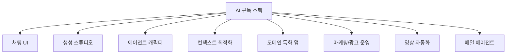
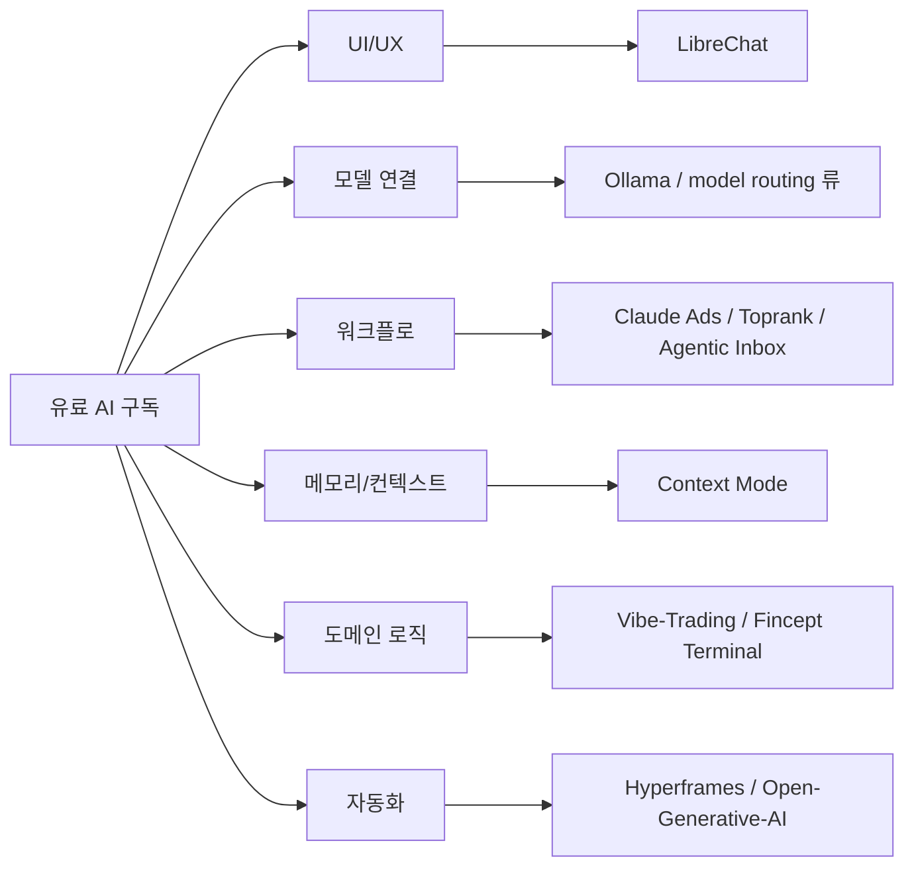

X에서 “고액 AI 구독이 바보 같아지는 GitHub 저장소 10선”이라는 글이 화제가 됐다. 표현은 강하지만, 메시지는 분명하다. **이제 많은 AI 도구는 개별 SaaS를 계속 더 사는 대신, 직접 조합한 오픈소스 스택으로 상당 부분 대체할 수 있다**는 것이다.

물론 “무료”라는 표현은 절반만 맞다.  
셀프호스트는 서버 비용, 운영 부담, API 비용, 모델 품질 차이를 함께 감수해야 한다. 그럼에도 이 목록이 흥미로운 이유는, 오늘날 AI 구독이 실제로 어떤 레이어로 분해되는지를 보여 주기 때문이다.

<!--more-->

## Sources

- X post: <https://x.com/i/status/2049684937574608975>
- LibreChat: <https://github.com/danny-avila/LibreChat>
- Open-Generative-AI (formerly Open Higgsfield AI path): <https://github.com/Anil-matcha/Open-Generative-AI>
- Open-LLM-VTuber: <https://github.com/Open-LLM-VTuber/Open-LLM-VTuber>
- Context Mode: <https://github.com/mksglu/context-mode>
- Vibe-Trading: <https://github.com/HKUDS/Vibe-Trading>
- Fincept Terminal: <https://github.com/Fincept-Corporation/FinceptTerminal>
- Toprank: <https://github.com/nowork-studio/toprank>
- Claude Ads: <https://github.com/AgriciDaniel/claude-ads>
- Hyperframes: <https://github.com/heygen-com/hyperframes>
- Agentic Inbox: <https://github.com/cloudflare/agentic-inbox>

## 1. 이 목록은 “10개 툴 추천”보다 “구독형 AI 스택 분해도”에 가깝다

원문이 나열한 저장소는 서로 완전히 다른 문제를 푼다.

- 채팅 허브
- 이미지/영상 생성 스튜디오
- AI 캐릭터 인터페이스
- 컨텍스트 비용 최적화
- 트레이딩 에이전트
- 금융 터미널
- SEO/광고 운영
- 비디오 자동화
- 에이전트형 메일 클라이언트

즉, 이 글은 “이거 하나면 다 된다”가 아니라 **지금 우리가 돈 내는 AI 구독이 사실은 여러 레이어의 묶음**이라는 점을 드러낸다.

## 2. 채팅 허브를 대체하는 레이어: LibreChat

`danny-avila/LibreChat`은 이 목록의 출발점으로 가장 이해하기 쉽다.  
GPT, Claude, Gemini, DeepSeek 같은 여러 모델을 하나의 인터페이스에서 다루고, MCP와 에이전트 기능도 붙일 수 있다.

이 저장소가 말해 주는 건 단순하다.

- 많은 사용자는 사실 모델 자체보다 **좋은 작업 UI**에 돈을 낸다
- 그 UI와 연결 레이어는 오픈소스로도 상당 부분 재구성 가능하다

즉 “ChatGPT 대체품”이라기보다 **멀티 모델 프런트엔드**로 보는 편이 맞다.

## 3. 생성형 미디어 스튜디오를 대체하는 레이어

여기에는 성격이 조금 다른 두 저장소가 들어간다.

### 3-1. Open-Generative-AI

X 원문에서는 `Open Higgsfield AI`라고 소개됐지만, 현재 GitHub 기준 저장소는 `Anil-matcha/Open-Generative-AI`다.  
핵심은 여러 이미지/영상 생성 모델을 한 스튜디오 안에서 다루게 만든다는 점이다.

이런 저장소가 중요한 이유는, 생성형 이미지/영상 툴 시장이 결국

- 모델
- 프롬프트
- 자산 관리
- 작업 흐름

의 조합이기 때문이다.

### 3-2. Hyperframes

`heygen-com/hyperframes`는 우리가 이미 다뤘듯, HTML을 중심으로 영상을 코드처럼 만들게 해 주는 프레임워크다.  
즉 “영상 생성 SaaS”의 대체재라기보다 **에이전트 친화적인 영상 파이프라인**에 가깝다.

둘을 같이 보면 메시지가 선명하다.  
생성 AI 구독은 점점 **모델 요금**보다 **작업 스튜디오 요금**에 가까워지고 있다.

## 4. AI 캐릭터와 개인 인터페이스를 대체하는 레이어

`Open-LLM-VTuber/Open-LLM-VTuber`는 Live2D와 LLM, 음성 대화를 결합한 오픈소스 프로젝트다.  

이 저장소가 상징하는 건, AI가 이제 텍스트 채팅창을 넘어서 **캐릭터 인터페이스**로도 패키징된다는 점이다.  
로컬 실행, 음성 대화, 인터럽트 대응 같은 요소까지 들어가면, 유료 AI 캐릭터 앱의 핵심 가치가 무엇인지 분해해서 보게 된다.

## 5. Context Mode는 구독 대체보다 “비용 압축기”라는 해석이 더 정확하다

`mksglu/context-mode`는 직접 기능을 제공하는 SaaS 대체품이라기보다, 코딩 에이전트의 컨텍스트 낭비를 줄여 주는 **비용 최적화 레이어**에 가깝다.

이런 도구가 중요한 이유는 분명하다.

- 요즘 많은 AI 비용은 모델 자체보다
- 긴 로그
- 중복된 툴 출력
- 불필요한 전체 문맥 적재

에서 새기 때문이다.

그래서 이 프로젝트는 “새 기능”보다 **기존 워크플로의 토큰 비용을 깎는 하네스**로 읽는 편이 맞다.

## 6. 도메인 특화 앱: 트레이딩과 금융 리서치

목록 중 `Vibe-Trading`, `Fincept Terminal`은 일반 사용자용 채팅 툴과 결이 다르다.

### 6-1. Vibe-Trading

`HKUDS/Vibe-Trading`은 개인 트레이딩 에이전트 관점의 프로젝트다.  
여기서 중요한 건 “매매를 자동화한다”는 문구보다, **분석 + 판단 + 실행**을 도메인 특화 루프로 묶으려 한다는 점이다.

### 6-2. Fincept Terminal

`Fincept-Corporation/FinceptTerminal`은 이미 따로 다뤘듯, 오픈소스 금융 워크벤치/터미널 관점이 강하다.  
시장 분석, 경제 데이터, 투자 리서치를 한 화면에 모으는 식이다.

이 두 저장소는 공통적으로, AI 구독을 단순 채팅 도구가 아니라 **직무용 콘솔**로 재정의한다.

## 7. Claude Code 기반 성장 운영 레이어: Toprank와 Claude Ads

이 목록에서 특히 흥미로운 부분은 `Toprank`, `Claude Ads`다.  
둘 다 “AI가 글을 써 준다”가 아니라 **SEO, SEM, 광고 운영을 Claude Code 워크플로 안으로 끌어들인다**는 쪽에 가깝다.

### 7-1. Toprank

`nowork-studio/toprank`는 Claude Code용 SEO/SEM/Google Ads 스킬 세트 관점으로 볼 수 있다.  
즉, 검색과 광고 운영을 사람 손으로만 하던 작업에서 **반복 가능한 하네스**로 옮긴다.

### 7-2. Claude Ads

`AgriciDaniel/claude-ads`는 여러 광고 채널을 점검·최적화하고, 크리에이티브 생성까지 연결하는 방향을 취한다.

이 두 저장소가 의미하는 건 명확하다.  
이제 AI 구독 비용의 일부는 “모델 접근권”이 아니라 **마케팅 운영 프로세스 자동화**에 대한 비용이다.

## 8. Agentic Inbox는 이메일도 이제 에이전트 콘솔로 바뀐다는 신호다

`cloudflare/agentic-inbox`는 셀프호스트형 메일 + 에이전트 조합이다.  
메일 AI 시장은 겉으로 보기엔 요약과 답장 초안 정도로 보이지만, 실제로는

- 분류
- 우선순위 판단
- 답장 초안
- 후속 작업 연결

이 묶여 있는 워크플로 시장이다.

이 프로젝트는 그 시장을 **자기 인프라 위에서 직접 굴릴 수 있는가**라는 질문으로 되돌린다.

## 9. 실전 적용 포인트

이 목록을 “무료 툴 10개 모음”으로 소비하면 아쉽다.  
오히려 이렇게 나눠 보면 더 현실적이다.

### 9-1. AI 채팅 구독을 줄이고 싶다면

- `LibreChat`

### 9-2. 생성형 미디어 스택을 직접 쌓고 싶다면

- `Open-Generative-AI`
- `Hyperframes`

### 9-3. 에이전트 비용을 줄이고 싶다면

- `Context Mode`

### 9-4. 직무별 콘솔을 만들고 싶다면

- `Vibe-Trading`
- `Fincept Terminal`
- `Toprank`
- `Claude Ads`
- `Agentic Inbox`

즉, 핵심은 “무엇이 공짜인가”보다 **내가 지금 비용을 내는 레이어가 정확히 무엇인가**를 파악하는 것이다.

## 10. 결론

이 X 글의 표현처럼 “비싼 AI 구독이 바보 같다”까지는 아닐 수 있다.  
운영, 보안, 유지보수, 품질 보증까지 생각하면 SaaS의 가치가 분명히 있기 때문이다.

하지만 이 목록이 보여 주는 변화는 분명하다.

이제 AI 제품의 많은 부분은

- 모델
- UI
- 워크플로
- 컨텍스트 관리
- 도메인 로직
- 자동화 하네스

로 분해해서 다시 조립할 수 있다.

그래서 앞으로의 경쟁은 “누가 더 좋은 모델 API를 파느냐”뿐 아니라, **누가 더 좋은 운영 레이어와 작업 하네스를 제공하느냐**로 옮겨갈 가능성이 크다.
