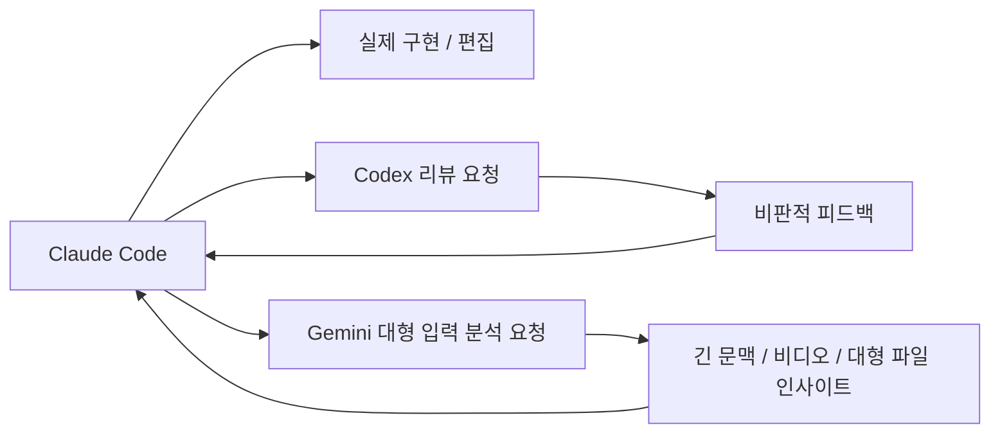
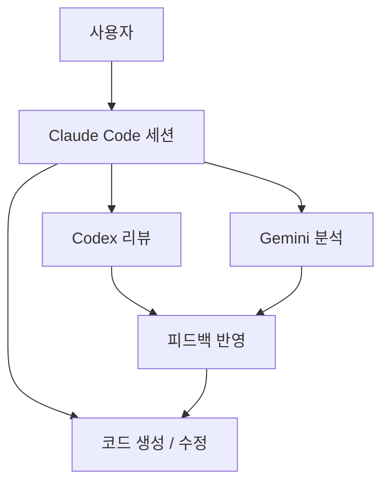

이 영상의 핵심은 “Claude Code가 갑자기 더 똑똑해졌다”가 아니다.  
핵심은 **Claude Code를 메인 작업 환경으로 두고, Codex와 Gemini를 각각 다른 역할로 붙여서 한 개 모델의 약점을 메우는 것**이다.

즉 이 영상은 모델 교체론보다 **모델 분업론**에 가깝다.

<!--more-->

## Sources

- YouTube: <https://www.youtube.com/watch?v=ETvz1qhQDXE>

## 1. 영상의 출발점은 “한 모델의 블라인드 스폿”이다

영상은 Claude Code 자체를 버리자는 방향으로 가지 않는다.  
오히려 Claude Code를 여전히 중심 IDE/오케스트레이터로 두고, **한 모델이 놓치는 관점은 다른 모델로 보완하자**는 논리를 택한다.

이 관점은 꽤 실용적이다.

- 어떤 모델은 코딩 흐름이 좋고
- 어떤 모델은 비판적 리뷰가 좋고
- 어떤 모델은 긴 문맥이나 특정 멀티모달 입력 처리에 강하다

즉 중요한 건 “누가 최고인가”보다 **누가 어떤 역할을 맡는가**다.

## 2. 이 영상이 제안하는 구조는 3-브레인 워크플로다

영상에서 제안하는 분업은 대략 이렇게 읽을 수 있다.

### 2-1. Claude Code = 메인 작업 환경

Claude Code는 실제 코딩을 진행하고, 파일을 수정하고, 작업 흐름을 이끄는 중심 환경으로 남는다.

즉 주 역할은:

- 구현
- 파일 편집
- 작업 오케스트레이션

이다.

### 2-2. Codex = 리뷰어 / adversarial reviewer

영상은 Codex를 다시 “세컨드 오피니언” 위치로 끌어온다.  
특히 리뷰, 비판적 검토, 악마의 변호인 같은 역할이 중요하다고 본다.

즉 Claude가 작성한 결과물을 Codex에게 던져:

- 논리적 구멍이 없는지
- 구현이 어색하지 않은지
- 더 나은 방법이 없는지

를 따져 보게 만드는 식이다.

### 2-3. Gemini = 긴 문맥 / 비디오 / 대형 파일 분석기

영상은 Gemini의 강점으로

- 긴 컨텍스트
- 대형 PDF
- 비디오 입력

같은 영역을 강조한다.

이건 중요한 포인트다.  
즉 Gemini를 일반 코딩용 메인 모델로 쓰는 게 아니라, **Claude Code가 직접 잘 다루지 못하는 대형 입력 분석 보조 두뇌**로 붙인다는 뜻이다.

## 3. 왜 이런 구조가 유효하나: 한 모델이 모든 일을 완벽히 하진 못하기 때문이다

영상의 핵심 논리는 간단하다.

- 모델마다 강점이 다르다
- 한 모델은 특정 상황에서 quality regression이 생길 수 있다
- 긴 작업일수록 한 모델의 블라인드 스폿이 커질 수 있다

그래서 하나의 세션 안에서 한 모델만 맹신하기보다, **메인 실행 모델 + 보조 검토 모델 + 특수 입력 분석 모델** 구조를 쓰는 편이 더 안전하다는 것이다.

이건 사실 사람 팀과도 비슷하다.

- 구현 담당
- 리뷰 담당
- 리서치 담당

을 나누는 것과 같다.

## 4. Codex를 메인 코더가 아니라 리뷰어로 두는 해석이 흥미롭다

이 영상에서 특히 흥미로운 부분은 Codex의 위치다.  
보통은 “Claude 대신 Codex를 쓸까?” 식으로 접근하기 쉽다. 하지만 이 영상은 그 질문을 비껴 간다.

대신 이렇게 본다.

- Claude는 빠르게 만들어 낸다
- Codex는 그 결과를 다시 공격적으로 검토한다

즉 Codex를 대체재보다 **품질 보강 장치**로 쓰는 것이다.

이 관점은 실용적이다.  
좋은 워크플로는 도구 갈아타기보다, **이미 만든 결과물을 누가 비판해 줄 것인가**를 먼저 해결하기 때문이다.

## 5. Gemini의 역할은 “더 똑똑한 코더”보다 “입력 확장기”에 가깝다

영상은 Gemini 쪽에서는 코딩 자체보다 입력 능력을 강조한다.

- 긴 비디오를 분석하고
- 매우 큰 PDF를 한 번에 보고
- 긴 컨텍스트를 유지하는 능력

이런 장점은 코드 생성 그 자체보다, **코딩 이전의 자료 해석 단계**에 더 잘 맞는다.

예를 들면:

- 긴 강의 영상 요약 후 기능 요구사항 추출
- 대형 스펙 문서 분석
- 리서치 자료 정리

같은 단계다.

이건 꽤 중요하다.  
왜냐하면 많은 코딩 실패는 구현보다도, **입력 문서를 제대로 소화하지 못하는 데서 시작**되기 때문이다.

## 6. 결국 이 구조는 Claude Code를 “프런트엔드”로 쓰는 발상이다

이 영상의 밑바탕에는 익숙한 흐름이 있다.  
우리가 최근 여러 번 다뤘듯, Claude Code를 “Anthropic 모델 전용 CLI”가 아니라 **작업 프런트엔드**로 보는 관점이다.

그러면 구조는 이렇게 바뀐다.

- 파일 조작과 실행은 Claude Code
- 보조 리뷰는 Codex
- 대형 입력 해석은 Gemini

즉 메인 툴 하나를 버리는 게 아니라, Claude Code를 중심 콘솔로 둔 채 **여러 두뇌를 뒤에 매다는 구조**가 된다.

## 7. 이 방식이 특히 잘 맞는 경우

이 영상식 조합은 아무 때나 다 필요한 건 아니다.  
특히 아래 상황에서 강점이 크다.

### 7-1. 결과물을 꼭 한 번 더 비판적으로 검토하고 싶을 때

한 모델이 만든 결과를 다른 모델이 리뷰하는 것만으로도 품질이 꽤 안정될 수 있다.

### 7-2. 입력 자료가 너무 클 때

긴 영상, 긴 PDF, 긴 문맥을 바로 Claude Code 세션에 다 밀어 넣기보다, 먼저 보조 모델에게 해석을 맡기는 편이 낫다.

### 7-3. Claude Code를 버리고 싶진 않지만 보완하고 싶을 때

툴을 갈아타기보다 **보조 두뇌를 덧붙이는 방식**이 진입 장벽이 낮다.

## 8. 한계도 있다

이 구조가 만능은 아니다.

### 8-1. 세션이 복잡해진다

모델이 늘어나면 사고 흐름은 좋아질 수 있지만, 설정과 운영은 복잡해진다.

### 8-2. 책임이 분산될 수 있다

누가 최종 결정을 내리는지 불분명하면 오히려 더 헷갈릴 수 있다.

### 8-3. 단순 작업엔 과하다

작은 버그 수정이나 짧은 스크립트 작업까지 3-브레인 구조를 쓰면 오버엔지니어링이 된다.

## 9. 결론

이 영상의 좋은 점은 “새 모델이 최고다”라는 식으로 가지 않는다는 것이다.  
대신 이렇게 묻는다.

- 메인 작업 환경은 무엇으로 둘까?
- 누가 결과물을 리뷰할까?
- 누가 긴 문서와 영상을 소화할까?

그리고 그 자리에 각각

- Claude Code
- Codex
- Gemini

를 놓는다.

즉 핵심은 툴 전환이 아니라 **역할 분업**이다.  
Claude Code를 계속 쓰되, 그 바깥에 두 개의 보조 두뇌를 붙이는 순간, 워크플로는 단일 모델 사용보다 훨씬 탄력적으로 바뀔 수 있다.
