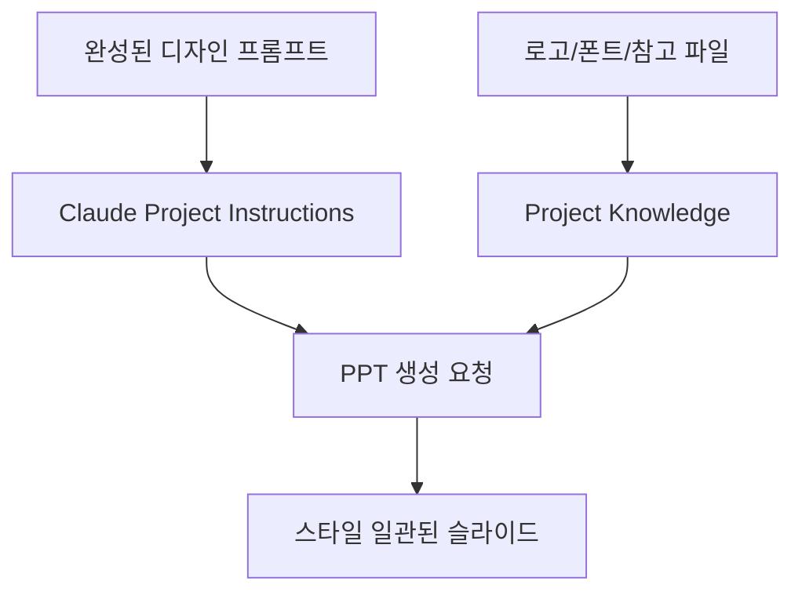

이 영상의 제목은 자극적이지만, 실제 메시지는 훨씬 실무적이다.  
핵심은 **PPT를 AI가 더 예쁘게 만들어 준다**가 아니라, **디자인 시스템을 먼저 고정해 두면 일반 Claude만으로도 수정 가능한 고품질 PPT를 반복 생산할 수 있다**는 것이다.

즉 이 영상은 슬라이드 자동 생성보다 **프로젝트화된 디자인 규칙 + 반복 가능한 PPT 워크플로**를 이야기한다.

<!--more-->

## Sources

- YouTube: <https://www.youtube.com/watch?v=aITV54CLc_U>
- getdesign.md: <https://getdesign.md/>

## 1. 영상의 가장 중요한 주장: PPT는 Claude Design보다 일반 Claude가 낫다

영상은 PPT 생성 경로를 두 가지로 나눈다.

- Claude Design
- 일반 Claude

그리고 발표자는 수백 번 이상 시험한 결과, PPT는 일반 Claude 쪽이 더 낫다고 주장한다.

이유는 단 하나로 요약된다.

**차트와 그래프가 살아 있느냐**다.

영상에 따르면 Claude Design으로 만든 슬라이드는 차트/그래프가 이미지로 들어가는 경우가 많아, 나중에 PowerPoint 안에서 숫자를 수정하기 어렵다.  
반면 일반 Claude로 만든 PPT는 그래프가 편집 가능한 파워포인트 오브젝트로 남아, 더블클릭하면 엑셀 기반으로 수정할 수 있다는 것이다.

이 차이는 현업에서 치명적이다.  
슬라이드는 보기 좋기만 하면 되는 게 아니라, **마지막 숫자 수정과 현장 대응이 가능해야** 하기 때문이다.

## 2. 그래서 이 영상은 “예쁘게 생성”보다 “살아 있는 결과물”을 택한다

많은 AI 슬라이드 도구는 보기에는 그럴듯하지만,

- 차트가 이미지로 굳어 있고
- 페이지 구조를 나중에 손보기가 어렵고
- 회사 스타일에 맞게 통일하기 어렵다

는 문제가 있다.

이 영상은 바로 그 지점을 피한다.

즉 목표는 단순 생성이 아니라:

- 편집 가능하고
- 회사 스타일에 맞고
- 반복 생산 가능한

PPT다.

이 관점이 중요하다.  
AI가 슬라이드를 만드는 시대에도, 실제 업무는 여전히 **마지막 10%의 수정 가능성**에 크게 좌우되기 때문이다.

## 3. 디자인의 핵심은 getdesign.md에서 출발하는 ‘스타일 시드’다

영상이 제안하는 첫 단계는 `getdesign.md`에서 마음에 드는 회사 스타일을 고르는 것이다.

사이트 설명 그대로 이곳은 `DESIGN.md collection for AI coding agents` 에 가깝다.  
즉 다양한 서비스의 디자인 시스템을 DESIGN.md 형태로 볼 수 있고, 이를 프로젝트의 스타일 시드로 복사해 올 수 있다.

영상에서는 이걸 PPT용 출발점으로 쓴다.

- 애플 톤
- 스트라이프 톤
- 특정 스타트업 톤

같은 걸 참고해 하나를 고르고, 그 디자인 시스템을 PPT 생성용 프롬프트의 초안으로 삼는 식이다.

핵심은 “남의 스타일을 그대로 복사”가 아니다.  
핵심은 **디자인 언어를 0에서 쓰지 않고, 강한 출발점을 하나 잡는 것**이다.

## 4. 하지만 그대로 쓰면 안 되고, 내 브랜드에 맞게 바꿔야 한다

영상이 좋은 이유는 이 지점을 분명히 짚기 때문이다.  
가져온 디자인 프롬프트는 출발점일 뿐이고, 그대로 쓰면 당연히 안 맞는다.

특히 꼭 바꿔야 하는 것으로 제시한 것은:

- 폰트
- 로고
- 슬라이드 비율
- 제목/부제목/본문 위치 규칙
- 페이지 밀도

같은 것들이다.

이건 사실 `DESIGN.md`나 design prompt를 **내 조직의 스타일 가이드로 재작성하는 과정**이다.

즉 getdesign.md는 영감 저장소이고, 실제 품질은 그걸 얼마나 자기 프로젝트 규칙으로 고정하느냐에 달려 있다.

## 5. 영상의 진짜 노하우는 ‘한 장씩’ 테스트하는 미세 조정 루프다

여기서부터가 실전적이다.  
영상은 처음부터 전체 덱을 뽑지 말고, 먼저 **테스트용 1장**을 계속 뽑으라고 권한다.

이 방식의 장점은 명확하다.

- 제목/부제목 위치가 어색한지
- 본문이 너무 아래로 깔리는지
- 로고 위치가 이상한지
- 페이지 넘버링 위치가 어울리는지

같은 디테일을 한 장에서 빠르게 조정할 수 있다.

심지어 영상은, 말로 설명이 안 되면 직접 수정한 PPT를 다시 올려서  
“1페이지는 네가 만든 것, 2페이지는 내가 고친 것”처럼 비교용 예시를 주라고 한다.

이건 매우 강한 팁이다.  
즉 프롬프트 엔지니어링만으로 버티지 말고, **수정된 산출물을 다시 학습 예시로 돌려주는 것**이다.

## 6. 완성된 프롬프트는 Claude Project에 ‘박제’해야 한다

영상의 네 번째 단계는 `Claude Project` 세팅이다.

핵심은:

- 완성된 디자인 프롬프트를 project instructions에 넣고
- 로고, 폰트 파일, 참고 자료를 knowledge에 올리고
- 이후 모든 PPT 작업을 그 프로젝트 안에서만 진행하는 것

이다.

이렇게 되면 매번

- 색상
- 폰트
- 비율
- 로고 사용 방식
- 밀도와 카피 톤

을 다시 설명할 필요가 없다.

즉 이 프로젝트는 일회성 채팅이 아니라 **회사 전용 PPT 생성기**로 변한다.

## 7. 이 방식이 강한 이유: 새 덱 생성보다 리디자인에 더 강하다

영상에서 특히 인상적인 부분은 여기다.  
발표자는 새 주제로 PPT를 만드는 것보다, **기존의 품질 낮은 PPT나 PDF를 올리고 우리 스타일로 리디자인해 달라**고 하는 방식을 더 강한 활용 예로 든다.

이게 중요한 이유는 실제 업무가 보통 이렇기 때문이다.

- 기존 보고서를 새 브랜드 스타일로 통일해야 하고
- NotebookLM이나 다른 도구가 만든 PDF를 다시 PPT로 다듬어야 하고
- 외부 자료를 우리 회사 톤으로 맞춰야 한다

즉 AI 슬라이드 생성의 진짜 가치는 백지에서 만드는 것보다, **이미 있는 문서를 회사 스타일로 재가공하는 데** 더 크게 나타날 수 있다.

## 8. 결국 이것은 디자인 시스템과 슬라이드 시스템을 붙이는 방법이다

이 영상을 단순 “Claude로 PPT 잘 만드는 법”으로만 보면 아쉽다.  
더 중요한 해석은 이렇다.

- 디자인 시스템을 한 번 정의하고
- 그걸 프로젝트 지침으로 고정하고
- 슬라이드 생성 작업을 그 위에서 반복한다

즉 PPT 작업을 매번 수작업 디자인이 아니라 **시스템 위의 렌더링 작업**으로 바꾸는 것이다.

우리가 최근 `DESIGN.md`, `future-slide-skill`, `Huashu Design` 같은 흐름에서 봤던 것도 결국 같은 방향이다.  
좋은 결과물은 프롬프트 한 줄에서 나오지 않고, **고정된 스타일 레이어 + 반복 가능한 생성 루프**에서 나온다.

## 9. 결론

이 영상의 제목처럼 “클로드가 PPT를 죽였다”기보다, 더 정확한 표현은 이렇다.

**클로드는 이제 PPT를 직접 만드는 도구라기보다, 디자인 시스템이 박제된 슬라이드 생산 엔진에 가까워지고 있다.**

그리고 그 핵심 조건은 세 가지다.

- 편집 가능한 일반 Claude 경로를 택할 것
- getdesign.md 같은 스타일 시드에서 출발할 것
- 완성된 프롬프트를 Claude Project에 고정할 것

즉 AI가 PPT를 대체하는 순간은 “한 번 예쁘게 뽑는 것”이 아니라, **내 스타일이 고정된 상태로 반복해서 수정 가능한 결과물을 안정적으로 뽑을 때**다.
