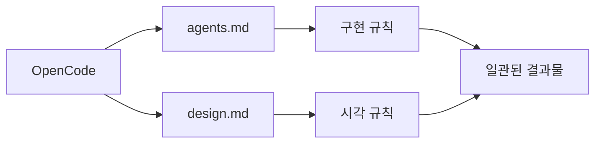
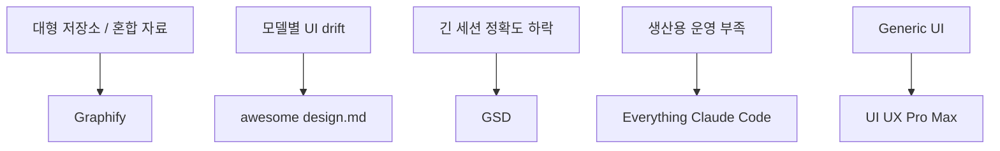

이 영상의 핵심은 “좋은 스킬 5개 추천”에서 끝나지 않는다.  
진짜 포인트는 **OpenCode가 Claude Code 계열 스킬 생태계를 거의 그대로 읽어 들일 수 있기 때문에, 스킬을 붙이는 순간 워크플로가 급격히 강해진다**는 데 있다.

즉 OpenCode의 가치는 기본 모델 품질만이 아니라, **필요할 때만 불러오는 skill layer**를 얼마나 잘 얹느냐에 달려 있다는 해석이다.

<!--more-->

## Sources

- YouTube: <https://www.youtube.com/watch?v=iYpHOxgZjUE>

## 1. 영상의 가장 중요한 포인트: OpenCode는 스킬을 “지연 로딩”한다

영상은 OpenCode의 스킬 구조를 먼저 설명한다.

- 스킬은 instructions, scripts, reference material을 묶은 폴더다
- OpenCode는 스킬 이름과 설명만 먼저 보고
- 실제 전체 내용은 필요할 때만 native skill tool로 불러온다

이게 중요한 이유는 분명하다.

모든 규칙과 참고 자료를 한 번에 프롬프트에 밀어 넣는 대신, **필요할 때만 관련 지식을 꺼내 쓰기 때문에 컨텍스트 창이 덜 더러워진다.**

게다가 영상에 따르면 OpenCode는:

- `.opencode/skills`
- `.claude/skills`
- `.agents/skills`
- 그리고 홈 디렉터리의 글로벌 스킬 위치들

까지 읽을 수 있어서, Claude Code용으로 만들어진 많은 스킬이 거의 수정 없이 재사용된다.

즉 OpenCode는 단순 경쟁 제품이 아니라, **스킬 생태계를 흡수하는 런타임**에 가깝다.

## 2. 첫 번째 스킬: Graphify

영상에서 가장 먼저 나오는 스킬은 `Graphify`다.  
우리가 이미 여러 번 다뤘듯, 이 도구는 코드·문서·PDF·이미지·영상까지 포함한 혼합 코퍼스를 그래프로 바꿔 준다.

OpenCode에서 이게 특히 중요한 이유는, 큰 저장소를 다룰 때 에이전트가 매 턴 grep과 파일 열람을 반복하며 토큰을 태우기 때문이다.

영상은 Graphify의 장점을 이렇게 본다.

- 첫 빌드 후에는 follow-up 질문마다 raw files 대신 compact graph를 읽는다
- watch mode로 자동 갱신된다
- 작은 컨텍스트 모델을 쓸 때 특히 가치가 커진다

즉 OpenCode에서 Graphify는 “검색 도구”보다 **토큰 절약형 지식 레이어**로 작동한다.

## 3. 두 번째 스킬: awesome design.md

두 번째로 소개되는 것은 `awesome design.md`다.  
핵심은 Google의 `design.md` 포맷을 실제 유명 서비스의 디자인 시스템 샘플로 큐레이션해 두었다는 점이다.

영상이 여기서 짚는 중요한 문제는 모델이 달라질 때 생기는 **시각적 drift**다.

- GPT는 자기식 기본 UI를 만들고
- Claude는 또 다른 기본 스타일을 만들고
- Gemini도 또 다르게 만든다

하지만 프로젝트 루트에 `design.md`를 고정해 두면, 어떤 모델을 쓰더라도 출력 UI가 비슷한 톤을 유지한다.

이건 OpenCode처럼 provider-agnostic 환경에서 특히 중요하다.  
즉 OpenCode + `agents.md` + `design.md` 조합은

- `agents.md` = 어떻게 만들지
- `design.md` = 어떻게 보여야 할지

를 나눠서 고정해 준다.

## 4. 세 번째 스킬: GSD

영상은 `GSD`를 OpenCode에서 특히 잘 맞는 스킬로 본다.  
이유는 우리가 익히 본 문제, 즉 `context rot` 때문이다.

긴 프로젝트 세션에서는:

- 오래된 계획
- 반쯤 끝난 태스크
- 모델의 자기 대화

가 쌓이면서 정확도가 무너진다.

GSD는 이를 해결하기 위해

- 새 프로젝트 질문
- requirements / roadmap 생성
- discuss
- plan
- execute
- verify
- ship

같은 흐름으로 작업을 나눈다.

특히 영상이 강조하는 건 OpenCode의 plan mode와 잘 맞는다는 점이다.

- plan mode에서는 읽기 전용으로 구조를 고민하고
- build mode에서 실제 실행으로 넘어간다

즉 OpenCode + GSD 조합은 **긴 세션을 통째로 버티려 하지 않고, phase와 fresh context로 쪼개는 전략**이다.

## 5. 네 번째 스킬: Everything Claude Code

네 번째는 `Everything Claude Code`라는 거대한 하네스형 묶음이다.  
영상 설명을 보면 이건 단일 스킬보다는:

- specialized agents
- skills
- hooks
- rules
- MCP configs

를 묶은 **종합 운영체계**에 가깝다.

OpenCode에서 중요한 이유는, 이름은 Claude Code 쪽이지만 실제로는 `.claude/skills`를 OpenCode가 읽을 수 있기 때문에 많은 자산이 그대로 들어온다는 점이다.

영상이 강조하는 활용 포인트는:

- TDD workflow
- code reviewer agent
- build error resolver
- continuous learning
- security scanner

같은 생산용 하네스 기능이다.

즉 이 스킬 묶음은 OpenCode를 그냥 실행기에서 **production-grade harness**로 끌어올리는 역할을 한다.

## 6. 다섯 번째 스킬: UI UX Pro Max

마지막은 `UI UX Pro Max`다.  
이 스킬은 매우 좁고 선명한 문제를 푼다.

**AI가 기본적으로 만드는 UI가 너무 비슷하고 너무 밋밋하다**는 문제다.

영상 설명에 따르면 이 스킬은:

- 업종별 reasoning rules
- 병렬 검색
- 색상/폰트/패턴/타이포 조합
- anti-pattern 차단

을 통해 더 맞춤형 디자인 시스템을 뽑아낸다.

예를 들어:

- 핀테크에는 과도한 보라 그라데이션이나 과한 애니메이션을 피하게 하고
- 뷰티/스파 계열에는 어두운 모드나 네온 감성을 막는 식

이다.

이건 결국 OpenCode에서 모델의 기본 미감을 신뢰하지 않고, **도메인별 디자인 사고를 스킬로 외부화**하는 전략이다.

## 7. 이 다섯 개를 같이 보면 OpenCode의 구조가 보인다

이 다섯 스킬은 각각 다른 병목을 해결한다.

- Graphify = 입력/탐색 비용
- awesome design.md = 시각 일관성
- GSD = context rot
- Everything Claude Code = 운영 하네스
- UI UX Pro Max = 업종별 디자인 차별화

즉 이 영상은 “좋은 스킬”을 소개하는 동시에, OpenCode를 실제로 굴릴 때 필요한 다섯 레이어를 보여 준다.

1. 코드와 자료를 덜 읽게 만들고
2. 디자인 규칙을 고정하고
3. 긴 일을 phase로 나누고
4. 운영용 하네스를 얹고
5. 최종 UI 품질을 보정한다

이렇게 보면 OpenCode는 단독 모델 성능보다 **어떤 스킬 묶음을 얹느냐**가 훨씬 중요해진다.

## 8. 결론

이 영상의 진짜 메시지는 단순하다.

**에이전트는 강하지만, 워크플로가 더 중요하다.**

그리고 OpenCode의 강점은 여기에 있다.

- 스킬을 지연 로딩하고
- 여러 위치의 스킬 폴더를 읽고
- Claude Code 계열 자산을 흡수하고
- 모델이 달라도 같은 하네스를 재사용할 수 있다

즉 OpenCode를 잘 쓴다는 건 프롬프트를 잘 치는 것보다, **그래프·디자인·컨텍스트·하네스·UI 추론을 각각 스킬로 분리해 붙이는 것**에 더 가깝다.
