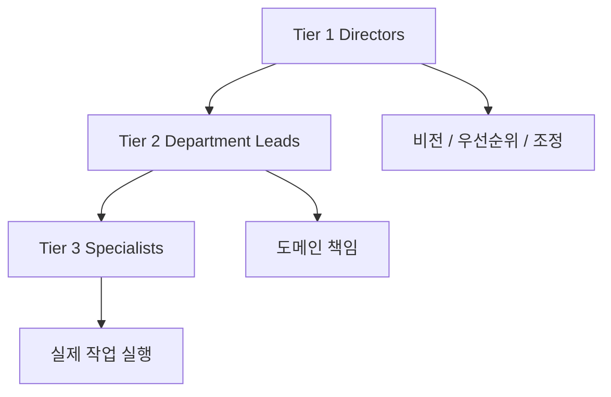
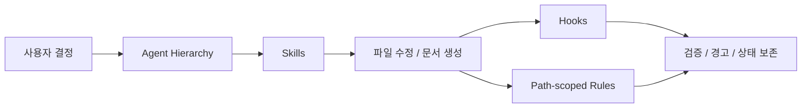

`Claude Code Game Studios`를 처음 보면 숫자부터 눈에 들어온다.  
현재 README 기준으로는 **49개 에이전트, 72개 스킬, 12개 훅, 11개 규칙, 39개 템플릿**이다. 하지만 이 프로젝트의 진짜 흥미로운 점은 숫자가 아니다.

핵심은 **에이전트를 더 자율적으로 만드는 대신, 실제 게임 스튜디오처럼 위계·역할·승인 구조를 설계했다**는 데 있다.

<!--more-->

## Sources

- Threads: <https://www.threads.com/@eddiemoon0720/post/DX1k9OME2IN>
- GitHub: <https://github.com/Donchitos/Claude-Code-Game-Studios>
- README: <https://raw.githubusercontent.com/Donchitos/Claude-Code-Game-Studios/main/README.md>

## 1. 이 프로젝트는 “게임 만들기 스킬 팩”보다 조직 설계에 가깝다

Threads 요약도 잘 짚었지만, 원본 README를 보면 방향이 더 분명하다.

> Turn a single Claude Code session into a full game development studio.

즉 한 세션 안에 단일 범용 어시스턴트를 두는 대신,

- director
- department lead
- specialist

역할을 분리해 **조직 구조를 코드화**한다.

이건 단순 멀티에이전트보다 한 단계 더 나간다.  
보통 멀티에이전트 예시는 “여러 에이전트가 있다”에서 끝나지만, 이 저장소는:

- 누가 누구에게 위임하는지
- 누가 같은 계층에서 자문만 가능한지
- 갈등은 어디로 escalation 되는지
- 어떤 변경은 producer가 조정하는지

까지 정한다.

즉 에이전트가 아니라 **에이전트 운영 규범**을 만든 프로젝트다.

## 2. 가장 중요한 구조는 3계층 위계다

README 기준 계층은 이렇게 잡혀 있다.

### 2-1. Tier 1 — Directors

- `creative-director`
- `technical-director`
- `producer`

이 레이어는 비전, 기술 방향, 조정 역할을 맡는다.

### 2-2. Tier 2 — Department Leads

- game design
- programming
- art
- audio
- narrative
- QA
- release
- localization

등의 책임자를 둔다.

### 2-3. Tier 3 — Specialists

여기에는 실제 실행 담당 역할이 대거 들어간다.

- gameplay programmer
- engine programmer
- AI programmer
- network programmer
- UI programmer
- level designer
- economy designer
- sound designer
- writer
- performance analyst
- devops engineer
- security engineer
- accessibility specialist

등이다.

이 구조의 의미는 명확하다.  
에이전트를 “똑똑한 개인”으로 보는 대신, **의사결정과 실행을 분리한 팀**으로 본다.

## 3. 그런데 더 중요한 건 “자율”이 아니라 “협업 프로토콜”이다

Threads가 강조한 대로, README에는 아주 선명한 문장이 있다.

> This is NOT an auto-pilot system.

이 프로젝트는 자율 에이전트 열풍과 정반대 방향에 서 있다.  
핵심은 5단계 협업 프로토콜이다.

1. Ask
2. Present options
3. You decide
4. Draft
5. Approve

즉 에이전트는 먼저 질문하고, 여러 옵션을 제시하고, **최종 결정은 반드시 사용자가 내리며, 승인 없이는 아무것도 확정하지 않는다.**

이 철학이 중요한 이유는, 대형 게임 프로젝트에서 가장 비싼 실수는 대개

- 코드를 빨리 쓴 것

이 아니라

- 잘못된 결정을 너무 빨리 굳힌 것

이기 때문이다.

## 4. 스킬이 72개나 되는 이유도 결국 공정 분해 때문이다

README를 보면 72개 스킬은 단순 많아 보이려고 넣은 게 아니다.  
게임 개발 공정을 세밀하게 분해한다.

예를 들면:

- onboarding / navigation
- game design
- art & assets
- UX & interface
- architecture
- stories & sprints
- reviews & analysis
- QA & testing
- production
- release
- creative & content
- team orchestration

즉 이 저장소는 “게임을 만든다”를 하나의 명령으로 보지 않고, **기획-설계-자산-구현-검토-릴리스**의 공정으로 나눈다.

특히 `/team-combat`, `/team-ui`, `/team-release` 같은 팀 오케스트레이션 명령은 여러 에이전트를 한 기능 단위로 묶는 패턴을 보여 준다.

## 5. Hooks와 path-scoped rules가 이 프로젝트를 진짜 운영체계처럼 만든다

이 저장소가 인상적인 이유는 agent/skill 숫자보다도 **운영 안전장치**가 많다는 점이다.

README 기준:

- 12 hooks
- 11 path-scoped rules

가 들어 있다.

Hooks는:

- commit / push 전 검증
- asset naming / JSON 구조 확인
- 세션 시작 시 최근 브랜치/커밋 확인
- compact 전후 상태 보존
- subagent audit trail

같은 역할을 한다.

Path-scoped rules는 파일 위치에 따라 다른 기준을 적용한다.

- `src/gameplay/**`
- `src/core/**`
- `src/ai/**`
- `src/networking/**`
- `src/ui/**`
- `design/gdd/**`
- `tests/**`
- `prototypes/**`

등에 서로 다른 제약을 붙인다.

즉 “에이전트가 뭘 할 수 있나”보다 **어디서 무엇을 하면 안 되는가**까지 구조화한다.

## 6. 엔진별 전용 세트가 있다는 점도 실전적이다

이 프로젝트는 게임 개발을 너무 추상적으로만 다루지 않는다.  
README에는 엔진별 specialist 세트가 아예 따로 있다.

- Godot 4
- Unity
- Unreal Engine 5

그리고 각 엔진마다:

- GDScript / Shaders / GDExtension
- DOTS/ECS / Addressables / UI Toolkit
- GAS / Blueprints / Replication / UMG

같은 세부 하위 전문성을 대응시킨다.

이건 중요한 차별점이다.  
많은 agent framework는 “게임 개발”을 한 덩어리로 보지만, 실제 현업에서는 **엔진별로 문제 구조가 완전히 다르다.**

## 7. 이 프로젝트가 주는 인사이트: 자동화의 핵심은 역할 분리다

Threads 작성자가 마지막에 짚은 포인트가 좋다.  
48개나 49개 에이전트를 한 번에 다 쓸 필요는 없다. 오히려 작은 조합부터 시작하면 된다.

예를 들어:

- `/brainstorm`
- `/sprint-plan`
- `/code-review`

정도만 써도 이미

- 기획
- 실행 계획
- 검토

가 분리된다.

즉 이 저장소의 진짜 교훈은 “많이 깔자”가 아니라, **중요한 의사결정과 실행 단계를 역할별로 분리하라**에 가깝다.

## 8. 결론

`Claude Code Game Studios`는 단순히 Claude Code를 게임 제작에 쓰는 템플릿이 아니다.  
진짜 의미는 **AI를 자율 비서로 대하는 대신, 실제 조직처럼 위계·승인·검증 구조를 가진 팀으로 설계한다**는 데 있다.

그래서 이 저장소가 흥미로운 이유도 여기 있다.

- 더 많은 자율성

이 아니라,

- 더 나은 역할 분리
- 더 명확한 escalation
- 더 강한 승인 루프
- 더 촘촘한 운영 가드레일

을 제안하기 때문이다.

게임 개발이든 다른 도메인이든, 앞으로 멀티에이전트 시스템에서 중요한 건 “몇 개의 에이전트를 썼는가”보다 **누가 무엇을 결정하고 누가 무엇을 검증하는가**일 가능성이 크다.
