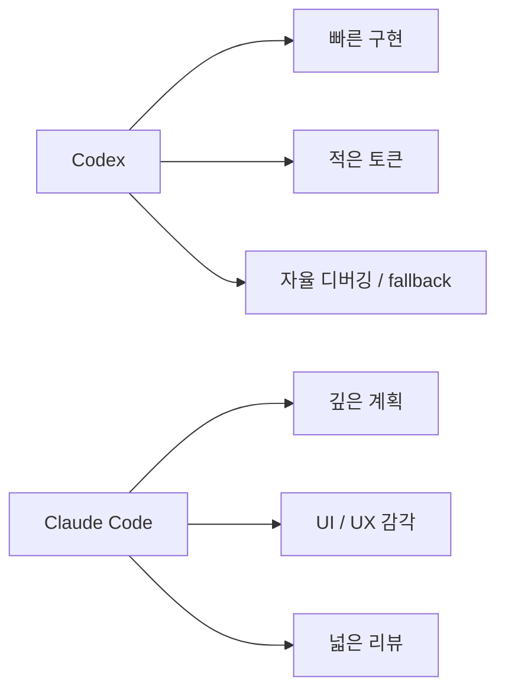
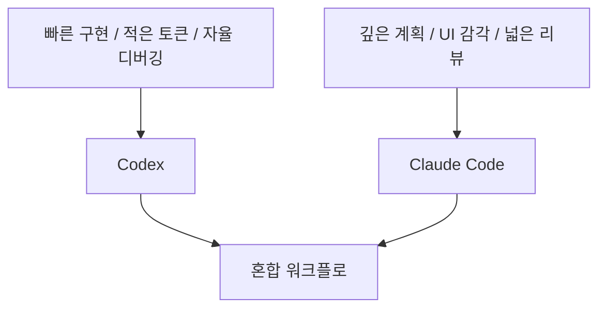

이 영상의 제목은 “논쟁이 끝났다”고 말하지만, 실제 결론은 더 미묘하다.  
영상이 보여 주는 건 단순 승패가 아니라 **Claude Code와 Codex가 서로 다른 종류의 엔지니어처럼 행동한다**는 점이다.

즉 하나를 고르면 다른 하나가 완전히 쓸모없어지는 게 아니라,

- Codex는 더 빠르고 더 자율적인 백엔드형
- Claude Code는 더 깊게 계획하고 UI까지 챙기는 풀스택형

이라는 분업에 가깝다.

<!--more-->

## Sources

- YouTube: <https://www.youtube.com/watch?v=8ImlAQOyVTs>

## 1. 영상의 출발점: 이제는 모델보다 CLI와 하네스까지 같이 비교해야 한다

영상은 GPT 5.5와 Opus 4.7을 비교하지만, 실제 비교 단위는 모델 그 자체가 아니다.  
핵심은 각 모델이 자기에게 최적화된 CLI, 즉 `Codex`와 `Claude Code` 안에서 어떻게 일하는가다.

이건 중요하다.  
이제 코딩 에이전트의 성능은 모델 단독보다:

- UI / TUI
- 권한 처리
- 기본 스킬
- 브라우저 검증
- 계획 모드
- 컨텍스트 관리

같은 하네스 레이어에 크게 좌우되기 때문이다.

## 2. 영상이 본 첫 번째 차이: 사용성은 Codex 쪽이 더 매끄럽다

영상은 Claude Code 쪽 사용성이 최근 더 불안정해졌다고 본다.

- TUI 렌더링 문제
- 긴 세션에서의 버그
- 권한 프롬프트 흐름

같은 부분이 대표적이다.

반대로 Codex는:

- Rust 기반 CLI
- 더 부드러운 UI
- YOLO mode의 단순성

덕분에 한 번 돌려 놓았을 때 **덜 막히고 덜 멈춘다**는 인상을 준다고 평가한다.

즉 이 영상 기준으로 Codex의 강점은 모델 품질 이전에, **도구가 계속 일하게 만드는 운용 감각**에 있다.

## 3. 비용과 토큰 효율에서는 Codex가 더 유리하다는 주장

영상은 같은 규모의 작업에서 토큰 사용량도 비교한다.

- Opus 4.7: 173,000 tokens
- GPT 5.5: 82,000 tokens

이라는 예시를 들면서, GPT 5.5가 더 적은 토큰과 더 적은 retry로 일을 끝냈다고 본다.

이 비교가 의미하는 건 단순 가격표 차이가 아니다.  
핵심은 **같은 작업을 얼마나 적은 시행착오로 끝내는가**다.

즉 Codex는 “더 싸다”보다 **더 적은 토큰으로 더 빨리 돌파하는 경향**이 있다는 식의 해석이다.

## 4. 하지만 계획(planning)은 Claude Code 쪽이 더 깊다

여기서부터 균형이 잡힌다.  
영상은 planning quality에서는 Claude Code가 여전히 강하다고 본다.

예를 들어 기존 백엔드가 있는 프로젝트에 프런트엔드를 붙이는 작업에서:

- Codex는 빠르게 계획하고 8분 만에 끝냈지만
- Claude Code는 24분 정도 걸렸고
- 대신 계획이 훨씬 더 깊고 UX까지 더 많이 고려했다고 평가한다

즉 Codex는 빠르게 핵심 흐름을 잡고 구현하는 쪽, Claude Code는 **더 넓은 고려사항을 끌어와 설계를 풍부하게 하는 쪽**이라는 것이다.

## 5. greenfield 구현에서는 Codex가 더 자율적이고, Claude Code는 더 설계 지향적이다

영상의 greenfield 테스트도 이 차이를 잘 보여 준다.

같은 요구사항을 줬을 때:

- Codex는 planning mode로 길게 멈추지 않고 바로 구현에 들어간다
- Claude Code는 더 많이 계획하고 천천히 들어간다

흥미로운 건 fallback 처리다.

영상에서는 Codex가 API key가 없는 상황에서도 로컬 fallback을 둬서 앱이 완전히 죽지 않게 만든 반면, Claude Code는 필요한 전제가 다 준비되길 기다리는 쪽에 더 가까웠다고 평가한다.

즉 Codex는 **빈틈을 메우는 실행형**, Claude Code는 **전제를 먼저 맞추는 설계형**에 가깝다.

## 6. 디버깅 성향도 다르다: Codex는 직접 뒤지고, Claude는 사용자와 대화한다

영상에서 아주 재미있는 비교는 디버깅 방식이다.

- Codex는 browser/agent 도구를 통해 스스로 구현을 더 직접 조사하는 쪽
- Claude Code는 사용자에게 상태를 묻고, 디버그 포인트와 로그를 추가해 함께 원인을 좁히는 쪽

이다.

이 차이는 단순 성격 차이가 아니라, 실제 협업 방식 차이다.

- Codex = “내가 좀 더 혼자 파고들게”
- Claude = “같이 증상을 확인하면서 풀자”

즉 자율성에서는 Codex가 더 세고, **사람과의 협업형 디버깅**에서는 Claude Code가 더 익숙한 느낌을 준다.

## 7. init와 리뷰에서도 차이가 있다

영상은 `init`와 `code review`도 비교한다.

### 7-1. init

Claude Code의 init은 비교적 길고 구조 설명이 많은 `claude.md`를 만든다.  
Codex는 더 간결하게 정리하면서:

- commit guideline
- PR guideline
- security instruction

같은 운영 규칙을 더 세련되게 담는다고 평가한다.

즉 Codex는 초기 설정에서도 **짧고 운영 중심**인 인상을 준다.

### 7-2. code review

반면 리뷰 자체는 Claude Code가 더 넓고 자세하게 나온다고 본다.

- 우선순위 구분
- 코드 스니펫 포함
- 더 많은 이슈 탐지

같은 면에서 Claude가 더 세다.

하지만 Codex는 요청한 범위, 예를 들어 reliability review라면 **그 범위를 더 엄격히 지키는** 쪽으로 평가된다.

즉:

- Claude Code = 더 넓고 자세한 리뷰
- Codex = 더 범위에 충실한 리뷰

라는 차이가 생긴다.

## 8. 영상의 가장 좋은 한 줄 요약: 백엔드형 vs 풀스택형

영상은 마지막에 두 모델의 성격을 꽤 잘 요약한다.

- GPT 5.5 / Codex는 기능을 빠르게 제대로 만드는 백엔드 엔지니어 느낌
- Opus 4.7 / Claude Code는 기능성과 사용자 경험을 함께 챙기는 풀스택 엔지니어 느낌

이 비유가 좋은 이유는, “누가 더 좋다”를 넘어서 **무엇을 우선하는가**를 보여 주기 때문이다.

## 9. 그래서 실제 워크플로에서는 둘을 섞는 게 자연스럽다

이 영상만 봐도 결론은 이미 드러난다.

- 빠른 구현
- 적은 토큰
- fallback과 자율 디버깅

이 중요하면 Codex가 좋고,

- 깊은 planning
- UI/UX 감각
- 넓은 리뷰

가 중요하면 Claude Code가 좋다.

즉 둘은 승자독식이 아니라:

- Codex로 뼈대를 빠르게 만들고
- Claude Code로 UX와 계획을 보강하거나
- Claude Code로 설계하고 Codex로 구현 속도를 내는

식의 조합이 자연스럽다.

## 10. 결론

이 영상의 진짜 결론은 “논쟁이 끝났다”가 아니다.  
오히려 더 정확한 결론은 이것이다.

**Claude Code와 Codex는 이제 거의 같은 문제를 푸는 도구가 아니라, 서로 다른 작업 스타일을 가진 엔지니어처럼 봐야 한다.**

그래서 선택 기준도 단순해진다.

- 더 빠르게 기능을 만들고 싶나?
- 더 적은 토큰으로 오래 가고 싶나?
- 자율 디버깅과 fallback이 중요한가?

그렇다면 Codex.

- 더 깊게 계획하고 싶나?
- UI/UX를 함께 챙기고 싶나?
- 더 넓고 자세한 리뷰가 필요한가?

그렇다면 Claude Code.

결국 중요한 건 승패보다, **내 워크플로에서 어느 역할을 누구에게 맡길 것인가**다.
