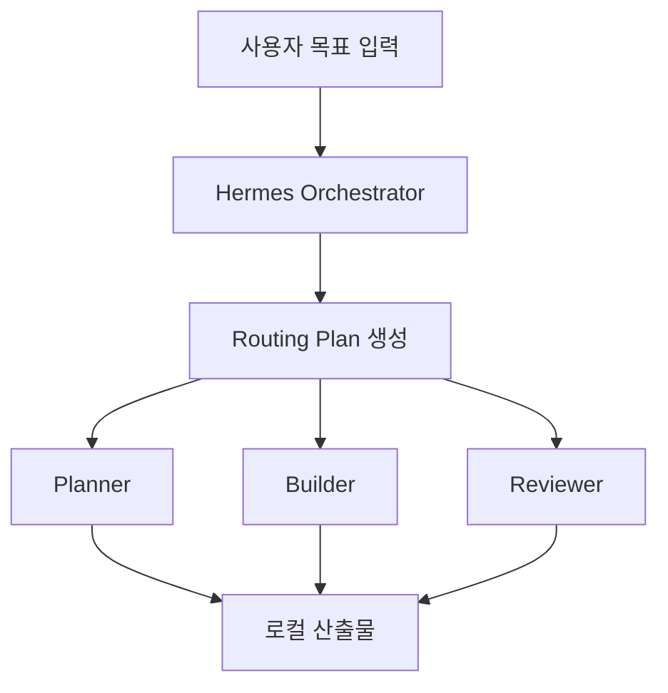
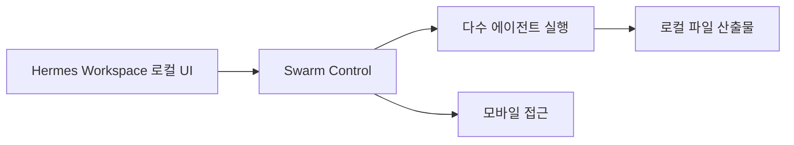

이 영상의 핵심은 Hermes가 새로 똑똑해졌다는 데 있지 않다.  
핵심은 **에이전트를 하나씩 순서대로 쓰는 대신, 로컬 워크스페이스 안에서 여러 역할을 동시에 돌리는 `swarm mode`가 들어왔다는 것**이다.

즉 Hermes는 더 이상 단일 에이전트 앱이라기보다, **오케스트레이터가 전문가 팀을 자동 라우팅하는 로컬 컨트롤 플레인**에 가까워진다.

<!--more-->

## Sources

- YouTube: <https://www.youtube.com/watch?v=pSzeCN4NoBU>

## 1. 문제 정의가 명확하다: 에이전트가 느린 이유는 다 한 명이 하기 때문이다

영상은 기존 불만을 아주 명확하게 잡는다.

- 한 에이전트가 계획도 세우고
- 구현도 하고
- 리뷰도 하고
- 검토도 하고

모든 걸 순차적으로 처리하면 당연히 느려진다.

그래서 `swarm mode`의 발상은 단순하다.

- planner
- builder
- reviewer

같은 역할을 나눠서 **동시에 움직이게 하자**는 것이다.

이건 사실 우리가 최근 계속 다뤘던 역할 분리 흐름과 정확히 맞닿아 있다.  
다만 Hermes는 그걸 CLI 해킹이 아니라 **UI와 control plane이 있는 로컬 도구** 안에서 구현한다는 점이 다르다.

## 2. Hermes Workspace + Swarm의 핵심은 “오케스트레이터가 목표를 받아 자동 라우팅한다”는 점이다

영상 설명을 따르면, 사용자는 목표만 주면 된다.

예:

- 블로그를 만들어라
- 키워드 전략을 세워라
- 콘텐츠 캘린더를 만들어라

그러면 swarm 오케스트레이터가:

1. 목표를 읽고
2. 필요한 역할을 조합하고
3. 각 에이전트에 미션을 나누고
4. 병렬로 실행을 시작한다

즉 사용자 입장에서는 “팀 구성”을 일일이 짜지 않아도, **goal → routing plan → specialist execution** 흐름이 자동으로 이어진다.

## 3. 기존 Hermes WebUI 글과 다른 지점: 이번엔 control panel이 아니라 병렬 운영 그 자체다

우리가 전에 다뤘던 Hermes + WebUI 흐름은

- 가시성
- 스케줄링
- 메모리
- 운영 통제

에 더 가까웠다.

이번 영상의 새 포인트는 그 위에 **동시 실행되는 agent swarms**가 올라왔다는 점이다.

즉 WebUI가 “운영 가능한 시스템”을 만들었다면, Swarm Mode는 거기서 한 걸음 더 나아가 **조직형 병렬 실행기**를 붙인 셈이다.

## 4. UI가 중요한 이유: swarm은 추상 개념이 아니라 실제 제어 가능한 오피스처럼 보인다

영상에서 인상적인 부분은 swarm UI의 시각화다.

- swarm 목록
- worker 역할
- blocked / ready 상태
- office view
- round table / grid view
- 개별 agent terminal

이런 인터페이스가 나온다.

이건 단순 예쁨 문제가 아니다.  
멀티에이전트는 보통 내부적으로는 돌아가도, 사람이 보기엔 “대체 누가 뭘 하고 있지?”가 불투명하다.  
Hermes는 그걸 **오피스처럼 보이게** 만든다.

즉 swarm mode의 실전성은 병렬성뿐 아니라, **사람이 관찰하고 개입할 수 있는 시각적 control plane**에 있다.

## 5. 역할 프리셋 + 커스텀 에이전트가 같이 있다는 점도 실용적이다

영상에 따르면 새 swarm을 추가할 때:

- builder
- reviewer
- triage
- 기타 preset role

를 선택할 수 있고, 각 역할에는 미리 system prompt와 skills가 붙어 있다.

동시에 완전 커스텀 에이전트도 만들 수 있다.

- system prompt
- mission
- skill set

을 바꿔 넣는 식이다.

이건 중요하다.  
좋은 멀티에이전트 시스템은 프리셋만 강요해도 안 되고, 완전 자유만 줘도 운영이 어려운데, Hermes는 **preset + custom의 중간지대**를 노린다.

## 6. 로컬 출력과 모바일 접근이 같이 붙는 점이 의외로 강하다

영상은 두 가지를 특히 강조한다.

### 6-1. 산출물이 로컬에 떨어진다

작성된 콘텐츠, 계획, 전략 파일이 로컬 디렉터리에 바로 생긴다.  
즉 swarm은 웹 SaaS 안에서만 끝나는 것이 아니라, **내 작업 디렉터리에 파일을 남기는 도구**다.

### 6-2. 모바일에서도 접근할 수 있다

로컬 워크스페이스이지만 모바일 접근까지 붙어 있어서, 에이전트 팀을 폰에서 확인하고 돌릴 수 있다는 점을 밀고 있다.

이건 결과적으로 swarm을 “한 번 실행하는 데모”보다 **상시 돌아가는 운영 시스템**처럼 보이게 만든다.

## 7. 영상 데모가 보여 주는 건 사실 SEO 팀이지, 기능보다 패턴이다

데모에서는 SEO용 블로그, 키워드 전략, 콘텐츠 캘린더, 내부 링크 전략 등을 swarm이 만들어 낸다.  
하지만 중요한 건 SEO 자체가 아니다.

중요한 건 이 패턴이다.

- 한 에이전트는 키워드 조사
- 한 에이전트는 콘텐츠 작성
- 한 에이전트는 내부 링크 전략
- 한 에이전트는 계획 정리

를 동시에 수행하고, 최종적으로 하나의 로컬 산출물 묶음으로 남긴다는 점이다.

즉 swarm mode는 특정 산업 기능이 아니라, **복수 역할을 가진 작업팀 패턴**을 제공한다.

## 8. 다만 영상도 안정성 문제는 인정한다

좋은 점만 있는 건 아니다.  
영상에서도 새 swarm feature가 약간 buggy할 수 있다고 경고한다.

예를 들면:

- 어떤 agent가 blocked 상태가 되거나
- 잘못된 API 설정으로 멈추거나
- 개별 설정을 다시 확인해야 하는 상황

이 생길 수 있다.

이건 오히려 중요한 신호다.  
멀티에이전트 시스템이 강력할수록, single-agent보다 설정과 관측 가능성이 더 중요해진다.  
Hermes가 UI를 밀어 주는 이유도 바로 여기에 있다.

## 9. 결론

이 영상의 핵심은 단순하다.

**에이전트를 더 똑똑하게 만드는 것보다, 여러 에이전트를 어떻게 팀처럼 조정할지가 더 중요해지고 있다.**

Hermes Swarm Mode는 그 변화의 한 예다.

- 목표를 주면
- 오케스트레이터가 역할을 라우팅하고
- 여러 에이전트가 동시에 일하고
- 사람이 UI에서 상태를 보고 개입하고
- 산출물은 로컬에 남는다

즉 Hermes는 단일 AI 비서에서, **로컬에서 운영되는 다중 에이전트 팀 매니저** 쪽으로 성격이 바뀌고 있다.
