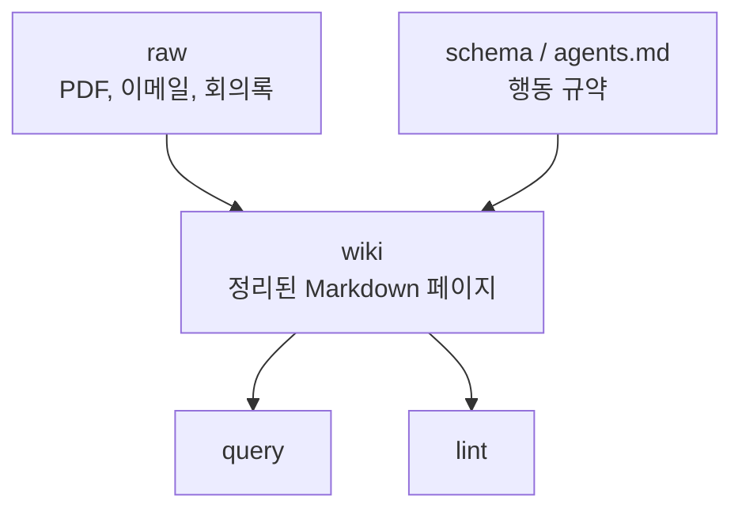
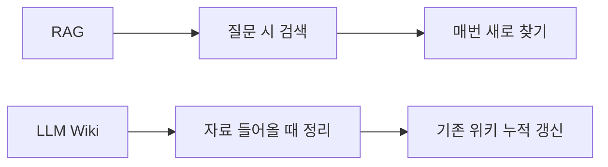

이 영상의 핵심은 “또 하나의 AI 지식관리 앱이 나왔다”가 아니다.  
핵심은 **Andrej Karpathy가 던진 `LLM Wiki` 아이디어가 왜 RAG와 다른지**를 선명하게 설명한다는 데 있다.

즉 이 영상은 LLM Wiki를 어떤 특정 제품명이 아니라, **지식을 축적하는 방식 자체를 바꾸는 패턴**으로 본다.

<!--more-->

## Sources

- YouTube: <https://www.youtube.com/watch?v=0vesaDsVX-Q>

## 1. 먼저 정리할 것: LLM Wiki는 공식 제품명이 아니다

영상은 이 부분부터 명확히 짚는다.

- `LLM Wiki`는 특정 SaaS 이름이 아니다
- Karpathy가 올린 것은 공식 레포가 아니라 gist 수준의 아이디어 파일이다
- 지금 GitHub에 보이는 여러 `llm-wiki`, `llm-wiki-agent`, `llm-wiki-compiler` 류는 커뮤니티 구현체들이다

이건 중요하다.  
즉 우리가 이야기하는 것은 제품 비교가 아니라, **하나의 구조적 패턴**이다.

## 2. 핵심 정의: LLM이 지속적으로 유지하고 확장하는 영속적 개인 위키

영상이 정리한 LLM Wiki의 핵심 문장은 이것이다.

**LLM이 지속적으로 유지하고 확장하는 영속적인 개인 위키를 만들자.**

이 정의가 중요한 이유는, 여기서 주체가 바뀌기 때문이다.

- 기존 PKM에서는 사람이 노트를 쓰고 연결한다
- RAG에서는 시스템이 질문이 들어올 때 검색한다
- LLM Wiki에서는 LLM이 raw 자료를 읽고 위키 페이지를 계속 갱신한다

즉 “질문할 때만 잠깐 똑똑해지는 시스템”이 아니라, **평소에도 지식 구조를 미리 써 두는 시스템**으로 보는 것이다.

## 3. 구조는 3계층이다: raw, wiki, schema

영상은 LLM Wiki를 세 층으로 설명한다.

### 3-1. raw

- PDF
- 이메일
- 회의록
- 원문 자료

를 그대로 쌓아 두는 불변 입력층이다.

### 3-2. wiki

이게 핵심이다.  
LLM이 raw를 읽고 정리한 마크다운 페이지들이 여기에 쌓인다.

- `transformer.md`
- `attention.md`
- `optimizer.md`
- `index.md`
- `log.md`

같은 식이다.

### 3-3. schema

`agents.md` 같은 파일로, LLM이 위키를 어떤 규칙으로 유지할지 정의한다.

즉:

- raw = 원자료
- wiki = 정리된 지식
- schema = 정리 방식과 행동 규약

이다.

## 4. 연산은 3개뿐이다: ingest, query, lint

영상이 정리한 연산은 놀랄 만큼 단순하다.

### 4-1. ingest

새 raw 자료를 흡수해 wiki를 갱신한다.

### 4-2. query

사용자 질문에 대해 wiki를 바탕으로 답한다.

### 4-3. lint

위키 내부의 모순, 충돌, 불일치를 찾는다.

이 셋만으로 꽤 많은 것이 가능해진다.  
즉 LLM Wiki의 핵심은 엄청난 기능 수가 아니라, **지식이 계속 다시 쓰이고 검토되는 루프**다.

## 5. RAG와 가장 큰 차이는 “언제 일하느냐”다

영상은 LLM Wiki와 RAG의 차이를 아주 잘 설명한다.

- RAG는 질문이 들어오면 그때 검색을 한다
- LLM Wiki는 자료가 들어오는 순간부터 위키를 갱신한다

이 차이를 한 문장으로 줄이면:

**RAG는 query-time 검색, LLM Wiki는 ingest-time 정리**다.

이건 생각보다 큰 차이다.

RAG는 매번 도서관에서 책을 다시 찾는 느낌이라면,  
LLM Wiki는 전담 사서가 새 책이 들어올 때마다 서가와 색인을 업데이트해 두는 느낌에 가깝다.

즉 LLM Wiki는 답을 “찾는” 시스템보다, **미리 정리해 두는 시스템**이다.

## 6. 또 다른 차이: 저장과 업데이트 방식이 다르다

RAG는 보통 벡터 인덱스를 중심으로 움직인다.  
반면 영상이 설명하는 LLM Wiki는 훨씬 전통적인 방식에 가깝다.

- `index.md`
- `log.md`
- 개념별 페이지

를 마크다운 파일로 유지한다.

이건 반직관적으로 들릴 수 있다.  
하지만 장점도 분명하다.

- 사람이 읽을 수 있다
- 변경 이력이 보인다
- 링크 구조가 눈에 들어온다
- 누적 수정이 된다

즉 LLM Wiki는 벡터 저장소보다 **사람과 LLM이 함께 편집하는 문서 지식 베이스**에 더 가깝다.

## 7. 영상의 좋은 점: 스케일 한계를 분명히 말한다

이 영상은 과장하지 않는다.  
오히려 중요한 비판을 세 가지로 정리한다.

### 7-1. 최종 신뢰 책임은 인간에게 남는다

LLM이 위키를 유지해도, 그 위키가 맞는지 틀린지는 사람이 검토해야 한다.

### 7-2. lint가 완벽하지 않다

모순 검출이 유용하긴 해도, 모든 불일치를 다 잡아낸다고 장담할 수는 없다.  
오히려 “모순 없음”이라는 거짓 안심을 줄 위험도 있다.

### 7-3. moderate scale에 더 적합하다

영상은 개인/팀 수준의 지식 관리에는 자연스럽지만, 거대한 엔터프라이즈 문서 저장소 전체를 이 방식으로 바로 대체하긴 아직 이르다고 본다.

즉 결론은 “RAG는 죽었다”가 아니다.  
정확한 포지셔닝은:

- 대규모 엔터프라이즈 검색 = 여전히 RAG / 하이브리드 검색 중심
- 개인·팀 단위 누적 지식 관리 = LLM Wiki 패턴이 더 자연스러울 수 있음

이다.

## 8. 구현 방식은 셋으로 갈린다: 로컬, 옵시디언, MCP

영상은 구현 환경도 세 가지로 정리한다.

### 8-1. 로컬 파일 시스템 + CLI

가장 단순한 방식이다.

- `raw`
- `wiki`
- `schema`

폴더를 만들고, Claude Code나 Codex 같은 CLI 에이전트에게 ingest/update를 시킨다.

### 8-2. Obsidian 볼트

우리가 이미 여러 번 봤던 구조와도 연결된다.  
볼트 안에서 그래프 뷰와 링크 구조를 활용하면, 사람이 보기에도 가장 직관적이다.

### 8-3. MCP 서버

위키 파일은 그대로 두고, 그 위에 MCP를 얹어 Claude Desktop이나 Cursor 같은 도구에서 툴처럼 접근하는 방식이다.

즉 본질은 같고, **어떤 UI와 런타임으로 붙이느냐만 다르다.**

## 9. 기존 LLM 위키/옵시디언 글과 이번 영상의 차별점

우리가 앞서 다뤘던 관련 글들은 주로:

- raw → wiki → Claude.md 구조
- ingest 자동화
- 제텔카스텐 자동화

에 가까웠다.

이번 영상이 더 좋았던 부분은, 그 구조를 `RAG와 대비되는 패턴 언어`로 설명했다는 점이다.

즉 “예쁜 지식 시스템”이 아니라:

- query-time vs ingest-time
- 검색 중심 vs 누적 재작성 중심
- 엔터프라이즈 규모 vs moderate scale

라는 좌표계를 제공한다.

## 10. 결론

이 영상이 말하는 LLM Wiki의 본질은 이것이다.

**질문이 들어올 때마다 다시 찾는 대신, 자료가 들어올 때마다 위키를 다시 써서 지식을 누적하자.**

그래서 이 패턴이 강한 곳도 분명하다.

- 연구자
- 리뷰어
- PM / 기획자
- 뉴스레터 작성자
- 개인 지식 오너

반대로 대규모 FAQ, 기업 전체 검색, 매우 큰 문서 저장소라면 아직은 RAG 쪽이 더 자연스럽다.

즉 LLM Wiki는 RAG의 대체재라기보다, **개인과 팀 단위에서 지식을 살아 있는 문서로 축적하는 또 다른 기억 아키텍처**에 가깝다.
