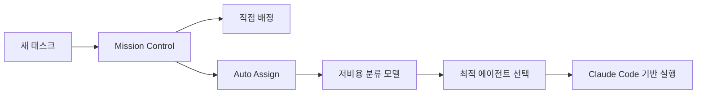

이 영상의 핵심은 “Claude Code로 앱을 만든다”가 아니다.  
핵심은 **Claude Code를 중심으로 여러 에이전트, 메모리, 대시보드, 스케줄러, 메시징 인터페이스를 엮어서 비즈니스 운영체계처럼 쓴다**는 데 있다.

즉 여기서 Claude Code는 개발 도구가 아니라, **디지털 조직의 실행 엔진**으로 바뀐다.

<!--more-->

## Sources

- YouTube: <https://www.youtube.com/watch?v=7aQbN543Mec>

## 1. 이 영상의 첫 장면이 말하는 것: 핵심은 하이브마인드다

영상은 `hive mind`라는 개념으로 시작한다.  
설명 그대로 보면, 이건 여러 에이전트가 각자 수행한 작업과 지식을 공유하는 **공통 메모리 상태**에 가깝다.

- 각 노드는 완료된 작업
- 각 에이전트는 디지털 브레인의 서로 다른 부분
- 전체 활동은 그래프나 리스트 뷰로 관찰 가능

즉 “AI 팀”을 말할 때 대부분 사람은 여러 에이전트를 띄우는 것까지만 생각한다.  
하지만 이 영상은 거기서 한 발 더 나아간다.

**여러 에이전트가 무엇을 알고 있고, 무슨 일을 했는지 한눈에 보이는 공유 기억층**이 필요하다는 것이다.

## 2. 워룸은 에이전트 채팅방이 아니라 운영 인터페이스다

영상에서 또 중요한 개념은 `war room`이다.

이건 단순 채팅창이 아니다.  
역할은 훨씬 더 운영적이다.

- 여러 에이전트의 최근 작업 상태를 한 번에 보고
- `/standup` 같은 명령으로 각자의 24시간 상태를 받고
- 메타 에이전트가 나머지 에이전트들의 응답을 종합해 요약한다

즉 war room은 “AI와 대화하는 곳”이 아니라, **조직 운영 회의실**에 가깝다.

이 구조가 중요한 이유는, 여러 에이전트를 돌리기 시작하면 곧바로  
“그래서 누가 지금 뭘 했지?”가 가장 큰 병목이 되기 때문이다.

```mermaid
flowchart TD
    A[Hive Mind] --> B[War Room]
    B --> C[/standup]
    C --> D[개별 에이전트 상태 보고]
    D --> E[메타 에이전트 종합]
    E --> F[사용자 의사결정]
```

## 3. 영상의 중요한 전제: 이것은 AI OS가 아니라 ‘데이터 조직화’ 문제다

발표자는 이 시스템을 거창한 AI OS로 포장하기보다, 결국은 **데이터 조직화 문제**라고 말한다.

이 해석이 좋다.  
왜냐하면 이런 시스템의 진짜 핵심은 모델 그 자체보다:

- 어떤 에이전트가 있고
- 어떤 기억을 공유하고
- 어떤 인터페이스에서 호출되고
- 어떤 작업이 어떤 큐로 들어가고
- 어떤 결과가 어디에 쌓이는지

를 정리하는 데 있기 때문이다.

즉 비즈니스용 AI 시스템의 핵심은 “더 똑똑한 모델”보다 **더 잘 정리된 작업·기억·인터페이스 구조**에 있다.

## 4. Claude Code는 여기서 백엔드 엔진처럼 동작한다

영상의 설명을 보면, 이 구조의 바닥에는 여전히 Claude Code가 있다.

- 기존 Claude Code subscription
- 기존 Claude Code ecosystem
- 기존 skills / plugins / CLI integrations

를 연결해 두고, 그 위에 Telegram 같은 외부 인터페이스와 에이전트 팀을 붙이는 방식이다.

즉 중요한 포인트는 새 운영체계를 처음부터 만드는 게 아니라,  
**이미 있는 Claude Code 인프라를 공유 백엔드처럼 재사용한다**는 데 있다.

그래서 에이전트 하나하나가 별도 도구가 아니라, Claude Code에 연결된:

- skills
- CLI access
- integrations
- permissions

을 전부 상속받는다.

## 5. 비즈니스 사례가 흥미로운 이유: 메타 광고 운영을 하나의 agent skill chain으로 만든다

영상은 실전 예로 meta ads 운영을 보여 준다.

구조는 이렇다.

1. Meta CLI를 통해 광고 성과 데이터를 읽는다
2. 전용 meta ads skill이 리포트 형식으로 정리한다
3. 아침 7:30에 스케줄링해서 자동 발송한다
4. 필요하면 어떤 광고가 이기는지, 어떤 크리에이티브가 필요한지 후속 질의를 한다
5. 심지어 새 creative 제작까지 다른 스킬과 연결한다

즉 단일 리포트 자동화가 아니라:

- 데이터 수집
- 요약
- 해석
- 후속 실행

이 연결된 **업무 루프**다.

이게 중요한 이유는, 많은 “AI 자동화”가 사실 보고서 생성에서 끝나기 때문이다.  
반면 이 시스템은 보고서를 넘어 **운영 의사결정의 인터페이스**를 만든다.

## 6. 미션 컨트롤은 칸반 보드가 아니라 작업 라우터다

영상에서 `mission control dashboard`는 겉보기엔 칸반 보드처럼 보이지만, 실제 역할은 더 넓다.

- 에이전트별 작업 상태 확인
- 병렬 작업 관찰
- 새 태스크 생성
- 드래그 앤 드롭 배정
- 자동 할당(auto assign)

즉 미션 컨트롤은 단순 보드가 아니라, **작업을 누구에게 보낼지 결정하는 운영 라우터**다.

특히 auto assign이 흥미롭다.  
발표자는 저렴한 Gemini 모델을 분류용으로 써서, 현재 태스크를 어떤 에이전트가 맡는 게 맞는지 판단하게 한다.

즉 고급 모델은 실행에 쓰고, 싼 모델은 **분류와 라우팅에 쓴다**는 발상이 들어 있다.



## 7. 스케줄 탭과 에이전트 탭은 결국 ‘지속 운영’을 위해 존재한다

이 영상이 흥미로운 건 한번 실행하고 끝나는 데모가 아니라, **상시 운영 시스템**처럼 보인다는 점이다.

### 7-1. Schedule

schedule tab은 cron job을 UI로 감싸는 역할을 한다.

- 매일
- 평일
- 주말
- 커스텀 주기

같은 방식으로 작업을 예약한다.

즉 자동화가 “필요할 때 직접 실행”이 아니라, **반복 업무를 정해진 cadence로 돌리는 것**이 된다.

### 7-2. Agents

agents tab에서는:

- 모델 교체
- 성격 변경
- task list 수정
- 중지/재시작/삭제

가 가능하다.

즉 에이전트는 일회성 프롬프트가 아니라, **운영되는 직원 프로필**처럼 다뤄진다.

## 8. 가장 흥미로운 부분: 시스템이 “새 에이전트가 필요하다”는 제안까지 한다

영상 후반의 좋은 포인트는 이것이다.  
기존 에이전트가 너무 많은 역할을 떠안으면, 대화 로그를 스캔해 **새 에이전트를 분리해야 한다고 제안**한다.

예를 들면:

- comms agent가 메일, LinkedIn, WhatsApp, 학교 운영까지 다 떠안고 있으면
- “email manager” 같은 별도 역할이 필요하다고 시스템이 제안한다

이건 매우 중요한 신호다.  
즉 이 구조는 단순히 여러 에이전트를 쓰는 것이 아니라, **조직 구조 자체를 계속 리팩터링하는 시스템**으로 발전할 수 있다는 뜻이다.

## 9. 결론

이 영상이 보여 주는 “Claude Code가 내 비즈니스를 돌린다”는 말의 진짜 의미는 단순 자동화가 아니다.  
더 정확히는 이렇다.

**Claude Code를 중심 실행 엔진으로 두고, 그 위에 하이브마인드 메모리, 워룸, 미션 컨트롤, 스케줄링, 자동 라우팅, 에이전트 리팩터링을 얹어 비즈니스 운영체계로 확장한다.**

그래서 이 시스템의 핵심도 모델이 아니다.

- 공유 기억
- 회의실 인터페이스
- 작업 배정
- 반복 실행
- 역할 분화

이 다섯 가지가 핵심이다.

결국 AI가 비즈니스를 “돌린다”는 건, 모델 하나가 만능 비서가 된다는 뜻이 아니라  
**업무를 기억하고 나누고 배정하고 반복하는 조직 구조가 생긴다**는 뜻에 더 가깝다.
