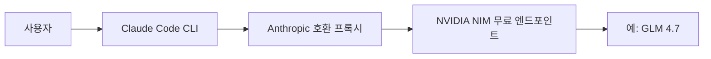
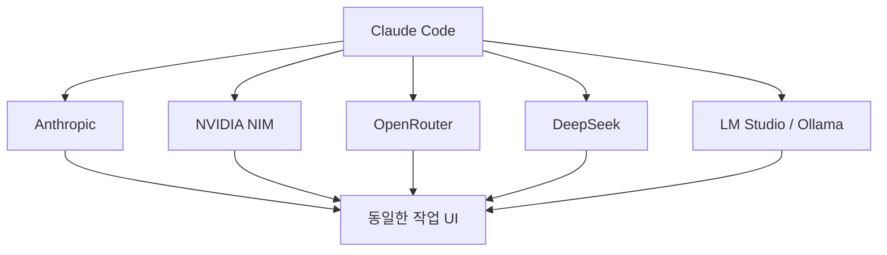

이 영상의 핵심은 “Claude Code가 진짜 공짜가 됐다”가 아니다.  
더 정확한 표현은 **Claude Code 클라이언트를 NVIDIA NIM의 무료 엔드포인트 뒤에 있는 Anthropic 호환 프록시로 연결해, 다른 모델을 Claude Code 안에서 쓰는 구조**다.

즉 무료의 본질은 Claude 모델이 공짜라는 뜻이 아니라, **Claude Code라는 훌륭한 클라이언트를 다른 무료/저가 백엔드에 붙여 쓰는 것**에 있다.

<!--more-->

## Sources

- YouTube: <https://www.youtube.com/watch?v=1LeLiWPJSE8>
- free-claude-code: <https://github.com/Alishahryar1/free-claude-code>
- NVIDIA NIM Models: <https://build.nvidia.com/models>

## 1. 구조를 먼저 이해해야 한다: Claude Code는 프런트엔드, 모델은 뒤에서 바뀐다

영상이 보여 주는 건 Claude Code 자체를 해킹하는 게 아니다.  
핵심은 요청 흐름을 바꾸는 것이다.

보통은:

- 사용자 프롬프트
- Claude Code
- Anthropic 모델

로 직행한다.

여기서 바뀌는 건 마지막 단계다.

- 사용자 프롬프트
- Claude Code
- Anthropic-compatible proxy
- NVIDIA NIM free endpoint의 모델

로 경로를 우회시킨다.

즉 사용자는 여전히 `claude` CLI를 쓰지만, 실제 추론은 NVIDIA 쪽 무료 모델이 담당한다.

## 2. “무료”의 정확한 의미: GPU 없이, 서버 관리 없이, 다만 제한이 있다

영상 제목은 강하지만, 실제 의미는 이렇게 정리하는 편이 정확하다.

- 내 로컬 GPU는 필요 없다
- 직접 클라우드 서버를 띄워 관리할 필요도 없다
- NVIDIA가 제공하는 무료 endpoint를 쓴다
- 다만 rate limit이 있다

영상에서는 `40 requests per minute` 수준을 예로 든다.  
즉 “무제한 완전 무료”라기보다, **개인 실험과 가벼운 업무에는 충분할 수 있는 free tier**에 가깝다.

또 중요한 점은 API key 자체가 없는 게 아니다.  
오히려 README를 보면 `NVIDIA_NIM_API_KEY`를 발급받아 `.env`에 넣는 구조다.  
따라서 **무과금일 수는 있어도 keyless는 아니다**라고 이해하는 편이 맞다.

## 3. 영상의 핵심 도구는 `free-claude-code` 프록시다

영상에서 참조하는 저장소는 `free-claude-code`다.  
이 저장소의 README를 보면 방향이 아주 명확하다.

> Claude Code의 Anthropic API 호출을 NVIDIA NIM, OpenRouter, DeepSeek, LM Studio, llama.cpp, Ollama 등으로 라우팅한다.

즉 이 프로젝트는 NVIDIA 전용 도구라기보다, **Claude Code의 클라이언트 프로토콜을 유지한 채 백엔드를 바꿔 끼우는 프록시 레이어**다.

README 기준 장점은:

- Claude Code drop-in proxy
- 6개 provider backend
- `/model` picker 지원
- streaming / tool use / reasoning block 처리
- Telegram / Discord bot wrapper까지 확장 가능

즉 이 프로젝트는 “무료 세팅”을 넘어서, **Claude Code를 다른 추론 인프라에 연결하는 범용 어댑터**에 가깝다.

## 4. NVIDIA NIM을 쓰는 이유: 무료 엔드포인트 + 함수 호출 가능한 모델

영상은 NVIDIA NIM의 장점을 두 가지로 본다.

### 4-1. 관리형 무료 엔드포인트

직접 GPU를 사거나 서버를 띄우지 않고, `build.nvidia.com`에서 제공하는 free endpoint를 쓸 수 있다.

### 4-2. Claude Code에 필요한 기능을 갖춘 모델 사용 가능

Claude Code 같은 클라이언트를 붙이려면 단순 채팅 모델이 아니라:

- tool calling
- function calling

같은 특성이 필요하다.

영상은 예시로 `z-ai/glm4.7` 계열을 쓴다.  
즉 중요한 건 “어떤 모델이 최고인가”보다, **Claude Code 프론트엔드가 기대하는 프로토콜을 뒤에서 얼마나 잘 흉내 낼 수 있나**다.

## 5. 이 방식의 진짜 의미: Claude Code를 모델 비종속 UI로 본다는 것이다

우리가 최근 여러 번 본 패턴이 여기서도 반복된다.

- Ollama를 붙여 Claude Code를 무료처럼 쓰기
- Codex / Gemini를 보조 두뇌로 붙이기
- free-claude-code로 NIM을 뒤에 붙이기

이 흐름의 공통점은, Claude Code를 더 이상 Anthropic 전용 도구로만 보지 않는다는 데 있다.

오히려 Claude Code는:

- 좋은 CLI
- 익숙한 워크플로
- 강한 하네스
- 훌륭한 사용자 경험

을 제공하는 **프런트엔드/클라이언트 레이어**로 읽힌다.

이 해석이 중요하다.  
미래의 경쟁은 “누가 모델을 만들었는가”뿐 아니라, **누가 좋은 작업 UI와 하네스를 장악했는가**로도 흘러가기 때문이다.

## 6. 세팅이 쉬워 보여도, 본질은 로컬 프록시 운영이다

영상에서는 설치를 간단하게 보여 주지만, 이 구조의 본질은 결국 로컬 프록시 서버를 띄우는 것이다.

흐름은 대략:

1. `uv`와 Python 설치
2. `free-claude-code` 저장소 클론
3. `.env`에 provider와 model, API key 지정
4. 프록시 서버 실행
5. `ANTHROPIC_BASE_URL`을 로컬 프록시 주소로 바꿔 `claude` 실행

즉 사용 경험은 “claude 실행” 그대로일 수 있지만, 내부적으로는 **로컬 라우팅 계층**이 하나 더 들어간다.

그래서 이 방식은 진짜 초보자용 원클릭이라기보다, **프록시와 환경 변수 개념을 이해하는 사용자에게 특히 잘 맞는 세팅**이다.

## 7. 장점과 한계를 같이 봐야 한다

### 7-1. 장점

- Claude Code UI/UX 유지
- GPU 없음
- 직접 서버 운영 부담 적음
- 무료 또는 저가 provider로 교체 가능
- NVIDIA 외에도 OpenRouter, DeepSeek, Ollama 등 확장 가능

### 7-2. 한계

- 무료 endpoint의 rate limit 존재
- 모델 품질은 Claude 본가 모델과 다를 수 있음
- function/tool calling 품질이 모델마다 다름
- 로컬 프록시와 환경 변수 세팅 필요
- “완전 무료”라 해도 장기 사용에는 제약이 생길 수 있음

즉 이 방식은 Anthropic 구독을 완전히 대체하는 만능 해법이라기보다, **Claude Code 작업 환경을 유지하면서 백엔드를 유연하게 바꾸는 실험적이지만 매우 실용적인 옵션**이다.

## 8. 결론

이 영상의 진짜 메시지는 단순하다.

**Claude Code의 가치는 모델에만 있지 않고, 그 자체가 훌륭한 클라이언트와 하네스라는 데 있다.**

그래서 사용자는:

- Anthropic 모델을 그대로 쓰거나
- NVIDIA NIM 무료 엔드포인트를 붙이거나
- OpenRouter / DeepSeek / Ollama 쪽으로 바꾸거나

하는 선택을 할 수 있다.

즉 “Claude Code를 무료처럼 쓴다”는 말의 실체는,  
Claude를 공짜로 받는 게 아니라 **Claude Code라는 프런트엔드를 더 값싼 백엔드에 연결해 재활용하는 것**이다.
