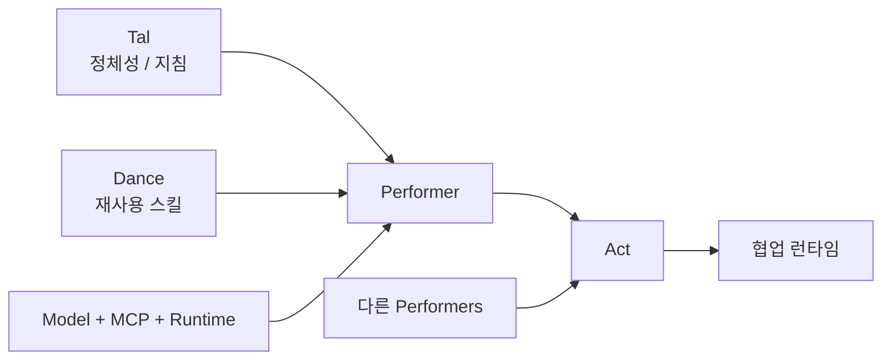
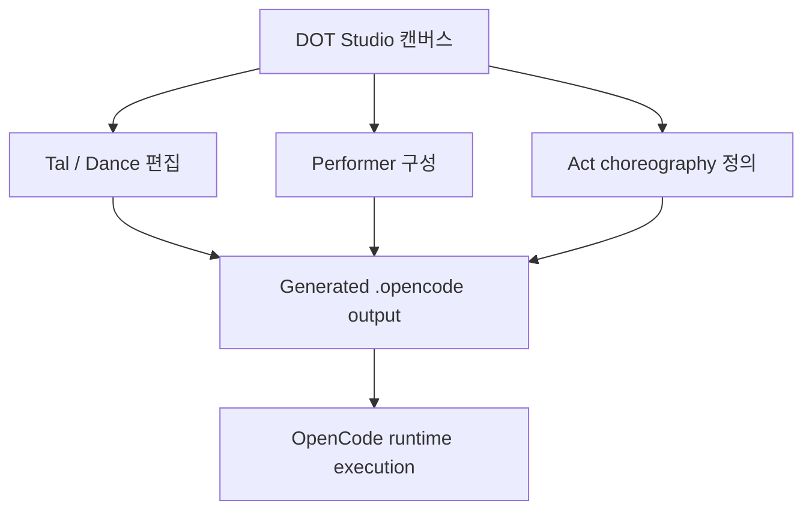

`DOT Studio`를 한 줄로 설명하면 README 표현 그대로다.  
**OpenCode 위에 얹는 Figma-style workspace for AI choreography.**

이 표현이 꽤 정확하다. 이 프로젝트는 단순 채팅 UI도, 일반적인 플로우차트 빌더도 아니다.  
핵심은 **에이전트의 역할, 스킬, 관계, 협업 규칙을 캔버스 위에서 설계하고, 그 결과를 OpenCode 런타임으로 투영한다**는 데 있다.

<!--more-->

## Sources

- GitHub: <https://github.com/dance-of-tal/dot-studio>
- README: <https://raw.githubusercontent.com/dance-of-tal/dot-studio/main/README.md>

## 1. DOT Studio는 “에이전트를 만든다”보다 “에이전트 관계를 설계한다”에 가깝다

README가 제시하는 핵심 개념은 네 가지다.

- `Tal`
- `Dance`
- `Performer`
- `Act`

여기서 흥미로운 점은, 개별 에이전트 생성보다 **구성 요소를 나누어 생각하게 만든다**는 것이다.

README의 가장 쉬운 공식은 이렇다.

`Tal + Dance + model + tools = Performer`

`Multiple Performers + choreography = Act`

즉 DOT Studio는 에이전트를 “한 덩어리 프롬프트”로 보지 않는다.  
오히려 정체성, 재사용 가능한 기능, 런타임 설정, 협업 관계를 **분리된 레이어**로 다룬다.

## 2. Tal, Dance, Performer, Act라는 분해가 좋은 이유

이 4분해가 중요한 이유는 재사용성과 협업 때문이다.

### 2-1. Tal

에이전트의 기본 정체성, 행동 양식, instruction layer다.

### 2-2. Dance

재사용 가능한 skill / capability package에 가깝다.

### 2-3. Performer

Tal, Dances, model 설정, MCP 구성을 조합해 실제 실행 가능한 에이전트를 만든다.

### 2-4. Act

여러 performer를 묶고, 그들이 **어떻게 협업할지**를 정의한다.

즉 이 구조는 단순 프롬프트 엔지니어링을 넘어, **에이전트 시스템 설계를 컴포넌트화**한다.

## 3. 이 프로젝트의 진짜 핵심은 Act, 즉 choreography layer다

README는 `Act`를 매우 중요하게 다룬다.  
Act는 단지 참여자 목록이 아니라:

- participants
- relations
- actRules
- subscriptions

를 가진 coordination layer다.

이게 의미하는 바는 분명하다.

에이전트 시스템의 핵심은 “누가 있느냐”보다,

- 누가 누구와 이야기하는가
- 어떤 신호에 깨어나는가
- 어떤 규칙 아래 협업하는가

에 있다는 것이다.

즉 DOT Studio는 agent builder라기보다 **agent choreography editor**라는 표현이 더 잘 맞는다.

## 4. 왜 Figma 비유가 적절한가

README는 계속 Figma-style workspace라는 표현을 쓴다.  
이 비유가 좋은 이유는 다음과 같다.

- 캔버스 위에서 배치한다
- 관계를 선으로 연결한다
- 수동 편집과 보조 편집을 섞는다
- 구조를 시각적으로 본다

즉 이 프로젝트는 “대화형 설정 폼”이 아니라, **배치와 관계가 중요한 설계 보드**다.

실제로 에이전트 시스템은 노드와 엣지, 경계와 흐름을 다루는 일이 많은데, 이걸 텍스트 파일만으로 계속 관리하면 곧 불투명해진다.  
DOT Studio는 그 문제를 **시각적 캔버스**로 풀려 한다.

## 5. OpenCode와의 관계가 중요하다: Studio는 설계하고, OpenCode는 실행한다

README에서 매우 중요한 문장이 하나 있다.

> `.opencode/` is generated output for OpenCode. You usually should not edit it directly.

즉 DOT Studio는 실행기를 대체하는 게 아니다.

- Studio는 설계/편집/구성
- OpenCode는 실행

을 맡는다.

이 분리가 중요한 이유는, 런타임과 저작 도구를 분리하면:

- 설계 실험은 더 안전해지고
- 캔버스 편집은 더 자유로워지고
- 실제 실행 형태는 일관되게 투영될 수 있기 때문이다

즉 DOT Studio는 OpenCode를 덮어쓰지 않고, **그 위에 시각적 authoring layer를 추가**한다.

## 6. Studio Assistant가 있다는 점도 흥미롭다

이 프로젝트는 완전 수동 툴이 아니다.  
README는 두 가지 편집 방식을 같이 제시한다.

- direct manipulation
- assisted editing

즉 사용자는:

- 직접 drag & drop으로 정밀하게 조정할 수도 있고
- Studio Assistant에게 초안을 만들거나 수정하게 할 수도 있다

이건 좋은 균형이다.  
에이전트 설계에서 완전 자동은 제어를 잃기 쉽고, 완전 수동은 금방 귀찮아진다.  
DOT Studio는 둘의 중간지대를 노린다.

## 7. Discord integration도 보여 주는 방향이 있다

README를 보면 Discord integration도 제공한다.  
다만 중요한 제한을 분명히 둔다.

- Discord는 runtime chat surface일 뿐
- DOT asset을 생성/편집/배포하지는 않는다

이 구분이 중요하다.  
즉 DOT Studio는:

- 설계는 Studio에서
- 실행 채팅은 Discord에서도

라는 식으로 **authoring과 runtime surface를 분리**하려 한다.

이건 꽤 성숙한 제품 감각이다.

## 8. 이 프로젝트가 주는 더 큰 메시지: 에이전트 설계도 이제 코드만으로 하지 않는다

DOT Studio가 흥미로운 이유는 단지 예쁜 UI가 있어서가 아니다.  
더 큰 의미는 **에이전트 시스템 설계를 코드/마크다운만이 아니라 시각적 작업공간에서도 하게 만든다**는 데 있다.

우리가 최근 계속 다뤘던 흐름을 보면:

- DESIGN.md는 디자인 시스템을 파일로 고정하고
- Graphify / code-review-graph는 코드 구조를 그래프로 보고
- Game Studios나 Hermes Swarm은 조직 구조를 만들고
- DOT Studio는 그 위에 에이전트 안무 자체를 시각화한다

즉 에이전트 시대의 authoring 도구가 점점 **코드 편집기 → 구조 편집기**로 확장되고 있다는 뜻이다.

## 9. 결론

`DOT Studio`가 흥미로운 이유는 에이전트를 더 많이 만들기 때문이 아니다.  
진짜 의미는 **에이전트의 정체성, 스킬, 런타임, 협업 규칙을 분리해서 캔버스 위에서 안무처럼 설계하게 만든다**는 데 있다.

그래서 이 프로젝트를 한마디로 정리하면:

- 챗봇 UI도 아니고
- 단순 플로우차트 빌더도 아니고
- OpenCode 위에 얹는 시각적 에이전트 저작 도구

다.

앞으로 멀티에이전트 시스템이 더 복잡해질수록, 좋은 도구의 경쟁은 “누가 더 좋은 모델을 붙이느냐”보다 **누가 더 잘 설계하고 보이게 하느냐**로 옮겨갈 가능성이 크다. DOT Studio는 그 방향을 꽤 선명하게 보여 준다.
