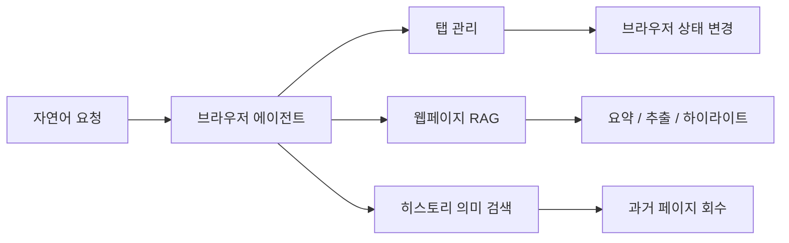
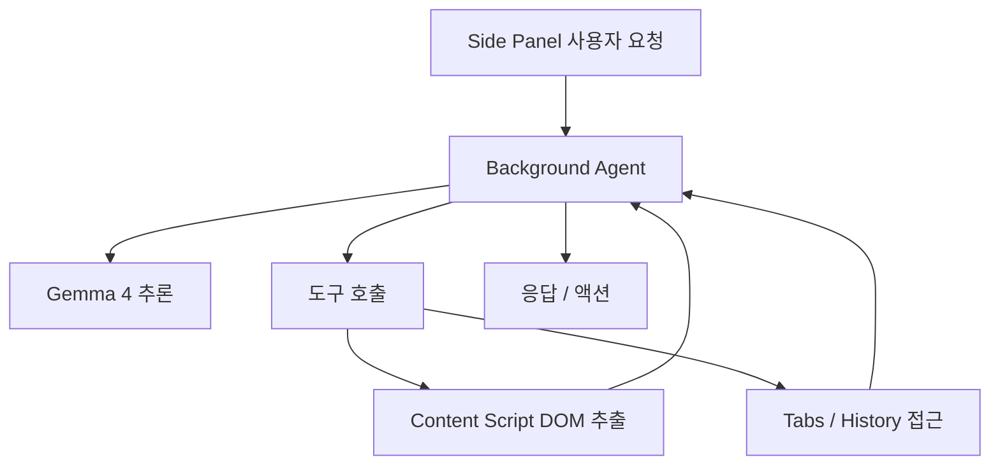

이 영상의 핵심은 “무료 크롬 자동화 도구”가 아니다.

더 정확히 말하면,  
**브라우저 안에 로컬 추론 모델과 도구 호출 루프를 넣어 브라우저 자체를 AI 에이전트 런타임으로 바꾼다**는 데 있다.

즉 이 프로젝트는 브라우저 확장이라기보다, **온디바이스 브라우저 에이전트의 기준 구현(reference implementation)** 에 가깝다.

<!--more-->

## Sources

- YouTube: <https://www.youtube.com/watch?v=8P3enx5Z490>
- GitHub: <https://github.com/nico-martin/gemma4-browser-extension>

## 1. 이 프로젝트의 핵심은 “브라우저용 ChatGPT”가 아니다

공식 저장소 설명은 아주 명확하다.

> On-device AI agent Chrome extension powered by Transformers.js and Gemma 4

여기서 중요한 단어는 세 개다.

- on-device
- agent
- browser

즉 목표는 웹페이지를 요약해 주는 가벼운 보조 도구가 아니라:

- 모델이 로컬에서 돌고
- 브라우저 도구를 호출하며
- 탭, 히스토리, 페이지 내용을 에이전트 루프로 다루는 것

이다.

## 2. 왜 이게 중요한가: 대부분의 브라우저 AI는 결국 서버형이기 때문이다

영상이 잘 짚는 부분은 바로 이 점이다.

기존 브라우저 AI 보조도구는 대개:

- 확장을 설치하고
- 현재 페이지나 탭 정보를 서버로 보내고
- 서버의 모델이 처리한 결과를 돌려주는

구조다.

이 방식은 능력은 좋을 수 있지만,

- 프라이버시 문제가 있고
- 사용량 비용이 들고
- 오프라인에서는 죽는다

는 한계가 있다.

Gemma 4 Browser Assistant는 반대로:

- 모델을 한 번 내려받고
- 브라우저 내부 저장소에 캐시하고
- WebGPU로 로컬 추론을 돌리고
- 외부 모델 서버 없이 동작

하는 방향을 택한다.

즉 “브라우저에서 AI를 쓴다”가 아니라  
**“브라우저가 AI 실행 환경이 된다”**는 쪽에 더 가깝다.

## 3. 저장소 기준 기능도 꽤 실용적이다

공식 README 기준 이 에이전트는 세 묶음의 기능을 가진다.

### 3-1. Tab Management

- `get_open_tabs`
- `go_to_tab`
- `open_url`
- `close_tab`

즉 탭을 자연어로 찾고, 전환하고, 열고, 닫을 수 있다.

### 3-2. Website Interaction (RAG)

- `ask_website`
- `highlight_website_element`

현재 페이지에서 관련 내용을 semantic similarity로 뽑아내고, 필요한 부분을 하이라이트할 수 있다.

### 3-3. History Vector Database

- `find_history`

단순 URL이나 제목 키워드가 아니라, 방문 기록의 의미 기반 검색을 하도록 설계되어 있다.

즉 이건 단순 브라우저 챗봇이 아니라  
**탭 + 페이지 + 히스토리라는 브라우저 상태 전체를 다루는 로컬 에이전트**다.

## 4. 아키텍처가 특히 중요하다: MV3 제약 위에서 잘 쪼갰다

공식 README는 이 확장을 3계층으로 설명한다.

- Background Script
- Side Panel
- Content Script

### Background Script

모델을 한 번만 로드하고, 추론과 도구 실행을 중앙에서 처리한다.

### Side Panel

사용자와 대화하는 채팅 UI다.  
팝업이 아니라 지속되는 패널이라 세션 연속성이 좋다.

### Content Script

실제 웹페이지 DOM에 접근해:

- 제목
- 문단
- 리스트

같은 구조를 추출하고, 필요한 요소를 하이라이트한다.

이 구조가 중요한 이유는, 브라우저 AI 확장에서 제일 어려운 부분이 종종 모델 성능이 아니라 **어디서 어떤 일을 하게 배치하느냐**이기 때문이다.

README가 말하듯, 무거운 ML 추론은 background에서 하고, UI는 side panel에서 얇게 유지하고, DOM 조작은 content script에 맡기는 게 합리적이다.

## 5. 영상의 “두 모델 구조”도 흥미롭다

영상에 따르면 이 확장은 모델을 하나만 쓰지 않는다.

- `Gemma 4 E2B instruct`  
  - reasoning brain
  - 도구 호출 판단
  - 응답 생성
- `all-MiniLM-L6-v2`  
  - embedding model
  - 페이지/히스토리 semantic search

공식 README에서도 `ask_website`가 `all-MiniLM-L6-v2` 임베딩을 써서 semantic similarity로 relevant section을 고른다고 설명한다.

이 구성이 중요한 이유는, 로컬 브라우저 에이전트가 되려면 단순 채팅 모델만으로는 부족하기 때문이다.

필요한 건:

- reasoning
- tool use
- retrieval

의 결합이다.

즉 이 프로젝트는 “브라우저에서 LLM 하나 돌리기”가 아니라  
**작은 로컬 에이전트 스택**에 가깝다.

## 6. WebGPU가 핵심이다: 무료인 이유가 공짜 마법은 아니다

영상 제목에는 `No API Key`가 붙어 있다.  
이건 맞지만, 더 정확한 표현이 필요하다.

무료인 이유는 누군가 공짜 GPU 서버를 제공해서가 아니라,

- 모델이 로컬에 있고
- 브라우저가 WebGPU를 쓰고
- 사용자의 하드웨어가 추론 비용을 부담

하기 때문이다.

즉 비용이 사라진 게 아니라 **클라우드 추론 비용이 로컬 연산으로 이동한 것**이다.

그래서 이 구조의 장점은:

- API 키 불필요
- 토큰 과금 없음
- 데이터 외부 전송 없음

이지만, 반대로:

- WebGPU 지원 필요
- 현대적인 GPU 필요
- 로컬 추론 속도 한계

도 함께 따라온다.

## 7. 이 프로젝트의 진짜 의의는 “private browsing copilot”이 아니라 “browser-native agent runtime”이다

이 확장은 기존의 브라우저 요약 툴보다 한 단계 더 나아간다.

왜냐하면:

- 모델이 브라우저 안에 있고
- 브라우저 상태를 도구로 읽고
- DOM에서 정보를 추출하고
- 히스토리를 벡터 검색하고
- 탭을 조작하며
- 그 결과를 다시 에이전트 루프에 넣기 때문이다

즉 브라우저는 더 이상 단순한 표시창이 아니라,  
**에이전트가 직접 상태를 읽고 바꾸는 작업 공간**이 된다.

## 8. 지금 시점에서 특히 흥미로운 이유

2026년 시점에 이 프로젝트가 흥미로운 이유는 두 가지다.

### 첫째, 브라우저 확장이 로컬 AI 에이전트의 유력한 폼팩터가 되고 있다는 점

브라우저는 이미:

- 탭
- 히스토리
- DOM
- 폼
- 검색

이라는 거대한 사용자 작업 맥락을 갖고 있다.

이걸 클라우드 서버 없이 바로 다루는 건 꽤 강력하다.

### 둘째, reference implementation이라는 점

이건 단순 제품 하나보다 더 중요할 수 있다.

왜냐하면 이 구조는 앞으로:

- 로컬 연구 도구
- 프라이버시 민감한 업무 도구
- 브라우저 자동화 에이전트

의 기본 청사진이 될 수 있기 때문이다.

즉 Gemma 4 Browser Assistant의 진짜 가치는 “요약 잘해 준다”가 아니라,  
**브라우저를 로컬 에이전트 OS처럼 쓰는 구조를 구체적으로 보여 준다**는 데 있다.

## 9. 최신 저장소 기준 메타데이터

GitHub 기준 현재 확인한 저장소 정보는 다음과 같다.

- 저장소: `nico-martin/gemma4-browser-extension`
- stars: `797`
- forks: `108`
- 기본 브랜치: `main`
- 주 언어: `TypeScript`

이 정도면 단순 데모를 넘어, 실제로 꽤 많은 사람이 참고하는 구현체가 됐다고 볼 수 있다.
