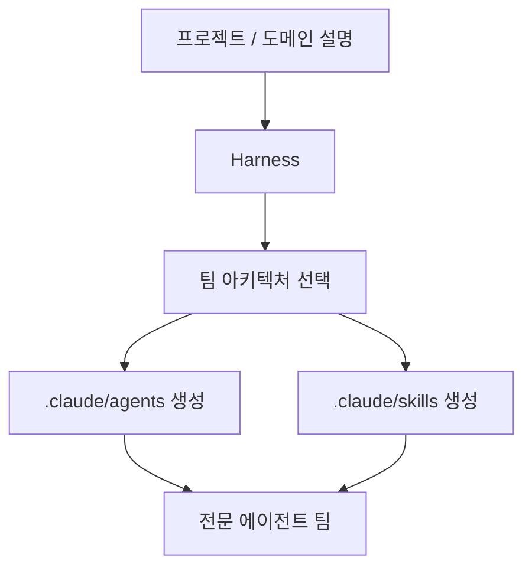
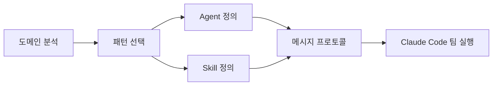

짧은 영상의 핵심은 단순하다.  
**Claude Code에 “하네스 구성해줘”라고 말하면, 프로젝트에 맞는 에이전트 팀 구조와 스킬 구성이 자동으로 만들어진다.**

이게 흥미로운 이유는, Harness가 단순한 보조 스킬이 아니라 **에이전트 팀 설계 공장**처럼 동작하기 때문이다.

<!--more-->

## Sources

- YouTube Shorts: <https://youtube.com/shorts/HrJdlSqFu20>
- GitHub: <https://github.com/revfactory/harness>
- README: <https://raw.githubusercontent.com/revfactory/harness/main/README.md>
- README_KO: <https://raw.githubusercontent.com/revfactory/harness/main/README_KO.md>

## 1. Harness는 “에이전트를 추가하는 도구”보다 “팀 구조를 설계하는 공장”에 가깝다

공식 README는 Harness를 이렇게 설명한다.

> Claude Code용 team-architecture factory

핵심은 에이전트를 하나씩 수동으로 만드는 게 아니다.

- 프로젝트/도메인을 분석하고
- 그 성격에 맞는 팀 구조를 고르고
- `.claude/agents/`와 `.claude/skills/`를 생성한다

즉 이 플러그인의 초점은 “에이전트 한 명”이 아니라 **협업 구조 전체**다.

## 2. 영상의 메시지와 저장소 설명이 정확히 맞닿아 있다

영상은 세 가지를 짧게 강조한다.

- “하네스 구성해줘” 한마디로 시작된다
- 도메인에 맞는 에이전트 팀과 스킬을 만든다
- 여섯 가지 아키텍처 패턴을 자동 선택한다

이건 README의 설명과 거의 그대로 맞아떨어진다.

README 기준 Harness는 다음 6개 패턴을 지원한다.

- Pipeline
- Fan-out/Fan-in
- Expert Pool
- Producer-Reviewer
- Supervisor
- Hierarchical Delegation

즉 Harness는 “프롬프트를 좀 더 잘 쓰는 법”이 아니라, **문제 유형에 맞는 협업 위상(topology)을 고르는 레이어**다.



## 3. 중요한 건 “누가 일하나”보다 “어떻게 나눠서 일하나”다

많은 에이전트 도구는 결국 에이전트를 많이 두는 데서 멈춘다.  
하지만 실제 품질 차이는 보통 인원 수보다 **협업 구조**에서 난다.

예를 들면:

- 순차 의존 작업이면 `Pipeline`
- 독립 작업 병렬화면 `Fan-out/Fan-in`
- 상황 따라 전문성을 골라 쓰면 `Expert Pool`
- 생성 후 검토가 중요하면 `Producer-Reviewer`

Harness는 이걸 사람이 매번 처음부터 설계하지 않게 한다.

즉 “에이전트 자동 생성”보다 더 정확한 표현은  
**“에이전트 팀 운영 구조 자동 초안 생성”**이다.

## 4. 설치가 짧은 이유도 중요하다

영상에서는 설치가 간단하다고 말한다.  
README 기준 설치 흐름은 실제로 매우 짧다.

```text
/plugin marketplace add revfactory/harness
/plugin install harness@harness
```

짧다는 건 단순한 편의성 이상의 의미가 있다.

에이전트 팀 운영 도구가 복잡하면 대부분:

- 초기에만 실험하고
- 프로젝트마다 다시 세팅하기 귀찮아지고
- 결국 한 명짜리 세션으로 돌아간다

Harness는 반대로 **도입 마찰을 낮추고, 팀 구조 초안을 빠르게 뽑는 데 집중**한다.

## 5. 출력도 추상 개념이 아니라 실제 파일이다

README가 보여 주는 출력은 꽤 구체적이다.

- `.claude/agents/`
- `.claude/skills/`

즉 결과가 “좋은 아이디어”로 끝나는 게 아니라, Claude Code가 실제로 읽는 파일 구조로 떨어진다.

이 점이 중요하다.

하네스 엔지니어링이 강해지려면 결국:

- 구조가 문서화되고
- 재실행 가능해야 하며
- 팀 구성이 파일 형태로 남아야 한다

Harness는 그걸 **생성 가능한 산출물**로 만든다.



## 6. 49.5 → 79.3 수치는 “유망한 신호”로 읽는 게 맞다

영상은 A/B 테스트 결과 품질 점수가 49점대에서 79점대로 올랐다고 소개한다.  
README 기준 더 정확한 표기는 이렇다.

- 평균 품질 점수 `49.5 → 79.3`
- 평균 `+60%`
- `15/15` win-rate
- variance `-32%`

다만 README도 분명히 적고 있듯, 이 수치는:

- `n=15`
- author-measured
- third-party replications pending

상태다.

그래서 이 숫자는 “이미 보편적으로 검증된 절대 성능”이라기보다,  
**하네스 사전 구성(structured pre-configuration)이 실제 출력 품질에 의미 있는 영향을 줄 수 있다는 강한 신호**로 읽는 편이 맞다.

## 7. 결국 Harness의 본질은 메타 스킬이다

README는 Harness를 메타 스킬로 설명한다.

이 표현이 중요한 이유는 이 플러그인이 직접 모든 일을 대신하는 게 아니라:

- 어떤 팀이 필요할지 결정하고
- 그 팀의 역할을 정의하고
- 그 팀이 쓸 스킬까지 생성하기 때문이다

즉 Harness는 “문제를 푸는 에이전트”가 아니라  
**문제를 풀 에이전트 조직을 설계하는 에이전트**다.

이 점에서 기존의 단일 스킬 팩보다 한 단계 위 레이어에 있다.

## 8. 이 플러그인이 흥미로운 이유는 하네스를 ‘설계 가능한 대상’으로 바꾸기 때문이다

Claude Code를 오래 쓰다 보면 병목은 모델보다 자주 구조에서 생긴다.

- 누가 먼저 조사할까
- 누가 생성할까
- 누가 검증할까
- 병렬로 할까, 순차로 할까

Harness는 이 질문에 대해 “매번 수동으로 짜지 말고, 패턴화해서 생성하자”는 답을 낸다.

그래서 이 프로젝트의 진짜 가치는 단순 자동화가 아니라:

- 팀 구조의 재사용성
- 도메인별 초안 생성
- 하네스 설계 비용 절감

에 있다.

결국 “하네스 구성해줘”라는 한 문장은  
프롬프트 한 줄이 아니라 **에이전트 조직도 생성 명령**에 가깝다.
