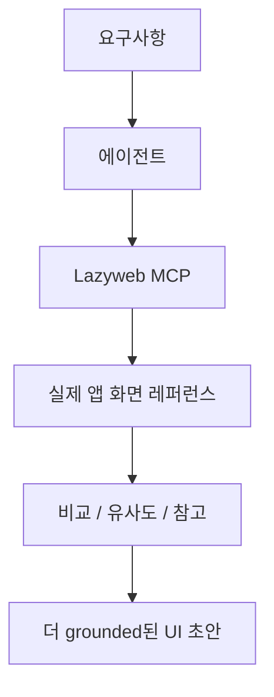

Lazyweb의 핵심 문장은 아주 직설적이다.

**Design context for AI agents.**

즉 이 서비스는 사람이 둘러보는 영감 사이트로 끝나지 않는다.  
Claude Code, Codex, Cursor 같은 코딩 에이전트가 **실제 제품 화면을 참고한 상태로 UI를 만들게 하는 MCP 레이어**를 지향한다.

<!--more-->

## Sources

- Website: <https://www.lazyweb.com/>
- Install page: <https://www.lazyweb.com/mcp-install>

## 1. Lazyweb은 “디자인 영감 모음집”보다 “디자인 grounding layer”에 가깝다

홈페이지 메타 설명은 Lazyweb을 이렇게 정의한다.

- `Design context for AI agents`
- `257k+ real-world app screens`
- `25,000+ tracked companies`

이 표현이 중요한 이유는, Lazyweb의 초점이 단순 수집이 아니라 **grounding**에 있기 때문이다.

즉 에이전트가 UI를 만들 때:

- 막연한 “예쁘게”
- 일반적인 “모던 SaaS처럼”
- 너무 익숙한 템플릿 재생산

으로 흐르지 않고, 실제 서비스 화면 맥락을 참고하게 하려는 것이다.

## 2. 왜 “실제 앱 화면”이 중요할까

텍스트 기반 디자인 지시는 자주 모호하다.

- 깔끔하게
- Notion처럼
- Stripe 느낌으로
- 대시보드답게

이런 말은 사람끼리도 해석이 갈린다.  
에이전트에게는 더 심하다.

Lazyweb은 여기서 텍스트가 아니라 **실제 제품 스크린**을 준다.

그러면 컨텍스트가:

- 추상적 형용사
- vague prompt

에서

- 레이아웃
- 정보 밀도
- 시각적 위계
- 컴포넌트 패턴

으로 바뀐다.

즉 “무슨 분위기인지”가 아니라 **실제 어떤 구조인지**를 참고하게 만든다.

```mermaid
flowchart LR
    A[추상 프롬프트<br/>"깔끔한 SaaS UI"] --> B[에이전트 추정]
    B --> C[generic 결과]

    D[Lazyweb 실제 앱 화면] --> E[MCP 컨텍스트 주입]
    E --> F[grounded UI 생성]
```

## 3. Lazyweb MCP의 본질은 검색보다 참조 컨텍스트다

이 서비스는 MCP라는 점이 핵심이다.

즉 브라우저 북마크 사이트가 아니라, 에이전트가 호출할 수 있는 **참조 도구**가 된다.

그러면 흐름은 이렇게 바뀐다.

- 사람이 먼저 영감 사이트를 뒤진다
- 괜찮은 예시를 캡처한다
- 그걸 다시 AI에게 설명한다

에서

- 에이전트가 필요한 참조를 직접 찾고
- 비교하고
- 유사도를 보고
- 그걸 바탕으로 UI를 설계한다

로 이동한다.

이 차이는 꽤 크다.  
디자인 탐색이 사람의 수동 복사 작업이 아니라 **에이전트 작업 루프 안으로 들어오기** 때문이다.

## 4. 설치 페이지가 보여주는 건 “원클릭 도구”가 아니라 “원프롬프트 부트스트랩”이다

설치 페이지의 헤드라인은 이것이다.

**One prompt. Your agent installs the rest.**

이 문구가 말하는 바는 명확하다.

Lazyweb은 사용자가 문서를 따라가며 MCP를 손으로 붙이는 대신,  
**에이전트에게 설치 프롬프트를 넘겨 나머지 구성을 위임하는 흐름**을 기본 UX로 잡고 있다.

또 설치 페이지는 다음을 함께 말한다.

- free Lazyweb MCP token
- optional `/lazyweb` skill
- Claude, Codex, Cursor 등 대상

즉 이 제품은 단일 앱이 아니라:

- MCP 서버
- 설치 프롬프트
- 선택적 스킬

을 함께 묶은 **agent-native distribution** 방식을 택하고 있다.

## 5. “무료 토큰”의 의미도 정확히 봐야 한다

설치 페이지의 토큰 안내 문구도 흥미롭다.

핵심은 이 bearer token이:

- `no-billing UI reference tools`
- ignored local MCP config에는 넣어도 됨
- public git history에는 넣지 말 것

이라는 점이다.

이건 Lazyweb이 “사람도 무료, 에이전트도 무료”라는 메시지를 밀면서도,  
실제 운영에서는 **읽기 전용 레퍼런스 접근**에 초점을 맞추고 있음을 보여 준다.

즉 결제형 생성 서비스라기보다, 우선은 **참조 인프라**에 가깝다.

## 6. 이 도구의 진짜 포지션은 “디자인판 Graphify”에 더 가깝다

코드 영역에서 Graphify류 도구가 하는 일은, 에이전트가 코드를 다시 훑기 전에 **구조를 먼저 주는 것**이다.

Lazyweb도 비슷하다.

다만 대상이 코드가 아니라 디자인이다.

- 코드 에이전트는 소스 구조를 먼저 안다
- 디자인 에이전트는 실제 앱 패턴을 먼저 안다

이렇게 되면 에이전트는 “모든 걸 상상해서 생성”하는 대신,  
**이미 존재하는 제품 문법 위에서 변형하고 조합하는 방식**으로 움직일 수 있다.



## 7. 왜 Claude Code, Codex, Cursor에 모두 맞는가

홈페이지 메타 설명은 Lazyweb MCP가 다음 툴을 직접 언급한다.

- Claude Code
- Codex
- Cursor

이건 중요하다.  
왜냐하면 Lazyweb의 핵심 가치는 특정 모델이나 IDE에 묶이지 않기 때문이다.

본질은:

- 코딩 에이전트가
- 실제 UI 레퍼런스를
- MCP 인터페이스로 가져다 쓰게 하는 것

이기 때문이다.

즉 Lazyweb은 “좋은 디자인 모델”이라기보다  
**어떤 에이전트든 더 덜 허공에서 디자인하게 만드는 외부 컨텍스트 레이어**다.

## 8. 결국 Lazyweb이 겨냥하는 문제는 AI의 디자인 환각이다

코딩 에이전트는 종종 작동하는 UI를 만들지만,

- 지나치게 generic하고
- 실제 제품 관습과 동떨어지며
- 정보 밀도나 시각적 위계가 어색한

결과를 낸다.

이건 모델이 미적 감각이 없어서라기보다,  
**참조 컨텍스트 없이 추측으로 만들기 때문**인 경우가 많다.

Lazyweb은 여기에 대한 꽤 실용적인 답이다.

- “더 좋은 프롬프트를 써라”가 아니라
- “실제 앱 화면을 에이전트 작업 루프에 넣어라”

는 쪽으로 문제를 푼다.

그래서 Lazyweb MCP의 진짜 가치는 스크린샷 개수보다,  
**디자인 레퍼런스를 사람의 눈에서 에이전트의 도구 체인으로 옮긴다**는 데 있다.
