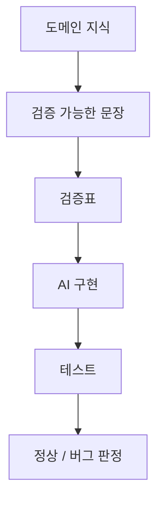

이 영상의 핵심은 아주 선명하다.  
**바이브 코딩의 진짜 벽은 만드는 능력이 아니라, 제대로 됐는지 판정하는 능력**이라는 것이다.

즉 AI로 기능을 만드는 일은 점점 쉬워지지만,  
그 기능이 정말 믿을 만한지 판단하는 일은 오히려 더 중요해진다.

<!--more-->

## Sources

- YouTube: <https://www.youtube.com/watch?v=Ybdrj7Igg44>

## 1. 처음의 두려움과 나중의 두려움은 다르다

영상은 바이브 코딩을 시작할 때의 감정 변화를 아주 잘 짚는다.

처음엔:

- “이걸 내가 만들 수 있을까?”

가 무섭다.

하지만 막상 만들고 나면 더 무서운 질문이 생긴다.

- “이거 진짜 믿어도 되는 거야?”

이 차이가 중요하다.  
AI는 버튼, 화면, 업로드, 계산 같은 겉모습을 너무 쉽게 만들어 주기 때문에,  
사람은 어느 순간 “작동하는 것처럼 보이는 상태”를 “제대로 작동하는 상태”로 착각하기 쉽다.

## 2. 불안의 원인은 개발 지식 부족이 아니라 판정 기준 부재다

영상이 가장 강하게 밀어 주는 문장은 이것이다.

**여러분이 불안한 이유는 개발 지식이 부족해서가 아니라, 정상 작동을 판정하는 기준이 없기 때문이다.**

이 해석이 좋다.  
왜냐하면 실제 현장에서 사람을 흔드는 건 코드 문법보다 이런 질문들이기 때문이다.

- 저장은 어디에 됐는가?
- 새로고침해도 남는가?
- 프로그램 재시작 후에도 유지되는가?
- 잘못된 값은 막히는가?
- 다른 사용자에게도 동일하게 보이는가?
- 엑셀 계산값과 진짜로 일치하는가?

즉 AI가 기능을 만들어 줬다고 해서, 그 기능의 **정상/비정상 기준**까지 자동으로 생기지는 않는다.

## 3. “작동하는 것처럼 보임”과 “작동함”은 다르다

영상은 이 차이를 여러 비유로 설명한다.

- 전자레인지가 돌아간다고 음식이 제대로 익은 건 아니다
- 택배앱이 배송 완료라 해도 물건이 안 와 있을 수 있다

소프트웨어도 똑같다.

- 버튼을 눌렀다
- 뭔가 목록에 보인다
- 저장된 것처럼 보인다

는 시작일 뿐이다.

그다음에 확인해야 할 것이 훨씬 많다.

- DB에 실제 저장됐는가
- 입력 검증은 되는가
- 값 형식은 맞는가
- 다른 화면 흐름에 영향을 주지 않는가

즉 바이브 코딩의 핵심 리스크는, **작동 분위기만 흉내 낸 시스템을 제품으로 착각하는 것**이다.

## 4. AI는 코딩을 잘하지만, 현장 감각은 없다

영상은 여기서 AI의 강점과 한계를 분리한다.

- AI는 코드를 잘 쓴다
- 화면도 잘 만든다
- 저장 기능도 빠르게 붙인다

하지만 AI에게 없는 것이 있다.

**현장 감각**이다.

예를 들면:

- 고객에게 어디까지 단가를 보여줘야 하는지
- 어떤 값은 관리자만 수정할 수 있어야 하는지
- 어떤 입력 오류가 실제 현장에서 치명적인지
- 견적 계산에서 어느 반올림 규칙을 써야 하는지

이건 코드 지식이 아니라 **도메인 지식 + 판정 기준**의 영역이다.

그래서 영상은 “도메인 지식은 기능 설명으로 끝나면 안 되고, 판정 기준으로 바뀌어야 한다”고 말한다.

## 5. 좋은 지시는 “기능”이 아니라 “검증 가능한 문장”이다

영상이 제시하는 예시는 아주 실용적이다.

나쁜 지시:

- 장비를 추가하는 기능이 필요해

좋은 지시:

- 장비 추가 버튼을 누르면 입력한 장비가 목록에 추가되어야 한다
- 저장 후 다시 돌아와도 값이 남아 있어야 한다
- 장비명은 비어 있으면 안 된다
- 단가는 숫자만 입력되어야 한다
- 숫자는 오른쪽 정렬이어야 한다

이 차이가 중요하다.  
첫 번째는 AI에게 “알아서 잘해줘”와 비슷하고,  
두 번째는 **합격/불합격 기준이 있는 문장**이다.

즉 바이브 코딩의 진짜 실력은 멋진 프롬프트 문장이 아니라,  
**내 업무 지식을 테스트 가능한 규칙으로 번역하는 능력**에 있다.

## 6. 검증표가 있어야 테스트가 가능하다

영상은 여기서 한 단계 더 나간다.  
입력값, 버튼, 저장, 검색, 계산에 대해 **검증표**를 만들라고 한다.

예를 들면:

### 6-1. 화면 흐름표

- 어떤 화면에서 어디로 이동하는가
- 어떤 버튼이 어떤 화면을 여는가

### 6-2. 이벤트 결과표

- 버튼을 누르면 무엇이 생기는가
- 검색어를 입력하면 무엇이 나오는가
- 저장 버튼을 누르면 어디에 저장되는가

### 6-3. 입력값 검증표

- 숫자만 들어가야 하는가
- 빈칸 허용 여부는 어떤가
- 소수점 자릿수는 몇 자리인가
- 오른쪽 정렬인가

### 6-4. 계산 검증표

- 샘플 입력값
- 기대 결과값
- 엑셀 계산과 동일한지 여부

이런 문서가 있으면, 나중에 테스트할 때도 그대로 확인하면 된다.  
즉 검증은 감으로 하는 것이 아니라, **문장화된 기준을 따라 확인하는 행위**가 된다.

## 7. E2E 테스트도 결국 기준값이 있어야 의미가 있다

영상은 E2E를 거창한 도구보다 **정답지가 있는 시험**으로 비유한다.

이 비유가 정확하다.

- AI는 시험을 잘 보는 학생일 수 있다
- 하지만 시험지가 없으면
- 자기가 문제를 만들고
- 자기가 채점하고
- 자기에게 후한 점수를 준다

즉 E2E나 자동 테스트도 결국:

- 어떤 입력을 넣었을 때
- 어떤 결과가 나와야 하는지

가 먼저 정리돼 있어야 의미가 있다.

그래서 “계산 잘되게 해줘”는 검증 기준이 아니다.  
반드시 샘플 데이터와 기대 결과를 사람이 정해 줘야 한다.

## 8. 내 컴퓨터에서 되면 끝이 아니라, 그때부터 제품화가 시작된다

영상 후반의 중요한 메시지는 이것이다.

**내 컴퓨터에서 되는 것은 아직 데모에 가깝다.**

왜냐하면 내 컴퓨터는:

- 내 계정
- 내 폴더 구조
- 내 권한
- 내 습관

을 이미 알고 있어서 관대하기 때문이다.

하지만 고객 환경은 다르다.

- 권한 문제
- 파일 위치 문제
- 설치 경로 문제
- 업데이트 문제
- 복구 문제

가 바로 터진다.

즉 제품화는 기능이 보이는 순간 끝나는 게 아니라,  
**다른 사람의 환경에서도 같은 판정 기준으로 살아남을 수 있을 때** 시작된다.

## 9. 결론

이 영상의 핵심은 단순하다.

AI 시대에 개발의 병목은 점점 “만드는 능력”에서 “검증 기준을 세우는 능력”으로 이동하고 있다.

그래서 바이브 코딩을 진짜 제품 만들기로 끌어올리려면:

- 기능 설명을
- 판정 가능한 문장으로 바꾸고
- 그 문장을 검증표로 정리하고
- 샘플 데이터와 기대 결과를 만들고
- 그 기준으로 끝까지 확인해야 한다

결국 AI는 코드를 잘 쓰는 조수일 수는 있어도,  
**무엇이 맞는지 판정하는 책임자까지 자동으로 대신해 주지는 않는다.**  
그 자리는 아직도 사람, 특히 도메인 지식을 가진 사람이 맡아야 한다.
