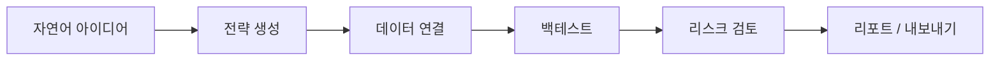
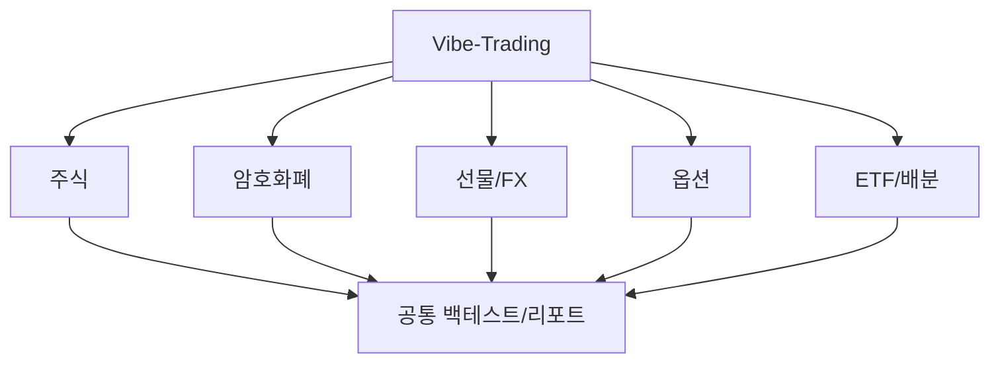

`HKUDS/Vibe-Trading`을 처음 보면 “개인용 AI 트레이딩 에이전트”라는 문구가 먼저 들어온다.  
하지만 README를 자세히 보면 이 프로젝트는 단순 자동 매매봇보다 훨씬 넓다. 더 정확한 표현은 **멀티에이전트 금융 워크스페이스**다.

즉 이 저장소는:

- 자연어로 전략을 만들고
- 데이터를 붙이고
- 여러 전문 에이전트 팀이 토론하고
- 백테스트와 리스크 검토를 거쳐
- 결과를 내보내는

하나의 금융 연구/실행 환경을 지향한다.

<!--more-->

## Sources

- GitHub: <https://github.com/HKUDS/Vibe-Trading>
- README: <https://raw.githubusercontent.com/HKUDS/Vibe-Trading/main/README.md>

## 1. 이 프로젝트를 트레이딩 봇으로만 보면 절반만 본다

README 첫 문장은 `Your Personal Trading Agent`지만, 기능표를 보면 이건 단순 매매 명령 실행기가 아니다.

핵심 능력은 다음처럼 더 넓다.

- Natural Language → Strategy
- 6 data sources
- 29 swarm presets
- cross-session memory
- 7 backtest engines
- multi-platform export

즉 `Vibe-Trading`은 주문 실행 도구라기보다, **아이디어를 전략으로 바꾸고 검증까지 이어주는 연구 운영 환경**에 가깝다.

## 2. 핵심 구조는 “자연어 → 전략 → 백테스트 → 리포트” 파이프라인이다

README가 내세우는 가장 강한 메시지는 이것이다.

**전략 아이디어를 자연어로 설명하면, 에이전트가 코드 작성·검증·내보내기까지 이어 준다.**

이 구조는 금융 자동화에서 특히 매력적이다.

- 아이디어는 자연어로 떠오르고
- 실제 실행은 코드와 수치 검증이 필요하며
- 마지막엔 리포트와 차트가 필요하기 때문이다

즉 Vibe-Trading은 인간이 “무슨 아이디어를 시험해 보고 싶은지”만 던지면, 나머지 공정을 점점 더 많이 흡수하려는 방향으로 보인다.

## 3. 74개 스킬과 29개 스웜 프리셋이 말해 주는 것

이 저장소가 흥미로운 이유는 숫자 자체보다, **금융 작업을 얼마나 세분화해서 본다**는 데 있다.

README 기준:

- 74 skills
- 29 swarm presets
- 27 tools
- 6 data sources

스킬 카테고리도 꽤 넓다.

- Data Source
- Strategy
- Analysis
- Asset Class
- Crypto
- Flow
- Tool
- Risk Analysis

즉 이 프로젝트는 “주식 분석”만 하는 게 아니라, **시장·자산군·전략·리서치·리스크를 분리된 기능층**으로 보고 있다.

## 4. 스웜 프리셋이 특히 재밌다: 투자위원회처럼 의사결정하게 만든다

README에서 가장 인상적인 부분 중 하나는 swarm presets다.

예를 들면:

- `investment_committee`
- `global_equities_desk`
- `crypto_trading_desk`
- `earnings_research_desk`
- `macro_rates_fx_desk`
- `quant_strategy_desk`
- `technical_analysis_panel`
- `risk_committee`
- `global_allocation_committee`

이 이름만 봐도 방향이 분명하다.  
단일 에이전트가 결론을 내리는 게 아니라, **분석가·전략가·리스크 담당이 서로 다른 시각을 낸 뒤 결론을 모으는 구조**다.

이건 최근 `TradingAgents` 같은 흐름과도 맞닿아 있다.  
중요한 건 자동 매매보다, **확증편향을 줄이는 다중 시각 분석 구조**다.

## 5. Cross-market backtest가 있는 점이 이 프로젝트를 한 단계 끌어올린다

많은 AI 금융 도구는 리서치와 아이디어 생성까지는 해도, 결국 검증은 사람이 따로 해야 한다.  
Vibe-Trading은 그 중간을 메우려 한다.

README 기준으로:

- 7개 backtest engines
- shared capital pool을 가진 composite engine
- Monte Carlo
- Bootstrap CI
- Walk-Forward validation

까지 붙어 있다.

즉 이 프로젝트는 전략 문장을 그럴듯하게 써 주는 수준이 아니라, **시장별/자산군별 특성을 반영한 검증 파이프라인**까지 붙이려 한다.

## 6. 범위가 주식만이 아니라는 점도 중요하다

README를 보면 커버하는 대상이 꽤 넓다.

- A-shares
- HK/US equities
- crypto
- futures
- forex
- options
- sector rotation
- ETF
- DeFi / on-chain

즉 하나의 asset class 전용 봇이 아니라, **글로벌 멀티마켓 리서치 데스크**를 축소한 느낌이다.

이건 금융 AI에서 꽤 중요한 차이다.  
실전 포트폴리오는 대개 한 자산군만 보지 않기 때문이다.

## 7. 최근 업데이트를 보면 “제품화” 속도가 빠르다

README의 News 섹션만 봐도 업데이트 폭이 꽤 넓다.

- 보안 hardening
- OpenAI Codex OAuth
- correlation heatmap
- settings UI
- validation hardening
- benchmark panel
- shadow account
- trade journal analyzer
- persistent memory

즉 이 프로젝트는 아이디어 수준을 넘어, **웹 UI + API + MCP + CLI + 보안 패치**가 함께 진화하는 제품형 리포지토리로 보인다.

이건 중요하다.  
금융 도구는 멋진 데모보다 신뢰성과 운영 안전장치가 더 중요하기 때문이다.

## 8. 다만 이걸 “자동 매매로 돈 벌어 주는 마법사”로 보면 곤란하다

이 프로젝트가 흥미롭다고 해서, 곧바로 “수익 보장형 자동매매 시스템”처럼 이해하면 위험하다.

실제로는:

- 전략 가정이 틀릴 수 있고
- 데이터 품질 문제가 있을 수 있으며
- 백테스트 과최적화가 생길 수 있고
- 실행 슬리피지와 실제 시장 마찰이 존재한다

즉 이 프로젝트의 가치는 당장 돈을 벌어 주는 로봇이라기보다, **전략 연구와 검증의 반복 속도를 높여 주는 워크스페이스**에 있다.

## 9. 결론

`Vibe-Trading`이 흥미로운 이유는 “AI가 대신 매매한다”는 데 있지 않다.  
더 정확히는 **아이디어, 데이터, 멀티에이전트 토론, 백테스트, 리포트, 내보내기를 하나의 금융 작업 환경으로 묶는다**는 데 있다.

그래서 이 프로젝트는 단순 트레이딩 봇보다:

- 연구 데스크
- 투자위원회
- 백테스트 랩
- 리스크 검토 보드

를 합친 것처럼 읽는 편이 맞다.

금융 AI의 진짜 가치는 자동 주문 버튼보다, **의사결정을 더 빨리, 더 넓게, 더 반복 가능하게 만드는 워크플로**에 있을 가능성이 크다.  
그 점에서 Vibe-Trading은 꽤 흥미로운 방향을 보여 준다.
