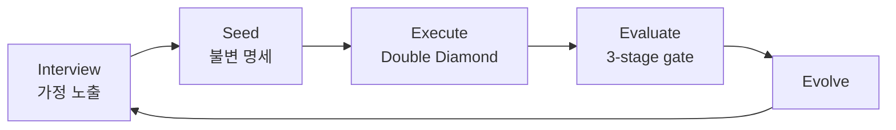

Ouroboros의 한 줄 슬로건은 꽤 강하다.

**Stop prompting. Start specifying.**

이 문장이 이 프로젝트를 거의 다 설명한다.  
Ouroboros는 “프롬프트를 더 잘 쓰는 방법”보다, **애초에 프롬프트 중심 작업을 명세 중심 실행 계약으로 바꾸는 로컬 Agent OS**를 만들려 한다.

<!--more-->

## Sources

- GitHub: <https://github.com/Q00/ouroboros>
- README: <https://raw.githubusercontent.com/Q00/ouroboros/main/README.md>

## 1. Ouroboros는 AI 코딩 툴보다 상위 레이어를 겨냥한다

공식 README는 Ouroboros를 이렇게 정의한다.

- `Agent OS`
- `local-first runtime layer`
- `replayable, observable, policy-bound execution contract`

이 표현이 중요한 이유는, 이 프로젝트가 단순히:

- Claude Code용 플러그인
- Codex용 스킬
- OpenCode용 워크플로

중 하나가 아니라는 뜻이기 때문이다.

Ouroboros는 그 위에서 **작업 방식 자체를 통제하는 운영 레이어**를 노린다.

즉 “어느 에이전트를 쓰는가”보다  
**그 에이전트가 어떤 계약 아래 일하는가**를 중요하게 본다.

## 2. 문제 설정이 정확하다: AI 코딩의 실패는 출력보다 입력에서 시작된다

README가 아주 노골적으로 말하는 부분이 있다.

> Most AI coding fails at the input, not the output.

이 프로젝트는 병목을 모델 성능 부족이 아니라 **인간의 불명확한 요구 정의**에서 찾는다.

README가 정리한 3가지 문제는 다음과 같다.

- vague prompts
- no spec
- manual QA

그리고 각 문제에 대한 해법도 분명하다.

- Socratic interview
- immutable seed spec
- 3-stage evaluation gate

즉 Ouroboros는 “더 똑똑한 모델을 붙인다”보다,  
**입력 명확화 → 명세 고정 → 자동 검증**의 체인을 먼저 만든다.

## 3. 핵심 구조는 Interview → Seed → Execute → Evaluate다

README가 제시하는 루프는 단순하면서도 강하다.

```text
Interview -> Seed -> Execute -> Evaluate
    ^                           |
    +---- Evolutionary Loop ----+
```

여기서 중요한 건 `Seed` 개념이다.

### Interview

소크라테스식 질문으로 숨겨진 가정과 모호함을 드러낸다.

### Seed

답변을 기반으로 **immutable specification**을 만든다.

### Execute

Double Diamond 구조로 실행한다.

### Evaluate

Mechanical → Semantic → Multi-Model Consensus의 3단계 게이트로 검증한다.

이 구조는 “좋아 보이면 끝”이 아니라,  
**명세를 먼저 굳히고 그 뒤 실행을 허용하는 게이트형 개발**에 가깝다.



## 4. Seed를 불변으로 둔다는 발상이 핵심이다

많은 AI 코딩 세션이 실패하는 이유는 요구가 대화 중간에 흐려지기 때문이다.

- 처음 목적이 조금씩 바뀌고
- 구조가 흔들리고
- 나중에는 무엇을 검증해야 하는지도 애매해진다

Ouroboros는 여기서 `immutable seed spec`을 세운다.

즉:

- 인터뷰 결과를 crystallize하고
- acceptance criteria와 ontology를 명시하고
- ambiguity가 충분히 낮아질 때까지 막는다

는 쪽이다.

README 표현으로는 ambiguity gate가 `<= 0.2`가 되어야 한다.

이건 결국 “일단 만들어 보고 고치자”보다  
**모호함을 먼저 수치화해서 차단하자**는 태도다.

## 5. 3단계 평가 게이트도 흥미롭다: manual QA를 계약으로 바꾼다

README는 Evaluate를 세 단계로 설명한다.

- Mechanical
- Semantic
- Multi-Model Consensus

이 구조가 좋은 이유는 검증을 한 종류의 판단에만 맡기지 않기 때문이다.

### Mechanical

테스트, 형식적 체크, 무료 검증 계층이다.

### Semantic

명세와 의미적으로 맞는지 본다.

### Multi-Model Consensus

하나의 모델 의견이 아니라 복수 모델 합의까지 본다.

즉 “코드는 돌아가는데 요구를 어겼다” 같은 상황을 줄이려는 구조다.

이 프로젝트는 QA를 마지막 감상평이 아니라 **실행 계약의 일부**로 만든다.

## 6. Ralph loop가 말해 주는 건 ‘세션’보다 ‘계보(lineage)’가 중요하다는 점이다

README에서 특히 재밌는 부분은 `ooo ralph`다.

이건 persistent evolutionary loop로 설명된다.

핵심 아이디어는:

- 세션이 끊겨도
- EventStore가 lineage를 복원하고
- 다음 generation이 이어서 진화한다

는 것이다.

즉 작업의 단위가 채팅 세션이 아니라 **세대를 가진 실행 계보**로 바뀐다.

이건 중요한 관점 변화다.

보통 에이전트 도구는 세션이 끊기면 맥락이 휘발되기 쉽다.  
하지만 Ouroboros는 그걸 “대화 기록”이 아니라 **evolutionary lineage**로 다루려 한다.

## 7. 여러 에이전트를 지원하지만, 진짜 핵심은 툴 중립성이 아니다

README는 다음 런타임을 직접 언급한다.

- Claude Code
- Codex CLI
- OpenCode
- Hermes

겉으로 보면 멀티 런타임 지원이 핵심처럼 보인다.  
하지만 더 중요한 건 그 위에 올려놓는 규율이다.

즉 Ouroboros는:

- 어느 에이전트를 쓰든
- 먼저 인터뷰하고
- 명세를 굳히고
- 평가 게이트를 거치고
- 진화 루프로 되먹임한다

는 `공통 운영 철학`을 강제하려 한다.

그래서 이 프로젝트의 본질은 멀티런타임 호환성보다,  
**에이전트 작업을 재현 가능하고 재검증 가능한 프로세스로 바꾸는 것**에 있다.

## 8. “From wonder to ontology”라는 철학도 의외로 중요하다

README 후반은 철학적이지만, 실제 구조와 잘 연결된다.

Ouroboros는 아이디어를 그냥 곧바로 코드로 번역하지 않는다.

대신:

- wonder
- reflect
- ontology
- convergence

같은 단계를 둔다.

그리고 ontology similarity `>= 0.95`를 convergence 기준으로 잡는다.

즉 이 시스템은 “작동하는 코드”를 넘어서  
**우리가 만들고 있는 것이 무엇인지 개념적으로도 충분히 안정화되었는가**를 본다.

이건 과할 수도 있지만, 큰 프로젝트일수록 오히려 필요한 태도다.

## 9. 왜 Ouroboros가 흥미로운가: 프롬프트 엔지니어링을 운영체계로 밀어 올리기 때문이다

많은 AI 코딩 도구는 결국 프롬프트 엔지니어링의 연장선에 머문다.

Ouroboros는 여기서 한 단계 더 간다.

- 프롬프트 대신 인터뷰
- 요약 대신 seed spec
- 감상평 대신 evaluation gate
- 세션 대신 lineage

즉 이 프로젝트는 AI 코딩을 “대화 잘하기”에서 끌어올려,  
**명세-실행-검증-진화가 연결된 운영체계**로 만들려 한다.

그래서 Ouroboros의 진짜 가치는 스킬 개수나 모델 호환성이 아니다.  
**비결정적인 에이전트 작업을 반복 가능하고 관측 가능한 계약으로 바꾸려는 시도**라는 점이 더 중요하다.

## 10. 최신 저장소 기준 메타데이터

GitHub 기준 현재 확인한 저장소 정보는 다음과 같다.

- 저장소: `Q00/ouroboros`
- 설명: `Agent OS: Stop prompting. Start specifying.`
- stars: `3,295`
- forks: `322`
- 기본 브랜치: `main`
- 라이선스: `MIT`
- 주 언어: `Python`

또 README 기준:

- PyPI 패키지: `ouroboros-ai`
- Python `>= 3.12` 필요
- Claude Code / Codex CLI / Hermes는 자동 감지 및 MCP 등록 가능

즉 이 프로젝트는 아직 철학적 실험으로만 보기엔 꽤 구체적이고,  
반대로 단순 생산성 툴로 보기엔 꽤 야심찬 방향을 가진 Agent OS라고 볼 수 있다.
