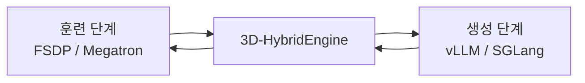

veRL을 그냥 “ByteDance가 만든 RLHF 라이브러리”라고 보면 핵심을 놓친다.

이 프로젝트의 진짜 포인트는 알고리즘 그 자체보다,  
**LLM 강화학습에서 훈련과 생성이 서로 싸우는 구조적 병목을 인프라 레벨에서 푼다**는 데 있다.

그래서 veRL은 RL 실험 툴킷보다 **post-training execution engine**에 더 가깝다.

<!--more-->

## Sources

- OPSOAI: <https://www.opsoai.com/posts/Escaping-the-LLM-RL-Hell-A-Deep-Dive-into-ByteDances-Hidden-RL-Weapon-veRL/>
- GitHub: <https://github.com/verl-project/verl>
- Paper: <https://arxiv.org/abs/2409.19256v2>

## 1. veRL이 푸는 문제는 “RL 알고리즘 부족”이 아니라 “훈련-생성 이중성”이다

OPSOAI 글이 강조하는 핵심은 정확하다.

LLM 강화학습에서 actor 모델은 동시에 두 가지 일을 해야 한다.

- rollout: 답변을 빠르게 생성해야 한다
- learn: gradient를 계산하고 가중치를 업데이트해야 한다

문제는 이 둘이 원하는 인프라 조건이 다르다는 점이다.

### 생성 모드가 원하는 것

- KV cache 최적화
- paged attention
- tensor parallelism
- 빠른 inference engine

### 훈련 모드가 원하는 것

- activation 메모리 관리
- FSDP / ZeRO류 shard
- 안정적인 distributed training

기존 프레임워크는 이 둘을 하나의 엔진 안에 억지로 우겨 넣거나,  
아예 두 엔진을 띄우고 메모리 중복과 통신 낭비를 감수했다.

veRL은 이 충돌을 정면으로 겨냥한다.

## 2. 공식 저장소도 veRL을 “알고리즘 모음”보다 “HybridFlow 기반 인프라”로 설명한다

공식 README는 veRL을 이렇게 정의한다.

- flexible
- efficient
- production-ready RL training library
- open-source version of `HybridFlow`

특히 강조하는 지점은 다음 세 가지다.

### 2-1. Easy extension of diverse RL algorithms

PPO, GRPO 같은 post-training dataflow를 몇 줄로 확장할 수 있게 한다.

### 2-2. Seamless integration of existing LLM infra

FSDP, Megatron-LM, vLLM, SGLang 등을 모듈식으로 결합한다.

### 2-3. Efficient actor model resharding with 3D-HybridEngine

훈련 단계와 생성 단계 사이 전환에서 메모리 중복과 통신 오버헤드를 줄인다.

즉 veRL의 본질은 “새로운 RL 수식”보다  
**기존 LLM infra를 RL post-training에 맞게 연결하고 전환 비용을 줄이는 실행 구조**다.

## 3. 3D-HybridEngine이 진짜 핵심이다

OPSOAI 글이 가장 세게 밀어 주는 포인트도, README가 공식적으로 강조하는 포인트도 결국 여기서 만난다.

### 기존 방식의 문제

- 훈련용 actor와 생성용 actor를 따로 둔다
- 혹은 한 엔진에 둘 다 억지로 묶는다
- 결과적으로 느리거나, 메모리 중복이 생기거나, 통신 비용이 커진다

### veRL의 접근

- 훈련은 FSDP / Megatron 계열에 맡기고
- 생성은 vLLM / SGLang 같은 SOTA inference engine에 맡긴다
- 그리고 전환 시 **resharding**을 효율적으로 처리한다

공식 README 표현대로라면:

> Efficient actor model resharding with 3D-HybridEngine

즉 문제를 감추지 않고,

- training shard layout
- inference shard layout

이 다르다는 사실을 인정한 뒤,  
그 전환을 빠르고 덜 중복되게 만들려는 것이다.

## 4. Hybrid-Controller가 주는 가치는 “알고리즘 코드와 분산 실행을 분리한다”는 점이다

OPSOAI 글은 `Hybrid-Controller`를 꽤 중요한 차별점으로 본다.

이 해석은 README의 설명과도 맞는다.

공식 문구는:

- hybrid-controller programming model
- flexible representation
- efficient execution of complex post-training dataflows

즉 사용자는 RL 알고리즘의 논리 흐름을 비교적 직관적으로 적고,
밑단 분산 실행은 별도 레이어가 처리하게 만드는 구조다.

이게 왜 중요하냐면, RL post-training은 금방 다음처럼 복잡해지기 때문이다.

- actor rollout
- ref model
- critic
- reward
- tool loop
- replay / filter / async queue

이걸 전부 분산 actor RPC 관점으로 직접 짜면 연구 코드가 곧 운영 지옥이 된다.

veRL은 이 복잡성을 **programming model** 수준에서 누그러뜨리려 한다.

## 5. veRL은 RLHF 프레임워크라기보다 “post-training 버스”처럼 보인다

README를 보면 지원 범위가 상당히 넓다.

- training: FSDP, FSDP2, Megatron-LM
- rollout: vLLM, SGLang, HF Transformers
- models: Qwen, Llama, Gemma, DeepSeek 등

그리고 실제로 built with veRL 목록도 매우 넓다.

- reasoning
- search
- tool use
- code
- multimodal
- agent training

즉 veRL은 특정 RLHF recipe 하나를 강제하기보다,  
**여러 post-training 방법을 태울 수 있는 고성능 분산 버스**에 더 가깝다.

이게 중요한 이유는 2026년의 RL for LLM이 더 이상 단일 PPO recipe 경쟁이 아니기 때문이다.

이제는:

- reasoning RL
- tool-use RL
- search-interleaved RL
- long-horizon agent RL

처럼 workload가 다변화되었고, veRL은 그걸 담는 인프라 쪽으로 확장되고 있다.

## 6. OPSOAI 글의 실전 관점도 꽤 타당하다: GRPO + 도구 루프에 잘 맞는다

OPSOAI 글은 veRL이 특히 reasoning model의 GRPO 훈련, 그리고 외부 툴/샌드박스와 결합된 에이전트 학습에 잘 맞는다고 본다.

이 부분도 저장소 방향성과 맞아 떨어진다.

README의 “Awesome Projects Built with `verl`” 목록에는 실제로:

- search agent
- tool-use reasoning
- agent optimization
- multi-agent RL

계열 프로젝트가 계속 붙고 있다.

즉 veRL은 단순 SFT 다음 단계가 아니라,  
**환경과 상호작용하는 agentic RL 쪽으로 무게중심이 이동하는 흐름**을 이미 반영하고 있다.

## 7. 이 프로젝트가 왜 ByteDance의 “숨겨진 무기”처럼 보였는지

OPSOAI 글의 표현은 다소 공격적이지만, 왜 그런 인상을 받았는지는 이해된다.

이 프레임워크는 겉으로는 RL training library처럼 보이지만, 실제로는:

- 초대형 모델까지 염두에 둔 분산 설계
- MoE/대규모 백엔드 지원
- inference/training 분리
- post-training recipe 생태계

를 갖고 있다.

README도 다음처럼 말한다.

- state-of-the-art throughput
- production-ready
- DeepSeek 671B, Qwen3-235B 같은 대형 모델 사례

즉 이건 실험실 장난감이 아니라 **대형 추론 모델 post-training의 운영 인프라** 쪽에 더 가깝다.

## 8. veRL의 진짜 가치는 “RL을 더 똑똑하게”가 아니라 “RL을 덜 비싸게, 덜 느리게” 만드는 데 있다

많은 사람이 RL 프레임워크를 볼 때 알고리즘 혁신만 본다.  
하지만 실제 대형 LLM RL에서 자주 더 큰 문제는:

- 느린 rollout
- 메모리 중복
- shard 변환 비용
- 복잡한 분산 orchestration

이다.

veRL은 바로 이 지점을 판다.

즉 이 프로젝트의 가치는:

- 더 영리한 보상 함수

보다

- training/inference split를 전제로 한 효율적 실행
- resharding 병목 완화
- 다양한 infra 조합의 흡수

에 있다.

그래서 veRL을 가장 정확히 설명하면,  
**LLM RL의 알고리즘 프레임워크이자 동시에 실행 인프라 프레임워크**다.

## 9. 최신 저장소 기준 메타데이터

GitHub 기준 현재 확인한 저장소 정보는 다음과 같다.

- 저장소: `verl-project/verl`
- stars: `21,075`
- forks: `3,794`
- 기본 브랜치: `main`
- 라이선스: `Apache-2.0`
- 주 언어: `Python`

또 README 기준:

- ByteDance Seed 팀이 시작했고
- 현재는 `verl community`가 유지한다
- 2026년 1월 `verl-project`로 마이그레이션되었다

즉 이제 veRL은 ByteDance 내부 유산이면서 동시에 **커뮤니티 중심 인프라 프로젝트**로 성장하는 단계에 들어섰다고 볼 수 있다.
