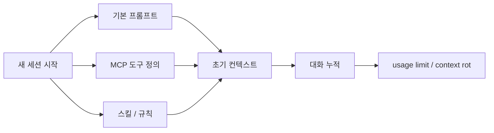
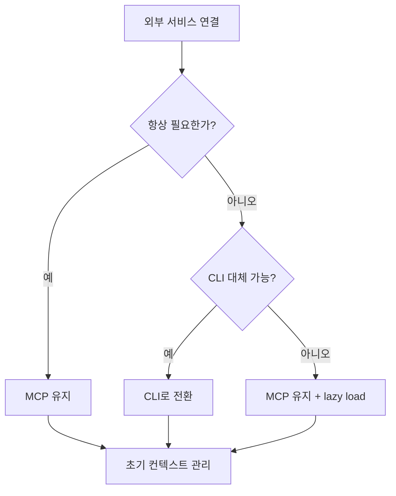

이 영상의 포인트는 “Claude를 덜 써라”가 아니다.

오히려 정반대다.  
**같은 사용량으로도 usage limit를 덜 맞게 하려면, 대화 앞단에 실리는 컨텍스트와 MCP 오버헤드를 줄여야 한다**는 주장이다.

즉 병목은 질문 횟수만이 아니라, **세션이 어떤 무게로 시작하느냐**에 있다.

<!--more-->

## Sources

- YouTube: <https://www.youtube.com/watch?v=P_rZ5VR23aE>
- Anthropic MCP docs: <https://docs.anthropic.com/en/docs/claude-code/mcp>

## 1. usage limit 문제를 “메시지 수”만으로 보면 절반만 보는 것이다

영상은 먼저 아주 기본적인 사실을 다시 꺼낸다.

대화형 LLM 세션에서는 새 메시지를 보낼 때마다:

- 현재 메시지
- 이전 메시지들
- 도구 설명
- 불러온 컨텍스트

가 함께 처리된다.

즉 20번째, 30번째, 40번째 메시지로 갈수록 비용은 단순 선형이 아니라 **누적형**으로 커진다.

그래서 usage limit는 “오늘 몇 번 물어봤나”보다  
**매번 얼마나 무거운 문맥을 다시 들고 가느냐**와 더 깊게 연결된다.

## 2. 영상의 핵심 진단: 세션은 시작부터 이미 무거울 수 있다

영상에서 가장 실전적인 장면은 `/context` 확인이다.

아직 프롬프트를 거의 보내지 않았는데도, 이미 상당한 비율의 컨텍스트가 소비돼 있었다는 점을 보여 준다.  
설명에 따르면 그 원인 중 가장 큰 것은 `MCP`였다.

즉 문제는 대화가 길어져서만이 아니라:

- 세션 시작 시점에
- MCP 도구 정의와 스킬 정보가
- 너무 많이 선로딩되는 것

일 수 있다.

이 관점은 중요하다.  
왜냐하면 usage limit를 “말을 적게 하자”로 풀지 않고,  
**세션의 공차중량을 줄이자**로 바꾸기 때문이다.

## 3. context rot는 단순 비용 문제를 넘어서 정확도 문제다

영상은 token 비용뿐 아니라 `context rot`도 함께 언급한다.

대화가 길어질수록:

- 정확도가 떨어지고
- 모델이 앞선 의도를 덜 선명하게 잡고
- 환각과 드리프트가 늘 수 있다

는 것이다.

즉 컨텍스트를 줄이는 건 단순 절약이 아니라,

- 더 오래 쓰기 위해서
- 더 정확하게 쓰기 위해서

필요하다.

이 지점에서 usage limit 최적화와 품질 최적화는 사실 같은 문제로 연결된다.

## 4. 첫 번째 해법: MCP를 가능한 한 “필요할 때만” 불러오게 만들기

영상이 제안하는 첫 번째 해결책은 MCP 도구를 처음부터 모두 싣지 말고,  
**필요할 때만 찾고 불러오도록 lazy loading에 가깝게 운용하는 것**이다.

즉 핵심 아이디어는 이렇다.

- 세션 시작 시 모든 MCP를 다 넣지 않는다
- 필요한 순간 relevant tool만 찾는다
- 초기 컨텍스트 소비를 낮춘다

영상에서는 이 설정을 통해 초기 MCP 오버헤드를 크게 줄이는 예시를 보여 준다.

이건 아주 직관적이다.

도구를 20개 연결했다고 해서, 매 세션 시작 때 그 20개 정의를 전부 문맥에 넣을 필요는 없다.  
실제로는 지금 작업과 관련된 몇 개만 필요할 때가 훨씬 많다.

## 5. 두 번째 해법이 더 중요하다: 가능하면 MCP보다 CLI를 우선하라

영상의 핵심 메시지는 사실 여기 있다.

**같은 외부 서비스라도 MCP 대신 CLI로 연결할 수 있으면, CLI가 토큰 측면에서 훨씬 유리할 수 있다**는 것이다.

왜냐하면 영상 설명에 따르면 MCP는 종종:

- 도구 인덱싱
- JSON schema
- 파라미터 구조

를 모델 문맥 안에 더 많이 로드해야 한다.

반면 CLI는:

- 모델이 이미 명령행 패턴을 더 잘 알고 있고
- 필요한 순간 help나 관련 옵션만 좁혀 볼 수 있고
- 전체 schema를 매번 통째로 실을 필요가 덜하다

는 장점이 있다.

즉 영상의 시각에서 보면 CLI는 단순 구식 대체재가 아니라,  
**토큰 효율이 좋은 외부 시스템 인터페이스**다.

## 6. 이 전략이 실전에서 강한 이유는 “도구 수”가 아니라 “도구 밀도”를 줄이기 때문이다

많은 사용자는 MCP를 많이 붙이는 게 곧 생산성이라고 생각한다.

하지만 영상은 반대로 묻는다.

- 이 MCP가 정말 항상 필요한가?
- 같은 서비스를 CLI로 더 가볍게 쓸 수 있지 않은가?
- 초기에 싣는 무게가 너무 큰 건 아닌가?

즉 중요한 건 도구 개수보다 **도구 밀도**다.

세션에 붙은 외부 시스템이 많을수록:

- 시작 비용이 커지고
- 누적 비용이 더 빨리 불어나며
- usage limit와 context rot가 더 빨리 온다

그래서 이 영상이 권하는 방식은 MCP를 무작정 줄이는 게 아니라,  
**무거운 MCP를 선별해서 CLI로 치환하고, 꼭 필요한 것만 늦게 로드하는 구조**다.

## 7. 영상의 실전 루프도 괜찮다: 무거운 MCP부터 찾고, CLI 후보를 고른다

영상은 꽤 현실적인 루프를 제안한다.

1. 현재 어떤 MCP가 가장 많은 문맥을 먹는지 확인한다  
2. 상위 몇 개를 뽑는다  
3. 해당 서비스가 CLI를 제공하는지 본다  
4. 가능하면 MCP를 제거하고 CLI로 이관한다  
5. 이후 세션 시작 무게와 장기 누적 비용을 줄인다

이 흐름이 좋은 이유는 감이 아니라 **측정 기반 치환**이기 때문이다.

즉 “MCP가 나쁘다”가 아니라:

- 어떤 MCP가
- 얼마나 무겁고
- 대체 가능한지

를 보고 바꾼다.

## 8. 왜 이 전략이 특히 Pro/중간급 사용자에게 중요할까

영상 후반은 한 가지 중요한 현실을 짚는다.

더 큰 플랜이나 더 큰 컨텍스트 창이 있더라도,  
누적 구조 자체가 바뀌는 건 아니다.

특히 컨텍스트 창이 더 작은 모델/플랜일수록:

- 선로딩된 MCP 비중이 더 크게 느껴지고
- 장기 세션 유지력이 더 나빠지고
- 같은 일도 더 빨리 한도에 닿는다

즉 이 전략은 헤비 유저만을 위한 팁이 아니다.  
오히려 **한도가 빡빡한 사용자일수록 더 체감이 큰 최적화**다.

## 9. 결국 이 영상의 핵심은 “더 적게 말하라”가 아니라 “더 가볍게 시작하라”다

많은 usage limit 팁은 보통 이런 식이다.

- 대화를 짧게 해라
- 새 세션을 자주 열어라
- 프롬프트를 줄여라

물론 맞는 말이지만, 이 영상은 좀 더 구조적인 답을 준다.

- 초기 MCP 로딩을 줄여라
- 필요한 도구만 늦게 불러와라
- 무거운 MCP는 CLI로 치환하라

즉 “말을 덜 하라”보다  
**세션이 들고 다니는 짐을 줄여라**는 전략이다.

이건 훨씬 실전적이다.

왜냐하면 사용량을 줄이지 않고도, 같은 양의 작업을 더 오래 버티게 만들 수 있기 때문이다.

## 10. 정리

이 영상이 말하는 usage limit 해결법은 단순한 절약 팁이 아니다.

핵심은:

- 컨텍스트는 누적되고
- MCP는 시작부터 세션을 무겁게 만들 수 있으며
- CLI는 종종 더 가벼운 인터페이스가 될 수 있다는 것

이다.

그래서 이 글의 결론은 간단하다.

Claude 사용 한도를 덜 맞고 싶다면,  
프롬프트 문장만 다듬지 말고 **도구 체인 자체를 다이어트**해야 한다.

특히:

- 무거운 MCP를 식별하고
- lazy loading 성격으로 운용하고
- 대체 가능한 건 CLI로 옮기는 것

이 실제로 더 큰 차이를 만든다.
