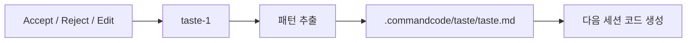
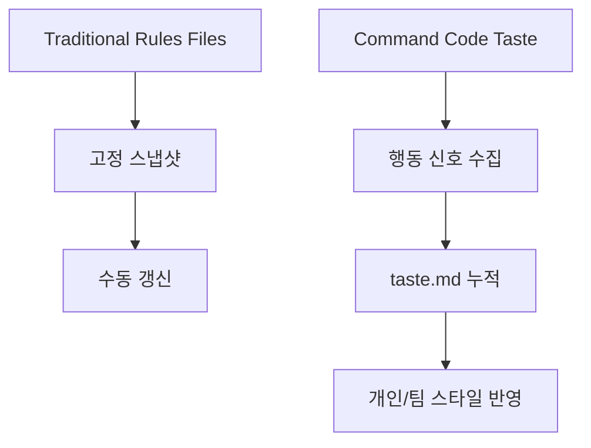

Threads가 던진 첫 문장은 가격이다.

**월 1달러짜리 코딩 에이전트**

하지만 진짜 흥미로운 포인트는 가격이 아니라 그 뒤에 붙은 설명이다.

**도구가 사용자의 코딩 방식 자체를 학습한다.**

이 한 줄 때문에 Command Code는 단순히 “싼 OpenCode 대안”이 아니라,  
**Rules 대신 Taste를 축적하는 코딩 에이전트**로 보이기 시작한다.

<!--more-->

## Sources

- Threads: <https://www.threads.com/@unclejobs.ai/post/DX-nHvfE6lR>
- Command Code homepage: <https://commandcode.ai/>
- Taste docs: <https://commandcode.ai/docs/taste>
- Taste reference: <https://commandcode.ai/docs/taste/commands>
- Launch post: <https://commandcode.ai/launch>

## 1. 핵심은 “더 똑똑한 모델”이 아니라 “내가 어떻게 코딩하는지 학습한다”는 점이다

Threads가 강조한 `taste-1`은 꽤 중요한 발상이다.

보통 코딩 에이전트는 이런 식으로 개인화한다.

- `.cursorrules`
- `CLAUDE.md`
- `AGENTS.md`
- 프로젝트 컨벤션 문서

즉 사람이 직접 “이렇게 해”라고 적어 둔 규칙에 의존한다.

반면 Command Code는 공식 문서에서 Taste를 이렇게 설명한다.

- every accept, reject, and edit becomes a signal
- learns patterns and micro-decisions you'd never document

즉 문서로 적힌 규칙보다,  
**실제 작업 과정에서 반복되는 미세한 선택**을 학습 대상으로 본다.

이건 꽤 다르다.

## 2. Rules와 Taste의 차이는 “스냅샷”과 “누적”의 차이다

Threads의 표현을 빌리면:

- Rules는 썩고
- Taste는 쌓인다

이 문장은 과장처럼 보이지만 구조적으로 꽤 맞다.

### Rules file의 한계

- 6개월 전에 적은 스냅샷
- 코드베이스가 진화해도 수동 갱신해야 함
- 실제 미세한 선호를 다 적기 어려움

### Taste의 목표

- 세션마다 갱신
- 사용자의 accept / reject / edit에서 신호 수집
- 사람이 쓰지 않는 미세한 취향까지 패턴화

즉 Command Code는 “룰을 잘 쓰는 법”보다  
**규칙을 명시하지 않아도 행동에서 취향을 추출하는 시스템**을 만들려 한다.

## 3. `.commandcode/taste/taste.md`가 중요한 이유

공식 Taste 문서는 이 학습 결과가 완전히 블랙박스로 사라지지 않는다고 설명한다.

저장 위치 예시는 다음과 같다.

```text
your-project/
└── .commandcode/
    └── taste/
        ├── taste.md
        ├── cli/
        │   └── taste.md
        ├── typescript/
        │   └── taste.md
        └── architecture/
            └── taste.md
```

이 구조가 좋은 이유는, 개인화가 “모델 속 어딘가”에만 남지 않고  
**읽을 수 있는 아티팩트로 노출된다**는 점이다.

즉 사용자는 Taste를:

- inspect하고
- 수정하고
- reset하고
- 공유할 수 있다

공식 launch 페이지도 이 점을 강조한다.

> You can inspect them in `.commandcode/taste/taste.md`, edit them directly, or reset them entirely.

즉 Taste는 완전한 자동화가 아니라,  
**학습된 취향을 문서화 가능한 계층으로 드러내는 구조**다.



## 4. Taste는 “내가 뭘 할 수 있나”보다 “내가 어떻게 하느냐”를 다룬다

Threads가 아주 잘 짚은 문장이 있다.

> Skills가 ‘뭘 할 수 있는지’를 정의한다면 Taste는 ‘내가 어떻게 하는지’를 가르치는 층

이 구분은 정말 중요하다.

### Skills

- 어떤 작업을 수행할 수 있는가
- 어떤 도구를 호출할 수 있는가
- 어떤 워크플로가 있는가

### Taste

- named export를 선호하는가
- vitest를 쓰는가 mocha를 쓰는가
- 디렉터리 구조를 어떻게 잡는가
- 어떤 코드 스타일을 “내 방식”으로 여기는가

즉 Command Code는 에이전트에게 능력을 더하는 게 아니라,  
**사용자 스타일을 더하는 두 번째 레이어**를 만들고 있다.

## 5. 공식 Taste 문서도 이를 “meta neuro-symbolic RL”로 설명한다

Command Code 공식 문서는 Taste를 꽤 공격적으로 포지셔닝한다.

- `taste-1`
- continuous reinforcement learning
- meta neuro-symbolic AI model

이 표현을 그대로 다 믿을 필요는 없지만, 방향은 분명하다.

Taste는 단순 preference file이 아니라,

- 지속적으로 학습하고
- reasoning과 패턴을 결합하고
- 보이지 않는 미세 선택을 축적한다

는 컨셉이다.

즉 이 프로젝트는 “프롬프트 더 잘 쓰기”에서 한 단계 더 나아가,  
**코딩 과정에서 나오는 선택 자체를 데이터로 삼는다**고 주장한다.

## 6. push / pull 구조가 있다는 건 개인화가 팀 자산으로도 바뀔 수 있다는 뜻이다

Taste Reference 문서에서 가장 흥미로운 부분은 `npx taste push/pull`이다.

공식 문서에 따르면 taste package는 세 종류가 있다.

- Project
- Global
- Remote

즉 Taste는:

- 프로젝트 안에서만 학습되는 것도 가능하고
- 내 개인 전역 취향으로 들고 다닐 수도 있고
- 원격에 올려 팀과 공유할 수도 있다

이건 꽤 큰 포인트다.

왜냐하면 “시니어 개발자의 스타일”을 문서가 아니라 **작동하는 학습 패키지**로 전파할 수 있기 때문이다.

즉 개인화는 고립된 커스텀 설정이 아니라,  
**팀의 암묵지를 배포 가능한 형식으로 바꾸는 수단**이 될 수 있다.

## 7. 가격이 화제가 되지만, 진짜 차별점은 taste 사용량이 따로 존재한다는 점이다

Threads는 가격표를 꽤 자세히 정리한다.

- Go: 월 1달러
- LLM 크레딧과 taste-1 사용량이 분리
- Pro / Max / Ultra로 갈수록 taste 한도가 크게 늘어남

공식 홈페이지도 `Open models from $1/mo`와 free credits를 내세운다.

여기서 중요한 건 “싸다”는 사실보다,  
**LLM 사용량과 Taste 학습/적용 사용량을 별도 층으로 본다**는 구조다.

즉 회사는 제품의 진짜 해자를 모델 호출보다 `taste-1` 레이어에 두고 있다고 읽을 수 있다.

다시 말해 가격표도 “LLM API 래퍼”가 아니라  
**개인화 학습 시스템을 파는 제품**이라는 뜻을 품고 있다.

## 8. OpenCode Go와의 차이도 결국 철학 차이다

Threads가 마지막에 비교한 포인트도 중요하다.

- OpenCode Go는 모델 풀과 가성비 중심
- Command Code는 코딩 패턴 학습 중심

즉 둘은 비슷해 보여도 경쟁 축이 다르다.

### OpenCode 쪽 질문

- 어떤 모델을 얼마나 싸게 쓸 수 있나?

### Command Code 쪽 질문

- 에이전트가 점점 내 방식대로 변하나?

이건 단순 제품 비교를 넘어, 앞으로 코딩 에이전트 시장이 어디로 갈지 보여 준다.

가격 경쟁만으로는 차별화가 어려워질수록,  
**개인화된 실행 방식과 학습된 스타일**이 더 중요한 경쟁 포인트가 될 가능성이 크다.



## 9. 그래서 이 제품의 진짜 질문은 “에이전트가 나를 닮을 수 있나?”다

결국 Command Code가 던지는 본질적인 질문은 이것이다.

에이전트는 단지 좋은 코드를 생성하는 것으로 충분한가,  
아니면 **내가 원하는 방식으로 생성하는 법까지 배워야 하는가**?

Taste는 이 질문에 대한 꽤 직접적인 답이다.

- 정답을 외우는 대신
- 선호를 축적하고
- 수정 피드백을 신호로 삼고
- 팀 차원의 패턴으로 배포한다

즉 이 제품의 본질은 “더 강한 모델”이 아니라  
**나를 닮아 가는 코딩 에이전트**를 만들려는 시도다.

## 10. 결론

Command Code를 월 1달러짜리 싸구려 에이전트로만 보면 핵심을 놓친다.

진짜 포인트는:

- Rules file의 한계를 다른 각도에서 풀고
- accept / reject / edit을 학습 신호로 바꾸고
- `.commandcode/taste/taste.md`로 인간이 읽을 수 있게 남기며
- 이를 개인/프로젝트/원격 패키지로 배포까지 가능하게 만든다는 점

이다.

즉 이 제품은 “코딩 에이전트”라기보다,  
**코딩 스타일을 누적 학습하는 taste system 위에 얹힌 에이전트**로 보는 편이 더 정확하다.
