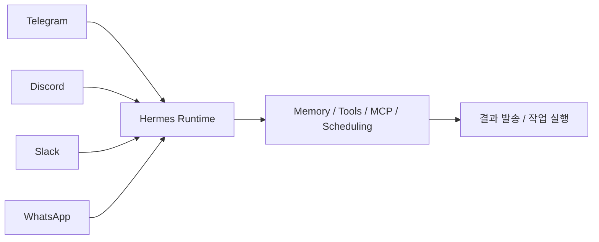
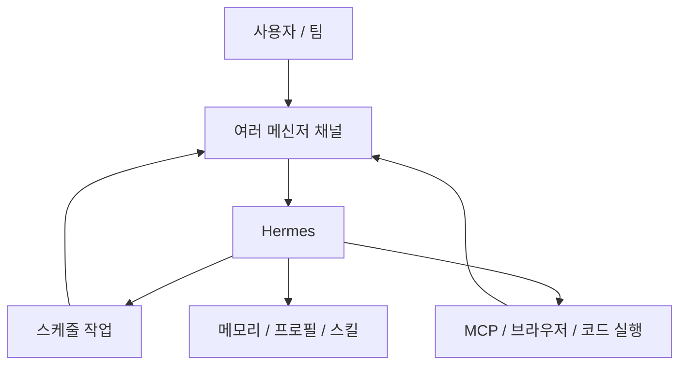

Threads의 문장은 짧지만 꽤 강하다.

**AI 에이전트 하나가 텔레그램, 디스코드, 슬랙, 왓츠앱 등 17개 메신저를 동시에 굴린다.**

그리고 정작 많은 사용자는 Hermes의 작은 일부만 쓴다는 주장도 붙는다.

이 메시지가 중요한 이유는, Hermes의 본질을 “또 하나의 AI 앱”이 아니라 **메시징 접근 레이어를 가진 Agent runtime**으로 보게 만들기 때문이다.

<!--more-->

## Sources

- Threads: <https://www.threads.com/@qjc.ai/post/DX9QmIxj5-v>
- Hermes Agent CN feature overview: <https://hermesagent.org.cn/en/docs/user-guide/features/overview>
- Official upstream: <https://hermes-agent.nousresearch.com>
- GitHub: <https://github.com/NousResearch/hermes-agent>

## 1. Hermes의 진짜 차별점은 “어디서든 말을 걸 수 있다”는 점이다

많은 AI 도구는 결국 하나의 화면에 묶여 있다.

- 웹앱
- IDE 패널
- 터미널

하지만 Hermes가 흥미로운 이유는 사용자가 도구를 열어야 하는 게 아니라,  
**사용자가 이미 있는 커뮤니케이션 채널로 에이전트가 들어온다**는 데 있다.

Threads가 강조한 `Telegram / Discord / Slack / WhatsApp` 포인트는 바로 이 지점을 찌른다.

즉 Hermes의 가치 중 큰 부분은:

- 더 좋은 답변

보다

- 더 자연스러운 접근 경로

에 있다.

## 2. 메신저 지원은 편의 기능이 아니라 운영 구조다

겉보기에는 “여러 메신저를 지원한다”는 말이 단순 편의성처럼 들릴 수 있다.

하지만 실제로는 꽤 다르다.

메신저 채널이 많아진다는 건 곧:

- 사람마다 다른 접점에서
- 같은 에이전트에 접근하고
- 같은 상태와 기억을 공유하며
- 같은 작업을 이어 갈 수 있다는 뜻

이다.

예를 들어:

- 나는 Telegram에서 빠르게 지시를 내리고
- 팀은 Discord에서 결과를 보고
- 운영 채널은 Slack에서 경고를 받고
- 이동 중엔 WhatsApp으로 확인할 수 있다

면, 에이전트는 하나지만 **접근 표면은 조직 전체로 확장**된다.

즉 Hermes는 채팅앱이 아니라 **agent access layer**에 가깝다.

## 3. 공식 기능 문서도 Hermes를 “기본 채팅”을 넘어선 시스템으로 설명한다

Hermes 기능 문서는 첫 문장부터 이렇게 말한다.

> extend far beyond basic chat

그리고 실제로 다음을 핵심 기능으로 묶어 둔다.

- persistent memory
- context files
- scheduled tasks
- subagent delegation
- browser automation
- voice interaction
- MCP integration
- API server

즉 메신저 지원은 이 많은 기능 위에 올라가는 **입력/출력 인터페이스**다.

중요한 건 메신저 자체가 아니라,  
그 메신저를 통해 다음이 가능하다는 점이다.

- 스케줄 작업 결과 수신
- 에이전트 호출
- 음성 입출력
- 브라우저 자동화 보고
- 외부 도구 실행 결과 전달

그래서 Hermes에서 메신저는 UI가 아니라 **운영 포트(port)** 로 보는 편이 맞다.

## 4. 왜 많은 사용자가 “8%만 쓴다”는 말이 나오는가

Threads의 숫자는 자극적이지만, 구조적으로는 이해가 간다.

대부분 사용자는 Hermes를 이렇게만 쓸 가능성이 높다.

- 메신저에서 질문한다
- 답변을 받는다
- 더 똑똑한 챗봇처럼 쓴다

하지만 기능 문서를 보면 Hermes는 그보다 훨씬 넓다.

### Core

- Tools & Toolsets
- Skills System
- Persistent Memory
- Context Files
- Checkpoints

### Automation

- Scheduled Tasks
- Subagent Delegation
- Code Execution
- Event Hooks
- Batch Processing

### Media & Web

- Voice Mode
- Browser Automation
- Vision
- Image Generation

### Integrations

- MCP
- Provider Routing
- Fallback Providers
- Credential Pools
- API Server
- IDE Integration

즉 그냥 메신저 챗봇으로만 쓰면, 정말로 **입구만 쓰고 건물 전체는 안 쓰는 것**에 가깝다.

## 5. Hermes의 메신저 레이어가 중요한 이유는 “에이전트를 생활권 안으로 들인다”는 점이다

터미널이나 IDE 기반 에이전트는 강력하지만, 여전히 사용자가 작업 환경 안으로 들어와야 한다.

반면 Hermes의 메시징 레이어는:

- 사용자가 이미 매일 쓰는 앱
- 이미 알림을 보는 습관이 있는 공간
- 이미 팀 대화가 이루어지는 방

으로 에이전트를 보낸다.

이게 중요한 이유는 생산성 도구의 실제 사용 빈도가 종종 능력보다 **접근 마찰**에 좌우되기 때문이다.

즉 Hermes는 모델이 더 똑똑해서가 아니라,  
**사용자 쪽 이동 비용을 줄이기 때문에 더 자주, 더 자연스럽게 쓰이기 쉬운 구조**를 가진다.

## 6. 스케줄링과 메신저가 붙을 때 Hermes는 ‘비서’처럼 보이기 시작한다

기능 문서에서 가장 눈에 띄는 조합 중 하나는:

- Scheduled Tasks (Cron)
- Messaging Platforms

이다.

이 둘이 붙으면 AI는 더 이상 “질문하면 답하는 존재”가 아니라,

- 아침 브리핑을 보내고
- 저녁 요약을 보내고
- 특정 조건이 생기면 경고를 보내고
- 백그라운드 작업 결과를 전달하는

**능동적 비서**로 바뀐다.

즉 메신저는 단순 접근 수단이 아니라,  
에이전트가 사람을 먼저 찾아오는 구조를 만드는 핵심 요소다.

## 7. 기존 Hermes 글들과 비교했을 때 이번 포인트는 ‘운영실’이 아니라 ‘입구’다

이미 Hermes를:

- WebUI control layer
- swarm orchestrator
- business OS

관점에서 볼 수 있다.

하지만 이번 Threads가 던지는 관점은 조금 다르다.

이번에는 “Hermes가 무엇을 할 수 있나”보다  
**사람이 Hermes에 어디서 접속하느냐**를 전면에 올린다.

이게 의외로 중요하다.

좋은 에이전트 시스템은 종종 다음 둘을 모두 갖춰야 한다.

- 내부적으로는 강한 실행/오케스트레이션 구조
- 외부적으로는 마찰 없는 접근 레이어

Hermes는 그중 후자를 메신저 다중 지원으로 메운다.

## 8. 왜 17개 메신저 지원이 전략적으로 의미가 있는가

숫자 자체보다 중요한 건 방향이다.

메신저가 많아질수록 Hermes는:

- 개인 비서
- 팀 운영 봇
- 알림 라우터
- 멀티채널 작업 허브

중 무엇으로도 재해석될 수 있다.

즉 이건 “텔레그램도 됩니다” 수준이 아니라,

**에이전트가 특정 앱에 갇히지 않고 커뮤니케이션 인프라 전반으로 퍼진다**는 뜻이다.

그 순간 Hermes는 하나의 앱이 아니라:

- 어디서 호출될지 모르는 실행 엔진
- 어디로든 결과를 보낼 수 있는 전달 허브

가 된다.

## 9. 결론

Threads가 짧게 던진 메시지는 단순 홍보 문구가 아니다.

Hermes를 그냥 “메신저에서 쓰는 ChatGPT”로 보면,  
정말로 일부만 쓰게 될 가능성이 높다.

하지만 Hermes를:

- 스케줄링
- 메모리
- 도구 호출
- MCP
- 브라우저 자동화
- 메신저 다중 채널

이 결합된 runtime으로 보면 완전히 다른 그림이 나온다.

결국 Hermes의 진짜 힘은 모델 이름보다,  
**에이전트를 사람들이 이미 사는 커뮤니케이션 공간 안으로 심는 접근 레이어**에 있다.
