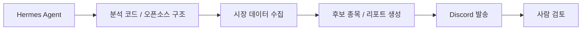
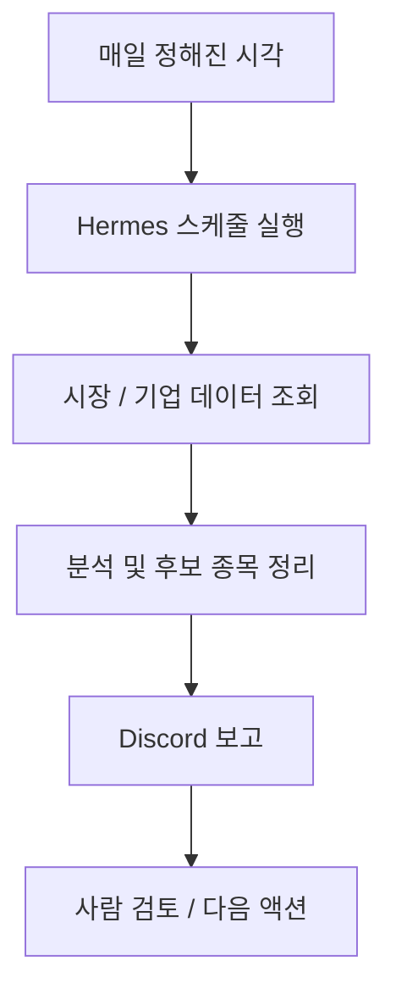

이 사이트의 제목은 직설적이다.

**개인 주식 트레이딩 AI 비서 구축 가이드**

하지만 내용을 보면 핵심은 “주식 챗봇 만들기”가 아니다.  
오히려 **매일 데이터를 보고, 근거를 남기고, Discord에 정해진 형식으로 보고하는 개인용 투자 운영 시스템**을 만드는 데 더 가깝다.

<!--more-->

## Sources

- Guide site: <https://trading-assistant-guide-site.vercel.app/>
- Referenced open-source system: <https://github.com/dragon1086/prism-insight>
- Hermes Agent: <https://github.com/NousResearch/hermes-agent>

## 1. 이 가이드가 흥미로운 이유는 “질문하는 AI”보다 “매일 보고하는 AI”를 만든다는 점이다

사이트의 첫 문장이 이미 방향을 정해 준다.

> 내 Discord에 매일 보고하는 주식 트레이딩 AI 비서를 만든다

이건 중요하다.

많은 투자 AI 프로젝트는 사용자가 물으면 답하는 형태다.

- 이 종목 어때?
- 오늘 시장 어때?
- 지금 들어가도 돼?

하지만 이 가이드는 구조를 다르게 잡는다.

- 정해진 시간에
- 시장과 종목을 조회하고
- 근거를 요약하고
- 결과를 Discord로 발송한다

즉 “질의응답형 도우미”보다  
**루틴을 수행하는 운영 비서**에 가깝다.

## 2. 핵심 구성도 단순하다: Hermes + 분석 코드 + Discord

사이트의 상단 카드가 제시하는 기본 구조는 세 부분이다.

- Hermes Agent
- 분석 코드 / 오픈소스 분석 시스템
- Discord

이 조합이 의미하는 건 다음과 같다.

### Hermes Agent

실행 엔진이다.

- 명령 실행
- 스케줄 작업
- 외부 시스템 호출
- 결과물 전달

을 맡는다.

### 분석 시스템

시장 데이터, 기업 분석, 후보 종목 추출, 리포트 생성을 담당한다.

### Discord

결과를 사람이 읽는 운영 채널이다.

즉 이 가이드는 “모델 하나 고르기”보다  
**실행 엔진 + 분석 로직 + 전달 채널**을 분리해서 본다.

이게 실제 운영 관점에서는 훨씬 현실적이다.

## 3. Hermes를 고른 이유는 챗봇이 아니라 에이전트 런타임이 필요하기 때문이다

가이드는 첫 단계부터 Hermes Agent 설치를 잡는다.

이건 우연이 아니다.

트레이딩 비서는 단순 대화보다 다음이 중요하다.

- 파일 읽기
- 코드 실행
- 스케줄링
- 결과 메시지 전송

즉 여기서는 “대답 잘하는 모델”보다  
**정해진 루틴을 수행할 수 있는 실행 환경**이 더 중요하다.

Hermes는 이 점에서:

- 작업 자동화
- 세션/프로필 분리
- 외부 알림 채널 연결

같은 운영 요소를 붙이기 쉬운 런타임 역할을 한다.

## 4. 이 가이드의 좋은 점은 처음부터 자동매매를 밀지 않는다는 것이다

사이트는 꽤 분명하게 경고한다.

- 처음부터 실제 주문을 켜지 말 것
- 2~4주 동안은 조회 / 모의 / 알림 모드로만 운영할 것
- 최소 권한과 모의투자부터 시작할 것

이 부분이 특히 좋다.

투자 AI 가이드가 자주 빠지는 함정은 “분석 → 바로 매매”로 점프하는 것이다.

하지만 실제로는:

- 데이터 품질 검증
- 요약 정확도 검증
- 알림 형식 검증
- 잘못된 신호 빈도 파악

이 먼저다.

즉 이 사이트는 AI 비서를 “수익 자동화 장치”보다  
**의사결정 보조 운영 계층**으로 먼저 다룬다.

## 5. 전용 profile을 따로 만드는 설계도 현실적이다

가이드는 Hermes에서 `trading-assistant` 같은 전용 profile을 만들라고 제안한다.

이게 중요한 이유는 투자 비서가 일반 작업용 에이전트와 섞이면 안 되기 때문이다.

분리해야 하는 이유는 명확하다.

- 메모리/기억 오염 방지
- 스케줄과 알림 분리
- 전용 지침 유지
- 운영 권한 범위 축소

즉 이 가이드는 단순 설치서가 아니라,  
**투자 비서를 별도 운영 계정처럼 다뤄야 한다**는 실전 감각을 갖고 있다.

## 6. prism-insight를 참고하라는 점도 의미가 크다

사이트는 분석 로직을 처음부터 새로 만들지 말고,  
`dragon1086/prism-insight` 같은 오픈소스 시스템을 참고하라고 말한다.

이 접근이 좋은 이유는 다음과 같다.

- 이미 역할 분담이 정리되어 있고
- 시장/기업/뉴스/기술적 분석 흐름을 참고할 수 있고
- 보고서 구조와 운영 아이디어를 빠르게 빌려올 수 있기 때문이다

즉 가이드는 “나만의 투자 AI를 처음부터 발명하라”가 아니라  
**검증된 오픈소스 구조를 베이스캠프로 삼으라**는 쪽에 가깝다.

이건 실전적으로 훨씬 성공 확률이 높다.

## 7. Codex OAuth를 언급하는 것도 흥미롭다

가이드는 모델 인증 방식으로 OpenAI API 키뿐 아니라 `Codex OAuth`도 언급한다.

이건 결국 트레이딩 비서를 꼭 한 모델/한 공급자에 묶어 둘 필요가 없다는 뜻이다.

즉 사용자는 상황에 따라:

- API key 기반
- 구독 기반 OAuth
- 다른 provider

를 고를 수 있다.

중요한 건 모델 선택 그 자체보다,  
**분석 루프와 전달 루프가 안정적으로 굴러가느냐**다.

이 관점도 꽤 건강하다.

## 8. 이 가이드의 진짜 메시지는 “자동매매 봇”이 아니라 “개인 투자 운영실”이다

사이트의 7단계 흐름과 `실전 운영 아키텍처` 섹션 제목을 보면 방향이 분명해진다.

이건 단순 기능 데모가 아니다.

결국 이 가이드는 사용자가 만들려는 것을 이렇게 재정의한다.

- 챗봇이 아니라
- 매일 시장을 읽고
- 후보 종목을 요약하고
- 리스크를 표시하고
- 결과를 보고하는

**개인용 투자 운영실**

이렇게 보면 Discord는 단순 알림창이 아니라 daily standup 채널이고,  
Hermes는 채팅 앱이 아니라 운영 오케스트레이터가 된다.

## 9. 왜 Discord가 좋은 전달 채널인가

투자 비서는 결과를 “잘 분석하는 것”만큼 “어디에 어떻게 전달하느냐”도 중요하다.

Discord를 쓰면:

- 채널별 분리
- 알림 히스토리 축적
- 수동 코멘트 추가
- 사람 검토 흔적 유지

가 쉽다.

즉 이메일보다 빠르고, 로컬 로그보다 읽기 쉽고, 채팅창보다 구조적이다.

이건 결국 투자 비서를 “개인 비서”가 아니라  
**지속적으로 쌓이는 운영 기록 시스템**으로 만든다.

## 10. 이 가이드가 좋은 이유는 기술보다 운영 순서를 먼저 잡아 준다는 점이다

많은 AI 가이드는 설치법은 자세한데 운영 순서는 빈약하다.

반면 이 사이트는 순서를 비교적 잘 잡고 있다.

1. 실행 엔진 설치  
2. 모델 인증  
3. 전용 프로필 분리  
4. 오픈소스 분석 구조 참고  
5. Discord 연결  
6. 운영 예시 정리  
7. 체크리스트로 검증

즉 “무엇을 설치하느냐”보다  
**어떤 순서로 시스템을 안전하게 운영 가능한 상태로 가져가느냐**를 더 중요하게 본다.

이게 실제로는 훨씬 큰 차이를 만든다.

## 11. 결론

`개인 주식 트레이딩 AI 비서 구축 가이드`의 진짜 가치는 화려한 모델 이름에 있지 않다.

핵심은:

- 투자 AI를 챗봇으로 두지 않고
- 운영 비서로 재정의하고
- Hermes + 분석 코드 + Discord 구조로 묶고
- 자동매매 전에 알림·검증 루프부터 깔게 만든다는 점

이다.

그래서 이 가이드는 “주식 봇 만들기”보다,  
**매일 보고하고 검토 가능한 개인 투자 운영체계를 세우는 방법론**으로 읽는 편이 더 정확하다.
